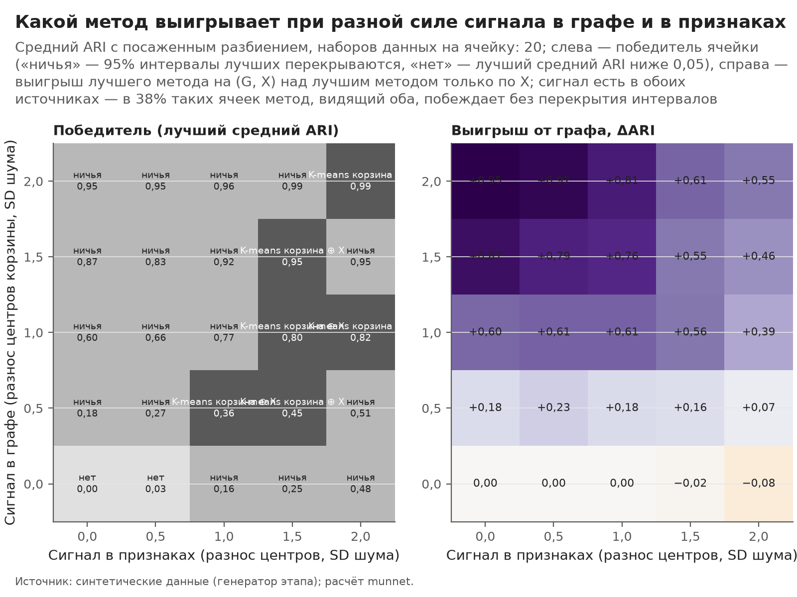
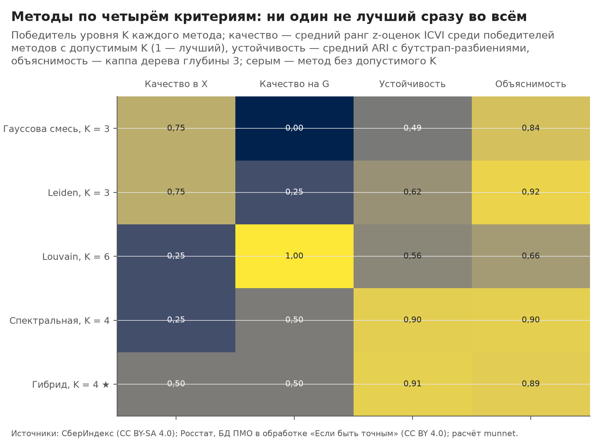
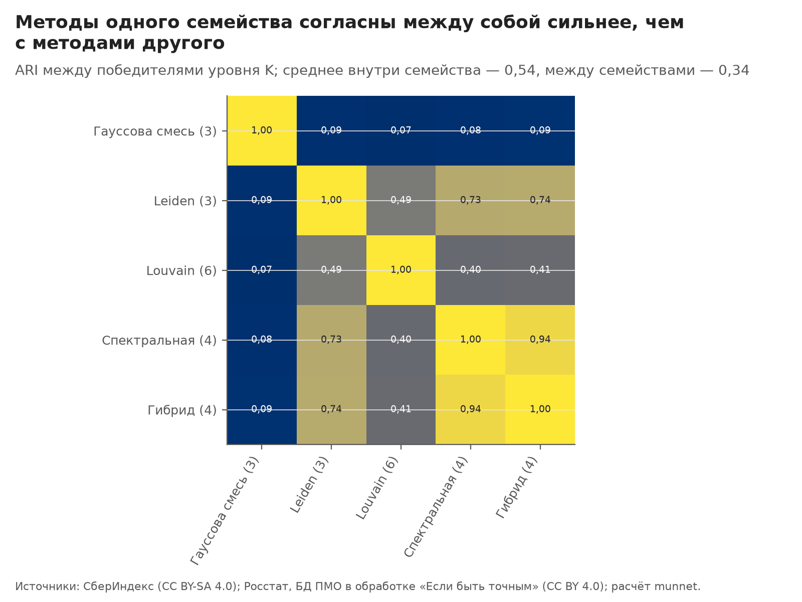
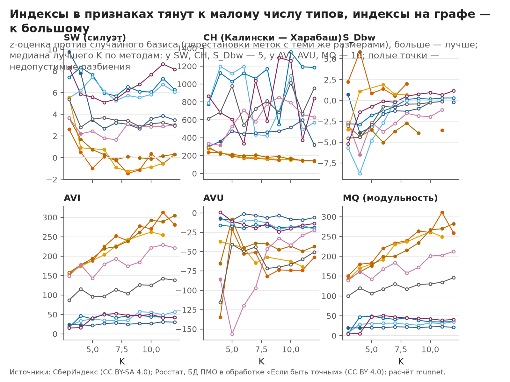
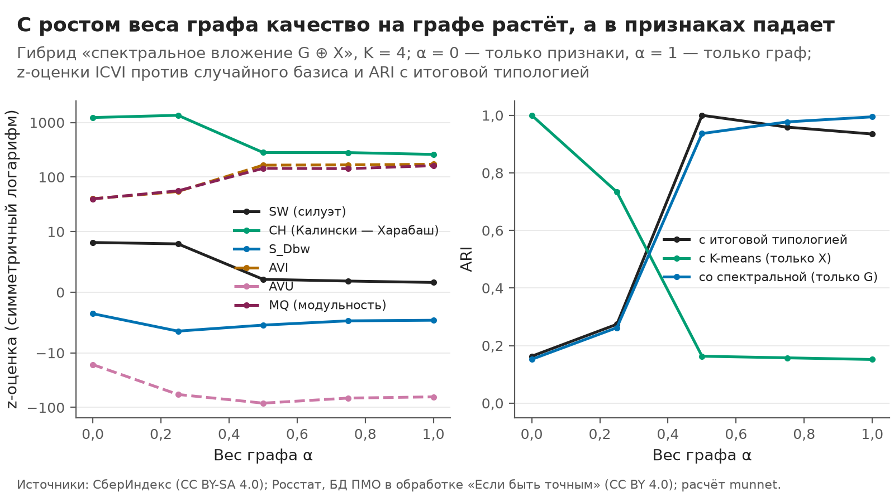
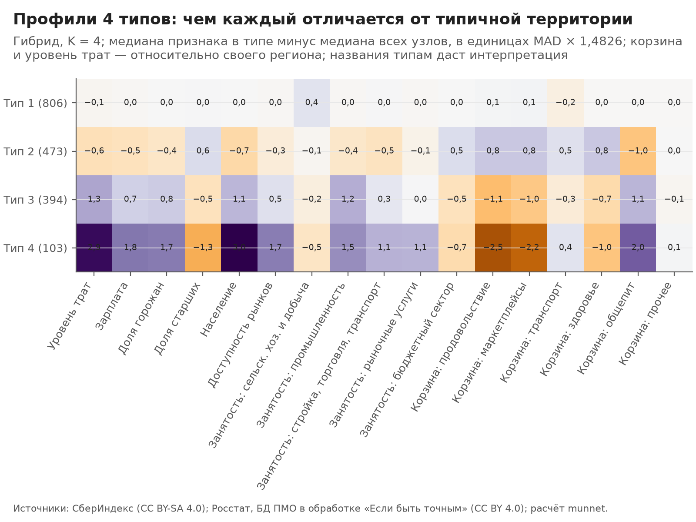

# Типы локальных экономик: сравнение методов кластеризации и выбор итогового разбиения

> Собрано командой `python -m munnet cluster` из выходов этапов `features` и `network`. Числа —
> `outputs/cluster/report_facts.json`, таблицы целиком — `outputs/cluster/*.csv`, метки —
> `data/processed/cluster_labels.parquet` и `cluster_final.parquet`. Руками не править: шаблон —
> `src/munnet/clustering/templates/clustering.md`, параметры — секция `clustering` в `configs/default.yaml`.
> Правило выбора записано до расчётов отдельным коммитом (`2ee1363`, «предрегистрация»).

## Главное за минуту

- **Итоговая типология — 4 типа, метод «Гибрид»** (спектральное вложение сети корзин ⊕ признаки места, K-means). Размеры типов: 806, 473, 394 и 103 узлов из 1776 (45,4%, 26,6%, 22,2%, 5,8%). Устойчивость — средний ARI с разбиениями на 80,0% узлов 0,91; все четыре типа устойчивы по Хеннигу (худший Жаккар 0,90 при пороге 0,75).
- **Почему он: решает допустимость, а не сравнение критериев.** Итог выбирается среди методов, видящих и граф, и признаки. У метода Шалилеха и Миркина (KEFRiN) и у базовой линии «K-means по корзине ⊕ X» ни одно K из 3–12 не допустимо: в каждом есть тип меньше 2,0% узлов — 16 пригородных районов областных центров с доступностью рынков на 26 MAD выше медианы своего региона. У гибрида допустимо одно K — 4.
- **Проверки чувствительности на уровне итога ничего не решают**: там допустим один кандидат, и любая замена агрегатора даёт его же. Выбор есть только среди всех семейств (проверка `all_eligible`): на Парето-фронте гибрид, Leiden (K = 3) и Louvain (K = 6); у гибрида и Leiden равные очки Копленда, и ничью решает устойчивость (0,91 против 0,62). Leiden лучше по качеству в X и объяснимости, гибрид — по качеству на G и устойчивости, поэтому исход зависит от агрегатора: по сумме мест (Борда) тоже ничья, а из 24 лексикографических порядков при выборе метода Leiden выигрывает 12, гибрид — 6, Louvain — 6: побеждает тот, чей сильный критерий стоит первым. Один шаг по всем парам «метод, K» среди всех семейств даёт другого победителя — «Спектральная», K = 4.
- **Сравнимые между K метрики графа** (AVI с поправкой на случайность и сырая MQ, проверка после предрегистрации) среди всех семейств выбирают Leiden с K = 3, а не гибрид: преимущество гибрида там держится на z-оценках, смещённых по K (`docs/icvi.md`). На уровне итога это ничего не меняет.
- **Пороги допустимости решают сильнее правила.** Если крупнейшему типу разрешить 55% или 60% узлов вместо 50%, среди всех семейств побеждает «Спектральная» с K = 3, а внутри гибрида K = 3 и K = 4 разводит разница устойчивости 0,008 при допуске ничьей 0,02: с допуском в цепочке равенств был бы выбран K = 3. Порог наименьшего типа (1–3%) на итог не влияет.
- **Где он хрупок.** Гибрид при равных весах блоков почти повторяет спектральную кластеризацию одного графа (ARI 0,94): типы задаёт корзина трат, а признаки места мало что добавляют. Поэтому они зависят от правила рёбер: на сети «Косинус корзин» тот же метод с K = 4 совпадает с итогом лишь на ARI 0,22, а если районы Москвы и Петербурга — отдельные узлы, на 0,32. Без уровня трат итог почти тот же (ARI 1,00).
- **Синтетика «когда помогает граф».** Если сигнал есть и в графе, и в признаках, метод, видящий оба источника, выигрывает в 16 из 16 ячеек сетки. Лучше всех — базовая линия, которая берёт координаты, из которых построен граф (16 из 16); граф как таковой полезен, когда таких координат нет (посаженный блочный граф: там выигрывает гибрид).
- **Внешняя проверка** на показателях, не входивших ни в рёбра, ни в признаки: типы различаются по числу ИП, организаций и ночёвок в средствах размещения сверх случайного (все 10 проверок значимы после поправки Бенджамини — Хохберга), ожидаемые знаки подтвердились, и типы объясняют эти показатели сверх 11 признаков места (прирост R² 0,006–0,026, у ночёвок — 0,010).
- **Отрицательные результаты.** HDBSCAN не нашёл в признаках ни одной структуры с K из сетки; KEFRiN на исходных признаках всегда выделяет мелкий тип пригородов, в варианте статьи (z-оценка, ρ = ξ = 1) — тоже; при усечённых хвостах признаков (проверка вне предрегистрации) побеждает KEFRiN с K = 4, и его типы с итогом почти не совпадают (ARI 0,15).

## 1. Входы: одни для всех методов

- **Узлы** — 1776 узлов сети основного режима (`features_nodes.is_node`): Москва и Петербург — узлы-города 90077 и 90078, остальные МО — сами себе узлы, у всех полный ряд за 24 месяца (`docs/features.md`).
- **G** — сеть «Расстояние корзин» этапа network (`network_edges`: `rule` = `basket_dist`, kNN, k = 10; выбор правила — `docs/network.md`, раздел 5): 12 418 рёбер, средняя степень 14,0, число компонент связности —
  1. Граф **взвешенный** и в методах, и в индексах качества: вес ребра — сходство корзин $S_{ij} = \exp(-d_{ij}^2/\sigma^2)$, от 0,11 до 1, медиана 0,95. Зонд Leiden этапа 2, по которому сравнивались правила рёбер, был без весов; здесь веса учтены везде.
- **X** — 11 признаков `features.space.attributes`: уровень трат относительно региона `log_level_rel` за 24 месяца (той же функцией, что корзина рёбер: сумма трат за период, логарифм, минус центр группы региона; на годовых окнах она совпадает с `features_windows`) и экономика места за 2023 год: зарплата, доля горожан, доля старших, население и доступность рынков относительно региона, пять долей занятости по ОКВЭД2. Пропуски — медиана группы региона (доля горожан — 47 узлов, доля старших — 6, доступность рынков — 12), затем $(x - \mathrm{медиана}) / (\mathrm{MAD} \times 1{,}4826)$ по узлам.
- **Корзина координатами** — шесть `clr_rel_*` за 24 месяца, из которых построен G. Их видят только базовая линия и дерево объяснимости (17 признаков).
- **Двойной счёт исключён по построению**: корзина — только в рёбрах, уровень трат и экономика места — только в X (`docs/features.md`, раздел 6). Сверка в коде: G, собранный заново функциями этапа network, совпадает с `network_edges`, а уровень трат годовых окон — с `features_windows` (иначе этап останавливается).

## 2. Методы

Три семейства и базовая линия, 10 методов (`clustering.families`):

- **По признакам X**: K-means (20 стартов на seed), Уорд, гауссова смесь (параметры sklearn по умолчанию; BIC — в таблице кандидатов, не в правиле), HDBSCAN (шум — метка −1, допустимо не больше 10,0% шума).
- **По графу G**: Leiden и Louvain (модульность с разрешением γ, веса рёбер), спектральная кластеризация (affinity — матрица весов G; граф связен).
- **На сети с признаками**:
  - **KEFRiN** Шалилеха и Миркина (Shalileh S., Mirkin B. Community partitioning over feature-rich networks using an extended K-means method // Entropy. 2022. Vol. 24, no. 5. Art. 626). Модель восстановления данных: признак узла $y_{iv}$ приближается центром его кластера $c_{kv}$, строка связей $p_{ij}$ — центром кластера в пространстве сети $\lambda_{kj}$ (режим несуммируемости). Критерий (формула 5, с. 5):

    $$F(S, c, \lambda) = \rho \sum_{i,v} \Big(y_{iv} - \sum_k c_{kv} s_{ik}\Big)^2 + \xi \sum_{i,j} \Big(p_{ij} - \sum_k \lambda_{kj} s_{ik}\Big)^2$$

    Чередующаяся минимизация (с. 6): узел — в кластер с наименьшим $\rho\lVert y_i - c_k\rVert^2 + \xi\lVert p_i - \lambda_k\rVert^2$, центры — средние по кластеру (формула 7); старт — случайный узел, затем узел с наибольшей суммой расстояний до уже выбранных (K-Means++ с MaxMin). Как у авторов: сеть стандартизуется модульностью (разд. 4.1, с. 11) $p_{ij} \to p_{ij} - p_{i+}p_{+j}/p_{++}$, веса $\rho = \xi = 1$ (разд. 2.4, с. 7). Вариант выбран до запуска на данных: KEFRiN, а не SEFNAC (PLoS ONE, 2021), потому что KEFRiN берёт K как параметр, а SEFNAC извлекает кластеры по одному и сам определяет K — сетке K = 3–12 он не подходит. Реализован по тексту статьи (`src/munnet/clustering/kefrin.py`), код авторов не использовался; тесты сверяют целевую функцию с матричной формой формулы 5 и проверяют, что на синтетике метод восстанавливает посаженное разбиение.
  - **Гибрид**: спектральное вложение G размерности K (нормированный лапласиан) ⊕ X, K-means. У блоков равный суммарный вес: блок делится на корень своей суммарной дисперсии и умножается на $\sqrt{\alpha}$ и $\sqrt{1-\alpha}$, $\alpha = 0,50$.
- **Базовая линия**: K-means по координатам корзины ⊕ X с равным суммарным весом блоков — отвечает на вопрос, нужен ли граф, если есть координаты, из которых он построен.

## 3. Протокол: равные условия

- **Сетка K** — 3…12 (10 значений) у всех методов. У Leiden, Louvain и HDBSCAN K — результат: разрешение γ и `min_cluster_size` подбираются только по получившемуся K (логарифмическая сетка, затем деление пополам; из значений с одним K — медианное), без критериев выбора. Leiden достиг всех 10 значений K, Louvain — 7 (пропуски: 5, 9, 12), HDBSCAN — ни одного (раздел 5).
- **Случайность**: 10 seed на метод; итог — лучший запуск по собственному критерию метода (инерция K-means, правдоподобие смеси, модульность, критерий $F$ KEFRiN), у спектральной — медоид по ARI; разброс по seed — ARI разбиений разных seed.
- **Допустимость** (`clustering.feasible`): наименьший тип — не меньше 2,0% узлов (36), крупнейший — не больше 50,0%; недопустимые остаются в таблицах, но в выбор не входят. Всего кандидатов «метод × K» — 87, допустимых — 29.
- **Критерии выбора** (все — больше лучше): качество в X — средний ранг z-оценок SW, CH и S_Dbw против случайного базиса (200 перестановок меток с теми же размерами) среди сравниваемых кандидатов; качество на G — то же для AVI, AVU и MQ; устойчивость — средний ARI разбиения на всех узлах с разбиениями 100 выборок по 80,0% узлов без возвращения (у каждой свой seed, методы по графу — на подграфе); объяснимость — каппа Коэна дерева глубины 3 «17 признаков → тип» на 5-кратной проверке. Метрика, не определённая у кандидата (например, AVU при K = 3 постоянна на всех перестановках, и z-оценка не существует), в его средний ранг не входит — правило записано в `clustering.impl.undefined_metric`.
- **Правило** (`clustering.selection`): Парето-фронт с допусками ничьей (устойчивость и объяснимость — 0,02, качество — 0), на фронте — Копленд (победы минус поражения по числу критериев, выигранных сверх допуска), равенство очков — выше устойчивость, затем проще, затем меньше K. Сначала K внутри метода, затем метод среди методов, видящих оба источника.
- **Время** этапа на 6 процессах — около 17 мин: бутстрап — 3 мин, пересчёт на других входах — 8 мин. Итог от числа процессов не зависит (тест `test_workers_do_not_change_result`).

## 4. Синтетика: когда помогает граф

Генератор с известной истиной (4 группы, 600 узлов, наборов данных на ячейку — 5) повторяет устройство реальной сети: у каждой группы свой центр в шести координатах «корзины», граф — kNN по гауссову ядру расстояния, как правило «Расстояние корзин» (средняя степень 14,0), признаки — три информативных и восемь шумовых. Сила сигнала в графе (разнос центров корзины) и в признаках задаётся раздельно. Проверка — посаженный блочный граф `networkx.stochastic_block_model` той же средней степени (14) с разной долей рёбер между группами: у него нет координат, из которых построен граф, поэтому базовая линия там не считается. Мера — ARI с истиной; K известно, у Leiden разрешение подбирается под K.

*Рисунок 1. Когда сигнал есть и в графе, и в признаках, выигрывают методы, видящие оба источника. Средний ARI с посаженным разбиением, наборов данных на ячейку: 5; слева — победитель ячейки, справа — выигрыш лучшего метода на (G, X) над лучшим методом только по X; сигнал есть в обоих источниках — в 100% таких ячеек побеждает метод, видящий оба. Источник: синтетические данные (генератор этапа).* Данные: `outputs/cluster/figures/C01_synthetic.csv`.

- **Граф нужен, когда в нём есть сигнал.** Без сигнала в графе лучший метод по признакам даёт ARI до 0,59, методы на двух источниках — до 0,55: граф-шум почти не мешает. Без сигнала в признаках методы по X бессильны (ARI не выше 0,00), а выигрыш от графа достигает 0,96.
- **Сигнал в обоих источниках — выигрывает метод, видящий оба** (16 из 16 ячеек). Но лучший из них — базовая линия, которая видит координаты, из которых построен граф: при сильных сигналах (оба не меньше 1) её средний ARI 0,91, у гибрида 0,84, у KEFRiN 0,42. Граф kNN — огрублённая копия координат: если координаты есть, выгоднее брать их.
- **KEFRiN при ρ = ξ = 1 недоиспользует граф.** На данных сеть после стандартизации модульностью даёт 24,8% общего разброса критерия, признаки — остальное, и разбиения KEFRiN далеки от графовых: z AVI у его кандидатов не выше 52, у гибрида — не ниже 143 (`candidates.csv`). Равные веса ρ и ξ — выбор авторов по умолчанию; их подбор статья оставляет открытым.
- **Посаженный блочный граф** (табл. 1): при малой доле рёбер между группами (0,3) Leiden восстанавливает группы почти точно (ARI 0,98); при доле 0,5 граф даёт половину сигнала, и гибрид (0,42) обходит и Leiden (0,14), и KEFRiN (0,19); при доле 0,7 и выше граф шумовой (ARI методов по графу не выше 0,00).

*Таблица 1. Посаженный блочный граф: средний ARI с истиной.*

| Доля рёбер между группами | Сигнал в X | K-means | Уорд | Гауссова смесь | Leiden | Спектральная | KEFRiN | Гибрид | Победитель |
|---:|---:|---:|---:|---:|---:|---:|---:|---:|---:|
| 0,3 | 0,0 | 0,00 | 0,00 | 0,00 | 0,98 | 0,97 | 0,00 | 0,97 | Leiden |
| 0,3 | 0,5 | 0,07 | 0,05 | 0,03 | 0,98 | 0,96 | 0,09 | 0,97 | Leiden |
| 0,3 | 1,0 | 0,17 | 0,10 | 0,16 | 0,98 | 0,98 | 0,21 | 0,99 | Гибрид |
| 0,3 | 1,5 | 0,22 | 0,15 | 0,21 | 0,98 | 0,97 | 0,29 | 0,98 | Гибрид |
| 0,3 | 2,0 | 0,40 | 0,30 | 0,47 | 0,98 | 0,97 | 0,51 | 0,98 | Гибрид |
| 0,5 | 0,0 | 0,00 | 0,00 | 0,00 | 0,20 | 0,35 | 0,00 | 0,35 | Гибрид |
| 0,5 | 0,5 | 0,04 | 0,03 | 0,02 | 0,13 | 0,32 | 0,04 | 0,37 | Гибрид |
| 0,5 | 1,0 | 0,16 | 0,10 | 0,14 | 0,12 | 0,32 | 0,14 | 0,40 | Гибрид |
| 0,5 | 1,5 | 0,33 | 0,24 | 0,31 | 0,09 | 0,31 | 0,31 | 0,45 | Гибрид |
| 0,5 | 2,0 | 0,48 | 0,31 | 0,47 | 0,16 | 0,35 | 0,43 | 0,52 | Гибрид |
| 0,7 | 0,0 | 0,00 | 0,00 | 0,00 | 0,00 | 0,00 | 0,00 | 0,00 | Leiden |
| 0,7 | 0,5 | 0,03 | 0,01 | 0,02 | 0,00 | 0,00 | 0,03 | 0,00 | KEFRiN |
| 0,7 | 1,0 | 0,18 | 0,11 | 0,12 | 0,00 | 0,00 | 0,13 | 0,00 | K-means |
| 0,7 | 1,5 | 0,20 | 0,12 | 0,20 | 0,00 | 0,00 | 0,20 | 0,00 | Гауссова смесь |
| 0,7 | 2,0 | 0,49 | 0,36 | 0,49 | 0,00 | 0,00 | 0,46 | 0,07 | K-means |
| 0,9 | 0,0 | 0,00 | 0,00 | 0,00 | 0,00 | 0,00 | 0,00 | 0,00 | KEFRiN |
| 0,9 | 0,5 | 0,03 | 0,03 | 0,02 | 0,00 | 0,00 | 0,03 | 0,00 | K-means |
| 0,9 | 1,0 | 0,06 | 0,04 | 0,05 | 0,00 | 0,00 | 0,08 | 0,00 | KEFRiN |
| 0,9 | 1,5 | 0,32 | 0,25 | 0,34 | 0,00 | 0,00 | 0,31 | 0,00 | Гауссова смесь |
| 0,9 | 2,0 | 0,33 | 0,22 | 0,37 | 0,00 | 0,00 | 0,31 | 0,00 | Гауссова смесь |

**Условия применения, подтверждённые опытом:** сигнал только в признаках — K-means или гауссова смесь; только в графе — Leiden или спектральная; в обоих, и есть координаты, из которых строится граф, — K-means по этим координатам ⊕ признаки; в обоих, а граф дан без координат, — гибрид. Эти выводы — в итоговой таблице методов (раздел 9).

## 5. Сравнение на данных: метод × критерий

*Таблица 2. Победитель уровня K каждого метода. Ранги качества — среди победителей методов с допустимым K (1 — лучший); z — z-оценка против случайного базиса; ARI при −10% рёбер — среднее по 20 повторам удаления случайных рёбер (проверка вне правила выбора).*

| Метод | Видит | Допустимых K | Выбран K | Качество в X (ранг) | Качество на G (ранг) | Устойчивость (ARI) | Жаккар, худший тип | Объяснимость (κ) | z SW | z AVI | z AVU | ARI разных seed | ARI при −10% рёбер | Время итога |
|---|---|---:|---:|---:|---:|---:|---:|---:|---:|---:|---:|---:|---:|---:|
| K-means | X | 0 из 10 | — | — | — | — | — | — | — | — | — | — | — | — |
| Уорд | X | 0 из 10 | — | — | — | — | — | — | — | — | — | — | — | — |
| Гауссова смесь | X | 2 из 10 | 3 | 0,75 | 0,00 | 0,49 | 0,57 | 0,84 | 9,8 | 24 | — | 0,82 | — | 1–10 с |
| HDBSCAN | X | 0 из 0 | — | — | — | — | — | — | — | — | — | — | — | — |
| Leiden | G | 10 из 10 | 3 | 0,75 | 0,25 | 0,62 | 0,66 | 0,92 | 2,6 | 153 | — | 0,58 | 0,63 | < 1 с |
| Louvain | G | 7 из 7 | 6 | 0,25 | 1,00 | 0,56 | 0,38 | 0,66 | 0,7 | 204 | −45 | 0,59 | 0,61 | < 1 с |
| Спектральная | G | 9 из 10 | 4 | 0,25 | 0,50 | 0,90 | 0,92 | 0,90 | 1,7 | 177 | −65 | 1,00 | 0,97 | 1–10 с |
| KEFRiN | X и G | 0 из 10 | — | — | — | — | — | — | — | — | — | — | — | — |
| Гибрид | X и G | 1 из 10 | 4 | 0,50 | 0,50 | 0,91 | 0,90 | 0,89 | 2,2 | 178 | −86 | 1,00 | 0,98 | 1–10 с |
| K-means корзина ⊕ X | X и координаты G | 0 из 10 | — | — | — | — | — | — | — | — | — | — | — | — |

*Рисунок 2. Методы по четырём критериям: ни один не лучший сразу во всём. Победитель уровня K каждого метода; качество — средний ранг z-оценок ICVI среди победителей методов с допустимым K (1 — лучший), устойчивость — средний ARI с бутстрап-разбиениями, объяснимость — каппа дерева глубины 3; серым — метод без допустимого K. Источник: СберИндекс (CC BY-SA 4.0); Росстат, БД ПМО в обработке «Если быть точным» (CC BY 4.0).* Данные: `outputs/cluster/figures/C02_methods.csv`.

- **HDBSCAN** не нашёл в признаках сгустков плотности: при `min_cluster_size` от 5 до 400 он выделяет не больше 2 кластеров, а начиная с 9 все узлы объявляются шумом. X — одно облако с хвостами, а не набор сгустков.
- **Методы по признакам и KEFRiN выделяют мелкий тип пригородов.** У K-means, Уорда, гауссовой смеси, KEFRiN и базовой линии почти при каждом K, у гибрида — при K ≥ 5 есть тип меньше 2,0% узлов (табл. 3); из 108 таких типов 105 отличаются прежде всего доступностью рынков относительно региона. Это пригородные районы областных центров: Новосибирский муниципальный район (Новосибирская область), Уфимский муниципальный район (Республика Башкортостан), Волжский муниципальный район (Самарская область), Тюменский муниципальный район (Тюменская область), муниципальный округ Пермский (Пермский край). Хвост этого признака — до 75 MAD: при квадрате евклидова расстояния он перевешивает остальные признаки.

*Таблица 3. Недопустимо мелкие типы по методам (все K сетки).*

| Метод | Мелких типов (по всем K) | Узлов в мелком типе | Признак с наибольшим отклонением |
|---|---:|---:|---:|
| K-means | 23 | 2–34 | Доступность рынков |
| Уорд | 20 | 2–32 | Доступность рынков |
| Гауссова смесь | 12 | 2–12 | Доступность рынков |
| KEFRiN | 28 | 1–32 | Доступность рынков |
| Гибрид | 8 | 16 | Доступность рынков |
| K-means корзина ⊕ X | 17 | 2–33 | Доступность рынков |

- **Методы по графу согласны между собой, а с методами по признакам — нет** (рис. 5): гибрид и спектральная — ARI 0,94, гибрид и Leiden — 0,74, гибрид и гауссова смесь — 0,09.
- **Устойчивость к удалению рёбер** (вне правила): гибрид 0,98, спектральная 0,97, Leiden 0,63, Louvain 0,61. По-видимому (гипотеза, не проверялась), у модульности на kNN-графе с почти равными весами много близких по качеству разбиений.

*Рисунок 5. Методы одного семейства согласны между собой сильнее, чем с методами другого. ARI между победителями уровня K; среднее внутри семейства — 0,54, между семействами — 0,34. Источник: СберИндекс (CC BY-SA 4.0); Росстат, БД ПМО в обработке «Если быть точным» (CC BY 4.0).* Данные: `outputs/cluster/figures/C05_agreement.csv`.

### Предел разрешения модульности

Модульность может слить сообщества, внутренний вес которых меньше $\sqrt{2m}$ (Fortunato S., Barthélemy M. Resolution limit in community detection // PNAS. 2007. Vol. 104, no. 1. P. 36–41); при разрешении γ порог — $\sqrt{2m/\gamma}$ (толкование для модульности с разрешением). На G порог при γ = 1 — 152, при наименьшем γ сетки — 334; наименьший внутренний вес сообщества у всех 17 разбиений Leiden и Louvain — 360. Ни одно сообщество не ниже порога (0): предел разрешения на этой сети K не ограничивает, мелкие типы модульность не прячет. Все сообщества связны на G (несвязных — 0; у Louvain такая гарантия не встроена, но здесь она выполнена).

*Таблица 3а. Предел разрешения и связность сообществ Leiden и Louvain.*

| Разбиение | γ | Порог √(2m/γ) | Наименьший вес внутри сообщества | Сообществ ниже порога | Несвязных сообществ |
|---|---:|---:|---:|---:|---:|
| Leiden, K = 3 | 0,21 | 334 | 3000 | 0 | 0 |
| Leiden, K = 4 | 0,35 | 256 | 2119 | 0 | 0 |
| Leiden, K = 5 | 0,46 | 224 | 1282 | 0 | 0 |
| Leiden, K = 6 | 0,50 | 215 | 1025 | 0 | 0 |
| Leiden, K = 7 | 0,65 | 188 | 850 | 0 | 0 |
| Leiden, K = 8 | 0,89 | 161 | 845 | 0 | 0 |
| Leiden, K = 9 | 0,90 | 160 | 602 | 0 | 0 |
| Leiden, K = 10 | 0,90 | 160 | 558 | 0 | 0 |
| Leiden, K = 11 | 0,93 | 157 | 551 | 0 | 0 |
| Leiden, K = 12 | 1,21 | 138 | 360 | 0 | 0 |
| Louvain, K = 3 | 0,21 | 334 | 1630 | 0 | 0 |
| Louvain, K = 4 | 0,43 | 232 | 1915 | 0 | 0 |
| Louvain, K = 6 | 0,43 | 231 | 958 | 0 | 0 |
| Louvain, K = 7 | 0,85 | 165 | 972 | 0 | 0 |
| Louvain, K = 8 | 0,89 | 161 | 409 | 0 | 0 |
| Louvain, K = 10 | 0,90 | 160 | 436 | 0 | 0 |
| Louvain, K = 11 | 0,93 | 157 | 576 | 0 | 0 |

### Свойства индексов на этой сети

Индексы в выборе участвуют только через z-оценку против случайного базиса и ранги, поэтому важно, что именно они меряют на этих данных (свойства подтверждены независимой проверкой модуля ICVI до расчётов этапа):

- **z AVI и z MQ почти одно и то же** на разбиениях по графу (τ Кендалла 0,89) и монотонно растут с K (τ Кендалла с K не ниже 0,87), хотя сырая модульность Leiden при K = 9–12 стоит на плато 0,728–0,731: z-оценка меряет «насколько далеко от случайного», а не качество. Поэтому качество на G тянет к большим K.
- **z AVU отрицательна у 98,7% разбиений с K ≥ 4** (до −156): случайные метки разносят внешние связи кластера равномерно, а это минимум AVU. AVU полезна как карта «какие типы стоило бы слить»: для итога — объединяемость пар типов (табл. 9). При K = 3 AVU постоянна (≡ 2/3), её z не определена у всех 9 кандидатов с K = 3.
- **S_Dbw в 11 признаках вырождается**: окрестности центров почти пусты; у 12 кандидатов (K от 9) она не определена, а в случайном базисе не определена в медиане у 35 перестановок из 200.
- **Индексы двух пространств тянут K в разные стороны** (рис. 3): медиана лучшего K по методам у SW, CH и S_Dbw — 5, у AVI, AVU и MQ — 10. K на краю сетки (3 или 12) выбран у методов: Гауссова смесь, Leiden; у Leiden по сырой модульности лучшим было бы K = 12, у Louvain — 11 (справка, не правило).
- **HDBSCAN**: исключение шума из индексов дало бы ему систематическое преимущество, но допустимых разбиений HDBSCAN нет, и это свойство на выбор не влияет (проверка «шум — отдельный кластер» — табл. 7).

*Рисунок 3. Индексы в признаках тянут к малому числу типов, индексы на графе — к большому. z-оценка против случайного базиса (перестановки меток с теми же размерами), больше — лучше; медиана лучшего K по методам: у SW, CH, S_Dbw — 5, у AVI, AVU, MQ — 10; полые точки — недопустимые разбиения. Источник: СберИндекс (CC BY-SA 4.0); Росстат, БД ПМО в обработке «Если быть точным» (CC BY 4.0).* Данные: `outputs/cluster/figures/C03_icvi_by_k.csv`.

## 6. Выбор

### Число типов внутри метода

Из методов, видящих оба источника, допустимые K есть только у гибрида (табл. 4): у KEFRiN (10 кандидатов) и базовой линии (10) в каждом K есть мелкий тип пригородов или тип больше 50,0% узлов; у гибрида при K ≥ 5 появляется тот же тип пригородов, а при K = 3 крупнейший тип больше половины. Поэтому на уровне метода у гибрида один допустимый кандидат — K = 4, и второй уровень правила (1 кандидат) выбирать не из чего. Это главное условие итога: его задаёт допустимость, а не сравнение критериев.

*Таблица 4. Все K методов, видящих оба источника: почему недопустимы.*

| Метод | K | Наименьший тип | Крупнейший тип | Устойчивость | Допустим |
|---|---:|---:|---:|---:|---:|
| KEFRiN | 3 | 1,0% | 76,6% | 0,46 | нет |
| KEFRiN | 4 | 0,1% | 76,0% | 0,45 | нет |
| KEFRiN | 5 | 0,1% | 50,2% | 0,96 | нет |
| KEFRiN | 6 | 0,1% | 38,8% | 0,75 | нет |
| KEFRiN | 7 | 0,1% | 36,7% | 0,79 | нет |
| KEFRiN | 8 | 0,1% | 32,7% | 0,66 | нет |
| KEFRiN | 9 | 0,1% | 32,4% | 0,67 | нет |
| KEFRiN | 10 | 0,1% | 32,4% | 0,69 | нет |
| KEFRiN | 11 | 0,1% | 35,4% | 0,57 | нет |
| KEFRiN | 12 | 0,1% | 26,6% | 0,69 | нет |
| Гибрид | 3 | 14,8% | 51,5% | 0,90 | нет |
| Гибрид | 4 | 5,8% | 45,4% | 0,91 | да |
| Гибрид | 5 | 0,9% | 44,9% | 0,85 | нет |
| Гибрид | 6 | 0,9% | 34,6% | 0,77 | нет |
| Гибрид | 7 | 0,9% | 33,8% | 0,58 | нет |
| Гибрид | 8 | 0,9% | 33,4% | 0,55 | нет |
| Гибрид | 9 | 0,9% | 22,4% | 0,53 | нет |
| Гибрид | 10 | 0,9% | 26,1% | 0,55 | нет |
| Гибрид | 11 | 0,9% | 17,3% | 0,63 | нет |
| Гибрид | 12 | 0,9% | 15,5% | 0,59 | нет |
| K-means корзина ⊕ X | 3 | 1,1% | 61,7% | 0,96 | нет |
| K-means корзина ⊕ X | 4 | 0,9% | 44,0% | 0,95 | нет |
| K-means корзина ⊕ X | 5 | 0,9% | 34,6% | 0,93 | нет |
| K-means корзина ⊕ X | 6 | 0,3% | 34,9% | 0,84 | нет |
| K-means корзина ⊕ X | 7 | 0,3% | 31,2% | 0,81 | нет |
| K-means корзина ⊕ X | 8 | 0,3% | 30,3% | 0,83 | нет |
| K-means корзина ⊕ X | 9 | 0,3% | 22,6% | 0,74 | нет |
| K-means корзина ⊕ X | 10 | 0,1% | 22,4% | 0,70 | нет |
| K-means корзина ⊕ X | 11 | 0,1% | 16,3% | 0,68 | нет |
| K-means корзина ⊕ X | 12 | 0,1% | 16,5% | 0,64 | нет |

### Если допустить все семейства

Правило применено и ко всем десяти методам (проверка `all_eligible` из предрегистрации). Парето-фронт — Leiden (K = 3), Louvain (K = 6), Гибрид (K = 4); равные наибольшие очки Копленда (1) у Leiden (K = 3), Гибрид (K = 4). Гибрид и Leiden выигрывают друг у друга по два критерия сверх допуска: гибрид — качество на G и устойчивость, Leiden — качество в X и объяснимость (разница по объяснимости 0,03 при допуске 0,02). Ничью решает цепочка равенств — выше устойчивость.

*Таблица 5. Победители методов на втором уровне без ограничения семейств: критерии, фронт, очки.*

| Победитель метода | Качество в X | Качество на G | Устойчивость | Объяснимость | На фронте | Очки Копленда |
|---|---:|---:|---:|---:|---:|---:|
| Гауссова смесь, K = 3 | 0,75 | 0,00 | 0,49 | 0,84 | нет | — |
| Leiden, K = 3 | 0,75 | 0,25 | 0,62 | 0,92 | да | +1 |
| Louvain, K = 6 | 0,25 | 1,00 | 0,56 | 0,66 | да | −2 |
| Спектральная, K = 4 | 0,25 | 0,50 | 0,90 | 0,90 | нет | — |
| Гибрид, K = 4 | 0,50 | 0,50 | 0,91 | 0,89 | да | +1 |

### Проверки чувствительности на двух уровнях

На уровне итога (методы с двумя источниками) допустим один кандидат, поэтому все проверки дают его же — это не довод надёжности, а следствие допустимости. Содержательны проверки среди всех семейств (набор проверок на этом уровне добавлен после предрегистрации, по замечанию судьи критерия 3).

*Таблица 6. Победитель при другом агрегаторе, наборе критериев, допусках, шаге и цепочке равенств. «(другой)» — не тот, что при основном правиле этого уровня.*

| Проверка | Среди методов с двумя источниками (итог) | Среди всех семейств |
|---|---:|---:|
| Борда на фронте вместо Копленда | Гибрид, K = 4 | Гибрид, K = 4 |
| Копленд по всем допустимым, без фронта | Гибрид, K = 4 | Гибрид, K = 4 |
| только качество в X и на G | Гибрид, K = 4 | Гибрид, K = 4 |
| из PLAN.md: качество и устойчивость | Гибрид, K = 4 | Гибрид, K = 4 |
| допуски ничьей × 0 | Гибрид, K = 4 | Гибрид, K = 4 |
| допуски ничьей × 2 | Гибрид, K = 4 | Гибрид, K = 4 |
| один шаг по всем парам «метод, K» | Гибрид, K = 4 | Спектральная, K = 4 **(другой)** |
| цепочка равенств с допуском устойчивости (толкование) | Гибрид, K = 4 | Гибрид, K = 4 |
| 24 лексикографических порядка (на обоих уровнях) | Гибрид, K = 4 — 24 | Leiden, K = 3 — 8; Гибрид, K = 4 — 6; Спектральная, K = 12 — 6; Спектральная, K = 4 — 4 |
| 24 порядка только при выборе метода (K — по основному правилу) | — | Leiden, K = 3 — 12; Гибрид, K = 4 — 6; Louvain, K = 6 — 6 |
| Борда только при выборе метода | — | Гибрид, K = 4 |

- **Среди всех семейств** гибрид сохраняется в 7 из 8 проверок; победителя меняет только один шаг по всем парам «метод, K» — Спектральная, K = 4. Без двух уровней ранги качества считаются среди всех допустимых K сразу, и спектральная с K = 4 перестаёт уступать гибриду.
- **Лексикографические порядки** решает первый критерий: при выборе метода (K — по основному правилу) Leiden побеждает в 12 порядках из 24 (первым стоит качество в X или объяснимость), гибрид — в 6 (первой — устойчивость), Louvain — в 6 (первым — качество на G). Если порядок меняет и выбор K внутри методов, в игру входит и спектральная (табл. 6).
- **Борда** на фронте даёт ничью гибрида и Leiden (7 и 7 мест), её решает та же цепочка равенств.

### Сетка порогов допустимости (добавлено после предрегистрации)

*Таблица 6а. Победитель при разных порогах допустимости; «цепочка с допуском» — равенство очков решает устойчивость с допуском 0,02 (толкование, раздел 10).*

| Наименьший тип | Крупнейший тип | Допустимых | Допустимые K гибрида | Итог (два источника) | Все семейства | Итог, цепочка с допуском | Все семейства, цепочка с допуском |
|---|---:|---:|---:|---:|---:|---:|---:|
| 1,0% | 50% | 29 | 4 | Гибрид, K = 4 | Гибрид, K = 4 | Гибрид, K = 4 | Гибрид, K = 4 |
| 1,0% | 55% | 31 | 3, 4 | Гибрид, K = 4 | Спектральная, K = 3 | Гибрид, K = 3 | Спектральная, K = 3 |
| 1,0% | 60% | 31 | 3, 4 | Гибрид, K = 4 | Спектральная, K = 3 | Гибрид, K = 3 | Спектральная, K = 3 |
| 1,5% | 50% | 29 | 4 | Гибрид, K = 4 | Гибрид, K = 4 | Гибрид, K = 4 | Гибрид, K = 4 |
| 1,5% | 55% | 31 | 3, 4 | Гибрид, K = 4 | Спектральная, K = 3 | Гибрид, K = 3 | Спектральная, K = 3 |
| 1,5% | 60% | 31 | 3, 4 | Гибрид, K = 4 | Спектральная, K = 3 | Гибрид, K = 3 | Спектральная, K = 3 |
| 2,0% | 50% | 29 | 4 | Гибрид, K = 4 | Гибрид, K = 4 | Гибрид, K = 4 | Гибрид, K = 4 |
| 2,0% | 55% | 31 | 3, 4 | Гибрид, K = 4 | Спектральная, K = 3 | Гибрид, K = 3 | Спектральная, K = 3 |
| 2,0% | 60% | 31 | 3, 4 | Гибрид, K = 4 | Спектральная, K = 3 | Гибрид, K = 3 | Спектральная, K = 3 |
| 2,5% | 50% | 29 | 4 | Гибрид, K = 4 | Гибрид, K = 4 | Гибрид, K = 4 | Гибрид, K = 4 |
| 2,5% | 55% | 31 | 3, 4 | Гибрид, K = 4 | Спектральная, K = 3 | Гибрид, K = 3 | Спектральная, K = 3 |
| 2,5% | 60% | 31 | 3, 4 | Гибрид, K = 4 | Спектральная, K = 3 | Гибрид, K = 3 | Спектральная, K = 3 |
| 3,0% | 50% | 29 | 4 | Гибрид, K = 4 | Гибрид, K = 4 | Гибрид, K = 4 | Гибрид, K = 4 |
| 3,0% | 55% | 31 | 3, 4 | Гибрид, K = 4 | Спектральная, K = 3 | Гибрид, K = 3 | Спектральная, K = 3 |
| 3,0% | 60% | 31 | 3, 4 | Гибрид, K = 4 | Спектральная, K = 3 | Гибрид, K = 3 | Спектральная, K = 3 |

- Наименьший тип от 1% до 3% на выбор не влияет: мелкие типы — это 16–34 пригородных района, меньше 2% узлов.
- Крупнейший тип до 50% — итог тот же во всех 15 ячейках при основной цепочке на уровне итога. При 55% и 60% допустим гибрид с K = 3, и среди всех семейств побеждает «Спектральная» с K = 3. Внутри гибрида K = 3 и K = 4 различает только устойчивость: разница 0,008 меньше допуска 0,02, и с допуском в цепочке выбран был бы K = 3. Итог на этой границе хрупок; порог 50% записан в предрегистрации до расчётов.

### Проверки по свойствам индексов (добавлено после предрегистрации)

Добавлено 28.09 по свойствам ICVI, найденным при независимой проверке модуля до расчётов этапа (раздел 5). Правило выбора не меняется; меняется только то, какие метрики входят в критерии качества.

*Таблица 7. Проверки по свойствам индексов: смена K внутри методов и итог.*

| Проверка | Смена K внутри метода | Итог | Итог меняется | Итог при всех семействах |
|---|---:|---:|---:|---:|
| (а) качество на G без AVU | нет | Гибрид, K = 4 | нет | Гибрид, K = 4 |
| (б) AVI и MQ — одна метрика | Louvain: 6 → 4 | Гибрид, K = 4 | нет | Гибрид, K = 4 |
| (в) качество в X без S_Dbw | Louvain: 6 → 3 | Гибрид, K = 4 | нет | Гибрид, K = 4 |
| (г) S_Dbw в варианте own | Leiden: 3 → 4; Louvain: 6 → 4 | Гибрид, K = 4 | нет | Гибрид, K = 4 |
| (д) неопределённая метрика — худший ранг | нет | Гибрид, K = 4 | нет | Гибрид, K = 4 |
| (е) шум HDBSCAN — отдельный кластер | нет | Гибрид, K = 4 | нет | Гибрид, K = 4 |
| (з) качество на G: AVI с поправкой на случайность и сырая MQ | Louvain: 6 → 4 | Гибрид, K = 4 | нет | Leiden, K = 3 |
| (и) то же и z AVU | Louvain: 6 → 4 | Гибрид, K = 4 | нет | Leiden, K = 3 |
| (к) качество в X: сырой SW | Гауссова смесь: 3 → 4; Louvain: 6 → 3 | Гибрид, K = 4 | нет | Гибрид, K = 4 |
| (л) сырой SW и AVI с поправкой, сырая MQ | Гауссова смесь: 3 → 4; Louvain: 6 → 3 | Гибрид, K = 4 | нет | Leiden, K = 3 |

Итог не меняется ни в одной из 6 проверок (а)–(е) ни при методах с двумя источниками, ни при всех семействах. Смен K внутри методов — 4: (б) AVI и MQ — одна метрика — Louvain: K = 6 → 4; (в) качество в X без S_Dbw — Louvain: K = 6 → 3; (г) S_Dbw в варианте own — Leiden: K = 3 → 4; (г) S_Dbw в варианте own — Louvain: K = 6 → 4. У Louvain и Leiden фронт по K широкий, и лишняя или убранная метрика качества переставляет очки Копленда.

**Метрики, сравнимые между K (строки (з)–(л), добавлено после предрегистрации по итогам этапа evaluate, `docs/icvi.md`).** z-оценка смещена по K: z AVI и z MQ растут с K, z SW и CH падают. Поэтому проверено ещё качество на G по AVI с поправкой на случайность $(\mathrm{AVI} - E)/(1 - E)$, где $E$ — среднее того же случайного базиса, что у z-оценки, и по сырой MQ (с z AVU и без неё), а качество в X — по сырому SW. На уровне итога ничего не меняется (сменили победителя 0 проверок), но **среди всех семейств по сравнимым метрикам графа побеждает Leiden с K = 3**: (з) качество на G: AVI с поправкой на случайность и сырая MQ — Leiden, K = 3; (и) то же и z AVU — Leiden, K = 3; (л) сырой SW и AVI с поправкой, сырая MQ — Leiden, K = 3. У Leiden AVI с поправкой 0,927 против 0,884 у гибрида, сырая MQ 0,606 против 0,590; по сырому SW (0,007 против 0,004) остаётся гибрид. Преимущество гибрида среди всех семейств держится на z-оценках, смещённых по K.

### Другие входы и проверки вне предрегистрации

*Таблица 8. Пересчёт выбора на других входах (20 повторов бутстрапа). ARI — на общих узлах с итоговой типологией.*

| Входы | Узлов | Признаков X | Победитель | ARI победителя с итогом | ARI того же метода и K (Гибрид, K = 4) с итогом |
|---|---:|---:|---:|---:|---:|
| G — сеть «Косинус корзин» | 1776 | 11 | Гибрид, K = 3 | 0,28 | 0,22 |
| X без уровня трат | 1776 | 10 | Гибрид, K = 4 | 1,00 | 1,00 |
| районы Москвы и Петербурга — отдельные узлы | 2016 | 11 | K-means корзина ⊕ X, K = 4 | 0,40 | 0,32 |
| X с усечёнными хвостами (вне предрегистрации) | 1776 | 11 | KEFRiN, K = 4 | 0,15 | 0,97 |

- **Без уровня трат** выбор тот же, разбиение почти то же (ARI 1,00): уровень трат, пересекающийся с долей общепита, типы не задаёт.
- **Сеть «Косинус корзин»** даёт победителя «Гибрид» с K = 3; тот же гибрид с K = 4 совпадает с итогом на ARI 0,22. Сообщества двух сетей корзины совпадали на этапе 2 лишь на ARI 0,32 (`docs/network.md`) — типы гибрида наследуют это расхождение.
- **Районы Москвы и Петербурга отдельными узлами** (2016 узлов): победитель — «K-means корзина ⊕ X» с K = 4, ARI с итогом 0,40 на общих узлах; тот же гибрид с K = 4 — 0,32. Районы меняют и сеть, и центры «относительно региона» у 242 новых узлов; какой из двух эффектов сдвигает типы, здесь не разделено.
- **Порог наименьшего типа 1% вместо 2%** (вне предрегистрации): допустимых кандидатов 29, как и при 2%, итог — «Гибрид» с K = 4: тип пригородов меньше и 1% узлов.
- **X с усечёнными хвостами** (каждый признак — в пределах своих 1-го и 99-го процентилей, вне предрегистрации): допустимые K появляются у KEFRiN (3), базовой линии (9) и гибрида (9), и побеждает «KEFRiN» с K = 4. Его типы с итогом почти не совпадают (ARI 0,15), а тот же гибрид — совпадает (0,97). Итог гибрида от хвостов не зависит; выбор между гибридом и KEFRiN — зависит.

### KEFRiN в варианте статьи (добавлено после предрегистрации, анализ, не выбор)

Признаки — z-оценка, как у авторов (разд. 4.1), и общий X; вес сети ξ при ρ = 1 — от 0,25 до 64 (как кривая гибрида по α). Доля сети в общем разбросе данных при ρ = ξ = 1 и z-оценке — 52,2%.

*Таблица 7а. KEFRiN при разных признаках и весе сети: допустимые K и совпадение с итогом.*

| Признаки | ξ/ρ | Доля сети в разбросе | Допустимые K | K = 4: наименьший тип | K = 4: крупнейший тип | K = 4: ARI с итогом | Наибольший ARI с итогом (K = 3–12) |
|---|---:|---:|---:|---:|---:|---:|---:|
| общий X (robust) | 0,25 | 8% | нет | 0,1% | 76% | −0,01 | 0,16 |
| общий X (robust) | 1,00 | 25% | нет | 0,1% | 76% | −0,01 | 0,18 |
| общий X (robust) | 4,00 | 57% | нет | 0,1% | 76% | −0,01 | 0,20 |
| общий X (robust) | 16,00 | 84% | нет | 0,1% | 76% | −0,01 | 0,22 |
| общий X (robust) | 64,00 | 95% | нет | 1,0% | 89% | 0,01 | 0,28 |
| z-оценка, как у авторов | 0,25 | 21% | нет | 1,1% | 41% | 0,23 | 0,23 |
| z-оценка, как у авторов | 1,00 | 52% | нет | 1,2% | 44% | 0,25 | 0,25 |
| z-оценка, как у авторов | 4,00 | 81% | нет | 1,2% | 46% | 0,27 | 0,27 |
| z-оценка, как у авторов | 16,00 | 95% | 7, 11, 12 | 4,8% | 56% | 0,29 | 0,41 |
| z-оценка, как у авторов | 64,00 | 99% | 12 | 2,9% | 90% | 0,00 | 0,21 |

- На общем X KEFRiN недопустим при любом весе сети (0 допустимых разбиений): мелкий тип пригородов остаётся.
- В варианте статьи (z-оценка, ρ = ξ = 1) тоже недопустим (0): при K = 4 наименьший тип — 1,2% узлов. Допустимые разбиения появляются только при сети, перевешивающей признаки: ξ/ρ = 16, K = 7; ξ/ρ = 16, K = 11; ξ/ρ = 16, K = 12; ξ/ρ = 64, K = 12.
- С итогом разбиения KEFRiN совпадают слабо: наибольший ARI по всем вариантам — 0,41, у допустимых — 0,41. Итог не зависит от того, взят ли KEFRiN в варианте статьи: допустимым он становится лишь при весах, которых предрегистрация не предусматривала.

### Кривая гибрида по весу графа

*Рисунок 4. С ростом веса графа качество на графе растёт, а в признаках падает. Гибрид «спектральное вложение G ⊕ X», K = 4; α = 0 — только признаки, α = 1 — только граф; z-оценки ICVI против случайного базиса и ARI с итоговой типологией. Источник: СберИндекс (CC BY-SA 4.0); Росстат, БД ПМО в обработке «Если быть точным» (CC BY 4.0).* Данные: `outputs/cluster/figures/C04_alpha.csv`.

При α = 0 гибрид — это K-means по X (z SW 8,2, z AVI 40), при α = 1 — K-means во вложении графа (z SW 1,6, z AVI 172). Уже при α = 0,50 разбиение почти совпадает со спектральным (ARI 0,94) и далеко от K-means по X (ARI 0,16): вложение K-го порядка разделяет узлы резче, чем 11 признаков с хвостами. Граф «помогает» здесь в смысле устойчивости и качества на G, но признаки места в типах почти не участвуют.

## 7. Итоговые типы

*Таблица 9. Итоговые типы: размер, устойчивость по Хеннигу (от 0,75 — устойчив, ниже 0,50 — распадается), изолируемость на G и тип, с которым больше всего общих внешних связей (U_kl — объединяемость пары, как в AVU).*

| Тип | Узлов | Доля | Жаккар лучшего совпадения | Изолируемость на G | Наибольшая объединяемость U_kl |
|---|---:|---:|---:|---:|---:|
| Тип 1 | 806 | 45,4% | 0,94 | 0,93 | с типом 2: 0,60 |
| Тип 2 | 473 | 26,6% | 0,94 | 0,93 | с типом 1: 0,60 |
| Тип 3 | 394 | 22,2% | 0,93 | 0,91 | с типом 4: 0,34 |
| Тип 4 | 103 | 5,8% | 0,90 | 0,88 | с типом 3: 0,34 |

- Все 4 типа устойчивы; самая высокая объединяемость — у пары типов 1 и 2 (0,60): большая часть их внешних рёбер ведёт друг в друга, это первые кандидаты на слияние. Изолируемость каждого типа не ниже 0,88.
- Дерево глубины 3 восстанавливает тип с каппой 0,89; первое разбиение — по признаку «Корзина: общепит» (правила — `outputs/cluster/tree_rules.txt`).
- Типы не повторяют карту регионов: AMI с группой региона −0,003.
- Профили — медианы признаков в типе (таблица 10, рис. 6); названия и экономический смысл типам даст этап интерпретации.

*Таблица 10. Медианы признаков по типам: корзина — CLR относительно группы региона, уровень трат, зарплата и население — логарифм относительно региона, доли — доли.*

| Признак | Колонка | Тип 1 | Тип 2 | Тип 3 | Тип 4 |
|---|---|---:|---:|---:|---:|
| Уровень трат | `log_level_rel` | −0,04 | −0,11 | 0,13 | 0,34 |
| Зарплата | `log_wage_rel` | −0,01 | −0,09 | 0,12 | 0,29 |
| Доля горожан | `urban_share_rel` | 0,00 | −0,10 | 0,18 | 0,40 |
| Доля старших | `age_old_share_rel` | 0,00 | 0,02 | −0,01 | −0,04 |
| Население | `log_pop_rel` | 0,00 | −0,51 | 0,77 | 2,21 |
| Доступность рынков | `market_access_rel` | −0,25 | −2,80 | 4,83 | 17,50 |
| Занятость: сельск. хоз. и добыча | `emp_sh_primary` | 0,05 | 0,03 | 0,02 | 0,01 |
| Занятость: промышленность | `emp_sh_industry` | 0,08 | 0,04 | 0,21 | 0,25 |
| Занятость: стройка, торговля, транспорт | `emp_sh_trade_transport` | 0,10 | 0,06 | 0,12 | 0,19 |
| Занятость: рыночные услуги | `emp_sh_market_services` | 0,08 | 0,07 | 0,08 | 0,12 |
| Занятость: бюджетный сектор | `emp_sh_public` | 0,47 | 0,56 | 0,37 | 0,35 |
| Корзина: продовольствие | `clr_rel_food` | 0,03 | 0,16 | −0,16 | −0,38 |
| Корзина: маркетплейсы | `clr_rel_marketplace` | 0,03 | 0,16 | −0,15 | −0,37 |
| Корзина: транспорт | `clr_rel_transport` | −0,02 | 0,08 | −0,03 | 0,07 |
| Корзина: здоровье | `clr_rel_health` | 0,00 | 0,09 | −0,07 | −0,11 |
| Корзина: общепит | `clr_rel_cafe` | −0,03 | −0,43 | 0,41 | 0,78 |
| Корзина: прочее | `clr_rel_other` | 0,00 | 0,00 | 0,00 | 0,01 |

*Рисунок 6. Профили 4 типов: чем каждый отличается от типичной территории. Гибрид, K = 4; медиана признака в типе минус медиана всех узлов, в единицах MAD × 1,4826; корзина и уровень трат — относительно своего региона; названия типам даст интерпретация. Источник: СберИндекс (CC BY-SA 4.0); Росстат, БД ПМО в обработке «Если быть точным» (CC BY 4.0).* Данные: `outputs/cluster/figures/C06_profiles.csv`.

*Рисунок 7. Итоговые типы (K = 4) на карте: типы не повторяют регионы. Гибрид, K = 4; тип узла сети у каждого МО; районы Москвы и Петербурга — тип своего узла-города; серым — МО вне сети (ряд короче 24 месяцев); AMI типов с группой региона — −0,003. Источник: СберИндекс (CC BY-SA 4.0); Росстат, БД ПМО в обработке «Если быть точным» (CC BY 4.0).* Данные: `outputs/cluster/figures/C07_map.csv`.

## 8. Внешняя проверка типов

Не критерий выбора: считается после выбора, для итога и всех допустимых кандидатов (29). Показатели не входят ни в рёбра, ни в признаки: ИП и организации на 1000 жителей (2024 год, «на 1 апреля») и ночёвки в коллективных средствах размещения на жителя (2023 год; есть у 1089 узлов, пропуск не заменяется нулём). Преобразование — $\ln(1 + x)$ минус медиана группы региона. Нулевая модель — 1000 перестановок меток типов внутри групп региона. Связь показателей с зарплатой слабая (|ρ| не выше 0,29 при пороге 0,5), выводы — без оговорки «связан с зарплатой».

*Таблица 11. Внешняя проверка итоговой типологии; q — с поправкой Бенджамини — Хохберга по всем проверкам блока.*

| Показатель | Проверка | Узлов | Значение | Среднее на перестановках | Ожидали | q (БХ) | Значимо |
|---|---|---:|---:|---:|---:|---:|---:|
| ИП на 1000 жителей | различие (ε²) | 1776 | 0,152 | 0,002 | — | 1,0·10⁻³ | да |
| ИП на 1000 жителей | знак (ρ): уровень трат | 1776 | 0,322 | 0,012 | + | 1,0·10⁻³ | да |
| ИП на 1000 жителей | знак (ρ): корзина: общепит | 1776 | 0,322 | 0,011 | + | 1,0·10⁻³ | да |
| ИП на 1000 жителей | сверх атрибутов (ΔR²) | 1776 | 0,006 | −0,002 | — | 1,0·10⁻³ | да |
| Организации на 1000 жителей | различие (ε²) | 1776 | 0,194 | 0,002 | — | 1,0·10⁻³ | да |
| Организации на 1000 жителей | знак (ρ): уровень трат | 1776 | 0,311 | 0,016 | + | 1,0·10⁻³ | да |
| Организации на 1000 жителей | знак (ρ): доля горожан | 1776 | 0,311 | 0,007 | + | 1,0·10⁻³ | да |
| Организации на 1000 жителей | сверх атрибутов (ΔR²) | 1776 | 0,026 | −0,002 | — | 1,0·10⁻³ | да |
| Ночёвки в КСР на жителя | различие (ε²) | 1089 | 0,024 | 0,003 | — | 1,0·10⁻³ | да |
| Ночёвки в КСР на жителя | сверх атрибутов (ΔR²) | 1089 | 0,010 | −0,003 | — | 1,0·10⁻³ | да |

- **Различие**: типы различают все три показателя сверх перестановок (ε² ИП 0,152, организаций 0,194, ночёвок 0,024 при среднем на перестановках около 0,002).
- **Знаки**: подтвердились все ожидания, записанные до расчёта (4 из 4). При 4 типах проверка сравнивает порядок четырёх средних по типам: у уровня трат, доли общепита и доли горожан он одинаков, поэтому ρ по ним совпадают — это свойство проверки при малом K, а не ошибка.
- **Сверх атрибутов**: метки типа добавляют к линейной модели на 11 признаках X прирост R² на перекрёстной проверке 0,006–0,026 у ИП и организаций, у ночёвок — 0,010: 0,006 (ИП; база 0,18), 0,026 (организации; база 0,26) и 0,010 (ночёвки; база 0,07); все приросты выше перестановочного нуля. Эффект небольшой: типы — это прежде всего корзина трат, а не второе описание экономики места.

*Таблица 12. Внешняя проверка победителей всех методов: ε² различия и прирост R² сверх атрибутов.*

| Разбиение | ε²: ИП на 1000 жителей | ε²: Организации на 1000 жителей | ε²: Ночёвки в КСР на жителя | ΔR²: ИП на 1000 жителей | ΔR²: Организации на 1000 жителей | ΔR²: Ночёвки в КСР на жителя |
|---|---:|---:|---:|---:|---:|---:|
| Гауссова смесь, K = 3 | 0,066 | 0,097 | 0,018 | −0,001 | 0,002 | −0,002 |
| Leiden, K = 3 | 0,116 | 0,134 | 0,019 | 0,004 | 0,010 | 0,009 |
| Louvain, K = 6 | 0,129 | 0,168 | 0,016 | 0,002 | 0,018 | 0,000 |
| Спектральная, K = 4 | 0,139 | 0,183 | 0,026 | 0,003 | 0,023 | 0,014 |
| Гибрид, K = 4 | 0,152 | 0,194 | 0,024 | 0,006 | 0,026 | 0,010 |

## 9. Итоговая таблица методов

*Таблица 13. Метод → что использует, что оптимизирует, плюсы, минусы, когда применять. Каждая ячейка «плюсы, минусы, когда» опирается на свой результат этого отчёта (таблица, рисунок или синтетика).*

| Метод | Использует | Оптимизирует | Предпосылки | Плюсы | Минусы | Когда применять | Параметр | Устойчивость | ICVI (победитель метода) | Время |
|---|---|---|---|---|---|---|---|---|---|---|
| K-means | X | сумма квадратов расстояний до центров | сферические кластеры, лёгкие хвосты | устойчив и на недопустимых K (медианный ARI бутстрапа 0,85, `candidates.csv`) | хвост доступности рынков даёт тип пригородов из 2–34 узлов (табл. 3): все K недопустимы | сигнал только в признаках, хвосты усечены (синтетика: при сигнале в графе 0 лучший метод по X — ARI 0,59, рис. 1) | K | — | нет допустимых K | 1–10 с |
| Уорд | X | прирост внутригрупповой дисперсии при слиянии | то же, иерархия | детерминирован, одно дерево на все K | те же мелкие типы; устойчивость ниже K-means (медианный ARI 0,53, `candidates.csv`) | нужна иерархия типов и подтипов | K | — | нет допустимых K | < 1 с |
| Гауссова смесь | X | правдоподобие смеси гауссиан | гауссовы кластеры | допустим при K = 3; разные формы кластеров | не согласен с методами по графу (ARI с итогом 0,09, рис. 5) | признаки близки к гауссовым, граф не нужен | K | 0,49 | z SW 9,8, z AVI 24 | 1–10 с |
| HDBSCAN | X | устойчивость кластеров плотности | кластеры — сгустки плотности | сам находит шум и K | в X нет сгустков плотности: при min_cluster_size 5–400 K не больше 2 (раздел 5) | плотные компактные группы в малой размерности | min_cluster_size | — | нет допустимых K | — |
| Leiden | G | модульность с разрешением γ | сообщества — плотные части графа | все сообщества связны на G (0 несвязных у 17 разбиений, раздел 5); допустим при всех K (табл. 2) | устойчивость к удалению рёбер 0,63 против 0,98 у гибрида (табл. 2) | сигнал только в графе (синтетика SBM: ARI 0,98, табл. 1) | разрешение γ | 0,62 | z SW 2,6, z AVI 153 | < 1 с |
| Louvain | G | модульность с разрешением γ | то же | быстрый | достиг 7 из 10 значений K (пропуски: 5, 9, 12) | быстрый первый взгляд на сообщества | разрешение γ | 0,56 | z SW 0,7, z AVI 204 | < 1 с |
| Спектральная | G | разрез графа (нормированный лапласиан) + K-means | связный граф, K задан | устойчив к бутстрапу и рёбрам (0,97; табл. 2) | видит только граф: признаки места не участвуют | граф связен, сигнал в графе сильнее, чем в признаках | K | 0,90 | z SW 1,7, z AVI 177 | 1–10 с |
| KEFRiN | X и G | ρ·Σ(y − c)² + ξ·Σ(p − λ)² | признаки и связи восстанавливаются центрами | одна целевая функция по X и G; признаки и связи восстанавливаются центрами (раздел 2) | на X с хвостами все K недопустимы (мелкий тип 1–32 узлов, табл. 3); в синтетике слабее гибрида (0,42 против 0,84, рис. 1) | хвосты X усечены: тогда побеждает (раздел 6, «Другие входы»), либо граф без координат (SBM, табл. 1) | K; ρ, ξ = 1 | — | нет допустимых K | 1–10 с |
| Гибрид | X и G | K-means во вложении G ⊕ X | вес графа α задан | устойчив (0,91), все типы устойчивы по Хеннигу (табл. 9) | при α = 0,50 почти совпадает со спектральной (ARI 0,94, рис. 4); зависит от правила рёбер (ARI 0,22 с сетью косинуса, табл. 8) | граф без исходных координат (SBM: ARI 0,42 при доле внешних рёбер 0,5, табл. 1) | K; α | 0,91 | z SW 2,2, z AVI 178 | 1–10 с |
| K-means корзина ⊕ X | X и координаты G | K-means по корзине ⊕ X | есть координаты, из которых строится граф | лучший в синтетике, где граф построен из координат (16 из 16 ячеек, рис. 1) | на данных все K недопустимы (тип пригородов из 16 узлов, табл. 3) | координаты, из которых строится граф, доступны, хвосты X усечены | K | — | нет допустимых K | 1–10 с |

## 10. Отступления от предрегистрации

- **Масштаб X у KEFRiN.** В статье признаки стандартизуются z-оценкой (Z), в предрегистрации входы одни для всех методов (`inputs.scale: robust`). Взят общий X; z-оценка оставлена в коде как параметр (`impl.shalileh_mirkin.features: zscore`) и на данных не запускалась. Исходное правило статьи меняет масштаб признаков, но не хвост доступности рынков, из-за которого KEFRiN недопустим; что даёт усечение хвостов — раздел 6, «Другие входы».
- **Цепочка равенств (толкование).** В предрегистрации: «равенство очков — выше stability, затем проще, затем меньше K»; допуск в цепочке не упомянут. Код с первого прогона сравнивает устойчивость без допуска; это записано в `clustering.impl.tie_chain_tolerance: 0`. Цепочка с допуском 0,02 — проверка `tie_chain` (табл. 6 и 6а): при порогах предрегистрации итог тот же, при крупнейшем типе 55–60% гибрид выбрал бы K = 3.
- **Проверки после замечаний судьи критерия 3, 29 сентября**: весь набор проверок чувствительности на уровне всех семейств, сетка порогов допустимости, предел разрешения, KEFRiN в варианте статьи — на выбор не влияют.
- **Неопределённая метрика.** Предрегистрация не описывала кандидатов, у которых z-оценка метрики не существует (вырожденный базис). Правило «не входит в средний ранг» записано в `clustering.impl.undefined_metric`; вариант «худший ранг» — проверка (табл. 7, итог тот же).
- **Проверки после предрегистрации** — шесть проверок по свойствам индексов (раздел 6, «Проверки по свойствам индексов»), порог 1% и усечение хвостов X (раздел 6, «Другие входы»), удаление рёбер (табл. 2): на выбор не влияют и помечены.
- **Вариант nodes_separate** строится в памяти теми же функциями этапов features и network (`munnet.nodes`, `munnet.features`, правило и kNN этапа network), а не отдельным запуском этапов в другую папку: так он воспроизводится одной командой `python -m munnet cluster` и не трогает `data/processed`. Сверка на основном режиме: G, пересобранный этим путём, совпадает с `network_edges`.
- **Шум HDBSCAN в ARI устойчивости** считается отдельной меткой, в Жаккаре — не участвует; в предрегистрации это не уточнено. На выбор не влияет: допустимых разбиений HDBSCAN нет.
- **Отладочный прогон.** До исправления модуля ICVI (вырожденный базис AVU) этап один раз запускался на данных с уменьшенными повторами для отладки; итоговые числа — только из полного прогона после исправления.

## 11. Ограничения

- **Итог задан допустимостью.** Из методов с двумя источниками допустим один кандидат; сравнение критериев решает выбор только при всех семействах (раздел 6, «Если допустить все семейства»). Ориентир K по iK-means Миркина (аномальные кластеры, порог 2 узла) — 16 по X и 20 по корзине ⊕ X, больше верхней границы сетки: в данных много мелких отличающихся групп, крупных типов немного.
- **Типы — это корзина трат.** Гибрид почти повторяет разбиение одного графа (раздел 6, «Кривая гибрида») и зависит от правила рёбер и режима узлов (раздел 6, «Другие входы»). Это следует держать в уме, описывая типы: признаки места их объясняют (внешняя проверка, дерево), но не задают.
- **Индексы качества** на этих данных меряют удалённость от случайного разбиения и в двух пространствах тянут K в разные стороны (раздел 5); итог опирается на все четыре критерия, а не на один индекс.
- **Данные** — безналичные траты по картам одного банка (оценка модели СберИндекса), 77 регионов; траты приезжих не видны. Признаки места — Росстат за 2023 год без малого бизнеса.

## 12. Выходы и запуск

Запуск: `uv run --frozen python -m munnet cluster` (после `panel features network`); временный конфиг — как в `docs/agents.md`. Случайность — от `seed` конфига; повторный прогон даёт те же метки и числа, меняется только `timing.csv`.

| Файл | Что внутри |
|---|---|
| `data/processed/cluster_labels.parquet` | метки каждого кандидата «метод × K»: `candidate`, `territory_id`, `method`, `k`, `param`, `label` (−1 — шум), `feasible`, `is_method_winner`, `is_final` |
| `data/processed/cluster_final.parquet` | итоговый тип узла 1…K, `type_jaccard` — устойчивость его типа |
| `outputs/cluster/final.json` | метод, K, параметр и настройки итога — для этапа dynamics |
| `outputs/cluster/candidates.csv` | все кандидаты: допустимость, ICVI и их базис, z-оценки, устойчивость, объяснимость, разброс по seed |
| `outputs/cluster/selection_levels*.csv`, `sensitivity*.csv`, `extra_checks.csv` | фронт, очки Копленда, победители всех проверок |
| `outputs/cluster/variants.csv`, `variant_candidates.csv` | пересчёт на других входах |
| `outputs/cluster/stability_*.csv`, `edge_perturbation.csv`, `agreement_*.csv` | бутстрап, Жаккар по типам, удаление рёбер, ARI и AMI методов |
| `outputs/cluster/profiles.csv`, `avu_matrix.csv`, `tree_rules.txt`, `small_clusters.csv` | профили типов, объединяемость пар, правила дерева, мелкие типы |
| `outputs/cluster/validation.csv` | внешняя проверка всех допустимых кандидатов |
| `outputs/cluster/synthetic_*.csv`, `alpha_curve.csv` | синтетика и кривая гибрида по α |

Данные: СберИндекс (CC BY-SA 4.0); Росстат, БД ПМО в обработке «Если быть точным» (CC BY 4.0).
