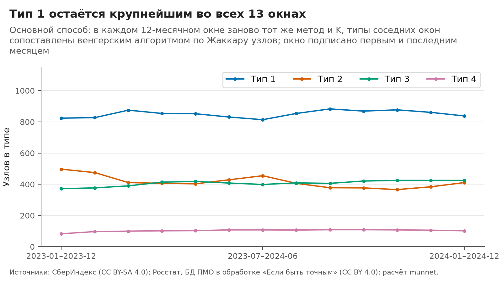
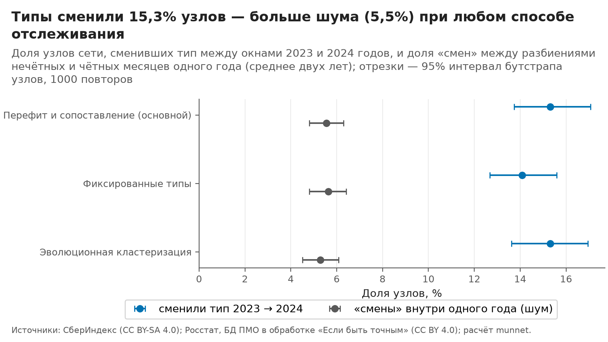
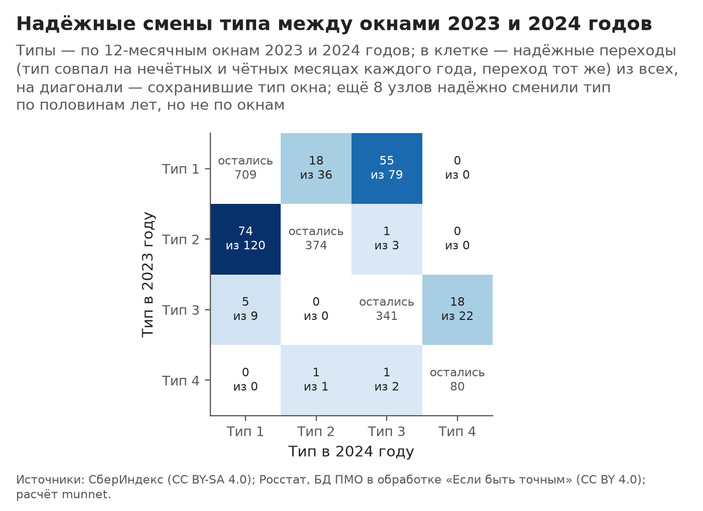
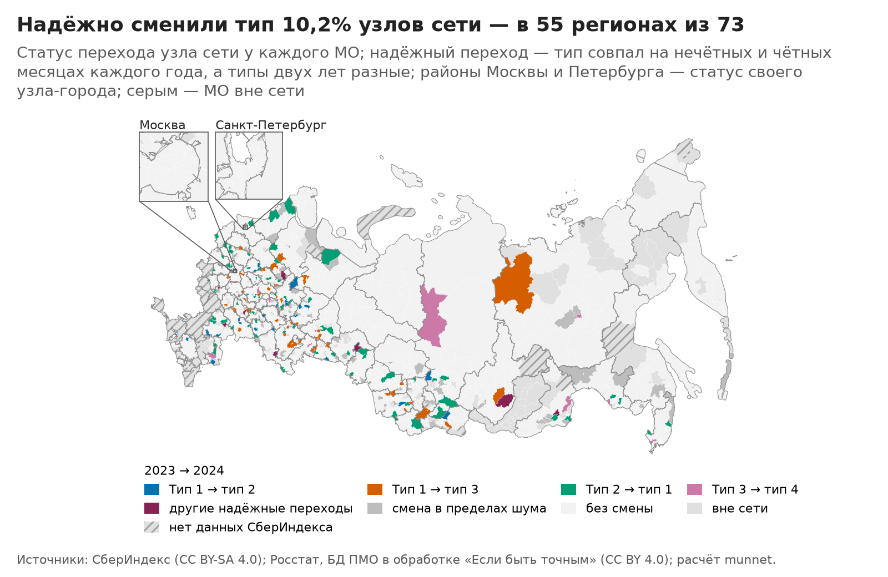
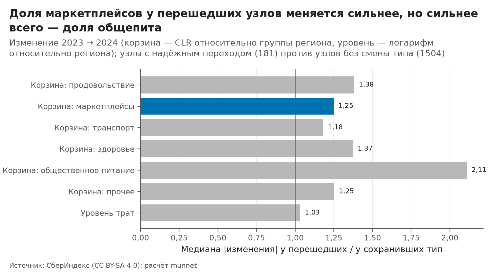

# Как типы локальных экономик меняются во времени: 2023 против 2024 года

> Собрано командой `python -m munnet dynamics` из выходов этапов `features`, `network` и `cluster`. Числа —
> `outputs/dynamics/report_facts.json`, таблицы целиком — `outputs/dynamics/*.csv`, история типа каждого узла —
> `data/processed/dynamics_history.parquet`. Руками не править: шаблон — `src/munnet/dynamics/templates/dynamics.md`,
> параметры — секция `dynamics` в `configs/default.yaml`. Правила отслеживания записаны до расчётов отдельным
> коммитом (`2ee1363`, блок `dynamics.tracking`).

## Главное за минуту

- **Смена типа за год не подтверждена, хотя в основном расчёте смен больше шума.** Между окнами 2023 и 2024 годов тип сменили 15,3% узлов сети (272 из 1776; 95% интервал 13,7–17,1%). Разбиения одного года на нечётных и на чётных месяцах расходятся у 5,5% узлов — это шум. Разность +9,8 п. п., 95% интервал бутстрапа узлов от 8,3 до 11,5 п. п.: по заранее записанному правилу изменение сверх шума. Тот же вывод дают все три способа отслеживания. При другом правиле связей между МО («косинус корзин») надёжных смен не больше, чем на плацебо — наборах месяцев без хода времени. Поэтому по заранее записанному правилу этапа 5 смена типа за год не подтверждена (проверка T3, `docs/interpretation.md`, разделы 6 и 8).
- **Надёжных переходов 181** (10,2% узлов): тип совпал на нечётных и чётных месяцах каждого года, а типы двух лет разные. Больше всего переходов из 2 в 1 — 74, из 1 в 3 — 55, из 1 в 2 — 26, из 3 в 4 — 18; два крупнейших потока — 71,3% надёжных переходов. Переходы есть в 55 регионах из 73.
- **Сами типы устойчивы, двигаются узлы.** Во всех 12 парах соседних окон и между 2023 и 2024 годами каждый из 4 типов «сохранился» при любом пороге Жаккара от 0,3 до 0,7: ни один тип не разделился, не слился с другим и не исчез. Меняется состав типов по краям.
- **Маркетплейсы: по записанному правилу — «частично», после вскрытия — не подтверждено.** Проверка сюжета о маркетплейсах по записанному правилу подтвердилась частично: первая часть выполнена, вторая — нет, наибольшее отношение у доли трат на общепит. У узлов с надёжным переходом доля маркетплейсов в корзине изменилась сильнее, чем у сохранивших тип (отношение медиан |изменения| 1,25, p = 0,001), но маркетплейсы по этому отношению 5-е из 6 частей корзины. После вскрытия видно, что первая часть ничего не проверяет (отступление после вскрытия 03.10.2026): тип окна строится прежде всего по сети корзин, поэтому у сменивших тип сильнее меняется почти любая часть корзины — у 5 частей из 6 p < 0,05, отношения медиан — от 1,18 до 2,11. Поэтому этим тестом гипотеза о маркетплейсах не подтверждена, а первое место общепита по отношению медиан (2,11) — описание (раздел 6). Уровень трат в сеть корзин не входит, и у перешедших он меняется почти так же, как у остальных (отношение медиан 1,03). Это тоже описание: уровень трат входит в признаки X, по которым строится тип окна, поэтому p по нему тоже смещено.
- **Узлы переходят вдоль оси типов** (описание). Типы выстроены вдоль одной оси «общепит против маркетплейсов и продуктов»: где доля общепита относительно региона выросла, а маркетплейсов упала, узел переходит в тип «ближе к городу» (с большим населением и доступностью рынков относительно региона), и наоборот.
- **Способы согласны.** Эволюционная кластеризация со сглаживанием почти повторяет основной способ (ARI переходов 0,99), фиксированные типы — чуть слабее (0,91): они не дают типам сдвигаться вместе с корзиной и находят 250 смен против 272 у основного.

## 1. Входы

- **Узлы** — 1776 узлов сети этапов network и cluster (Москва и Петербург — узлы-города, остальные МО — сами себе узлы, у всех полный ряд за 24 месяца).
- **Окна** — 13 скользящих 12-месячных окон этапа network с шагом 1 месяц: от 2023-01–2023-12 до 2024-01–2024-12 (`network_windows`, основной вид окон; обоснование — `docs/network.md`, раздел 8). В каждом окне все 12 календарных месяцев, поэтому сезон не смешивается с изменением типов.
- **Сеть окна G** — правило «Расстояние корзин», kNN, k = 10, как у итогового разбиения. Сеть строится функциями этапа network (`network.compute.similarity`, `network.graph.knn_edges`); сверка: во всех 13 окнах она совпала с `network_windows` ребро в ребро и вес в вес, иначе этап останавливается. Рёбер в окне — от 12 370 до 12 497.
- **Признаки окна X** — как у итогового разбиения: экономика места за 2023 год во всех окнах (предрегистрация: `place_year: 2023`) и уровень трат относительно региона за месяцы окна (`clustering.inputs.window_level`); пропуски — медиана группы региона, масштаб — медиана и MAD × 1,4826 по узлам (`clustering.inputs.build_X`). По окнам меняются только корзина (через G) и уровень трат.
- **Метод и K** — итог этапа cluster (`outputs/cluster/final.json`): гибрид «спектральное вложение G ⊕ X, K-means» с весом графа α = 0,5, K = 4, 10 seed, лучший запуск по инерции. Сверка: тот же код на 24 месяцах повторяет итоговые типы (ARI 1,00).

Итоговые типы 24 месяцев, с которыми сопоставляются типы окон (подробно — `docs/clustering.md`, раздел 7):

| Тип | Узлов | Доля | Корзина: общепит | Корзина: маркетплейсы | Уровень трат | Доступность рынков | Население |
|---|---:|---:|---:|---:|---:|---:|---:|
| Тип 1 | 806 | 45,4% | −0,03 | 0,03 | −0,04 | −0,3 | 0,00 |
| Тип 2 | 473 | 26,6% | −0,43 | 0,16 | −0,11 | −2,8 | −0,51 |
| Тип 3 | 394 | 22,2% | 0,41 | −0,15 | 0,13 | 4,9 | 0,77 |
| Тип 4 | 103 | 5,8% | 0,78 | −0,37 | 0,34 | 17,6 | 2,21 |

*Корзина — CLR относительно группы региона за 24 месяца; уровень трат и население — логарифм относительно региона; доступность рынков — разность с медианой региона. Медианы по узлам типа.*

По общепиту типы упорядочены так: 2 < 1 < 3 < 4, а по маркетплейсам — в обратном порядке. Это одна ось: чем больше в корзине общепита относительно своего региона, тем меньше маркетплейсов и продовольствия.

## 2. Способы отслеживания

В каждом способе типы всех окон приводятся к нумерации итоговых типов 1…4 24 месяцев. Узел $i$ в окне $w$ получает тип $y_i^{(w)}$; доля узлов, сменивших тип между окнами $a$ и $b$, — $\frac{1}{n}\sum_i [\,y_i^{(a)} \ne y_i^{(b)}\,]$.

- **Перефит и сопоставление (основной, `refit_match`).** В каждом окне заново тот же метод с тем же K. Нумерация кластеров (так в методике называются типы) произвольна, поэтому типы окна сопоставляются с типами прошлого окна венгерским алгоритмом (`scipy.optimize.linear_sum_assignment`) по матрице Жаккара узлов $J_{kl} = |A_k \cap B_l| / |A_k \cup B_l|$: перестановка $\pi$ максимизирует $\sum_k J_{k\pi(k)}$. Первое окно сопоставляется с итоговыми типами. Цепочка «окно к прошлому окну» во всех 13 окнах дала ту же нумерацию, что прямое сопоставление каждого окна с итоговыми типами.
- **Фиксированные типы (`fixed_prototypes`).** Смысл типов неизменен, двигаются узлы: узел окна относится к ближайшему центру итогового типа в пространстве метода. У гибрида это пространство — спектральное вложение G ⊕ X, а вложение каждого окна определено лишь с точностью до поворота. Поэтому вложение окна поворачивается к вложению 24 месяцев (ортогональная задача Прокруста на тех же узлах), а X окна масштабируется медианой и MAD 24 месяцев; блоки взвешиваются, как на 24 месяцах. Повёрнутое вложение окна объясняет от 0,91 до 0,97 суммы квадратов вложения 24 месяцев. Проверка: на самих 24 месяцах правило «к ближайшему центру» повторяет итоговые типы у 100,0% узлов.
- **Эволюционная кластеризация (`evolutionary`; Chakrabarti, Kumar, Tomkins, KDD 2006).** Разбиение окна должно и описывать данные окна, и не уходить далеко от прошлого окна. В том же пространстве, что у фиксированных типов, K-means окна стартует с центров прошлого окна, а центр пересчитывается по статье (разд. 4.2): $c_j \leftarrow (1-\gamma)\, cp\, c'_{f(j)} + \gamma\, (1-cp)\, \bar z_j$, где $\bar z_j$ — среднее узлов кластера, $c'_{f(j)}$ — ближайший к $c_j$ центр прошлого окна, $\gamma = n_j / (n_j + n'_{f(j)})$ — доля размера кластера в сумме с размером его пары в прошлом окне. Авторы затем нормируют центр к единичной длине (их объекты — единичные векторы); в евклидовом пространстве гибрида взят аналог — веса делятся на свою сумму $(1-\gamma)\, cp + \gamma\, (1-cp)$ (раздел 8). Первое окно — разбиение основного способа. Параметр изменения cp (в конфиге и таблицах — ε) = 0,5: рекомендованного значения у авторов нет, взят равный вес истории и окна; чувствительность — ε от 0,0 до 0,8 (раздел 7).

| Период | Месяцев | Рёбер G | ARI разных seed | Поворот к 24 месяцам | Тип 1 | Тип 2 | Тип 3 | Тип 4 | Сменили тип к прошлому окну |
|---|---:|---:|---:|---:|---:|---:|---:|---:|---:|
| 2023-01–2023-12 | 12 | 12 472 | 0,99 | 0,93 | 824 | 497 | 372 | 83 | — |
| 2023-02–2024-01 | 12 | 12 457 | 1,00 | 0,94 | 827 | 475 | 377 | 97 | 4,1% |
| 2023-03–2024-02 | 12 | 12 497 | 1,00 | 0,95 | 875 | 411 | 390 | 100 | 5,1% |
| 2023-04–2024-03 | 12 | 12 434 | 1,00 | 0,96 | 854 | 406 | 414 | 102 | 3,8% |
| 2023-05–2024-04 | 12 | 12 437 | 0,99 | 0,96 | 852 | 403 | 418 | 103 | 2,1% |
| 2023-06–2024-05 | 12 | 12 488 | 1,00 | 0,97 | 831 | 429 | 408 | 108 | 3,0% |
| 2023-07–2024-06 | 12 | 12 438 | 1,00 | 0,97 | 814 | 455 | 399 | 108 | 3,0% |
| 2023-08–2024-07 | 12 | 12 432 | 0,99 | 0,97 | 854 | 406 | 409 | 107 | 4,0% |
| 2023-09–2024-08 | 12 | 12 407 | 1,00 | 0,97 | 883 | 378 | 406 | 109 | 2,6% |
| 2023-10–2024-09 | 12 | 12 370 | 1,00 | 0,97 | 869 | 377 | 421 | 109 | 2,3% |
| 2023-11–2024-10 | 12 | 12 420 | 1,00 | 0,96 | 877 | 366 | 425 | 108 | 2,3% |
| 2023-12–2024-11 | 12 | 12 390 | 1,00 | 0,96 | 861 | 384 | 425 | 106 | 2,6% |
| 2024-01–2024-12 | 12 | 12 413 | 1,00 | 0,96 | 838 | 411 | 425 | 102 | 2,8% |
| 2023, нечётные месяцы | 6 | 12 444 | 1,00 | 0,91 |  |  |  |  |  |
| 2023, чётные месяцы | 6 | 12 476 | 1,00 | 0,94 |  |  |  |  |  |
| 2024, нечётные месяцы | 6 | 12 362 | 1,00 | 0,95 |  |  |  |  |  |
| 2024, чётные месяцы | 6 | 12 418 | 1,00 | 0,95 |  |  |  |  |  |
| 24 месяца | 24 | 12 418 | 1,00 | 1,00 |  |  |  |  |  |

*Периоды: 13 скользящих окон, половины каждого года (шум) и 24 месяца. ARI разных seed — медианный ARI разбиений 10 запусков; «поворот к 24 месяцам» — доля суммы квадратов вложения 24 месяцев, объяснённая повёрнутым вложением периода; число узлов в типах и доля сменивших тип к прошлому окну — основной способ.*

*Рисунок 2. Тип 1 остаётся крупнейшим во всех 13 окнах. Основной способ: в каждом 12-месячном окне заново тот же метод и K, типы соседних окон сопоставлены венгерским алгоритмом по Жаккару узлов; окно подписано первым и последним месяцем. Источник: СберИндекс (CC BY-SA 4.0); Росстат, БД ПМО в обработке «Если быть точным» (CC BY 4.0).* Данные: `outputs/dynamics/figures/D02_sizes.csv`.

Разбиение каждого окна повторяется при другом seed (наименьший ARI 0,99). Между соседними окнами тип меняют в среднем 3,1% узлов, не больше 5,1%: соседние окна делят 11 месяцев из 12, и их сходство задано построением (`docs/network.md`, раздел 8). Поэтому изменение измеряется между непересекающимися окнами — 2023 и 2024 годами.

## 3. Шум против изменения

**Что считается изменением** (предрегистрация `change`, `noise`, `change_rule`). Изменение — доля узлов, сменивших тип между окнами 2023 и 2024 годов. Шум — доля узлов, у которых тип разный в разбиениях нечётных и чётных месяцев одного года: это одно время, и различие — только от выборки месяцев. Разбиение полугодовых наборов месяцев шумнее 12-месячного окна, поэтому шум завышен, и проверка консервативна. Изменение сверх шума, если нижняя граница 95% интервала для разности «изменение минус шум» (шум — среднее двух лет) больше нуля. Интервал — 1000 выборок узлов с возвращением; в каждой выборке одни и те же узлы для изменения и для шума (парный бутстрап), а сопоставление типов пересчитывается.

| Способ | Сменили тип 2023 → 2024 | Шум 2023 | Шум 2024 | Разность | 95% интервал разности | Сверх шума | Надёжных переходов |
|---|---:|---:|---:|---:|---:|---:|---:|
| Перефит и сопоставление (основной) | 15,3% (13,7%–17,1%) | 5,7% | 5,3% | +9,8 п. п. | 8,3…11,5 | да | 181 |
| Фиксированные типы | 14,1% (12,7%–15,6%) | 6,1% | 5,2% | +8,4 п. п. | 6,9…10,0 | да | 161 |
| Эволюционная кластеризация | 15,3% (13,6%–16,9%) | 5,8% | 4,8% | +10,0 п. п. | 8,3…11,7 | да | 184 |

*Доли узлов сети; в скобках — 95% интервал бутстрапа. Надёжный переход — определение в разделе 5.*

*Рисунок 1. Типы сменили 15,3% узлов — больше шума (5,5%) при любом способе отслеживания. Доля узлов сети, сменивших тип между окнами 2023 и 2024 годов, и доля «смен» между разбиениями нечётных и чётных месяцев одного года (среднее двух лет); отрезки — 95% интервал бутстрапа узлов, 1000 повторов. Источник: СберИндекс (CC BY-SA 4.0); Росстат, БД ПМО в обработке «Если быть точным» (CC BY 4.0).* Данные: `outputs/dynamics/figures/D01_change_noise.csv`.

- Изменение больше шума в 2,8 раза; шум двух лет почти одинаков (5,7% и 5,3%).
- Вывод не зависит от способа: у фиксированных типов разность +8,4 п. п., у эволюционной кластеризации +10,0 п. п.; нижняя граница интервала везде больше нуля.
- Шум 5,5% — это и оценка того, сколько «переходов» между двумя годами может быть случайными: примерно треть из 15,3%. Поэтому о конкретном узле говорим только при надёжном переходе.

## 4. События: типы сохраняются

События — по схеме MONIC (Spiliopoulou и др., 2006) с порогом Жаккара, как у Greene и др. (2010). Пары «тип до — тип после» с $J \ge \tau$ соединяются; тип с одной парой, у которой тоже одна пара, «сохранился»; тип с двумя и более парами «разделился»; два и более типа с общей парой «слились»; тип без пары до — «исчез», после — «возник». Основной порог τ = 0,5 (предрегистрация `events_jaccard`), чувствительность — 0,3 и 0,7.

| Порог Жаккара | Пары | сохранился | разделился | слились | перестроились | возник | исчез |
|---|---:|---:|---:|---:|---:|---:|---:|
| 0,3 | 12 пар соседних окон | 48 | 0 | 0 | 0 | 0 | 0 |
| 0,3 | 2023 → 2024 | 4 | 0 | 0 | 0 | 0 | 0 |
| 0,3 | шум: половины года (2 пары) | 8 | 0 | 0 | 0 | 0 | 0 |
| 0,5 | 12 пар соседних окон | 48 | 0 | 0 | 0 | 0 | 0 |
| 0,5 | 2023 → 2024 | 4 | 0 | 0 | 0 | 0 | 0 |
| 0,5 | шум: половины года (2 пары) | 8 | 0 | 0 | 0 | 0 | 0 |
| 0,7 | 12 пар соседних окон | 48 | 0 | 0 | 0 | 0 | 0 |
| 0,7 | 2023 → 2024 | 4 | 0 | 0 | 0 | 0 | 0 |
| 0,7 | шум: половины года (2 пары) | 8 | 0 | 0 | 0 | 0 | 0 |

*Число событий по основному способу; соседние окна — сумма по 12 парам.*

- При всех трёх порогах все 4 типа сохранились во всех парах: и в соседних окнах, и между 2023 и 2024 годами (Жаккар типа с его парой — от 0,70 до 0,76). Разделений, слияний, новых и исчезнувших типов нет.
- У эволюционной кластеризации при пороге 0,7 между 2023 и 2024 годами: «сохранился» — 3, «исчез» — 1, «возник» — 1; у фиксированных типов: «сохранился» — 4.
- Смысл для сюжета: за два года не появилось нового типа локальной экономики, изменение — это переход части узлов между существующими типами. Размер типа по окнам колеблется (наибольший размах — 31,5% от среднего размера, у типа 2).

## 5. Надёжные переходы и кто перешёл

**Надёжный переход узла** (предрегистрация `node_transition: stable_halves`): тип узла совпал в разбиениях нечётных и чётных месяцев и в 2023, и в 2024 году, а типы двух лет различаются. Половины года согласны по типу у 94,3% узлов в 2023 году и у 94,7% — в 2024-м. Остальные смены типа между окнами — «в пределах шума».

*Все переходы между окнами 2023 и 2024 годов (основной способ); в скобках — из них надёжные, у которых переход по половинам лет тот же. Строки и столбцы — тип 12-месячного окна.*

| Тип 2023 \ тип 2024 | Тип 1 | Тип 2 | Тип 3 | Тип 4 |
|---|---:|---:|---:|---:|
| Тип 1 | 709 | 36 (18) | 79 (55) | 0 (0) |
| Тип 2 | 120 (74) | 374 | 3 (1) | 0 (0) |
| Тип 3 | 9 (5) | 0 (0) | 341 | 22 (18) |
| Тип 4 | 0 (0) | 1 (1) | 2 (1) | 80 |

*В таблице 173 надёжных переходов из 181. Ещё у 8 узлов тип по половинам лет сменился надёжно, а тип окон 2023 и 2024 годов один: они стоят на диагонали и в скобки не входят. Надёжных переходов, у которых окна показывают другой переход, нет.*

*Рисунок 3. Чаще всего надёжно переходят из типа 2 в тип 1. Типы — по 12-месячным окнам 2023 и 2024 годов; в клетке — надёжные переходы (тип совпал на нечётных и чётных месяцах каждого года, переход тот же) из всех, на диагонали — сохранившие тип окна; ещё 8 узлов надёжно сменили тип по половинам лет, но не по окнам. Источник: СберИндекс (CC BY-SA 4.0); Росстат, БД ПМО в обработке «Если быть точным» (CC BY 4.0).* Данные: `outputs/dynamics/figures/D03_transitions.csv`.

- Надёжных переходов по предрегистрированному определению (типы половин года) — 181: из 2 в 1 — 74, из 1 в 3 — 55, из 1 в 2 — 26, из 3 в 4 — 18. Два крупнейших потока — 71,3% всех надёжных переходов. Те же потоки — в таблице изменений корзины ниже.
- 8 узлов, надёжных по половинам, но без смены типа окон, стоят на границе типов: их 12-месячный тип не изменился.

**Куда смещается корзина у перешедших.** Медианы изменения 2023 → 2024 (корзина — CLR относительно группы региона, уровень — логарифм относительно региона; примеры — узлы, у которых корзина изменилась сильнее всего):

| Переход | Узлов | Продовольствие | Маркетплейсы | Транспорт | Здоровье | Общественное питание | Прочее | Уровень трат | Примеры: сильнее всего изменилась корзина |
|---|---:|---:|---:|---:|---:|---:|---:|---:|---:|
| 1 → 2 | 26 | 0,04 | 0,10 | −0,01 | 0,01 | −0,19 | 0,04 | −0,02 | Богородский округ (Кировская область); Унинский округ (Кировская область); Красноармейский район (Самарская область); Троснянский район (Орловская область); Половинский округ (Курганская область) |
| 1 → 3 | 55 | −0,02 | −0,05 | 0,00 | −0,01 | 0,08 | −0,01 | 0,02 | Ельцовский район (Алтайский край); Шатровский округ (Курганская область); Краснослободский район (Республика Мордовия); Ермишинский район (Рязанская область); Инзенский район (Ульяновская область) |
| 2 → 1 | 74 | −0,02 | −0,05 | −0,01 | −0,04 | 0,13 | −0,01 | 0,00 | Большеулуйский район (Красноярский край); Савинский район (Ивановская область); Духовницкий район (Саратовская область); Павинский округ (Костромская область); Базарносызганский район (Ульяновская область) |
| 2 → 3 | 1 | −0,21 | −0,10 | −0,08 | −0,14 | 0,62 | −0,09 | 0,02 | Кичменгско-Городецкий округ (Вологодская область) |
| 3 → 1 | 5 | 0,04 | −0,03 | 0,05 | 0,05 | −0,26 | 0,02 | −0,03 | Балейский район (Забайкальский край); Качугский район (Иркутская область); Становлянский район (Липецкая область); Саракташский район (Оренбургская область); Котовский район (Волгоградская область) |
| 3 → 4 | 18 | −0,02 | −0,10 | 0,05 | 0,02 | 0,05 | 0,00 | 0,03 | Благовещенский округ (Амурская область); Кирово-Чепецк (Кировская область); Якутск (Республика Саха (Якутия)); Медведевский район (Республика Марий Эл); Чебоксары (Чувашская Республика) |
| 4 → 2 | 1 | 0,29 | 0,90 | 0,09 | 0,08 | −1,31 | −0,06 | 0,08 | Усть-Ишимский район (Омская область) |
| 4 → 3 | 1 | 0,04 | 0,07 | 0,13 | 0,03 | −0,27 | 0,01 | 0,01 | Городищенский район (Пензенская область) |
| без смены | 1504 | 0,00 | −0,01 | 0,01 | 0,01 | −0,01 | 0,00 | 0,00 | — |

У каждого из 4 потоков с 10 и более узлами общепит и маркетплейсы изменились в сторону профиля нового типа: переходы в тип с большим общепитом — это рост доли общепита и падение доли маркетплейсов относительно своего региона, переходы в тип с меньшим общепитом — наоборот. Уровень трат относительно региона у перешедших меняется не сильнее, чем у сохранивших тип.

**Где переходы.** Надёжные переходы есть в 55 регионах из 73; первые 10 регионов собирают 38,1% надёжных переходов, больше всего — Кировская область (11).

| Регион | Узлов | Надёжных переходов | Доля узлов региона | Сменили тип всего |
|---|---:|---:|---:|---:|
| Кировская область | 43 | 11 | 25,6% | 15 |
| Республика Башкортостан | 61 | 8 | 13,1% | 11 |
| Волгоградская область | 35 | 7 | 20,0% | 7 |
| Нижегородская область | 50 | 7 | 14,0% | 8 |
| Красноярский край | 51 | 7 | 13,7% | 9 |
| Свердловская область | 64 | 7 | 10,9% | 9 |
| Курганская область | 24 | 6 | 25,0% | 8 |
| Алтайский край | 65 | 6 | 9,2% | 10 |
| Пензенская область | 25 | 5 | 20,0% | 7 |
| Костромская область | 28 | 5 | 17,9% | 6 |

*Рисунок 5. Надёжно сменили тип 10,2% узлов сети — в 55 регионах из 73. Статус перехода узла сети у каждого МО; надёжный переход — тип совпал на нечётных и чётных месяцах каждого года, а типы двух лет разные; районы Москвы и Петербурга — статус своего узла-города; серым — МО вне сети. Источник: СберИндекс (CC BY-SA 4.0); Росстат, БД ПМО в обработке «Если быть точным» (CC BY 4.0).* Данные: `outputs/dynamics/figures/D05_map.csv`.

## 6. Проверка сюжета о маркетплейсах

**Что записано до расчёта** (предрегистрация `driver: clr_rel_marketplace`). Сюжет проекта: сдвиг к маркетплейсам перестраивает типы. Проверка из двух частей: (1) у узлов с надёжным переходом |изменение доли маркетплейсов 2023 → 2024| (CLR относительно региона) больше, чем у узлов без смены типа, — тест Манна — Уитни, односторонний, α = 0,05; (2) из шести частей корзины у маркетплейсов наибольшее отношение медиан |изменения| «переход / без смены».

**Итог: проверка подтвердилась частично: первая часть выполнена, вторая — нет, наибольшее отношение у доли трат на общепит.**

**Отступление после вскрытия 03.10.2026.** Запись проверки и вердикт по ней не менялись. После вскрытия видно, что первая часть проверки ничего не проверяет, поэтому рядом — оба прочтения.

- **По записанному правилу — частично.** Первая часть выполнена (p = 0,001, отношение медиан 1,25), вторая — нет: маркетплейсы 5-е из 6 частей корзины.
- **После вскрытия первая часть выполняется почти для любой части корзины.** Тип окна строится по сети корзин (рёбра — расстояние корзин относительно региона) и по признакам X. Узел, сменивший тип, сдвинулся по корзине, поэтому у сменивших тип сильнее меняется почти любая часть корзины, по которой различаются типы. В таблице ниже p < 0,05 у 5 частей из 6, не значимы: транспорт (p = 0,063); отношения медиан — от 1,18 (транспорт) до 2,11. Нулевая гипотеза теста («у перешедших часть корзины меняется так же, как у остальных») неверна по построению типов, и малое p ничего не говорит о роли маркетплейсов. Это та ошибка, которую разбирают Gao, Bien, Witten (2022): p-значения по признакам, по которым построены кластеры, некорректны. Для профилей типов это правило в проекте записано (блок `interpret` в `configs/default.yaml`), а к этой проверке его не применили.
- **Уровень трат.** Он входит в признаки окна X и меняется от окна к окну, но в сеть корзин не входит. У перешедших он меняется почти так же, как у остальных: отношение медиан 1,03 — меньше, чем у любой части корзины. Это согласуется с тем, что переходы в основном отражают сдвиг корзины. Это тоже описание: уровень трат входит в признаки X, по которым строится тип окна, поэтому p по нему тоже смещено (в таблице ниже оно приведено как данные).
- **Вывод.** Этим тестом гипотеза «сдвиг к маркетплейсам перестраивает типы» не подтверждена. Первое место общепита по отношению медиан (2,11) — описание: по доле общепита типы различаются сильнее всего (размах медиан типов 1,21 против 0,52 у маркетплейсов и 0,53 у продуктов, `outputs/dynamics/types.csv`), поэтому при смене типа она и меняется сильнее.

| Показатель | Медиана модуля Δ: переход | Медиана модуля Δ: без смены | Отношение | Медиана Δ: переход | AUC | p (Манн — Уитни, односторонний) |
|---|---:|---:|---:|---:|---:|---:|
| Корзина: продовольствие | 0,031 | 0,022 | 1,38 | −0,019 | 0,61 | 1,5·10⁻⁶ |
| Корзина: маркетплейсы | 0,065 | 0,052 | 1,25 | −0,045 | 0,57 | 0,001 |
| Корзина: транспорт | 0,039 | 0,033 | 1,18 | −0,002 | 0,53 | 0,063 |
| Корзина: здоровье | 0,034 | 0,025 | 1,37 | −0,012 | 0,58 | 3,5·10⁻⁴ |
| Корзина: общественное питание | 0,113 | 0,054 | 2,11 | 0,075 | 0,72 | 3,3·10⁻²² |
| Корзина: прочее | 0,031 | 0,025 | 1,25 | −0,005 | 0,55 | 0,012 |
| Уровень трат | 0,019 | 0,019 | 1,03 | 0,005 | 0,51 | 0,379 |

*Узлы с надёжным переходом (181) против узлов, чей тип в окнах 2023 и 2024 годов один (1504); AUC — вероятность, что |изменение| у случайного перешедшего узла больше, чем у случайного сохранившего тип. Тест для шести частей и уровня — без поправки на множественность: предрегистрирована одна проверка (маркетплейсы), остальные строки — описание.*

*Рисунок 4. Доля маркетплейсов у перешедших узлов меняется сильнее, но сильнее всего — доля общепита. Изменение 2023 → 2024 (корзина — CLR относительно группы региона, уровень — логарифм относительно региона); узлы с надёжным переходом (181) против узлов без смены типа (1504). Источник: СберИндекс (CC BY-SA 4.0).* Данные: `outputs/dynamics/figures/D04_driver.csv`.

*Рисунок 4 — описание: у перешедших сильнее меняются почти все части корзины, по которым различаются типы (отступление выше).*

Прочтение по записанному правилу; после вскрытия первая часть ничего не проверяет (отступление выше):

- Первая часть выполнена: p = 0,001, AUC 0,57, отношение медиан 1,25.
- Вторая — нет: маркетплейсы по отношению медиан 5-е из шести, первое место — у общепита (2,11, p = 3,3·10⁻²²). Уровень трат у перешедших меняется почти так же, как у остальных (отношение медиан 1,03); это описание, p по нему тоже смещено (отступление выше).
- Если «без смены» понимать строже — тип совпал в обеих половинах обоих лет и в окнах (1399 узлов), — по записанному правилу вывод тот же: p = 6,7·10⁻⁴, отношение 1,27, первое место — у доли трат на общепит.
- Как читать. Корзина здесь — относительно своего региона, поэтому общий для всех рост маркетплейсов вычтен; переход типа задаёт то, как узел сдвинулся относительно соседей по региону. Маркетплейсы лежат на одной оси с общепитом (раздел 5), а сильнее всего у перешедших меняется доля общепита — это описание (отступление выше). Сюжет для лендинга стоит формулировать так: «переходы идут по оси „общепит против маркетплейсов“, и сильнее всего у перешедших меняется доля общепита».

## 7. Сравнение способов

| Способ | Сменили тип 2023 → 2024 | Шум | Надёжных переходов | Соседние окна: сменили тип, среднее | ARI переходов с основным | Жаккар сменивших тип с основным | Надёжные переходы основного: тот же переход | …и тоже надёжный |
|---|---:|---:|---:|---:|---:|---:|---:|---:|
| Перефит и сопоставление (основной) | 15,3% | 5,5% | 181 | 3,1% | 1,00 | 1,00 | 95,6% | 100,0% |
| Фиксированные типы | 14,1% | 5,6% | 161 | 2,6% | 0,91 | 0,68 | 89,0% | 77,3% |
| Эволюционная кластеризация | 15,3% | 5,3% | 184 | 2,7% | 0,99 | 0,97 | 95,6% | 95,6% |

*Согласие с основным способом: ARI меток переходов «тип 2023 × тип 2024»; Жаккар множеств узлов, сменивших тип; доля надёжных переходов основного способа, которые способ повторяет тем же переходом между окнами (у самого основного это не 100%: 8 надёжных переходов не видны в окнах, раздел 5) и признаёт надёжными.*

- **Что показывает каждый.** Основной способ отвечает на вопрос «какие типы в данных окна и кто в них»: типы вправе сдвигаться вместе с корзиной. Фиксированные типы отвечают на вопрос «кто ушёл от эталона 24 месяцев»: смысл типа закреплён, поэтому смен меньше (14,1% против 15,3%) и надёжных переходов меньше (161), а их потоки другие: из 2 в 1 — 61, из 1 в 2 — 38, из 1 в 3 — 35, из 3 в 4 — 11. Эволюционная кластеризация сглаживает соседние окна (между ними тип меняют в среднем 2,7% узлов против 3,1%), но между 2023 и 2024 годами даёт почти то же, что основной способ (15,3%, надёжных переходов 184).
- **Согласие.** ARI переходов с основным: эволюционная 0,99, фиксированные типы 0,91; надёжные переходы основного фиксированные типы повторяют в 89,0% случаев, эволюционная — в 95,6%.
- **Когда какой применять.** Сглаживание нужно, когда разбиения соседних окон дрожат; здесь окна делят 11 месяцев из 12, перефит и так устойчив, и сглаживание почти ничего не меняет — от веса истории ε результат почти не зависит (таблица ниже). Фиксированные типы нужны, когда смысл типа должен быть одним для всех лет (например, для сравнения с внешним показателем 24 месяцев), но они не заметят, если сам тип сдвинется.

| ε | Сменили тип 2023 → 2024 | Шум | Надёжных переходов | Соседние окна, среднее | ARI переходов с основным |
|---|---:|---:|---:|---:|---:|
| 0,0 | 15,3% | 5,4% | 184 | 3,0% | 1,00 |
| 0,2 | 15,5% | 5,3% | 187 | 2,7% | 0,99 |
| 0,5 | 15,3% | 5,3% | 184 | 2,7% | 0,99 |
| 0,8 | 14,8% | 5,4% | 173 | 2,6% | 0,97 |

*Эволюционная кластеризация при разном параметре изменения cp (ε); ε = 0 — K-means со стартом от центров прошлого окна без сглаживания.*

## 8. Отступления и толкования

Предрегистрированные ключи не менялись; где запись допускала несколько прочтений, взято ближайшее, а параметры реализации записаны в `dynamics.impl` с пометкой «НЕ ПРЕДРЕГИСТРАЦИЯ».

- **Нумерация типов.** Типы всех окон приводятся к итоговым типам 24 месяцев: первое окно — к итоговым, каждое следующее — к прошлому окну (цепочка), половины года — к окну своего года. Прямое сопоставление с итоговыми типами дало ту же нумерацию.
- **Доля смен на шуме** — среднее двух лет (2023 и 2024), каждая — между разбиениями нечётных и чётных месяцев. Комментарий к предрегистрированному ключу `noise` этого не уточняет; толкование записано в `dynamics.impl.noise_mean` и здесь.
- **Две матрицы переходов.** Надёжный переход по предрегистрации определён по типам половин года, а все переходы — по типам 12-месячных окон. В таблице раздела 5 обе части даны в типах окон (надёжные — только с тем же переходом по половинам), а потоки и проверка сюжета — по предрегистрированному определению.
- **События MONIC.** Предрегистрация задаёт порог Жаккара для «сохранился»; для остальных событий взято правило Greene и др. (2010) с тем же порогом (двудольный граф пар с $J \ge \tau$). Событие «перестроились» (несколько типов → несколько) добавлено, чтобы каждый тип получил событие; на данных его нет.
- **«Без смены типа» в проверке сюжета** — тип в окнах 2023 и 2024 годов один (основное прочтение); строгое прочтение — в разделе 6, вывод тот же. Изменение корзины — между теми же окнами (сверено с `network_window_nodes`).
- **Проверка сюжета: прочтение после вскрытия (03.10.2026).** Запись `driver` и вердикт по ней не менялись. Рядом с вердиктом («Главное за минуту» и раздел 6) добавлено второе прочтение: первая часть проверки выполняется почти для любой части корзины и о маркетплейсах ничего не говорит.
- **Фиксированные типы для гибрида.** Пространство метода зависит от окна (вложение G определено с точностью до поворота), поэтому вложение окна поворачивается к вложению 24 месяцев (Прокруст), а X масштабируется по 24 месяцам (раздел 2).
- **Эволюционная кластеризация.** Правило пересчёта центров — по статье (KDD 2006, разд. 4.2) с весом γ по размерам кластеров. У авторов после смешивания центр нормируется к единичной длине, потому что объекты лежат на единичной сфере; в пространстве гибрида объекты не нормированы, поэтому взята нормировка весов к сумме 1. При равных размерах (γ = 1/2) она даёт правило $cp \cdot c' + (1 - cp) \cdot \bar z$ из патента тех же авторов (US 8930365 B2). Надёжные переходы для неё — по разбиениям половин года, полученным одним шагом от центров и размеров кластеров окна своего года.
- **Сети половин года** строятся теми же функциями этапа network, что сети окон; их нет в `network_windows`, поэтому они проверены косвенно — тем же кодом для 13 окон, совпавших с `network_windows`.

## 9. Ограничения

- **Два года.** Изменение 2023 → 2024 — одно сравнение; тренд или колебание по нему не различить. Скользящие окна показывают, как оно накапливается, но не независимы.
- **Шум измерен на полугодовых наборах месяцев** и завышен относительно 12-месячных окон: доля «случайных» переходов, вероятно, меньше 5,5%, а надёжных — больше 181.
- **Признаки места — 2023 год во всех окнах** (предрегистрация): переход типа отражает изменение корзины и уровня трат, а не экономики места. Уровень трат у перешедших меняется так же, как у остальных; это согласуется с тем, что переходы в основном отражают сдвиг корзины, и это описание (раздел 6).
- **Переход — связь, а не причина.** Проверка сюжета показывает, какие части корзины сильнее меняются у перешедших; почему они меняются, данные не говорят.
- **Данные** — безналичные траты по картам одного банка (оценка модели СберИндекса), 77 регионов; траты приезжих не видны; рубли номинальные, но корзина и уровень взяты относительно своего региона.

## 10. Выходы и запуск

Запуск: `uv run --frozen python -m munnet dynamics` (после `panel features network cluster`); временный конфиг — как в `docs/agents.md`. Не больше 1 мин на обычном ноутбуке; случайность — от `seed` конфига, повторный прогон даёт те же числа.

| Файл | Что внутри |
|---|---|
| `data/processed/dynamics_history.parquet` | история типа каждого узла по 13 окнам для лендинга: `territory_id`, `window`, `window_index`, `first_date`, `last_date`, `type` (1…K, нумерация итоговых типов), `type_24m`, `status` (`reliable`, `within_noise`, `no_change`), `reliable`, `is_city_node` |
| `outputs/dynamics/labels.csv` | типы всех периодов по трём способам |
| `outputs/dynamics/periods.csv`, `windows.csv` | периоды, сети, разброс по seed, поворот вложения; размеры типов по окнам |
| `outputs/dynamics/comparison.csv`, `evolutionary_epsilon.csv` | изменение, шум, бутстрап и согласие способов; чувствительность к ε |
| `outputs/dynamics/transitions.csv`, `events.csv` | матрицы переходов (все и надёжные), события MONIC при трёх порогах |
| `outputs/dynamics/nodes.csv`, `flows.csv`, `regions.csv` | узлы с типами, статусом и изменением корзины; потоки; регионы |
| `outputs/dynamics/driver.csv`, `driver_stable_same.csv` | проверка сюжета о маркетплейсах |
| `outputs/dynamics/facts.json`, `report_facts.json` | числа этапа и отчёта |

Данные: СберИндекс (CC BY-SA 4.0); Росстат, БД ПМО в обработке «Если быть точным» (CC BY 4.0). Литература: Chakrabarti D., Kumar R., Tomkins A. Evolutionary clustering // KDD 2006, с. 554–560 (вторично — патент US 8930365 B2 тех же авторов); Spiliopoulou M. и др. MONIC: modeling and monitoring cluster transitions // KDD 2006; Greene D., Doyle D., Cunningham P. Tracking the evolution of communities in dynamic social networks // ASONAM 2010; Gao L. L., Bien J., Witten D. Selective inference for hierarchical clustering // Journal of the American Statistical Association. 2024. Vol. 119. P. 332–342 (онлайн — 2022).
