# Разведка данных: траты жителей 2190 муниципалитетов, 2023–2024

> Собрано командой `python -m munnet panel eda` (версии данных — sha256 в `configs/default.yaml`, таблица
> в конце). Не править вручную: текст — `src/munnet/eda/templates/eda.md`, числа — `outputs/eda/facts.json`.

Проект munnet делит муниципалитеты России на типы по тому, как тратят их жители, и связывает их в сеть. Этот отчёт — разведка перед поиском типов: что есть в данных СберИндекса за 2023–2024 годы, где тратят больше и почему, что меняется со временем и какую тему (сюжет) взять для типологии на следующем этапе. Траты — оценка СберИндекса средних безналичных потребительских расходов жителя муниципалитета (МО) в месяц, в текущих рублях без поправки на инфляцию. «Типичное МО» — медиана по МО без весов, «типичный житель» — среднее по МО с весами населения. Каждое число отчёта пересчитывается одной командой и лежит в `outputs/eda/facts.json`; вывод в заголовке каждого рисунка проверяется на данных, и если он перестал быть верным, отчёт не собирается.

## Главное за минуту

- **Что в данных.** Траты за 2023–2024 годы есть по 2190 МО 77 регионов; 8 регионов юго-запада нет целиком. Все месяцы есть у 92,1% МО, пропуски чаще у мелких МО ([рис. 1](#fig-1)).
- **Сколько тратят.** По оценке СберИндекса, безналичные траты жителя типичного МО в 2024 году — 26 561 ₽ в месяц; во внутригородских территориях Москвы и Петербурга — в 1,90 раза выше медианы страны, на Севере — в 1,41 раза. Где выше зарплата, почти всегда выше и траты (ранговая корреляция 0,87 при максимуме 1); большую часть различий задаёт регион ([рис. 3](#fig-3), [4](#fig-4), [5](#fig-5)).
- **Годовой ритм почти у всех общий.** Декабрь — месяц самых больших трат у 97,6% МО. Свой устойчивый ритм, отличный от общего, есть лишь у 15,6% МО, чаще на Севере, где траты растут летом ([рис. 6](#fig-6), [7](#fig-7), [8](#fig-8)).
- **Маркетплейсы растут быстрее там, где тратят меньше.** Доля маркетплейсов в безналичных тратах типичного МО — 11,6% в 2023 году и 15,9% в 2024-м, в декабре — 15,4% и 19,4%. За год доля прибавила +5,5 п. п. у пятой части МО с самыми низкими тратами и +2,6 п. п. у пятой части с самыми высокими; в рублях МО с высокими тратами прибавляют больше ([рис. 11](#fig-11), [12](#fig-12)).
- **В разах корзины сильнее всего различаются долей общепита, в процентных пунктах — долей продовольствия.** Продовольствие — 44,1% трат типичного МО, общепит (кафе, рестораны, фастфуд) — 2,6%; межквартильный размах доли продовольствия — 8,5 п. п., общепита — 3,2 п. п. Состав корзины во многом повторяет уровень трат (ρ 0,80); без уровня и региона остаётся 23,6% разброса долей ([рис. 9](#fig-9), [10](#fig-10)).
- **Сходство МО по рядам — только без общего фона.** Помесячные траты двух случайных МО похожи (медиана корреляции 0,91) лишь из-за общего роста и декабря; для связей между МО годится только свой ритм ([таблица T06](#tab-t06)).
- **Какой сюжет.** Все критерии отказа прошёл только С4 «Состав корзины» (3,75); следующий по итогу — С5 «Сдвиг к маркетплейсам» (3,60; слой). С 247 внутригородскими территориями Москвы и Петербурга отдельными узлами перестаёт проходить критерии С4; выше всех по итогу — С5 «Сдвиг к маркетплейсам» (3,85; слой): выбор сюжета связан с решением по Москве и Петербургу. Выбор — за участником ([таблица T14](#tab-t14)).

## Какой сюжет выбрать

Матрица — подсказка, выбор делает участник. Каждый сюжет получает баллы 1–5 по шести критериям, итог — их взвешенная сумма. Веса выведены из критериев жюри: сила сигнала — 25%, сеть и динамика — 20%, практическая ценность — 20%, покрытие — 15%, объяснимость — 10%, риски данных — 10%.

- **По фактам** посчитаны только сила сигнала и покрытие — это 40% итога (колонка «По фактам», баллы 1–5). Остальные 60% — экспертные баллы автора (колонка «Экспертный»); их обоснования — ниже, участник вправе их изменить в `src/munnet/eda/stories.py` и пересобрать отчёт командой `python -m munnet eda --only syn`.
- **Критерии отказа.** Главным сюжет может стать, только если выполнены все его критерии; иначе он «слой» (выполнен хотя бы один критерий силы сигнала) или «контекст», какой бы ни был итог. Сигнал сюжета проверяется сверх того, что дают уровень трат, зарплата и регион: иначе типы повторят карту регионов и зарплат.
- **Критерий на границе** — критерий, по которому другая оценка той же величины (граница интервала бутстрепа, другое определение «внутри регионов», другое решение по Москве и Петербургу) даёт другой ответ: на таком критерии решение строить не стоит.
- **Узлы сети.** Критерии отказа, сила сигнала, покрытие и прототип типов посчитаны на узлах сети: Москва и Петербург — два узла-города, остальные МО — сами себе узлы (параметр `nodes.mode`); узлов 1945, из них с полным рядом — 1776. Функции те же, что в разделах, а «относительно региона» — по группе региона: города вместе со своими областями («Москва и Московская область», «Санкт-Петербург и Ленинградская область»). Сюжет С6 на узлах не пересчитывается: внутригородские территории и узлы-города не входят в выборку 5-НДФЛ, меняется только знаменатель покрытия.
- **Другое решение по Москве и Петербургу.** Вторая матрица — 247 внутригородских территорий отдельными узлами: критерии, сила сигнала и покрытие — при этом решении, экспертные баллы — те же.
- **Проверки сюжета.** Быстрый прототип типов ([таблица T15](#tab-t15)) показывает, не повторяют ли типы простое деление МО; внешняя проверка — связь главного показателя сюжета внутри регионов с показателем Росстата вне признаков сюжета, ожидаемый знак связи записан до этапа 2; пример МО — наибольшее отклонение от того, что дают уровень трат (у С2 — зарплата) и регион.

<a name=tab-t14></a>**Таблица T14.** Матрица решения: баллы 1–5 с весами (×), итог Σ вес × балл и его части, роль по критериям отказа; риски: 5 — рисков мало.

| № | Сюжет | Сигнал ×0,25 | Покрытие ×0,15 | Сеть ×0,20 | Ценность ×0,20 | Объяснимость ×0,10 | Риски ×0,10 | По фактам ×0,40 | Экспертный ×0,60 | Итог | Роль |
|---|---|---:|---:|---:|---:|---:|---:|---:|---:|---:|---|
| С1 | Годовой ритм | 2 | 5 | 4 | 3 | 4 | 2 | 3,12 | 3,33 | 3,25 | слой |
| С2 | Ядра и периферия | 2 | 5 | 3 | 4 | 4 | 3 | 3,12 | 3,50 | 3,35 | контекст (критерий на границе) |
| С3 | Устойчивость потребления | 2 | 5 | 2 | 3 | 3 | 1 | 3,12 | 2,33 | 2,65 | контекст |
| С4 | Состав корзины | 4 | 5 | 4 | 3 | 3 | 3 | 4,38 | 3,33 | 3,75 | может быть главным (критерий на границе) |
| С5 | Сдвиг к маркетплейсам | 3 | 5 | 3 | 4 | 4 | 3 | 3,75 | 3,50 | 3,60 | слой |
| С6 | Где зарабатывают и где тратят | 1 | 4 | 3 | 4 | 4 | 2 | 2,12 | 3,33 | 2,85 | контекст |

Целиком: `outputs/eda/tables/T14_decision_matrix.csv`.

**Подсказка.** Все критерии отказа выполнены у С4 «Состав корзины» (критерий на границе). Разрыв между С4 и С5 — 0,15 балла, а сдвиг одного экспертного балла на 1 (вес в итоге — 0,20) меняет их порядок: при таком разрыве первое место определяют экспертные баллы. С4 впереди и по одним фактам (сила сигнала и покрытие). Быстрый прототип (k-means, k = 5, [таблица T15](#tab-t15)): сильнее всего простое деление повторяют типы С2 (группа по уровню трат, AMI 0,38), слабее всего — типы С4 (AMI не больше 0,04); для сравнения, типы по одному уровню трат совпадают с группами по уровню на AMI 0,64. Типы двух независимых замеров совпадают (ARI): С2 — 0,89, С3 — 0,04, С4 — 0,43, С5 — 0,33. Возможна связка «главный сюжет + слой»: главный сюжет задаёт признаки и рёбра всей сети, а слой описывает подмножество МО, где его сигнал сильнее. Матрица не знает, какой сюжет вам интереснее и что вы успеете сделать: экспертные баллы и веса отражают мнение автора.

<a name=tab-t15></a>**Таблица T15.** Быстрый прототип типов: k-means (k = 5) по признакам сюжета у узлов сети с полным рядом; AMI типов с простыми делениями узлов сети и ARI типов двух независимых замеров.

| Сюжет | Признаки | Узлов | AMI: регион | AMI: федеральный округ | AMI: тип МО | AMI: группа по населению | AMI: группа по уровню трат | AMI: доля горожан | ARI двух замеров | Замеры |
|---|---|---:|---:|---:|---:|---:|---:|---:|---:|---|
| уровень трат, для сравнения | уровень трат | 1776 | 0,16 | 0,09 | 0,10 | 0,11 | 0,64 | 0,10 | 0,48 | 2023 и 2024 годы |
| С1 | летний избыток, декабрьский пик, размах своего ритма | 1776 | 0,13 | 0,10 | 0,01 | 0,01 | 0,04 | 0,01 | — | — |
| С2 | уровень трат, доступность рынков, расстояние до столицы | 1709 | 0,23 | 0,29 | 0,08 | 0,13 | 0,38 | 0,10 | 0,89 | 2023 и 2024 годы |
| С3 | номинальный рост трат | 1776 | 0,04 | 0,02 | 0,02 | 0,06 | 0,03 | 0,02 | 0,04 | январь–июнь и июль–декабрь |
| С4 | шесть долей CLR без уровня и региона | 1776 | 0,01 | 0,00 | 0,02 | 0,04 | 0,01 | 0,01 | 0,43 | 2023 и 2024 годы |
| С5 | прирост доли маркетплейсов и её начальный уровень | 1776 | 0,16 | 0,15 | 0,06 | 0,09 | 0,12 | 0,07 | 0,33 | январь–июнь и июль–декабрь |
| С6 | траты к доходу 5-НДФЛ, расстояние до столицы | 1501 | 0,07 | 0,05 | 0,04 | 0,05 | 0,10 | 0,03 | — | — |

Целиком: `outputs/eda/tables/T15_prototype.csv`.

**С1 «Годовой ритм»** — типы МО по форме года: северное лето, новогодний пик, ровный ритм. Роль: слой; итог 3,25 (по фактам 3,12, экспертный 3,33); 247 внутригородских территорий отдельными узлами — слой, итог 3,25.

- Критерии отказа: ✗ доля МО с устойчивым своим ритмом 17,5%, нужно ≥ 25,0% (проверка: без условия на размах — 18,1%; 247 внутригородских территорий отдельными узлами — 15,6%; вывод тот же); ✓ та же доля против перестановочного нуля 17,5%, нужно ≥ 3 × 1,5% = 4,6% (проверка: 247 внутригородских территорий отдельными узлами — 15,6%; вывод тот же).
- Сигнал 2: доля МО с устойчивым своим ритмом 17,5%; покрытие 5: МО с полным рядом за 24 месяца — 1776 из 1945 (91%).
- Экспертные баллы: сеть и динамика 4: корреляции и DTW своего ритма, скользящие годовые окна; практическая ценность 3: завоз, сезонная нагрузка, северные надбавки; объяснимость 4: «северяне тратят летом»; риски данных 2: два цикла; курорты юга выпали; неясно, где совершена трата.
- Прототип типов: наибольшее сходство с делением «регион» (AMI 0,13). Внешняя проверка (главный показатель — летний избыток трат): доля занятых в добыче — ожидается «+», ρ внутри регионов 0,12 (n = 280), слабая связь, знак ожидаемый; широта — ожидается «+», ρ внутри регионов 0,10 (n = 1774), слабая связь, знак ожидаемый.
- Пример МО: Таймырский Долгано-Ненецкий (Красноярский край): летний избыток трат +19,5% при ожидаемых по уровню трат и региону +6,9%; кому полезен: власти северных регионов и торговля — завоз и сезонная нагрузка на сервисы.

**С2 «Ядра и периферия»** — центры и периферия по уровню трат, доступности рынков и дорогам. Роль: контекст (критерий на границе); итог 3,35 (по фактам 3,12, экспертный 3,50); 247 внутригородских территорий отдельными узлами — контекст, итог 3,35.

- Критерии отказа: ✗ частный ρ уровня с доступностью рынков сверх зарплаты внутри регионов без внутригородских территорий (у них зарплата — по месту работы) 0,197, по модулю нужно ≥ 0,200 (критерий на границе: по всем МО — 0,204 ✓; нижняя граница интервала бутстрепа по всем МО — 0,153 ✗; верхняя — 0,253 ✓; ранги внутри регионов, все МО — 0,169 ✗; при равном размере МО, все МО — 0,089 ✗).
- Сигнал 2: частный ρ уровня с доступностью рынков сверх зарплаты внутри регионов, без внутригородских 0,197; покрытие 5: МО с доступностью рынков и зарплатой — 1794 из 1945 (92%).
- Экспертные баллы: сеть и динамика 3: дорожные расстояния и гравитация естественны, но статичны; практическая ценность 4: размещение услуг и транспорт; объяснимость 4: знакомая рамка «центр — периферия»; риски данных 3: уровень трат сводится к зарплате и региону.
- Прототип типов: наибольшее сходство с делением «группа по уровню трат» (AMI 0,38); типы двух замеров (2023 и 2024 годы) совпадают на ARI 0,89. Внешняя проверка (главный показатель — уровень трат): оборот розничной торговли на жителя — ожидается «+», ρ внутри регионов 0,64 (n = 1720), знак ожидаемый.
- Пример МО: Красноярский район (Астраханская область): траты жителя в месяц 18 657 ₽ при ожидаемых по зарплате и региону 33 311 ₽; кому полезен: власти субъекта — где размещать услуги и транспорт для периферии.

**С3 «Устойчивость потребления»** — кто наращивает траты и кто проседает. Роль: контекст; итог 2,65 (по фактам 3,12, экспертный 2,33); 247 внутригородских территорий отдельными узлами — контекст, итог 2,65.

- Критерии отказа: ✗ согласованность роста по полугодиям (ρ) 0,39, нужно ≥ 0,50 (проверка: 247 внутригородских территорий отдельными узлами — 0,35; вывод тот же).
- Сигнал 2: согласованность роста по полугодиям 0,39; покрытие 5: МО с полным рядом за 24 месяца — 1776 из 1945 (91%).
- Экспертные баллы: сеть и динамика 2: корреляции роста на двух годах; практическая ценность 3: мониторинг потребления; объяснимость 3: «кто растёт» понятно, но рост номинальный; риски данных 1: номинал, два года, шум полугодий.
- Прототип типов: наибольшее сходство с делением «группа по населению» (AMI 0,06); типы двух замеров (январь–июнь и июль–декабрь) совпадают на ARI 0,04. Внешняя проверка (главный показатель — номинальный рост трат): рост фонда оплаты труда 2024 к 2023 — ожидается «+», ρ внутри регионов 0,20 (n = 1629), слабая связь, знак ожидаемый.
- Пример МО: Таймырский Долгано-Ненецкий (Красноярский край): номинальный рост трат +5,6% при ожидаемых по уровню трат и региону +20,1%; кому полезен: мониторинг потребления — какие МО проседают по тратам.

**С4 «Состав корзины»** — типы по составу трат, очищенному от уровня и региона. Роль: может быть главным (критерий на границе); итог 3,75 (по фактам 4,38, экспертный 3,33); 247 внутригородских территорий отдельными узлами — слой, итог 3,50.

- Критерии отказа: ✓ доля дисперсии CLR после очистки от уровня и региона 31,5%, нужно ≥ 30,0% (критерий на границе: 247 внутригородских территорий отдельными узлами — 23,6% ✗); ✓ устойчивость очищенной PC1 (ρ 2023 и 2024) 0,89, нужно ≥ 0,70 (проверка: 247 внутригородских территорий отдельными узлами — 0,89; вывод тот же; для сравнения: у любой очищенной доли по отдельности — 0,86–0,93).
- Сигнал 4: доля дисперсии CLR после очистки от уровня и региона 31,5%; покрытие 5: МО с 12 месяцами обоих лет — 1776 из 1945 (91%).
- Экспертные баллы: сеть и динамика 4: косинус векторов расходов, помесячные сети; практическая ценность 3: торговля и сервисы; объяснимость 3: очищенные оси труднее назвать; риски данных 3: доля общепита зависит от сетевых кафе.
- Прототип типов: наибольшее сходство с делением «группа по населению» (AMI 0,04); типы двух замеров (2023 и 2024 годы) совпадают на ARI 0,43. Внешняя проверка (главный показатель — корзина без уровня и региона): оборот общепита на жителя — ожидается «+», ρ внутри регионов 0,10 (n = 1241), слабая связь, знак ожидаемый.
- Пример МО: Белозерский округ (Вологодская область): доля общепита в тратах 12,2% при ожидаемых по уровню трат и региону 2,8%; кому полезен: торговые сети и сервисы — формат магазинов и кафе в МО.

**С5 «Сдвиг к маркетплейсам»** — где и как быстро растёт доля маркетплейсов в тратах. Роль: слой; итог 3,60 (по фактам 3,75, экспертный 3,50); 247 внутригородских территорий отдельными узлами — слой, итог 3,85.

- Критерии отказа: ✓ согласованность прироста доли по полугодиям (ρ) 0,59, нужно ≥ 0,50 (проверка: 247 внутригородских территорий отдельными узлами — 0,68; вывод тот же); ✗ согласованность прироста доли по полугодиям сверх уровня трат и региона (ρ остатков МНК) 0,44, нужно ≥ 0,50 (проверка: 247 внутригородских территорий отдельными узлами — 0,44; вывод тот же; для сравнения: доля разброса прироста, которую дают уровень и регион — 46,0%); ✓ ρ прироста доли с уровнем трат внутри регионов −0,62, по модулю нужно ≥ 0,30 (проверка: 247 внутригородских территорий отдельными узлами — −0,62; вывод тот же); ✓ наибольший скачок годового прироста доли между соседними месяцами (п. п.) 1,00, нужно ≤ 2,00 (проверка: 247 внутригородских территорий отдельными узлами — 1,07; вывод тот же).
- Сигнал 3: согласованность прироста доли маркетплейсов по полугодиям 0,59; покрытие 5: МО с полным рядом за 24 месяца — 1776 из 1945 (91%).
- Экспертные баллы: сеть и динамика 3: помесячные ряды доли у всех МО почти одинаковы (общий рост и ритм), свой остаток слабый, опережения по лаговым корреляциям нет; рёбра — по сходству годовых признаков; практическая ценность 4: ритейл, логистика, пункты выдачи, местный бизнес; объяснимость 4: «доля маркетплейсов растёт быстрее там, где тратят меньше»; риски данных 3: только относительный сигнал; возможна переклассификация продавцов.
- Ряды доли маркетплейсов для рёбер: помесячные ряды двух случайных МО коррелируют на 0,94 (медиана) из-за общего роста и ритма; после вычета тренда МО и общего ритма месяца 90-й перцентиль — 0,40 при 0,27 на перемешанных месяцах, со сдвигом на месяц — 0,36.
- Прототип типов: наибольшее сходство с делением «регион» (AMI 0,16); типы двух замеров (январь–июнь и июль–декабрь) совпадают на ARI 0,33. Внешняя проверка (главный показатель — прирост доли маркетплейсов): индекс доступности рынков — ожидается «−», ρ внутри регионов −0,20 (n = 1761), слабая связь, знак ожидаемый; индивидуальные предприниматели на 1000 жителей — ожидается «−», ρ внутри регионов −0,26 (n = 1774), слабая связь, знак ожидаемый.
- Пример МО: Казачинско-Ленский район (Иркутская область): прирост доли маркетплейсов +8,7 п. п. при ожидаемых по уровню трат и региону +3,4 п. п.; кому полезен: маркетплейсы и логистика — где открывать пункты выдачи; местная торговля — где быстрее теряет долю.

**С6 «Где зарабатывают и где тратят»** — пригороды, центры занятости и вахта по балансу доходов и трат. Роль: контекст; итог 2,85 (по фактам 2,12, экспертный 3,33); 247 внутригородских территорий отдельными узлами — контекст, итог 2,70.

- Критерии отказа: ✓ МО с пригодным доходом 5-НДФЛ 1607, нужно ≥ 1500; ✗ траты к доходу 5-НДФЛ: пригороды к остальным 0,99, нужно ≥ 1,20 (проверка: наименьшее в вариантах правила пригорода — 0,99; наибольшее — 1,11; вывод тот же); ✗ p теста Манна — Уитни для пригородов 0,492, нужно < 0,010.
- Сигнал 1: траты к доходу 5-НДФЛ: пригороды к остальным 0,99; покрытие 4: МО с пригодным доходом 5-НДФЛ — 1607 из 1945 (83%).
- Экспертные баллы: сеть и динамика 3: гравитация «работа — жительство» по дорогам; практическая ценность 4: агломерации, транспорт, налоги по месту жительства; объяснимость 4: «живут в пригороде, работают в центре»; риски данных 2: 5-НДФЛ по работодателю, аномальные отношения получателей к жителям, Росстат без малого бизнеса.
- Прототип типов: наибольшее сходство с делением «группа по уровню трат» (AMI 0,10). Внешняя проверка (главный показатель — траты к доходу 5-НДФЛ): работники крупных и средних организаций на жителя трудоспособного возраста — ожидается «−», ρ внутри регионов −0,81 (n = 1600), знак ожидаемый.
- Пример МО: Белоярский район (Ханты-Мансийский автономный округ — Югра): траты к доходу 5-НДФЛ 9,29 при ожидаемых по региону 1,08; кому полезен: власти агломераций — транспорт и налоги по месту жительства.

## 1. Что есть в данных

**Траты есть по 2190 МО 77 регионов, полный ряд за два года — у 2016 МО; выводы разведки — о покрытых МО, а не обо всей России.**

<a name=fig-1></a>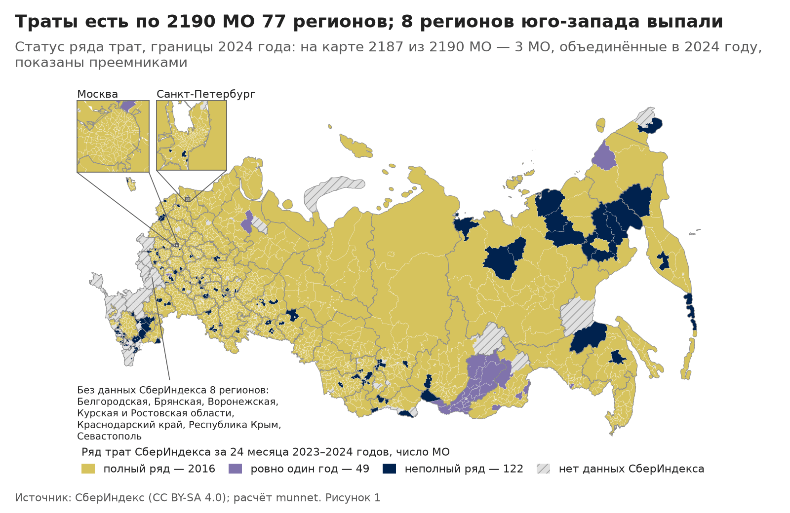

*Рисунок 1. Статус ряда трат, границы 2024 года: на карте 2187 из 2190 МО — 3 МО, объединённые в 2024 году, показаны преемниками. Источник: СберИндекс (CC BY-SA 4.0).* Данные: `outputs/eda/data/F01_coverage_map.csv`.

<a name=fig-2></a>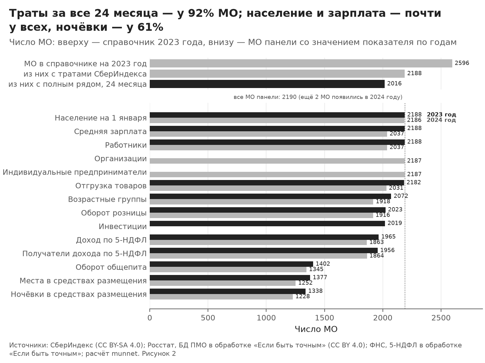

*Рисунок 2. Число МО: вверху — справочник 2023 года, внизу — МО панели со значением показателя по годам. Источник: СберИндекс (CC BY-SA 4.0); Росстат, БД ПМО в обработке «Если быть точным» (CC BY 4.0); ФНС, 5-НДФЛ в обработке «Если быть точным».* Данные: `outputs/eda/data/F02_coverage_funnel.csv`.

**Что видно.**

- **Покрытие.** Траты есть по 2190 МО 77 регионов. Целиком без данных СберИндекса 8 регионов: Белгородская, Брянская, Воронежская, Курская и Ростовская области, Краснодарский край, Республика Крым, Севастополь. В остальных регионах нет ещё 153 МО справочника 2023 года (больше всего: Республика Дагестан — 39, Чеченская Республика — 12, Санкт-Петербург — 10). Среди них 7 столиц субъектов: Благовещенск, Вологда, Кызыл, Пенза, Улан-Удэ, Элиста, Южно-Сахалинск.
- **Неполные ряды.** Полный ряд за 24 месяца — у 2016 МО (92,1%); ровно 2023 год — у 43, ровно 2024 год — у 9, прочие неполные — у 122. Меньше всего МО с тратами в одном месяце — 2072 (январь 2024), больше всего — 2149 (март 2023).
- **Кто выпадает.** Неполные ряды чаще у меньших МО: медиана населения 17 698 человек против 23 841 у полных (тест Манна — Уитни, p = 4,5·10⁻⁸). Модель пропуска по населению, зарплате, доле горожан, широте, доступности рынков и типу МО отличает неполные ряды от полных с AUC 0,73 (0,5 — не лучше угадывания). Пропуски идут и целыми регионами: в 4 регионах неполные ряды у всех МО панели (Республика Бурятия — 22, Республика Дагестан — 12, Чеченская Республика — 5, Республика Ингушетия — 2).
- **Контекст.** В 2023 году значения есть: население на 1 января — у 2188 МО панели, средняя зарплата — у 2188, доход по 5-НДФЛ — у 1965. Реже всего есть показатель «ночёвки в средствах размещения» — у 61,1% МО панели ([таблица T02](#tab-t02)). В 2024 году у Росстата нет годового значения показателя «средняя зарплата» ни у одного МО в 5 регионах: Кемеровская, Новосибирская, Рязанская и Тверская области, Республика Северная Осетия — Алания (140 МО панели). Поэтому признаки контекста разведки взяты за 2023 год.

**Что это значит для сюжета.**

- **Покрытие.** Выводы разведки — о 77 регионах с тратами, а не обо всей России. Курорты Черноморского побережья в данные не попали, а траты приезжих в данные курортного МО не входят: траты привязаны к жителям. Поэтому курортный тип по тратам не выделить, только по ночёвкам и местам в средствах размещения (Росстат).
- **Регионы без столицы.** У 7 регионов с тратами столицы субъекта в данных нет. Для сюжетов С2 «Ядра и периферия» и С6 «Где зарабатывают и где тратят» у этих регионов в сети не будет ядра, а пригороды считаются от центра, которого в сети нет.
- **Пропуски.** Пропуски неслучайны, поэтому неполные МО нельзя молча выбросить: выводы о типах — о покрытых МО, а неполные ряды показываются отдельно.
- **Длина ряда.** Порог длины ряда для узла сети выбирает этап 2: ряд не короче 12, 18 и 24 месяцев есть у 2131, 2058 и 2016 МО (98,6%, 94,7% и 94,2% населения выборки). Все 12 месяцев 2024 года — у 2048 МО.
- **Москва и Петербург.** Внутригородских территорий — 247 (Москва — 146, Петербург — 101): 11,3% узлов и 15,5% населения выборки. Как они входят в сеть, задаёт параметр `nodes.mode`; матрица сюжетов посчитана на узлах сети (раздел «Какой сюжет выбрать»).
- **Проверки.** Контрольные числа этапа `panel`: жёстких 21, не сошлось 0; мягких 32, вне допуска 0 ([таблица T00](#tab-t00)).

<a name=tab-t01></a>**Таблица T01.** Неполные ряды против полных: SMD по признакам МО; AUC модели пропуска 0,73; тест Манна — Уитни по населению, p = 4,5·10⁻⁸.

| Признак или регион | Полные ряды | Неполные ряды | SMD | Доля неполных |
|---|---:|---:|---:|---:|
| Среднегодовое население 2023 года, чел., медиана | 23 841 | 17 698 | −0,46 | — |
| Средняя зарплата 2023 года, ₽, медиана | 51 252 | 48 302 | −0,15 | — |
| Доля горожан 2023 года, %, медиана | 57,0 | 8,5 | −0,38 | — |
| Широта точки МО, °, медиана | 55,6 | 53,2 | −0,47 | — |
| Индекс доступности рынков (0–1000), медиана | 323 | 296 | −0,42 | — |
| Тип «муниципальный район», % МО | 48,6 | 59,2 | 0,21 | — |
| Тип «муниципальный округ», % МО | 17,9 | 13,8 | −0,11 | — |
| Тип «городской округ», % МО | 21,5 | 24,1 | 0,06 | — |
| Тип «внутригородская территория», % МО | 12,0 | 2,9 | −0,35 | — |
| Республика Бурятия, число МО | 0 | 22 | — | 100,0% |
| Республика Дагестан, число МО | 0 | 12 | — | 100,0% |
| Амурская область, число МО | 19 | 8 | — | 29,6% |
| Республика Калмыкия, число МО | 5 | 7 | — | 58,3% |
| Республика Саха (Якутия), число МО | 29 | 7 | — | 19,4% |
| Магаданская область, число МО | 3 | 6 | — | 66,7% |

Целиком: `outputs/eda/tables/T01_missingness.csv`.

<a name=tab-t02></a>**Таблица T02.** Контекст Росстата и ФНС: МО панели со значением, шаг соединения по ОКТМО, флаги и потери; здесь 2023 год — год признаков контекста разведки, остальные годы — в CSV; значений моста у МО с объединением в истории ОКТМО — 62.

| Код | Показатель | Год | МО со значением | Прямой код | Код другой версии | Мост oktmo_stable | Перенос прошлого года | Флаги | В годовой таблице | Нет значения | Почему нет |
|---|---|---:|---:|---:|---:|---:|---:|---|---:|---:|---|
| population | Население на 1 января | 2023 | 2188 | 2179 | 8 | 0 | 1 | запасной период — 32; ноль вместо значения — 1 | 2188 | 2 | МО нет в срезе справочника — 2 |
| age | Возрастные группы | 2023 | 2072 | 2019 | 53 | 0 | 0 | сумма возрастных групп расходится с «Всего» — 2 | 2072 | 118 | в регионе нет годовых строк — 103; нет кода — 13; МО нет в срезе справочника — 2 |
| population_urban | Городское население | 2023 | 1593 | 1585 | 8 | 0 | 0 | запасной период — 32 | 1593 | 597 | нет кода — 595; МО нет в срезе справочника — 2 |
| population_rural | Сельское население | 2023 | 1717 | 1709 | 8 | 0 | 0 | запасной период — 32 | 1717 | 473 | в регионе нет годовых строк — 259; нет кода — 212; МО нет в срезе справочника — 2 |
| wage | Средняя зарплата | 2023 | 2188 | 2184 | 0 | 4 | 0 | — | 2188 | 2 | МО нет в срезе справочника — 2 |
| employees | Работники | 2023 | 2188 | 2184 | 0 | 4 | 0 | — | 2188 | 2 | МО нет в срезе справочника — 2 |
| payroll | Фонд оплаты труда | 2023 | 2188 | 2184 | 0 | 4 | 0 | — | 2188 | 2 | МО нет в срезе справочника — 2 |
| retail | Оборот розницы | 2023 | 2023 | 2020 | 0 | 3 | 0 | — | 2023 | 167 | нет кода — 153; в регионе нет годовых строк — 12; МО нет в срезе справочника — 2 |
| catering_turnover | Оборот общепита | 2023 | 1402 | 1398 | 0 | 4 | 0 | — | 1402 | 788 | нет кода — 772; в регионе нет годовых строк — 14; МО нет в срезе справочника — 2 |
| shipments | Отгрузка товаров | 2023 | 2182 | 2178 | 0 | 4 | 0 | — | 2182 | 8 | нет кода — 6; МО нет в срезе справочника — 2 |
| nights | Ночёвки в средствах размещения | 2023 | 1338 | 1338 | 0 | 0 | 0 | — | 1338 | 852 | нет кода — 804; в регионе нет годовых строк — 46; МО нет в срезе справочника — 2 |
| beds | Места в средствах размещения | 2023 | 1377 | 1377 | 0 | 0 | 0 | — | 1377 | 813 | нет кода — 765; в регионе нет годовых строк — 46; МО нет в срезе справочника — 2 |
| invest | Инвестиции | 2023 | 2019 | 2015 | 0 | 4 | 0 | — | 2019 | 171 | в регионе нет годовых строк — 162; нет кода — 7; МО нет в срезе справочника — 2 |
| ndfl_income | Доход по 5-НДФЛ | 2023 | 1965 | 1872 | 84 | 9 | 0 | значение уже за объединённое МО, исключено — 1 | 1964 | 225 | нет кода — 124; в регионе нет годовых строк — 98; МО нет в срезе справочника — 2; мост запрещён объединением — 1 |
| ndfl_recipients | Получатели дохода по 5-НДФЛ | 2023 | 1956 | 1863 | 84 | 9 | 0 | сбой единиц получателей в источнике, исключено — 33; значение уже за объединённое МО, исключено — 1 | 1922 | 234 | нет кода — 133; в регионе нет годовых строк — 98; МО нет в срезе справочника — 2; мост запрещён объединением — 1 |

Целиком: `outputs/eda/tables/T02_context_coverage.csv`.

**Оговорки.**

- Траты — оценка средних безналичных потребительских расходов жителей МО по моделям СберИндекса в номинальных рублях. Траты приезжих в данных не видны; траты жителей вне своего МО (поездки, онлайн) по смыслу определения входят, но модель привязки не раскрыта.
- Показатели Росстата — без малого бизнеса; занятость и доход по 5-НДФЛ считаются по месту работодателя, поэтому у внутригородских территорий Москвы и Петербурга на жителя они не считаются.
- Объединения МО 2024 года: ряды предшественников и преемников не склеены, на карте 2024 года показаны преемники.
- «Ровно один календарный год» — все 12 месяцев 2023 или 2024 года и ни одного месяца другого года; прочие ряды с пропусками — «неполные».

## 2. Сколько тратят

**По оценке СберИндекса, в типичном МО житель тратит безналично 26 561 ₽ в месяц, в среднем по жителям — 37 253 ₽; уровень трат во многом повторяет карту регионов и зарплат.**

<a name=fig-3></a>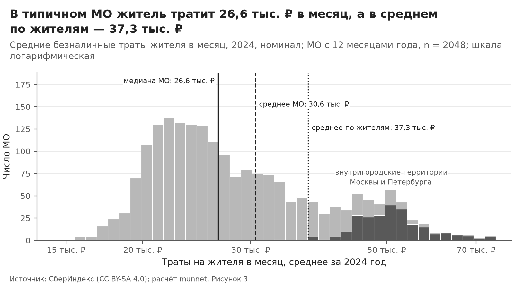

*Рисунок 3. Средние безналичные траты жителя в месяц, 2024, номинал; МО с 12 месяцами года, n = 2048; шкала логарифмическая. Источник: СберИндекс (CC BY-SA 4.0).* Данные: `outputs/eda/data/F03_level_distribution.csv`.

<a name=fig-4></a>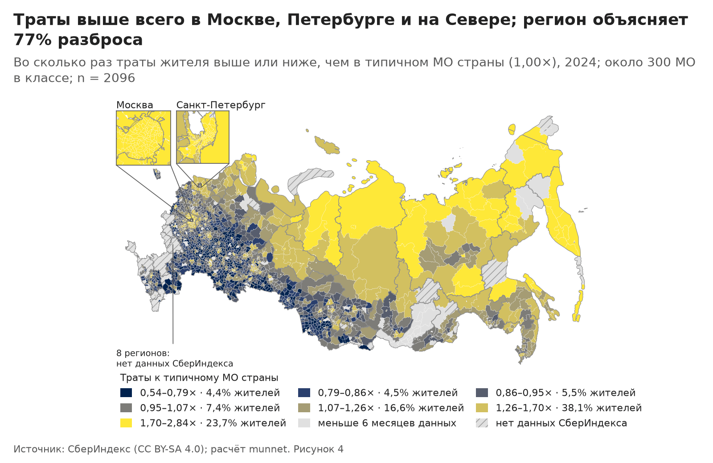

*Рисунок 4. Во сколько раз траты жителя выше или ниже, чем в типичном МО страны (1,00×), 2024; около 300 МО в классе; n = 2096. Источник: СберИндекс (CC BY-SA 4.0).* Данные: `outputs/eda/data/F04_level_map.csv`.

<a name=fig-5></a>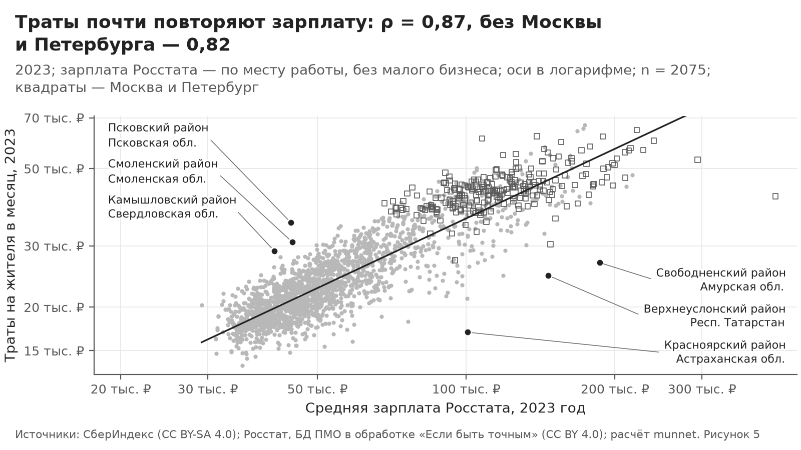

*Рисунок 5. 2023; зарплата Росстата — по месту работы, без малого бизнеса; оси в логарифме; n = 2075; квадраты — Москва и Петербург. Источник: СберИндекс (CC BY-SA 4.0); Росстат, БД ПМО в обработке «Если быть точным» (CC BY 4.0).* Данные: `outputs/eda/data/F05_level_vs_wage.csv`.

**Что видно.** В типичном МО (медиана по МО) житель в 2024 году тратил безналично 26 561 ₽ в месяц, а в среднем по всем жителям — 37 253 ₽: многолюдные МО тратят больше ([рис. 3](#fig-3), [T04](#tab-t04)).

- **Разброс.** Второй горб распределения — внутригородские территории Москвы и Петербурга: их медиана — 50 590 ₽, у муниципальных районов — 23 758 ₽, у городских округов — 32 506 ₽. В МО 90-го перцентиля траты выше, чем в МО 10-го, в 2,4 раза. Выше всех — Арбат и Хамовники (Москва), Анадырь (Чукотский автономный округ); ниже всех — Яльчикский округ, Аликовский округ и Янтиковский округ (Чувашская Республика); полный список — в [T03](#tab-t03).
- **Регион.** На него приходится большая часть разброса: η² региона для логарифма уровня — 0,77, без внутригородских территорий — 0,62 (η² — доля разброса между регионами в общем разбросе; [рис. 4](#fig-4)). Карта площадью скрывает людей: в верхнем классе карты живёт 23,7% жителей её МО, в нижнем — 4,4%. Рубли номинальные: на Севере и в столицах цены выше, поэтому разрыв в рублях, скорее всего, больше разрыва в объёме покупок.
- **Зарплата.** Траты почти повторяют зарплату Росстата: ранговая корреляция Спирмена ρ = 0,87 по 2075 МО, без Москвы и Петербурга (у их районов зарплата по месту работодателя) — 0,82 по 1832 МО ([рис. 5](#fig-5)). Внутри регионов ρ = 0,68, а если ранжировать МО внутри каждого региона — 0,63. Медиана отношения трат жителя к средней зарплате работника без Москвы и Петербурга — 45,6% (знаменатели разные: все жители против работников крупных и средних организаций).
- **Выбросы — гипотезы.** Дальше всего выше линии — Псковский район (Псковская область), Смоленский район (Смоленская область), Камышловский район (Свердловская область), ниже — Красноярский район (Астраханская область), Свободненский район (Амурская область), Верхнеуслонский район (Республика Татарстан). Гипотеза: там зарплата по месту работы расходится с доходом жителей (жители пригорода работают в областном центре, а у крупного работодателя работают приезжие); проверка — в разделе «Экономика места».

**Что это значит для сюжета.** Сырой уровень трат — почти карта регионов и зарплат, поэтому сюжет С2 «Ядра и периферия» по уровню её повторит.

- **Доступность рынков.** С индексом доступности ρ = 0,19, без внутригородских территорий — −0,15, без них и без Севера — −0,04: Москва с Петербургом поднимают связь, а Север опускает её. Медиана индекса на Севере — 236, у прочих МО — 317, а траты к медиане страны — 1,41 против 0,93. Внутри регионов ρ = 0,31, с расстоянием до столицы региона — −0,22.
- **Три определения «внутри регионов».** Частный ρ уровня с доступностью при контроле зарплаты: ранги всей выборки, центрированные по региону, — 0,204; ранги внутри каждого региона — 0,169; ранги значений, центрированных по региону, — 0,182. Порог критерия отказа С2 (0,200) пройден только при одном определении «внутри регионов» из трёх.
- **Размер МО.** Внутри регионов многолюдные МО и тратят больше (ρ уровня с численностью населения — 0,65), и лучше связаны с рынками (ρ доступности с численностью — 0,32). При контроле и зарплаты, и численности частный ρ — 0,089: сигнал доступности сверх зарплаты в основном идёт вместе с размером МО, и при контроле размера критерий не выполняется.
- **Критерий отказа С2.** По основному определению частный ρ — 0,204 (интервал бутстрепа — от 0,153 до 0,253, 2033 МО), без внутригородских территорий — 0,198: оценка выше порога, но интервал бутстрепа накрывает порог; ниже порога — без внутригородских территорий, при рангах внутри региона, при рангах центрированных значений и при контроле размера МО. Критерий неустойчив, и решение о сюжете не стоит строить на одном этом числе.

Для этапа 2 уровень трат лучше брать относительно региона или зарплаты, иначе типы МО повторят карту регионов. Корреляции здесь описывают связь, а не причину.

<a name=tab-t03></a>**Таблица T03.** МО с самыми высокими и самыми низкими тратами 2024 года к медиане страны.

| Край | № | id | МО | Регион | Тип | Траты 2024, ₽ в месяц | К медиане страны | К медиане региона | z в своём типе МО | Выброс | Чем выделяется (признаки контекста) | Пояснение |
|---|---:|---:|---|---|---|---:|---:|---:|---:|---|---|---|
| верх | 1 | 2535 | Арбат | Москва | внутригородская территория | 75 367 ₽ | 2,84× | 1,44× | 3,6 | да | высокая доступность рынков (z = 4,3); много ночёвок в гостиницах на жителя (z = 3,8); высокая плотность населения (z = 3,7) | центр Москвы, дорогое жильё и обеспеченные жители (гипотеза) |
| верх | 2 | 2544 | Хамовники | Москва | внутригородская территория | 74 336 ₽ | 2,80× | 1,42× | 3,4 | нет | высокая доступность рынков (z = 4,2); высокая плотность населения (z = 3,5) | центр Москвы, дорогое жильё и обеспеченные жители (гипотеза) |
| верх | 3 | 2344 | Анадырь | Чукотский автономный округ | городской округ | 74 230 ₽ | 2,77× | 1,07× | 3,4 | нет | столица региона; высокая зарплата (z = 4,4); высокий доход 5-НДФЛ на жителя (z = 4,2); мало пожилых (z = −3,3) | столица Чукотки, северные надбавки и дорогой завоз (гипотеза) |
| верх | 4 | 2486 | Раменки | Москва | внутригородская территория | 73 507 ₽ | 2,77× | 1,40× | 3,3 | нет | высокая доступность рынков (z = 4,0); высокая плотность населения (z = 3,3) | — |
| верх | 5 | 2545 | Якиманка | Москва | внутригородская территория | 72 461 ₽ | 2,73× | 1,38× | 3,2 | нет | высокая доступность рынков (z = 4,4); высокая плотность населения (z = 3,2); много ночёвок в гостиницах на жителя (z = 2,4) | — |
| верх | 6 | 2527 | Куркино | Москва | внутригородская территория | 70 359 ₽ | 2,65× | 1,34× | 3,0 | нет | высокая доступность рынков (z = 3,3); высокая плотность населения (z = 3,0) | — |
| верх | 7 | 2349 | Билибинский район | Чукотский автономный округ | муниципальный район | 70 349 ₽ | 2,64× | 1,02× | 5,7 | да | высокий доход 5-НДФЛ на жителя (z = 5,2); высокая зарплата (z = 4,3); север (z = 3,6) | золотодобыча и атомная станция, северные надбавки (гипотеза) |
| низ | 1 | 502 | Яльчикский округ | Чувашская Республика | муниципальный округ | 14 246 ₽ | 0,54× | 0,78× | −2,9 | нет | много пожилых (z = 2,2) | сельский округ Чувашии, низкие зарплаты, много пожилых, возможно, больше наличных (гипотеза) |
| низ | 2 | 484 | Аликовский округ | Чувашская Республика | муниципальный округ | 15 577 ₽ | 0,59× | 0,86× | −2,4 | нет | — | — |
| низ | 3 | 503 | Янтиковский округ | Чувашская Республика | муниципальный округ | 15 594 ₽ | 0,59× | 0,86× | −2,4 | нет | — | — |
| низ | 4 | 483 | Алатырский округ | Чувашская Республика | муниципальный округ | 15 885 ₽ | 0,60× | 0,87× | −2,3 | нет | — | — |
| низ | 5 | 499 | Шемуршинский округ | Чувашская Республика | муниципальный округ | 16 090 ₽ | 0,61× | 0,89× | −2,2 | нет | — | — |
| низ | 6 | 496 | Урмарский округ | Чувашская Республика | муниципальный округ | 16 200 ₽ | 0,61× | 0,89× | −2,2 | нет | — | — |
| низ | 7 | 2268 | Старокулаткинский район | Ульяновская область | муниципальный район | 16 432 ₽ | 0,62× | 0,82× | −1,9 | нет | много пожилых (z = 4,0) | — |

Целиком: `outputs/eda/tables/T03_level_extremes.csv`.

<a name=tab-t04></a>**Таблица T04.** Типичное МО и типичный житель: траты по категориям, 2024.

| Код | Категория | МО | МО с населением | Медиана МО | Среднее МО | Среднее по жителям | Жители / медиана |
|---|---|---:|---:|---:|---:|---:|---:|
| all | Все категории | 2048 | 2048 | 26 561 ₽ | 30 553 ₽ | 37 253 ₽ | 1,40 |
| food | Продовольствие | 2048 | 2048 | 12 069 ₽ | 12 527 ₽ | 13 636 ₽ | 1,13 |
| marketplace | Маркетплейсы | 2048 | 2048 | 4528 ₽ | 4723 ₽ | 5261 ₽ | 1,16 |
| transport | Транспорт | 2048 | 2048 | 1428 ₽ | 1787 ₽ | 2506 ₽ | 1,75 |
| health | Здоровье | 2048 | 2048 | 1215 ₽ | 1470 ₽ | 1953 ₽ | 1,61 |
| cafe | Общественное питание | 2048 | 2048 | 651 ₽ | 1251 ₽ | 2178 ₽ | 3,35 |
| other | Прочее | 2048 | 2048 | 6968 ₽ | 8795 ₽ | 11 717 ₽ | 1,68 |

Целиком: `outputs/eda/tables/T04_weighting.csv`.

**Оговорки.**

- Траты — оценка СберИндекса средних безналичных потребительских расходов жителей МО в номинальных рублях; траты приезжих в МО не видны, а траты жителей вне своего МО (поездки, онлайн) по смыслу входят, но как их привязывают к МО, СберИндекс не раскрывает.
- Рубли номинальные и в пространстве: на Севере и в столицах цены выше, поэтому «траты на Севере в 1,41 раза выше медианы страны» не значит «в 1,41 раза больше потребления»; сравнение внутри регионов от разницы цен чище.
- Подсказки [T03](#tab-t03) описывают место, а не причину трат: ночёвки в гостиницах и других коллективных средствах размещения — это приезжие, а их траты в данных не видны.
- Наличные расходы не видны: где доля наличных выше, уровень занижен (гипотеза, в данных не проверить).
- Зарплата Росстата — по месту работы, крупные и средние организации без малого бизнеса; у внутригородских территорий Москвы и Петербурга она описывает работодателей района, а не жителей.
- Среднее по жителям взвешено среднегодовым населением года; МО без населения в него не входят.
- Выводы — о регионах, где есть данные СберИндекса, а не обо всей России.

## 3. Годовой ритм

**Декабрь — месяц самых больших трат у 97,6% МО, а свой устойчивый годовой ритм есть лишь у 15,6% МО, чаще на Севере.**

<a name=fig-6></a>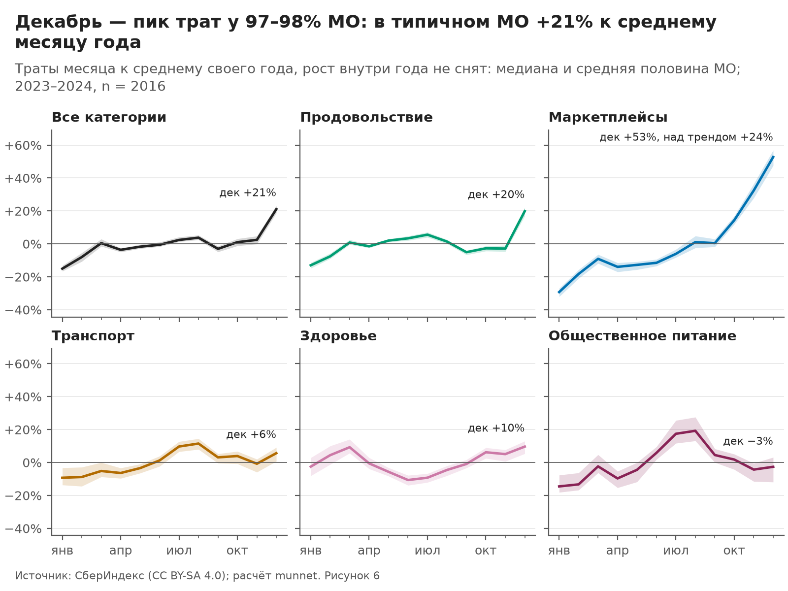

*Рисунок 6. Траты месяца к среднему своего года, рост внутри года не снят: медиана и средняя половина МО; 2023–2024, n = 2016. Источник: СберИндекс (CC BY-SA 4.0).* Данные: `outputs/eda/data/F06_national_rhythm.csv`.

<a name=fig-7></a>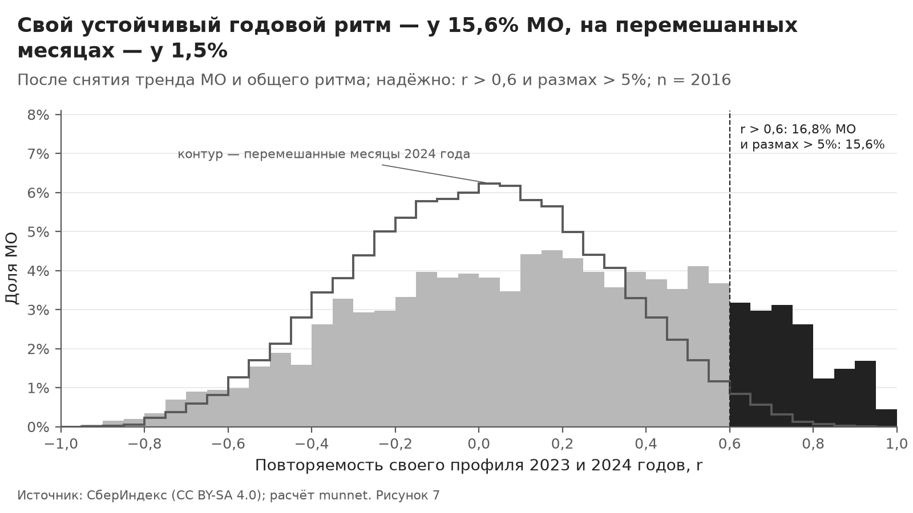

*Рисунок 7. После снятия тренда МО и общего ритма; надёжно: r > 0,6 и размах > 5%; n = 2016. Источник: СберИндекс (CC BY-SA 4.0).* Данные: `outputs/eda/data/F07_own_rhythm.csv`.

<a name=fig-8></a>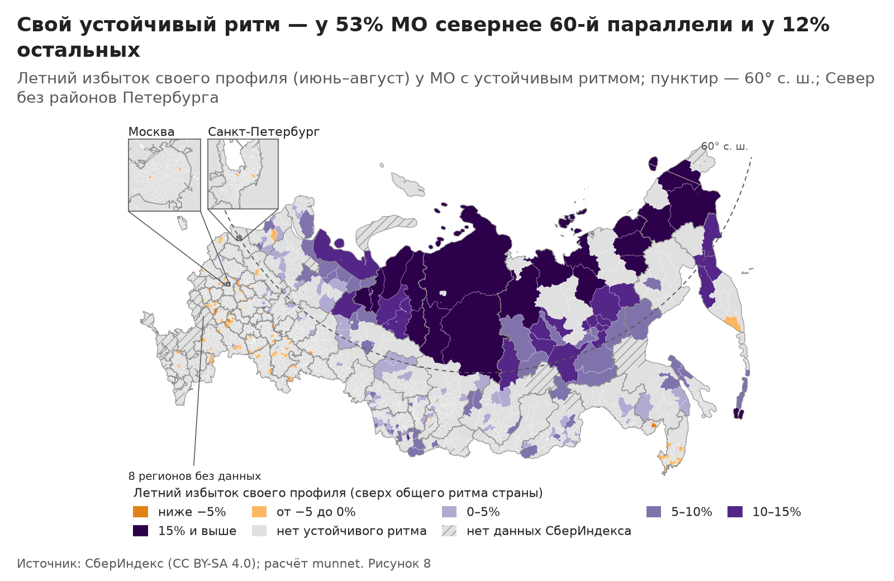

*Рисунок 8. Летний избыток своего профиля (июнь–август) у МО с устойчивым ритмом; пунктир — 60° с. ш.; Север без районов Петербурга. Источник: СберИндекс (CC BY-SA 4.0).* Данные: `outputs/eda/data/F08_north_rhythm_map.csv`.

**Что видно.** Годовой ритм трат в основном общий для страны. После снятия линейного тренда каждого МО общий ритм календарного месяца объясняет 73,1% оставшегося разброса (медиана по МО 79,7%). В типичном МО траты отклоняются от среднего своего года на −15,1% в январе и на +21,1% в декабре; декабрь оказывается месяцем с самыми большими тратами у 96,8% МО в 2023 году и у 97,6% в 2024-м. Часть декабрьского превышения даёт рост трат внутри года: над собственным линейным трендом МО декабрь отклоняется на +12,7%, у маркетплейсов — на +23,8% при +52,8% к среднему года. У общепита есть свой летний подъём: в августе траты отклоняются от среднего года на +19,2%.

**Свой ритм.** Устойчивым своим ритмом назван профиль года, который остаётся после вычета общего ритма и повторяется в оба года: корреляция r профилей 2023 и 2024 годов больше 0,6, размах больше 5%. Такой ритм есть у 314 МО из 2016 (15,6%); на данных с перемешанными месяцами 2024 года его находят у 1,5%. Сигнал не случаен, но у большинства МО своего ритма нет (медиана r 0,18). Критерий держится в основном на повторяемости r, а не на размахе: у типичного МО размах своего профиля 6,9% при размахе чистого шума 5,7%, связь размаха с населением сильная обратная (ρ Спирмена −0,54 — у малых МО размах раздувает шум), и порог размаха отсекает лишь 24 МО с r > 0,6. Поэтому в сводку ([таблица T13](#tab-t13)) идёт размах, умноженный на r (при r ≤ 0 — ноль): его связь с населением слабая обратная (−0,16).

**Где свой ритм.** На Севере (севернее 60-й параллели, без внутригородских территорий Петербурга) устойчивый свой ритм есть у 53,5% МО, у остальных — у 12,0%. Среди МО с устойчивым ритмом северных 29,3%, во всей выборке — 8,5%. Больше всего МО с устойчивым ритмом в регионах: Республика Саха (Якутия) — 27, Алтайский край — 18, Забайкальский край — 13, Ямало-Ненецкий автономный округ — 13. У северных МО с устойчивым ритмом он летний: пик своего профиля летом (июнь–август) у 80,4%, у остальных только у 36,5%. Самые сильные профили: Шурышкарский округ, Верхоянский район, Булунский район и Ямальский округ ([таблица T05](#tab-t05)).

Летний избыток трат над трендом МО (июнь–август к остальным месяцам без декабря) у типичного северного МО +8,2%, у остальных +3,4%; у общепита +29,1% против +18,0%. Связь летнего избытка с широтой слабая прямая (ρ Спирмена 0,15), с долей добычи в занятости умеренная прямая (0,45), с долей сельского хозяйства слабая обратная (−0,16), с ночёвками в гостиницах на жителя слабая обратная (−0,16). Внутри регионов все связи слабеют (ρ по модулю не больше 0,09): летний подъём скорее свойство региона, чем отдельного МО. «Аграрного» летнего слоя в тратах не видно. Траты приезжих в курортных МО в этих данных не видны; северный летний подъём, вероятно, отражает траты самих жителей в сезон отпусков (гипотеза).

**Что это значит для сюжета.** Годовой ритм (сюжет С1) годится как слой, а не как главная ось: устойчивый свой ритм есть у 15,6% МО при пороге критерия отказа 25%. На Севере такой ритм есть у 53,5% МО — это выше порога: С1 — сильный слой для Севера, а не для всей страны. Для этапа 2 корреляции и DTW рядов нужно считать по своему ритму. У рядов логарифма трат без обработки медиана корреляции случайной пары МО 0,91: общий рост и декабрь делают все МО «похожими». У своего ритма 90-й перцентиль корреляции 0,54 при 0,27 на перемешанных месяцах ([таблица T06](#tab-t06)). Помесячные ряды малых МО шумят: в самой малой из 10 равных групп МО по населению шум своего ритма в 2,2 раза больше, чем в самой крупной, у общепита в 4,4 раза (у транспорта отношение 3,0, [таблица T07](#tab-t07)). Для малых МО по общепиту и транспорту надёжнее годовые доли или сжатие к региону.

<a name=tab-t05></a>**Таблица T05.** МО с самым сильным устойчивым своим ритмом: первые 15 из 314 по размаху своего профиля. Размах больше у малых МО (ρ Спирмена с населением среди них −0,48): часть его — шум.

| id | МО | Регион | Размах | Пик | Летний избыток | r | Широта | Ночёвки на жителя | Добыча | Сельское хозяйство | Подсказка (\|z\| > 2) |
|---:|---|---|---:|---:|---:|---:|---:|---:|---:|---:|---|
| 2249 | Шурышкарский округ | Ямало-Ненецкий автономный округ | 54% | июль | +27% | 0,87 | 65,1 | 0,4 | — | 5% | широта +3,0; плотность −2,3; доля пожилых −2,6 |
| 319 | Верхоянский район | Республика Саха (Якутия) | 45% | июль | +28% | 0,96 | 66,9 | — | — | — | широта +3,6; плотность −2,7; доля пожилых −2,1 |
| 316 | Булунский район | Республика Саха (Якутия) | 42% | июль | +26% | 0,82 | 70,8 | 0,5 | — | 6% | широта +4,9; плотность −3,1; доля пожилых −3,3 |
| 2250 | Ямальский округ | Ямало-Ненецкий автономный округ | 42% | июль | +26% | 0,97 | 69,9 | 0,3 | 19% | 1% | широта +4,6; плотность −2,5; доля пожилых −4,0 |
| 341 | Усть-Янский район | Республика Саха (Якутия) | 41% | июль | +19% | 0,89 | 70,9 | — | 8% | — | широта +4,9; плотность −2,8; доля пожилых −2,1 |
| 335 | Среднеколымский район | Республика Саха (Якутия) | 40% | август | +24% | 0,93 | 67,8 | — | — | 3% | широта +3,9; плотность −2,9 |
| 2345 | Эгвекинот | Чукотский автономный округ | 39% | июль | +22% | 0,94 | 67,7 | — | — | 12% | широта +3,9; плотность −3,2; доля пожилых −2,8 |
| 2244 | Красноселькупский округ | Ямало-Ненецкий автономный округ | 39% | июль | +21% | 0,88 | 64,5 | 0,6 | 45% | — | широта +2,8; доля добычи +3,2; плотность −2,9; доля пожилых −3,4 |
| 318 | Верхнеколымский район | Республика Саха (Якутия) | 39% | июль | +16% | 0,89 | 65,6 | — | — | — | широта +3,2; плотность −2,8 |
| 618 | Карагинский район | Камчатский край | 38% | август | +10% | 0,93 | 59,2 | — | — | 13% | плотность −2,9; доля пожилых −2,2 |
| 340 | Усть-Майский район | Республика Саха (Якутия) | 37% | декабрь | +9% | 0,75 | 60,8 | — | 31% | 2% | плотность −2,7 |
| 2344 | Анадырь | Чукотский автономный округ | 37% | июль | +20% | 0,98 | 64,7 | 0,8 | 23% | 1% | широта +2,9; плотность +2,1; доля пожилых −3,5; столица Чукотки, северные надбавки и дорогой завоз (гипотеза) |
| 726 | Эвенкийский район | Красноярский край | 35% | июль | +19% | 0,90 | 64,3 | 0,3 | 29% | 1% | широта +2,8; плотность −3,5; доля пожилых −2,4 |
| 334 | Оленекский район | Республика Саха (Якутия) | 35% | июль | +24% | 0,71 | 68,8 | — | 31% | — | широта +4,2; плотность −3,6; доля пожилых −3,3 |
| 331 | Нижнеколымский район | Республика Саха (Якутия) | 34% | июль | +16% | 0,70 | 69,6 | — | — | — | широта +4,5; плотность −2,9 |

Целиком: `outputs/eda/tables/T05_rhythm_top.csv`.

<a name=tab-t06></a>**Таблица T06.** Сигнал для рёбер (общий ритм — 73% разброса после тренда): корреляции и DTW — по своему ритму, иначе все МО похожи.

| Код | Ряд | Пар МО | Медиана ρ | 90-й перцентиль ρ | Медиана, месяцы перемешаны | 90-й перцентиль, месяцы перемешаны |
|---|---|---:|---:|---:|---:|---:|
| raw | Логарифм трат без обработки | 20 000 | 0,91 | 0,97 | 0,00 | 0,27 |
| detrended | Без тренда МО | 20 000 | 0,81 | 0,92 | 0,00 | 0,27 |
| own | Свой ритм | 20 000 | −0,01 | 0,54 | 0,00 | 0,27 |

Целиком: `outputs/eda/tables/T06_edge_signal.csv`.

<a name=tab-t07></a>**Таблица T07.** Шум своего ритма по группам МО по населению (1 — самые малые): разброс 1,4826 × MAD, в процентах.

| Группа | МО | Население от | Население до | Шум: все категории | Шум: общепит | Шум: транспорт |
|---:|---:|---:|---:|---:|---:|---:|
| 1 | 202 | 1984 | 8881 | 3,8% | 20,6% | 9,7% |
| 2 | 202 | 8891 | 11 802 | 3,2% | 16,8% | 7,9% |
| 3 | 201 | 11 840 | 15 100 | 3,2% | 14,9% | 7,5% |
| 4 | 202 | 15 102 | 18 871 | 3,1% | 12,5% | 7,0% |
| 5 | 201 | 18 920 | 23 838 | 2,9% | 11,2% | 6,5% |
| 6 | 202 | 23 844 | 31 494 | 2,8% | 9,8% | 6,6% |
| 7 | 201 | 31 505 | 43 597 | 2,4% | 7,2% | 5,0% |
| 8 | 202 | 43 782 | 64 922 | 2,2% | 6,2% | 4,4% |
| 9 | 201 | 65 068 | 110 624 | 1,8% | 5,3% | 3,7% |
| 10 | 202 | 110 758 | 1 634 594 | 1,7% | 4,7% | 3,2% |

Целиком: `outputs/eda/tables/T07_noise_by_size.csv`.

**Оговорки.**

- Два годовых цикла: повторяемость своего профиля опирается на две точки на месяц, поэтому долю МО с устойчивым ритмом сравниваем с той же долей на перемешанных месяцах 2024 года; стандартные методы выделения сезонности (STL, X-13) на двух годах ненадёжны.
- Профиль рисунка 6 («месяц / среднее своего года») включает рост трат внутри года, поэтому декабрь в нём выше, чем над трендом МО (у маркетплейсов +52,8% против +23,8%); своему ритму этот рост не мешает.
- Сдвиг уровня ряда на рубеже 2023 и 2024 годов после снятия линейного тренда даёт в оба года одинаковую «пилу» с пиком в январе. Если добавить такой сдвиг в тренд МО, устойчивый ритм остаётся у 11,9% МО (на перемешанных месяцах — 1,3%). Из 73 МО вне Севера с устойчивым ритмом и пиком своего профиля в январе–марте его теряют 32: их «ритм» может быть сдвигом уровня, а не годовым циклом. Северный слой от этого почти не зависит: устойчивый ритм у 53,5% северных МО без сдвига и у 52,3% со сдвигом.
- Траты привязаны к жителям МО: траты приезжих в курортном МО не видны, и курортный тип по этим данным не выделить; траты жителей вне своего МО (поездки, онлайн) по смыслу входят, но как модель СберИндекса их привязывает, не раскрыто. Объяснение северного лета отпусками остаётся гипотезой.
- Север — МО севернее 60° с. ш. по точке внутри полигона, без внутригородских территорий Петербурга (севернее этой широты их 22), как в разделах 2 и 5.
- Курортные регионы юга (Краснодарский край, Крым, Севастополь) выпали из данных целиком; выводы сделаны о МО с полным рядом за 24 месяца.
- Суммы номинальные; линейный тренд МО снимается до расчёта ритма, поэтому общая инфляция и рост МО на свой ритм не влияют.

## 4. Корзина и маркетплейсы

**Доля маркетплейсов в типичном МО за год выросла с 11,6% до 15,9% и растёт быстрее там, где тратят меньше; состав корзины сначала повторяет уровень трат.**

<a name=fig-9></a>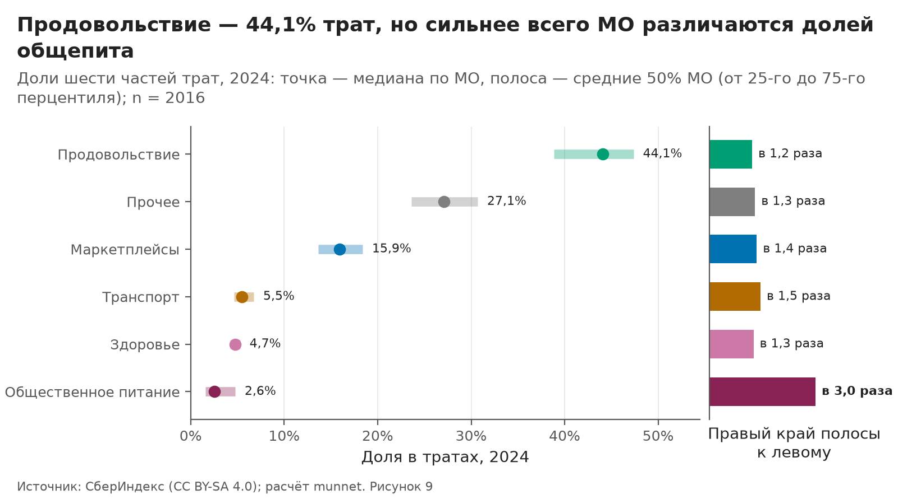

*Рисунок 9. Доли шести частей трат, 2024: точка — медиана по МО, полоса — средние 50% МО (от 25-го до 75-го перцентиля); n = 2016. Источник: СберИндекс (CC BY-SA 4.0).* Данные: `outputs/eda/data/F09_basket.csv`.

<a name=fig-10></a>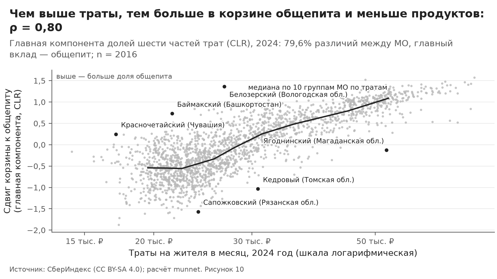

*Рисунок 10. Главная компонента долей шести частей трат (CLR), 2024: 79,6% различий между МО, главный вклад — общепит; n = 2016. Источник: СберИндекс (CC BY-SA 4.0).* Данные: `outputs/eda/data/F10_basket_vs_level.csv`.

<a name=fig-11></a>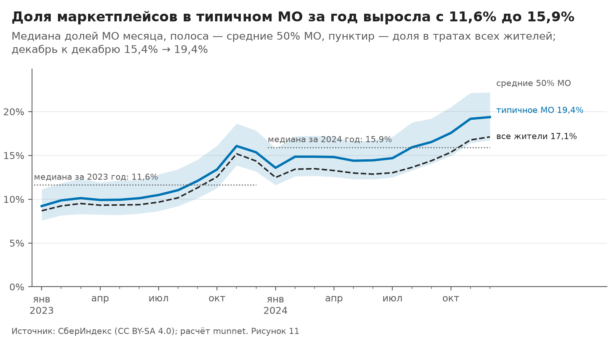

*Рисунок 11. Медиана долей МО месяца, полоса — средние 50% МО, пунктир — доля в тратах всех жителей; декабрь к декабрю 15,4% → 19,4%. Источник: СберИндекс (CC BY-SA 4.0).* Данные: `outputs/eda/data/F11_marketplace_trend.csv`.

<a name=fig-12></a>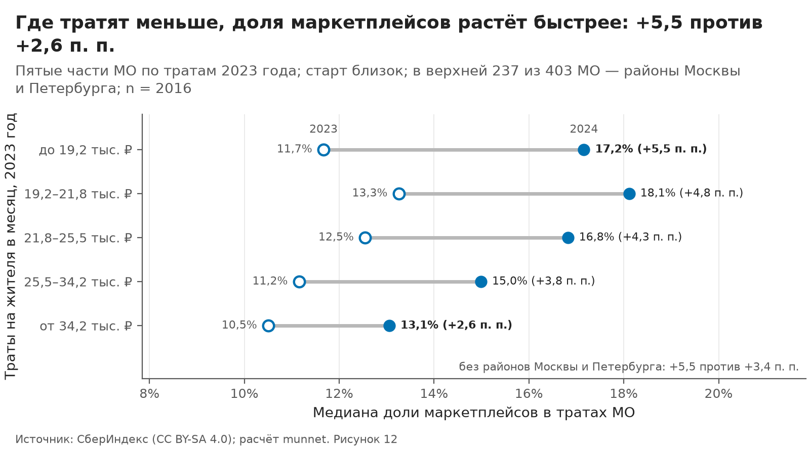

*Рисунок 12. Пятые части МО по тратам 2023 года; старт близок; в верхней 237 из 403 МО — районы Москвы и Петербурга; n = 2016. Источник: СберИндекс (CC BY-SA 4.0).* Данные: `outputs/eda/data/F12_marketplace_gap.csv`.

<a name=fig-13></a>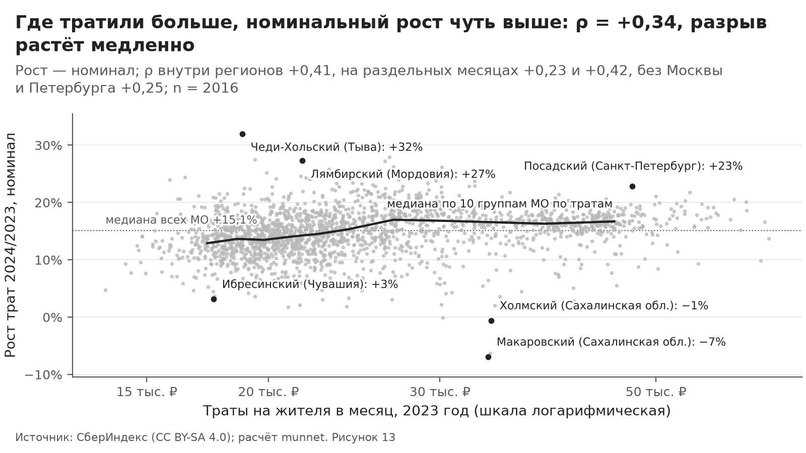

*Рисунок 13. Рост — номинал; ρ внутри регионов +0,41, на раздельных месяцах +0,23 и +0,42, без Москвы и Петербурга +0,25; n = 2016. Источник: СберИндекс (CC BY-SA 4.0).* Данные: `outputs/eda/data/F13_growth_divergence.csv`.

**Что видно.** Корзина:

- В 2024 году у типичного МО (медианы долей по 2016 МО с полными годами) продукты занимают 44,1% трат, «Прочее» 27,1%, маркетплейсы 15,9%, транспорт 5,5%, здоровье 4,7%, общепит 2,6%.
- Сильнее всего МО различаются долей общепита: у МО на 75-м перцентиле она в 3,0 раза выше, чем на 25-м, у остальных частей — в 1,2–1,5 раза. Дисперсия CLR (логарифма доли относительно среднего геометрического всех шести долей) у общепита 0,325, у продуктов 0,085.
- Первая главная компонента CLR — сдвиг корзины к общепиту (нагрузка общепита 0,83, маркетплейсов −0,39, продуктов −0,38). Она несёт 79,6% дисперсии и почти повторяет уровень трат: ρ = 0,80.
- Уровень трат объясняет 53,8% дисперсии CLR, регион 55,9%, оба вместе 76,4%; после очистки от них остаётся 23,6%.
- Главная ось остатка снова держится на общепите (нагрузка 0,89): на неё приходится 57,7% дисперсии остатка, её значения в 2023 и 2024 годах согласованы (ρ = 0,89).

Маркетплейсы:

- Медиана годовых долей маркетплейсов по МО выросла с 11,6% в 2023 году до 15,9% в 2024-м, декабрь к декабрю — с 15,4% до 19,4%. Доля в тратах всех жителей (траты МО, взвешенные населением) декабрь к декабрю выросла с 14,4% до 17,1%.
- Типичный прирост доли за год +4,1 п. п. (у средней половины МО — от +3,3 п. п. до +5,0 п. п.).
- В п. п. доля растёт быстрее там, где тратят меньше: ρ прироста с уровнем трат −0,71, внутри регионов −0,62. Медианная доля у пятой части МО с самыми низкими тратами выросла с 11,7% до 17,2% (+5,5 п. п.), у пятой части с самыми высокими — с 10,5% до 13,1% (+2,6 п. п.).
- Часть связи с уровнем даёт знаменатель: все траты растут быстрее там, где они выше (ρ роста с уровнем внутри регионов 0,41). Если бы все траты МО росли с медианной скоростью, ρ прироста доли с уровнем внутри регионов был бы −0,42, а не −0,62.
- В пятой части МО с самыми высокими тратами 237 из 403 — районы Москвы и Петербурга. Без них (МО заново разделены на пятые части) прирост медианной доли у нижней пятой части +5,5 п. п., у верхней +3,4 п. п.: разрыв меньше, но остаётся.
- При контроле плотности и численности населения связь внутри регионов остаётся: частный ρ = −0,40.
- В п. п. догоняния нет: прибавка почти не зависит от стартовой доли (ρ = 0,05 и 0,07 на раздельных месяцах). Поэтому в относительном выражении МО с малой долей растут быстрее: ρ разности логарифмов доли со стартовой долей −0,59 и −0,56 на раздельных месяцах.
- Разброс долей в п. п. растёт (межквартильный размах 4,1 → 4,8 п. п.), а в логарифмах сжимается (стандартное отклонение логарифма доли 0,328 → 0,244).
- Рост трат на маркетплейсах в рублях в медиане +54,0% (номинал). В процентах эти траты растут быстрее там, где тратят меньше (ρ с уровнем трат −0,34); разрыв в рублях всё же растёт (ρ прибавки с уровнем 0,65), потому что база выше: в 2023 году у пятой части МО с самыми высокими тратами траты на маркетплейсах в 2,2 раза больше, чем у пятой части с самыми низкими. Так во всех категориях: ρ прибавки в рублях с уровнем трат — от 0,64 до 0,80.
- Прирост доли за январь–июнь и за июль–декабрь согласован (ρ = 0,68); η² региона для прироста 0,41. Скачка, похожего на смену границ категорий, нет: наибольшее изменение годового прироста доли между соседними месяцами 1,07 п. п. (октябрь → ноябрь).

Рост трат:

- Номинальный рост трат 2024/2023 в типичном МО +15,1% (10-й и 90-й перцентили +9,8% и +19,2%); по категориям: маркетплейсы +54,0%, общепит +18,5%, продукты +10,6%, здоровье +10,0%, транспорт +8,9%, «Прочее» +7,9%. Реальный рост не считается: ИПЦ в конфиге не задан, МО сравниваются только между собой.
- Разрыв в уровнях трат растёт медленно: номинальный рост выше там, где тратили больше (ρ = 0,34, внутри регионов 0,41, на раздельных месяцах 0,23 и 0,42, без районов Москвы и Петербурга 0,25), а стандартное отклонение логарифма уровня трат выросло с 0,312 до 0,323.
- Но рост отдельных МО за январь–июнь и за июль–декабрь согласован слабо: ρ = 0,35.

**Что это значит для сюжета.**

- **С4 «Состав корзины» — слой.** Сырая корзина во многом повторяет уровень трат и регион: после очистки от них остаётся 23,6% различий при пороге критерия отказа 30,0%. Очищенная ось устойчива между годами (ρ = 0,89) и держится на общепите, доля которого, вероятно, зависит от присутствия сетевых кафе. Признаки узлов — CLR, очищенные от уровня трат и региона (в сводке — значение очищенной первой главной компоненты).
- **С5 «Сдвиг к маркетплейсам» — критерии отказа выполнены.** Сигнал устойчивый, но относительный: признаки узла — прирост доли в п. п. и прирост в рублях вместе. Формулировка: «доля маркетплейсов растёт быстрее там, где тратят меньше; в п. п. догоняния по доле нет, в относительном выражении есть; в рублях разрыв растёт». Риски: часть связи с уровнем дают знаменатель и районы Москвы и Петербурга в верхней группе; доля наличных по МО неизвестна. Гипотеза, в данных не проверить: часть покупок на маркетплейсах могла уйти на карты банков самих площадок, и неравномерно между МО.
- **С3 «Устойчивость потребления» — контекст.** Рост МО за январь–июнь и за июль–декабрь согласован слабо (ρ = 0,35), критерий отказа не выполнен: рост годится только как контекст.

<a name=tab-t08></a>**Таблица T08.** Состав корзины: дисперсия CLR, нагрузки главных компонент сырых CLR, R² уровня трат и региона, нагрузка первой главной компоненты очищенных CLR; в последней строке — доли дисперсии.

| Код | Часть трат | Медиана доли 2024 | Дисперсия CLR | PC1 | PC2 | PC3 | R² уровень | R² регион | R² оба | PC1 очищенных |
|---|---|---:|---:|---:|---:|---:|---:|---:|---:|---:|
| cafe | Общественное питание | 2,6% | 0,325 | 0,83 | −0,23 | 0,19 | 0,66 | 0,55 | 0,80 | 0,89 |
| marketplace | Маркетплейсы | 15,9% | 0,098 | −0,39 | −0,21 | 0,72 | 0,46 | 0,63 | 0,80 | −0,33 |
| food | Продовольствие | 44,1% | 0,085 | −0,38 | −0,33 | −0,43 | 0,59 | 0,65 | 0,87 | −0,25 |
| transport | Транспорт | 5,5% | 0,034 | 0,01 | 0,85 | −0,08 | 0,00 | 0,30 | 0,30 | −0,08 |
| health | Здоровье | 4,7% | 0,025 | −0,12 | 0,15 | 0,09 | 0,21 | 0,54 | 0,58 | −0,16 |
| other | Прочее | 27,1% | 0,021 | 0,05 | −0,23 | −0,49 | 0,12 | 0,52 | 0,53 | −0,07 |
| total | Итого: сумма дисперсий CLR, дальше — доли дисперсии | — | 0,587 | 0,80 | 0,07 | 0,07 | 0,54 | 0,56 | 0,76 | 0,58 |

Целиком: `outputs/eda/tables/T08_basket_pca.csv`.

<a name=tab-t09></a>**Таблица T09.** Проверки сдвига к маркетплейсам: связь с уровнем, догоняние в двух шкалах, устойчивость, рубли, ступенька. Доля маркетплейсов — доля в безналичных тратах: где доля наличных выше, знаменатель занижен, а направление смещения прироста неизвестно, без данных о наличных это не проверить.

| Проверка | Значение | МО | Факт | Число |
|---|---|---:|---|---|
| Прирост доли за год, медиана | +4,1 п. п. (средние 50% МО — от +3,3 п. п. до +5,0 п. п.) | 2016 | e4.mp_pp_median | 4,099 |
| ρ прироста доли (п. п.) с уровнем трат 2023: в целом и внутри регионов | −0,71 и −0,62 | 2016 | e4.rho_mp_pp_level | −0,711 |
| То же внутри регионов: если бы все траты МО росли с медианной скоростью (без эффекта знаменателя); частный ρ при контроле плотности и численности населения | −0,42; −0,40 | 2016 | e4.rho_mp_pp_level_within_fixed | −0,415 |
| ρ относительного прироста доли (разность логарифмов) с уровнем трат: в целом и внутри регионов | −0,42 и −0,43 | 2016 | e4.rho_mp_log_level | −0,420 |
| η² региона для прироста доли | 0,41 | 2016 | e4.eta2_mp_pp | 0,406 |
| Прирост медианной доли у нижней и верхней пятых частей МО по тратам (медиана приростов МО) | +5,5 п. п. и +2,6 п. п. (+5,2 п. п. и +2,6 п. п.) | 2016 | e4.dq1_pp | 5,500 |
| Районов Москвы и Петербурга в верхней пятой части; прирост медианной доли без них | 237 из 403; +5,5 п. п. и +3,4 п. п. | 2016 | e4.q5_n_inner | 237 |
| ρ прироста доли (п. п.) с начальной долей на раздельных месяцах: начало — нечётные месяцы, начало — чётные; без разделения (смещено регрессией к среднему) | 0,05 и 0,07; 0,06 | 2016 | e4.rho_mp_pp_initial | 0,047 |
| То же для относительного прироста доли (разность логарифмов) | −0,59 и −0,56; −0,59 | 2016 | e4.rho_mp_log_initial | −0,587 |
| ρ прироста за январь–июнь и за июль–декабрь | 0,68 | 2016 | e4.mp_split_half | 0,683 |
| Межквартильный размах доли, п. п.: 2023 → 2024 | 4,1 → 4,8 | 2016 | e4.mp_iqr_2024 | 4,771 |
| Стандартное отклонение логарифма доли: 2023 → 2024 | 0,328 → 0,244 | 2016 | e4.mp_sd_log_2024 | 0,244 |
| Рост трат на маркетплейсах в рублях (номинал): медиана; ρ с уровнем трат | +54,0%; −0,34 | 2016 | e4.mp_rub_growth_median | 0,540 |
| ρ прибавки в рублях (номинал) с уровнем трат: маркетплейсы; все категории T10; во сколько раз траты на маркетплейсах 2023 года у верхней пятой части МО по тратам больше, чем у нижней | 0,65; от 0,64 до 0,80; в 2,2 раза | 2016 | e4.rho_mp_rub_incr_level | 0,651 |
| Тест ступеньки: наибольший скачок годового прироста, п. п. | 1,07 (октябрь → ноябрь): скачка нет | 2016 | e4.mp_step_max_pp | 1,071 |

Целиком: `outputs/eda/tables/T09_marketplace_checks.csv`.

<a name=tab-t10></a>**Таблица T10.** Рост трат 2024/2023 по категориям (номинал), согласованность полугодий, разброс уровней и связь прибавки в рублях с уровнем трат.

| Код | Категория | Рост, медиана | 10-й перцентиль | 90-й перцентиль | ρ полугодий | Ст. откл. логарифма 2023 | Ст. откл. логарифма 2024 | ρ прибавки в ₽ с уровнем | МО |
|---|---|---:|---:|---:|---:|---:|---:|---:|---:|
| all | Все категории | +15,1% | +9,8% | +19,2% | 0,35 | 0,312 | 0,323 | 0,80 | 2016 |
| food | Продовольствие | +10,6% | +4,8% | +14,2% | 0,55 | 0,213 | 0,220 | 0,72 | 2016 |
| marketplace | Маркетплейсы | +54,0% | +40,2% | +82,0% | 0,61 | 0,393 | 0,297 | 0,65 | 2016 |
| transport | Транспорт | +8,9% | −4,7% | +18,4% | 0,43 | 0,429 | 0,480 | 0,66 | 2016 |
| health | Здоровье | +10,0% | +0,4% | +17,2% | 0,37 | 0,358 | 0,387 | 0,64 | 2016 |
| cafe | Общественное питание | +18,5% | −5,1% | +35,5% | 0,34 | 0,933 | 0,974 | 0,73 | 2016 |
| other | Прочее | +7,9% | −0,9% | +14,9% | 0,31 | 0,458 | 0,485 | 0,70 | 2016 |

Целиком: `outputs/eda/tables/T10_growth_noise.csv`.

**Оговорки.**

- Рост — номинальный, в текущих ценах: общая инфляция в нём не снята. МО сравниваются по относительному росту и рангам, а на них одинаковый для всех МО рост цен не влияет. Различия инфляции между регионами это не снимает: часть регионального разброса роста может быть ценовой (гипотеза: региональный ИПЦ не загружен).
- Доля маркетплейсов — доля в безналичных тратах по картам. Где доля наличных выше, знаменатель занижен, а направление смещения прироста доли неизвестно: без данных о наличных это не проверить.
- Траты привязаны к жителям МО: траты приезжих в курортных МО не видны, а траты жителей вне своего МО (поездки, онлайн) по смыслу входят, но модель привязки СберИндекс не раскрывает.
- «Прочее» — разность между «Все категории» и суммой пяти категорий, то есть иные траты; по описанию набора авиа- и ж/д билеты не входят в «Транспорт» и, вероятно, попадают сюда.
- Январь 2023 → декабрь 2024 сравнивает разные месяцы года, а у маркетплейсов декабрь — сезонный пик: в таком сравнении сезонность не снята. Сопоставимы по сезону декабрь к декабрю (15,4% → 19,4%) и годовые медианы (11,6% → 15,9%).
- Сдвиг к маркетплейсам может частично быть переклассификацией продавцов: тест ступеньки ловит только резкий скачок, плавную переклассификацию он не видит.
- Знак главной компоненты условен (наибольшая по модулю нагрузка положительна), поэтому её связь с уровнем трат читается по модулю.
- «Внутри регионов» — ранги всей выборки, центрированные по региону. На самих значениях, центрированных по региону, связи немного слабее; оба числа есть в пояснениях фактов (facts.json).

## 5. Экономика места

**Внутри регионов траты выше там, где больше горожан (ρ = 0,61), и ниже, где больше пожилых (ρ = −0,50). Пригороды столиц не выделяются: траты к доходу по месту работы — 2,02 против 2,04.**

<a name=fig-14></a>

*Рисунок 14. ρ Спирмена внутри регионов, 2023, МО без внутригородских территорий; доли корзины — в логарифмах (CLR); n = 280–1832. Источник: СберИндекс (CC BY-SA 4.0); Росстат, БД ПМО в обработке «Если быть точным» (CC BY 4.0).* Данные: `outputs/eda/data/F14_economy_signatures.csv`.

<a name=fig-15></a>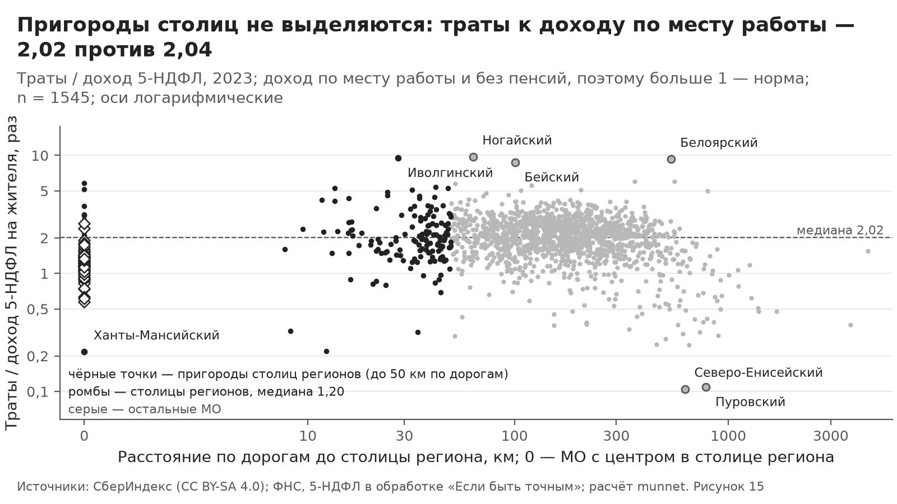

*Рисунок 15. Траты / доход 5-НДФЛ, 2023; доход по месту работы и без пенсий, поэтому больше 1 — норма; n = 1545; оси логарифмические. Источник: СберИндекс (CC BY-SA 4.0); ФНС, 5-НДФЛ в обработке «Если быть точным».* Данные: `outputs/eda/data/F15_work_vs_home.csv`.

**Что видно.**

- **Черты места внутри регионов.** Траты выше там, где больше горожан (ρ = 0,61), и ниже, где больше пожилых (ρ = −0,50); обе связи держатся и при равной зарплате (частный ρ = 0,49 и −0,35; [рис. 14](#fig-14)). Где больше бюджетников, траты ниже (ρ = −0,52), но это та же ось, что зарплата (с ней ρ = −0,69): при равной зарплате связь почти исчезает (частный ρ = −0,08). Где плотнее население, доля общепита в корзине выше (ρ = 0,62), доля продуктов — ниже (ρ = −0,64), прирост доли маркетплейсов — ниже (ρ = −0,52). С чертами места слабо связаны летний избыток и доля «Прочего» (|ρ| не больше 0,28 и 0,13); из 96 связей по модулю не слабее 0,3 — 41.
- **Карта регионов маскирует место.** По МО без внутригородских территорий за 2023 год: где выше доступность рынков, без учёта регионов траты ниже (ρ = −0,19), а внутри регионов — выше (ρ = 0,30). Если добавить внутригородские территории Москвы и Петербурга, знак без учёта регионов меняется на обратный (ρ = 0,15); поэтому в разделе 2, где они есть, связь с другим знаком.
- **Пригороды не выделяются.** В типичном МО безналичные траты в 2,02 раза больше дохода 5-НДФЛ на жителя (распределение — в [T12](#tab-t12)): доход считается по месту работы и без пенсий, поэтому отношение больше единицы — норма. В пригородах столиц регионов медиана — 2,02, в остальных МО с известным расстоянием до столицы — 2,04 (p Манна — Уитни 0,492), и внутри регионов отношение почти не зависит от расстояния до столицы (ρ = 0,05). Вывод не зависит от правила пригорода: в 6 вариантах (порог 25–100 км, все МО или только районы и округа) отношение медиан — от 0,99 до 1,11, ниже порога С6 (1,2). Московская область в тест не входит (столицы субъекта в справочнике у неё нет), но и по прямому расстоянию до Москвы ближние МО не выделяются: не дальше 50 км — 1,30, дальше — 1,58.
- **Отношение задают рабочие места.** По рангу отношение почти обратно числу получателей 5-НДФЛ на жителя (ρ = −0,85, внутри регионов −0,83): это плотность рабочих мест с доходом по месту работы, поэтому получатели не годятся для его внешней проверки. Ниже всего отношение в столицах регионов (1,20). Против столицы своего региона пригороды выше в 1,80 раза, но и прочие МО — в 1,72 раза (регионов в сравнении — 51): это разрыв «столица — остальные», а не свойство пригородов. Между типами [T11](#tab-t11) медиана ниже всего у типа «Добыча» (0,89), выше всего — у типа «Бюджетная периферия» (2,55).
- **При равной структуре сигнал пригородов слабый.** С поправкой на регион, долю пожилых и долю бюджетников пригороды выше остальных МО в 1,15 раза (p Манна — Уитни 5,5·10⁻¹³): различие надёжно, но слабее порога С6 (1,2). Гипотеза раздела 2 (пригороды выше линии «траты ~ зарплата») подтверждается слабо: относительно этой линии траты пригородов в 1,04 раза выше, чем у остальных МО (p 8,9·10⁻⁶), а среди 30 МО, сильнее всего превышающих линию, пригородов 11 при их доле в выборке 11,5%.
- **Крайние МО — гипотезы.** Самое высокое отношение — Карагинский район 10,70, Эвенкийский район 10,36, Ногайский район 9,74: вероятно, жители работают у работодателей из других МО или живут на пенсии и выплаты, которых нет в 5-НДФЛ. Самое низкое — Северо-Енисейский район 0,10, Пуровский округ 0,11, Ханты-Мансийский район 0,22: вероятно, там работают приезжие, в том числе вахтой ([рис. 15](#fig-15) и [T12](#tab-t12)). Отношение не считается у 33 МО, где число получателей 5-НДФЛ снято как дефект источника (единицы вместо тысяч), и у 65 МО с неполным годом трат.

**Что это значит для сюжета.** Для сюжета С6 «Где зарабатывают и где тратят» пригодны 1607 МО с надёжным 5-НДФЛ; признак узла — ln(траты / доход 5-НДФЛ), в сводке `log_spend_to_ndfl`. Критерий отказа С6 не выполнен: против остальных МО пригороды не выделяются, а при равной структуре — выше лишь в 1,15 раза, так что рёбра «работа — жительство» от пригородов к центрам занятости этот показатель подкрепляет слабо. Различие «столицы — остальные МО» может остаться слоем. Черты места, чья связь с тратами держится внутри регионов и при равной зарплате, годятся для объяснения типов на этапе 2; их лучше брать относительно региона.

<a name=tab-t11></a>**Таблица T11.** Гипотезы о типах местной экономики: медианы черт трат против всех МО; внутригородские территории входят только в свой тип, код правила — в CSV.

| Тип | Правило | МО | Уровень к региону, 2024 | Продовольствие | «Прочее» | Общепит | Маркетплейсы | Летний избыток | Траты / зарплата | Траты / доход 5-НДФЛ | Прирост доли маркетплейсов | Примеры |
|---|---|---:|---:|---:|---:|---:|---:|---:|---:|---:|---:|---|
| Все МО панели | — | 2190 | 1,00 | 44,1% | 27,1% | 2,6% | 16,0% | +3,6% | 0,46 | 2,02 | +4,1 п. п. | — |
| Внутригородские территории | внутригородская территория Москвы или Петербурга | 247 | 1,00 | 31,6% | 34,3% | 7,9% | 13,0% | +2,8% | — | — | +2,4 п. п. | Марьино; Выхино-Жулебино; Южное Бутово |
| Столицы регионов | административный центр субъекта по справочнику | 67 | 1,47 | 36,6% | 31,8% | 6,0% | 13,6% | +3,7% | 0,47 | 1,20 | +3,1 п. п. | Новосибирск; Екатеринбург; Казань |
| Пригороды столиц регионов | до 50 км по дорогам от столицы региона, кроме самой столицы | 229 | 1,12 | 42,0% | 28,3% | 3,8% | 15,9% | +2,8% | 0,46 | 2,02 | +4,1 п. п. | Волжский; Энгельсский район; Ангарский |
| Север | центр севернее 60° с. ш. | 189 | 1,00 | 42,2% | 30,0% | 3,6% | 15,1% | +8,2% | 0,39 | 1,32 | +3,8 п. п. | Приморский округ; Таймырский Долгано-Ненецкий; Анабарский район |
| Добыча | занятых в добыче не меньше 20% | 105 | 1,07 | 42,2% | 30,8% | 3,5% | 14,4% | +7,8% | 0,32 | 0,89 | +4,0 п. п. | Нижневартовский район; Ханты-Мансийский район; Тенькинский округ |
| Обрабатывающая промышленность | занятых в обработке не меньше 30% | 189 | 1,16 | 41,8% | 28,5% | 3,6% | 15,8% | +3,1% | 0,46 | 1,52 | +3,6 п. п. | Фрязино; Боровский район; Верхнесалдинский |
| Аграрные | занятых в сельском хозяйстве не меньше 20% | 184 | 0,97 | 46,6% | 24,0% | 1,6% | 17,4% | +3,2% | 0,44 | 2,04 | +5,0 п. п. | Уваровский округ; Ливенский район; Шаблыкинский район |
| Бюджетная периферия | занятых в бюджетной сфере не меньше 55% работников крупных и средних организаций: такая доля высока там, где мало частных работодателей; гипотеза о типе, а не отдельная черта места | 621 | 0,95 | 46,6% | 24,6% | 1,7% | 17,0% | +4,5% | 0,48 | 2,55 | +4,8 п. п. | Новолакский район; Сергокалинский район; Приютненский район |
| Курортные (по ночёвкам Росстата) | не меньше 5 ночёвок в средствах размещения на жителя за год | 121 | 1,04 | 43,1% | 27,4% | 2,9% | 17,0% | +3,3% | 0,47 | 1,91 | +4,4 п. п. | Белокуриха; Светлогорский; Чемальский район |

Целиком: `outputs/eda/tables/T11_economy_types.csv`.

<a name=tab-t12></a>**Таблица T12.** Траты к доходу по месту работы: распределения и крайние МО.

| Блок | id | МО или статистика | Регион | Траты / доход 5-НДФЛ | Траты / зарплата | Получатели / жители | До столицы региона, км | Подсказка |
|---|---:|---|---|---:|---:|---:|---:|---|
| распределение | — | 10-й перцентиль | — | 1,08 | 0,35 | 0,23 | — | — |
| распределение | — | медиана | — | 2,02 | 0,46 | 0,37 | — | — |
| распределение | — | 90-й перцентиль | — | 3,07 | 0,54 | 0,88 | — | — |
| высокое | 618 | Карагинский район | Камчатский край | 10,70 | 0,22 | 0,07 | — | мало получателей дохода 5-НДФЛ на жителя (z −4,3); высокая зарплата (z +4,1); редкое население (z −2,8) |
| высокое | 726 | Эвенкийский район | Красноярский край | 10,36 | 0,32 | 0,12 | — | редкое население (z −3,3); мало получателей дохода 5-НДФЛ на жителя (z −3,0); высокая зарплата (z +2,2) |
| высокое | 201 | Ногайский район | Карачаево-Черкесская Республика | 9,74 | 0,70 | 0,11 | 64 | мало получателей дохода 5-НДФЛ на жителя (z −3,2); много бюджетников (z +2,1) |
| высокое | 93 | Иволгинский район | Республика Бурятия | 9,49 | 0,56 | 0,16 | 28 | мало пожилых (z −2,9); мало получателей дохода 5-НДФЛ на жителя (z −2,3) |
| высокое | 2229 | Белоярский район | Ханты-Мансийский автономный округ — Югра | 9,29 | 0,26 | 0,09 | 539 | мало получателей дохода 5-НДФЛ на жителя (z −3,7); мало пожилых (z −2,9); высокая зарплата (z +2,7) |
| высокое | 455 | Бейский район | Республика Хакасия | 8,70 | 0,46 | 0,05 | 101 | мало получателей дохода 5-НДФЛ на жителя (z −5,0) |
| высокое | 619 | Олюторский район | Камчатский край | 7,26 | 0,41 | 0,08 | — | мало получателей дохода 5-НДФЛ на жителя (z −4,0); редкое население (z −2,9); высокая зарплата (z +2,4) |
| низкое | 716 | Северо-Енисейский район | Красноярский край | 0,10 | 0,27 | 2,83 | 628 | много получателей дохода 5-НДФЛ на жителя (z +5,3); высокая зарплата (z +2,6); много занятых в добыче (z +2,2) |
| низкое | 2882 | Пуровский округ | Ямало-Ненецкий автономный округ | 0,11 | 0,26 | 2,81 | 787 | много получателей дохода 5-НДФЛ на жителя (z +5,2); много занятых в добыче (z +3,5); высокая зарплата (z +3,2) |
| низкое | 2237 | Ханты-Мансийский район | Ханты-Мансийский автономный округ — Югра | 0,22 | 0,24 | 1,96 | 0 | много занятых в добыче (z +5,2); много получателей дохода 5-НДФЛ на жителя (z +4,3); высокая зарплата (z +2,4) |
| низкое | 1519 | Кольский район | Мурманская область | 0,22 | 0,27 | 1,64 | 12 | много получателей дохода 5-НДФЛ на жителя (z +3,8); высокая зарплата (z +2,5) |
| низкое | 884 | Селемджинский район | Амурская область | 0,25 | 0,28 | 2,27 | 654 | много получателей дохода 5-НДФЛ на жителя (z +4,7); много занятых в добыче (z +3,4); низкая доступность рынков (z −2,3) |
| низкое | 580 | Газимуро-Заводский округ | Забайкальский край | 0,25 | 0,25 | 1,69 | 462 | много получателей дохода 5-НДФЛ на жителя (z +3,9); много занятых в добыче (z +3,5); высокая зарплата (z +2,3) |
| низкое | 2233 | Нижневартовский район | Ханты-Мансийский автономный округ — Югра | 0,28 | 0,27 | 1,50 | 510 | много занятых в добыче (z +5,6); много получателей дохода 5-НДФЛ на жителя (z +3,6); мало пожилых (z −2,2) |

Целиком: `outputs/eda/tables/T12_work_home.csv`.

**Оговорки.**

- Доход 5-НДФЛ, занятость и зарплата Росстата учитываются по месту работодателя, а траты СберИндекса — по жителям МО. Поэтому высокое отношение трат к доходу, вероятно, значит, что жители работают у работодателей из других МО или живут на пенсии и выплаты, которых нет в 5-НДФЛ, а низкое — что в МО работают приезжие (вахта) или крупный работодатель платит сотрудникам из других МО. Это гипотезы.
- Траты — оценка СберИндекса средних безналичных трат жителя МО; знаменатель (все жители или держатели карт) и модель привязки трат к МО не раскрыты. Траты жителей вне своего МО (поездки, онлайн) по смыслу входят, траты приезжих в курортном МО не видны: курортный тип [T11](#tab-t11) задан ночёвками Росстата, а не тратами. Отношение трат к доходу — сравнительная мера, а не доля расходов в доходе.
- Тест пригородов. Пригодные МО без расстояния до столицы региона (62, в основном Московская область: столицы субъекта в справочнике у неё нет) в него не входят. У 28 районов и округов с центром в столице региона расстояние — 0 км, и правило пригорода захватывает районы вокруг столицы со своими крупными работодателями: Ханты-Мансийский район (0 км, 0,22), Кольский район (12 км, 0,22). Столица субъекта по справочнику — район, а не город: Гатчинский район (Ленинградская область); расстояние считается до центра района.
- Занятость и зарплата Росстата — без малого бизнеса; доли разделов ОКВЭД2 считаются от работников крупных и средних организаций. Скрытый раздел — пропуск, а не ноль: доли занятых в добыче, обработке и сельском хозяйстве известны не во всех МО, эти строки [рис. 14](#fig-14) посчитаны на меньшей выборке. Доля бюджетной сферы высока там, где мало частных работодателей, поэтому она идёт вместе с низкой зарплатой.
- Внутригородские территории Москвы и Петербурга не входят в [рис. 14](#fig-14) и в отношения к доходу: показатели по месту работы на их жителя не считаются. В типы [T11](#tab-t11) они входят только в свой тип.
- Связь внутри регионов — не причина: она может идти через третью черту, например зарплату; рост трат — номинальный.

## 6. Регион или место

**Регион задаёт уровень трат (η² 0,77), а рост и прирост доли маркетплейсов — наполовину.**

<a name=fig-16></a>

*Рисунок 16. Чёрные точки — η² региона, серые ромбы — η² с поправкой на шум, белые — I Морана (k = 8); n до 2075 МО. Источник: СберИндекс (CC BY-SA 4.0); Росстат, БД ПМО в обработке «Если быть точным» (CC BY 4.0); ФНС, 5-НДФЛ в обработке «Если быть точным».* Данные: `outputs/eda/data/F16_region_or_place.csv`.

**Что видно.**

- **Как считали.** Для каждого показателя МО посчитаны η² региона — доля разброса между регионами в общем разбросе — и I Морана: насколько значение МО похоже на значения 8 ближайших соседей, чем больше, тем сильнее сходство ([таблица T13](#tab-t13), [рис. 16](#fig-16)). На чистом шуме при 77 регионах η² около 0,04.
- **Уровень трат почти целиком региональный:** η² 0,77, I Морана 0,80.
- **Динамика трат.** η² ниже: 0,29 у показателя «номинальный рост трат» и 0,41 у показателя «прирост доли маркетплейсов». Но и шума в них больше: надёжность по полугодиям — 0,52 и 0,81. С поправкой на шум (η² / надёжность) на регион приходится 0,55 и 0,50 воспроизводимого разброса, то есть около половины.
- **Кроме региона.** Сопоставимую долю разброса дают и простые деления МО: у показателя «номинальный рост трат»: группа по населению — 0,18 (регион — 0,29); у показателя «прирост доли маркетплейсов»: группа по уровню трат — 0,42, тип МО — 0,32, группа по населению — 0,29, доля горожан — 0,23 (регион — 0,41). «Место» здесь во многом означает размер МО, уровень трат, тип МО и долю горожан.
- **Порог.** η² больше 0,6 — у 4 из 15 показателей: уровень трат, летний избыток трат, доля продовольствия и доля маркетплейсов.
- **Показатели без региона.** У показателя «корзина без уровня и региона» (I Морана 0,13) η² равен нулю по построению: регион из него уже вычтен, поэтому в счёт показателей он не входит; I Морана показывает, что соседи похожи и после вычета.
- **Москва и Петербург.** Без 247 внутригородских территорий η² уровня трат меняется с 0,77 до 0,62, I Морана — с 0,80 до 0,64; сильнее всего меняется η² показателя «доля продовольствия»: с 0,66 до 0,42.

**Что это значит для сюжета.**

- Типы МО по уровню трат повторят карту регионов.
- Для этапа 2 показатели выше порога η² лучше брать относительно региона (отношение к медиане региона или ранг внутри региона), остальные можно брать как есть.
- У показателей динамики низкий η² во многом от шума: их лучше считать по году, а не по полугодию, и сравнивать с надёжностью, прежде чем называть «свойством места».
- Москва и Петербург дают 247 мелких соседних узлов, которые могли бы стать отдельным «кластером столиц». В сети они — Москва и Петербург — два узла-города, остальные МО — сами себе узлы (параметр `nodes.mode`): матрица сюжетов посчитана на узлах сети, вторая матрица — 247 внутригородских территорий отдельными узлами (раздел «Какой сюжет выбрать»).
- Сюжет, чьи признаки почти целиком региональные, даст типы, похожие на карту регионов: это проверяет быстрый прототип типов ([таблица T15](#tab-t15)).

<a name=tab-t13></a>**Таблица T13.** Регион или место: η² региона и других делений, надёжность и η² с поправкой на шум, I Морана; с Москвой и Петербургом и без них.

| Показатель | МО | η² региона | Надёжность | η² без шума | η² округа | η² типа МО | η² размера | η² доли горожан | I Морана | η² без внутригородских | I без внутригородских | Брать относительно региона |
|---|---:|---|---:|---|---|---:|---:|---:|---:|---|---:|---|
| Уровень трат | 2048 | 0,77 | 0,99 | 0,77 | 0,30 | 0,54 | 0,37 | 0,29 | 0,80 | 0,62 | 0,64 | да |
| Летний избыток трат | 2016 | 0,68 | — | — | 0,26 | 0,03 | 0,05 | 0,02 | 0,67 | 0,67 | 0,67 | да |
| Доля продовольствия | 2048 | 0,66 | 0,98 | 0,68 | 0,16 | 0,54 | 0,53 | 0,20 | 0,70 | 0,42 | 0,47 | да |
| Доля маркетплейсов | 2048 | 0,63 | 0,93 | 0,67 | 0,19 | 0,29 | 0,28 | 0,11 | 0,67 | 0,55 | 0,57 | да |
| Размах своего ритма | 2016 | 0,56 | — | — | 0,14 | 0,03 | 0,05 | 0,01 | 0,55 | 0,55 | 0,54 | нет |
| Доля общепита | 2048 | 0,55 | 0,98 | 0,56 | 0,11 | 0,45 | 0,49 | 0,25 | 0,61 | 0,36 | 0,43 | нет |
| Доля здоровья | 2048 | 0,54 | 0,95 | 0,57 | 0,16 | 0,04 | 0,06 | 0,05 | 0,52 | 0,54 | 0,52 | нет |
| Доля «Прочего» | 2048 | 0,52 | 0,92 | 0,57 | 0,30 | 0,02 | 0,01 | 0,01 | 0,56 | 0,54 | 0,55 | нет |
| Прирост доли маркетплейсов | 2016 | 0,41 | 0,81 | 0,50 | 0,11 | 0,32 | 0,29 | 0,23 | 0,40 | 0,24 | 0,23 | нет |
| Траты к зарплате | 2075 | 0,39 | — | — | 0,06 | 0,09 | 0,01 | 0,01 | 0,42 | 0,38 | 0,40 | нет |
| Декабрьский пик трат | 2016 | 0,38 | — | — | 0,14 | 0,03 | 0,02 | 0,04 | 0,40 | 0,37 | 0,38 | нет |
| Траты к доходу 5-НДФЛ | 1607 | 0,31 | — | — | 0,10 | 0,07 | 0,04 | 0,08 | 0,33 | 0,31 | 0,33 | нет |
| Доля транспорта | 2048 | 0,30 | 0,92 | 0,33 | 0,06 | 0,02 | 0,03 | 0,06 | 0,37 | 0,30 | 0,36 | нет |
| Номинальный рост трат | 2016 | 0,29 | 0,52 | 0,55 | 0,08 | 0,07 | 0,18 | 0,05 | 0,28 | 0,25 | 0,25 | нет |
| Повторяемость своего ритма | 2016 | 0,22 | — | — | 0,06 | 0,02 | 0,02 | 0,00 | 0,25 | 0,23 | 0,26 | нет |
| Корзина без уровня и региона | 2016 | — (0 по построению) | — | — | — (0 по построению) | 0,02 | 0,10 | 0,01 | 0,13 | — | 0,12 | нет |

Целиком: `outputs/eda/tables/T13_region_or_place.csv`.

**Оговорки.**

- η² и I Морана описывают связь показателя с географией, а не причину.
- I Морана считается по ближайшим соседям по точкам внутри полигонов МО, а не по дорогам; внутригородские территории мелкие и соседствуют друг с другом, поэтому с ними I выше.
- Поправка на шум грубая: надёжность оценена по двум полугодиям или соседним годам, а η² / надёжность считает, что шум между регионами не различается.
- Экспертные баллы матрицы задал автор (`src/munnet/eda/stories.py`), баллы сигнала и покрытия посчитаны из фактов; участник вправе изменить и то, и другое.
- Быстрый прототип типов ([T15](#tab-t15)) — один запуск k-means без выбора числа типов и признаков: он показывает, что типы повторяют, а не какими они будут на этапе 3.

## 7. Что это значит для этапа 2

- **Рёбра по рядам — только по своему ритму.** У сырых помесячных рядов (в логарифме) медиана корреляции случайной пары МО — 0,91: все МО «похожи» из-за общего роста и декабря. У своего ритма 90-й перцентиль — 0,54 при 0,27 на перемешанных месяцах ([таблица T06](#tab-t06)).
- **Порог длины ряда для узла сети.** Ряд не короче года, полутора и двух лет есть у 2131, 2058 и 2016 МО из 2190 (98,6%, 94,7% и 94,2% населения выборки); МО с неполным рядом — 174, в них живёт 5,8% населения выборки.
- **Малые МО шумят.** Во сколько раз шум своего ритма в самой малой группе МО по населению больше, чем в самой крупной: 2,2 по всем тратам, 4,4 у общепита и 3,0 у транспорта. Там, где шум у малых МО заметно больше, для них надёжнее годовые доли или сжатие к региону.
- **Региональные признаки — относительно региона.** У 4 из 15 показателей η² региона больше 0,6: уровень трат, летний избыток трат, доля продовольствия и доля маркетплейсов. Их лучше брать как отношение к медиане региона или ранг внутри региона, иначе типы МО повторят карту регионов ([таблица T13](#tab-t13)).
- **Динамика шумит.** У роста трат и прироста доли маркетплейсов η² региона ниже, но и надёжность ниже (0,52 и 0,81): с поправкой на шум на регион приходится 0,55 и 0,50 воспроизводимого разброса. Признаки динамики лучше считать по году и не называть «свойством места» без такой поправки ([рис. 16](#fig-16)).
- **Москва и Петербург.** Без 247 внутригородских территорий η² уровня трат меняется с 0,77 до 0,62, I Морана — с 0,80 до 0,64; сильнее всего меняется η² показателя «доля продовольствия»: с 0,66 до 0,42. В сети они — Москва и Петербург — два узла-города, остальные МО — сами себе узлы (параметр `nodes.mode`); матрица сюжетов посчитана на узлах сети, вторая матрица — 247 внутригородских территорий отдельными узлами ([таблица T14](#tab-t14)).
- **Контекст.** Зарплата Росстата есть у 2188 МО панели, доход 5-НДФЛ — у 1965. Доход 5-НДФЛ на жителя пригоден (флаг `ndfl_ok`) у 1672 МО, а отношение трат к нему посчитано у 1607: у остальных в 2023 году есть не все месяцы трат. У 247 МО показатели по месту работы на жителя не считаются (флаг `workplace_based`). Покрытие всех показателей — [таблица T02](#tab-t02).

## Ограничения и ловушки данных

- **Номинал.** Суммы в текущих рублях: рост 2024 года к 2023-му включает инфляцию. Реальный рост не считается, пока в `eda.cpi` нет официального помесячного ИПЦ Росстата.
- **Покрытие.** Выводы — о 77 регионах с данными, а не обо всей России: целиком выпали Белгородская, Брянская, Воронежская, Курская и Ростовская области, Краснодарский край, Республика Крым, Севастополь; вне них нет ещё 153 МО справочника. ЗАТО в панели нет.
- **Пропуски неслучайны.** Неполные ряды — у меньших МО: модель пропуска отличает их от полных с AUC 0,73; в МО с неполным рядом живёт 5,8% населения выборки.
- **Чьи траты.** Траты — модельная оценка СберИндекса, привязанная к жителям МО: траты приезжих в курортном МО не видны, траты жителей вне своего МО (поездки, покупки в интернете) по смыслу входят, но как модель их привязывает, не раскрыто. Наличные не видны. Поэтому курортный тип по тратам не выделить.
- **Два года.** Годовой ритм и рост опираются на два годовых цикла: свой ритм сравнивается с перестановочным нулём, а рост МО по полугодиям согласован слабо (ρ = 0,35).
- **Место работы.** 5-НДФЛ и занятость Росстата считаются по месту работодателя; у внутригородских территорий Москвы и Петербурга показатели «на жителя» по месту работы не считаются. У 33 МО число получателей 5-НДФЛ в источнике записано в единицах вместо тысяч — их доход на жителя не используется.
- **Без малого бизнеса.** Зарплата и занятость Росстата — только по крупным и средним организациям, малые предприятия в них не входят.
- **Контекст — за 2023 год.** В 2024 году у Росстата нет годовой зарплаты ни у одного МО в 5 регионах: Кемеровская, Новосибирская, Рязанская и Тверская области, Республика Северная Осетия — Алания (140 МО панели), поэтому признаки контекста разведки взяты за 2023 год.
- **Москва и Петербург.** 247 внутригородских территорий — 11,3% узлов и 15,5% населения выборки; с ними и без них оценки «регион или место» различаются ([таблица T13](#tab-t13)). В сети они — Москва и Петербург — два узла-города, остальные МО — сами себе узлы; роли сюжетов при другом решении — во второй матрице ([таблица T14](#tab-t14)).
- **Маркетплейсы.** Рост доли может частично быть переклассификацией продавцов: резкого скачка тест ступеньки не нашёл (наибольший — 1,07 п. п.), но плавную переклассификацию он не видит. Сравнивать доли по сезону: декабрь с декабрём или годовые медианы — у маркетплейсов декабрь выше обычного месяца.
- **Объединения 2024 года.** У МО-предшественников ряд заканчивается в 2023 году, у преемников начинается в 2024-м; ряды не склеиваются.

## Как пересобрать и проверить

Из корня репозитория (Windows: Git Bash или PowerShell; нужен [uv](https://docs.astral.sh/uv/)):

```bash
uv run --frozen python -m munnet panel eda        # панель и разведка (данные — после этапа data)
uv run --frozen python -m munnet panel            # только панель, справочник территорий и контекст
uv run --frozen python -m munnet eda --only e3    # один раздел: пишет только свои файлы
uv run --frozen python -m munnet eda --only syn   # сводка, общие выходы и этот отчёт из итогов разделов
```

С `make`: `make panel eda`, один раздел — `make eda ONLY=e3`.

- **Время.** На ноутбуке этап `panel` идёт меньше минуты, этап `eda` целиком — около минуты, сводка с отчётом (`--only syn`) — несколько секунд.
- **Повторяемость.** Повторный прогон на тех же данных даёт побайтно те же выходы `panel` (совпадают их `sha256`) и тот же `docs/eda.md`; все случайности — от `seed` конфига.
- **Контрольные числа `panel`.** Жёстких 21, не сошлось 0; мягких 32, вне допуска 0 ([таблица T00](#tab-t00), целиком — `outputs/panel/controls.json`). Жёсткое расхождение останавливает сборку с кодом 3.
- **Соединение по ОКТМО** — в три шага по срезу справочника на год: прямой код → код другой версии того же МО → мост через `oktmo_stable` источника, с запретом для объединённых МО; части объединённых МО не суммируются. Почему у МО нет значения показателя — `outputs/panel/unmatched.csv` (колонка `reason`).
- **Числа и заголовки.** Каждое число текста — в `outputs/eda/facts.json` (значение, вид, готовый текст, определение); реестр рисунков — `outputs/eda/figures.json`, таблиц — `outputs/eda/tables.json`; данные каждого рисунка — CSV в `outputs/eda/data/`. Если вывод в заголовке рисунка перестал быть верным, сборка останавливается с кодом 3, а этот файл не перезаписывается.

<a name=tab-t00></a>**Таблица T00.** Контрольные числа этапа `panel`: жёстких 21, не сошлось 0; мягких 32, вне допуска 0.

| Ключ | Что проверяется | Вид | Ожидалось | Получено | Отклонение | Статус |
|---|---|---|---:|---:|---:|---|
| consumption_rows | Строк в тратах СберИндекса | жёсткое | 303 126 | 303 126 | 0,0% | сошлось |
| territories | МО в панели | жёсткое | 2190 | 2190 | 0,0% | сошлось |
| months | Месяцев в панели | жёсткое | 24 | 24 | 0,0% | сошлось |
| mo_months | Пар «МО × месяц» | жёсткое | 50 521 | 50 521 | 0,0% | сошлось |
| panel_long_rows | Строк длинной панели | жёсткое | 353 647 | 353 647 | 0,0% | сошлось |
| dup_keys | Дублей ключа | жёсткое | 0 | 0 | — | сошлось |
| other_nonpositive | Случаев «Прочее» ≤ 0 | жёсткое | 0 | 0 | — | сошлось |
| series_full | Полных рядов | жёсткое | 2016 | 2016 | 0,0% | сошлось |
| series_only_2023 | Рядов ровно за 2023 год | жёсткое | 43 | 43 | 0,0% | сошлось |
| series_only_2024 | Рядов ровно за 2024 год | жёсткое | 9 | 9 | 0,0% | сошлось |
| series_partial | Прочих неполных рядов | жёсткое | 122 | 122 | 0,0% | сошлось |
| exactly_12_months | Рядов ровно из 12 месяцев | жёсткое | 56 | 56 | 0,0% | сошлось |
| internal_gap | Рядов с разрывом внутри | жёсткое | 78 | 78 | 0,0% | сошлось |
| dict_versions | Версий МО в справочнике | жёсткое | 3101 | 3101 | 0,0% | сошлось |
| dict_territories | МО в справочнике | жёсткое | 2660 | 2660 | 0,0% | сошлось |
| in_slice_2023 | МО панели в срезе справочника 2023 года | жёсткое | 2188 | 2188 | 0,0% | сошлось |
| in_slice_2024 | МО панели в срезе справочника 2024 года | жёсткое | 2187 | 2187 | 0,0% | сошлось |
| inner_city | Внутригородских территорий | жёсткое | 247 | 247 | 0,0% | сошлось |
| regions | Регионов | жёсткое | 77 | 77 | 0,0% | сошлось |
| polygons_matched | МО панели с полигоном | жёсткое | 2190 | 2190 | 0,0% | сошлось |
| market_access | МО панели с индексом доступности рынков | жёсткое | 2170 | 2170 | 0,0% | сошлось |
| pop_jan1_2023 | Население на 1 января, 2023: МО со значением | мягкое | 2188 | 2188 | 0,0% | в допуске |
| pop_jan1_2024 | Население на 1 января, 2024: МО со значением | мягкое | 2186 | 2186 | 0,0% | в допуске |
| pop_jan1_2025 | Население на 1 января, 2025: МО со значением | мягкое | 1932 | 1932 | 0,0% | в допуске |
| pop_avg_both_2024 | Среднегодовое население 2024 года по двум датам | мягкое | 1932 | 1932 | 0,0% | в допуске |
| pop_carried_2024 | Население 2024 года: перенос прошлого года | мягкое | 27 | 27 | 0,0% | в допуске |
| pop_fallback_period_2023 | Население 2023 года: запасной период | мягкое | 32 | 32 | 0,0% | в допуске |
| pop_sum_2024_mln | Население МО панели на 1 января 2024 года, млн | мягкое | 120,48 | 120,48 | 0,0% | в допуске |
| age_2023 | Возрастные группы, 2023: МО со значением | мягкое | 2072 | 2072 | 0,0% | в допуске |
| age_2024 | Возрастные группы, 2024: МО со значением | мягкое | 1918 | 1918 | 0,0% | в допуске |
| wage_2023 | Средняя зарплата, 2023: МО со значением | мягкое | 2188 | 2188 | 0,0% | в допуске |
| wage_2024 | Средняя зарплата, 2024: МО со значением | мягкое | 2037 | 2037 | 0,0% | в допуске |
| employees_2023 | Работники, 2023: МО со значением | мягкое | 2188 | 2188 | 0,0% | в допуске |
| employees_2024 | Работники, 2024: МО со значением | мягкое | 2037 | 2037 | 0,0% | в допуске |
| retail_2023 | Оборот розницы, 2023: МО со значением | мягкое | 2023 | 2023 | 0,0% | в допуске |
| retail_2024 | Оборот розницы, 2024: МО со значением | мягкое | 1916 | 1916 | 0,0% | в допуске |
| catering_turnover_2023 | Оборот общепита, 2023: МО со значением | мягкое | 1402 | 1402 | 0,0% | в допуске |
| catering_turnover_2024 | Оборот общепита, 2024: МО со значением | мягкое | 1345 | 1345 | 0,0% | в допуске |
| shipments_2023 | Отгрузка товаров, 2023: МО со значением | мягкое | 2182 | 2182 | 0,0% | в допуске |
| shipments_2024 | Отгрузка товаров, 2024: МО со значением | мягкое | 2031 | 2031 | 0,0% | в допуске |
| nights_2023 | Ночёвки в средствах размещения, 2023: МО со значением | мягкое | 1338 | 1338 | 0,0% | в допуске |
| nights_2024 | Ночёвки в средствах размещения, 2024: МО со значением | мягкое | 1228 | 1228 | 0,0% | в допуске |
| beds_2023 | Места в средствах размещения, 2023: МО со значением | мягкое | 1377 | 1377 | 0,0% | в допуске |
| beds_2024 | Места в средствах размещения, 2024: МО со значением | мягкое | 1252 | 1252 | 0,0% | в допуске |
| orgs_2024 | Организации, 2024: МО со значением | мягкое | 2187 | 2187 | 0,0% | в допуске |
| ip_2024 | Индивидуальные предприниматели, 2024: МО со значением | мягкое | 2187 | 2187 | 0,0% | в допуске |
| invest_2023 | Инвестиции, 2023: МО со значением | мягкое | 2019 | 2019 | 0,0% | в допуске |
| payroll_2023 | Фонд оплаты труда, 2023: МО со значением | мягкое | 2188 | 2188 | 0,0% | в допуске |
| payroll_2024 | Фонд оплаты труда, 2024: МО со значением | мягкое | 2037 | 2037 | 0,0% | в допуске |
| ndfl_income_2023 | Доход по 5-НДФЛ, 2023: МО со значением | мягкое | 1957 | 1965 | +0,4% | в допуске |
| ndfl_income_2024 | Доход по 5-НДФЛ, 2024: МО со значением | мягкое | 1852 | 1863 | +0,6% | в допуске |
| ndfl_recipients_2023 | Получатели дохода по 5-НДФЛ, 2023: МО со значением | мягкое | 1948 | 1956 | +0,4% | в допуске |
| ndfl_recipients_2024 | Получатели дохода по 5-НДФЛ, 2024: МО со значением | мягкое | 1853 | 1864 | +0,6% | в допуске |

Целиком: `outputs/eda/tables/T00_controls.csv`.

Версии исходных данных:

| Данные | Файл или выгрузка | sha256 |
|---|---|---|
| СберИндекс: траты по МО, индекс доступности рынков, связи между МО | `hackathonlicence.zip` | `a9f932ff4096…` |
| СберИндекс: справочник и границы МО | `t_dict_municipal.rar` | `319ed22684b7…` |
| Росстат, БД ПМО в обработке «Если быть точным» | `data_bdmo_118_v20250918` | у каждого файла свой, см. `configs/default.yaml` |
| ФНС, 5-НДФЛ в обработке «Если быть точным» | `data_5ndfl_155_v20260722.parquet` | `b45f51b61874…` |

Данные: СберИндекс (CC BY-SA 4.0); Росстат, БД ПМО в обработке «Если быть точным» (CC BY 4.0); ФНС, 5-НДФЛ в обработке «Если быть точным».

## Словарь

- **МО** — муниципальное образование: район, округ, городской округ или внутригородская территория Москвы и Петербурга. **Внутригородская территория** — район Москвы или муниципальный округ Петербурга (в данных их 247); **Север** — МО с точкой севернее 60-й параллели, без внутригородских территорий Петербурга.
- **ОКТМО** — код МО в классификаторе территорий; нужен только как мост к Росстату и ФНС. **ЗАТО** — закрытое административно-территориальное образование. **ОКВЭД2** — классификатор видов экономической деятельности.
- **5-НДФЛ** — отчёт ФНС о доходах, с которых работодатели удержали налог; доход учтён по месту работодателя, пенсий и большинства пособий в нём нет.
- **Типичное МО** — медиана по МО без весов; **типичный житель** — среднее по МО с весами населения.
- **Номинал** — суммы в рублях своего года, без поправки на инфляцию; **ИПЦ** — индекс потребительских цен Росстата.
- **п. п.** — процентные пункты: разность двух долей в процентах.
- **ρ (ранговая корреляция Спирмена)** — насколько совпадает порядок МО по двум показателям: близко к единице — почти совпадает, около нуля — не связан, меньше нуля — обратный. «Внутри регионов» — то же на рангах, центрированных по среднему своего региона: различия между регионами вычтены.
- **МНК** — метод наименьших квадратов (линейная регрессия); **остаток** — то, что не объяснили контроли, например уровень трат и регион. **R²** — доля разброса, которую объясняет модель.
- **SD** — стандартное отклонение. **MAD** — медианное абсолютное отклонение; MAD × 1,4826 — устойчивая к выбросам оценка разброса. **z** — на сколько таких разбросов МО отклоняется от медианы своей группы.
- **SMD** — разница средних двух групп в единицах их разброса (SD). **AUC** — качество модели, отличающей две группы: 0,5 — не лучше угадывания, единица — без ошибок.
- **Интервал бутстрепа** — разброс оценки при повторных случайных выборках МО с возвращением.
- **CLR** — центрированный логарифм отношения: логарифм доли категории к среднему геометрическому всех долей корзины. Сравнивает доли, не нарушая их сумму; малые доли в нём различаются сильнее, чем в процентных пунктах.
- **Главная компонента (PC1)** — направление, вдоль которого МО сильнее всего различаются по составу трат; счёт — место МО на этой оси, нагрузка — вклад доли в эту ось.
- **η² региона** — доля разброса показателя между регионами в общем разбросе: близко к единице — показатель почти целиком задаётся регионом. **Надёжность** — насколько повторяется порядок МО в двух независимых замерах (полугодиях или годах); **η² с поправкой на шум** — η² / надёжность: какая доля воспроизводимого разброса приходится на регион.
- **I Морана** — насколько значения МО похожи на значения ближайших соседей; перестановочный тест сравнивает его с тем же числом на перемешанных МО.
- **Перестановочный нуль** — то же число на данных, где связь разрушена перемешиванием: показывает, сколько «сигнала» даёт случайность.
- **Свой ритм** — годовой профиль МО после снятия его линейного тренда и общего ритма календарного месяца. **DTW** — сравнение формы двух рядов, которое допускает сдвиг во времени.
- **k-means** — разбиение МО на заданное число групп с близкими признаками. **AMI** — насколько два разбиения МО совпадают сверх случайного: около нуля — не больше, чем случайно, единица — совпадают. **ARI** — то же по парам МО, попавшим в одну группу.
- **Критерий отказа** — условие из фактов, без которого сюжет не может быть главным; **слой** — сюжет для части МО поверх главного, **контекст** — сюжет только для объяснения типов.
