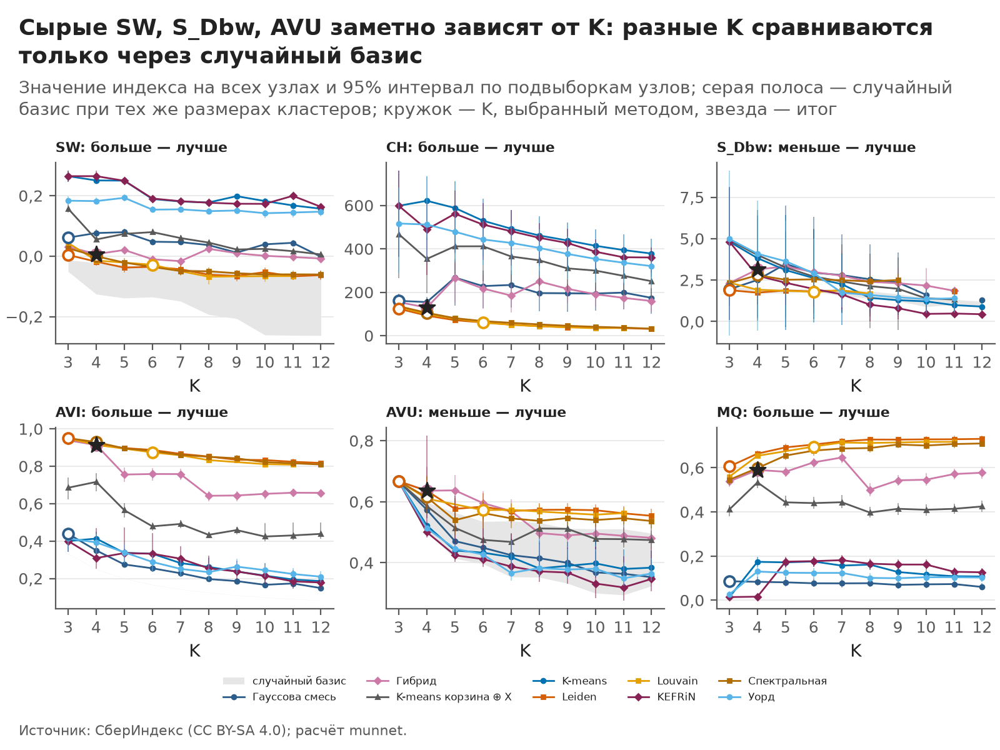
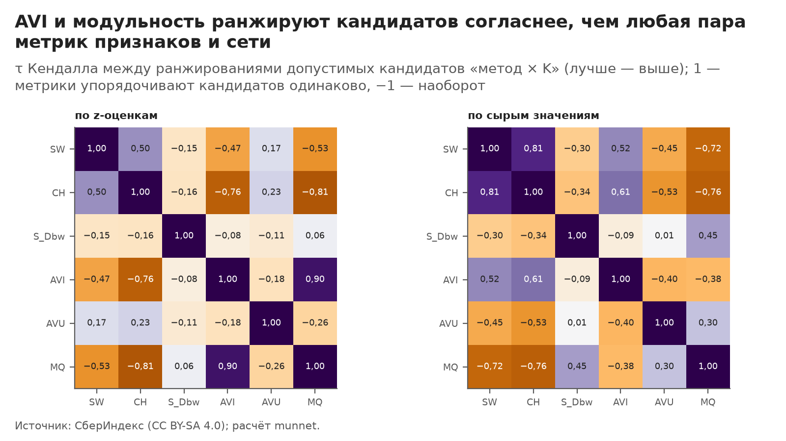
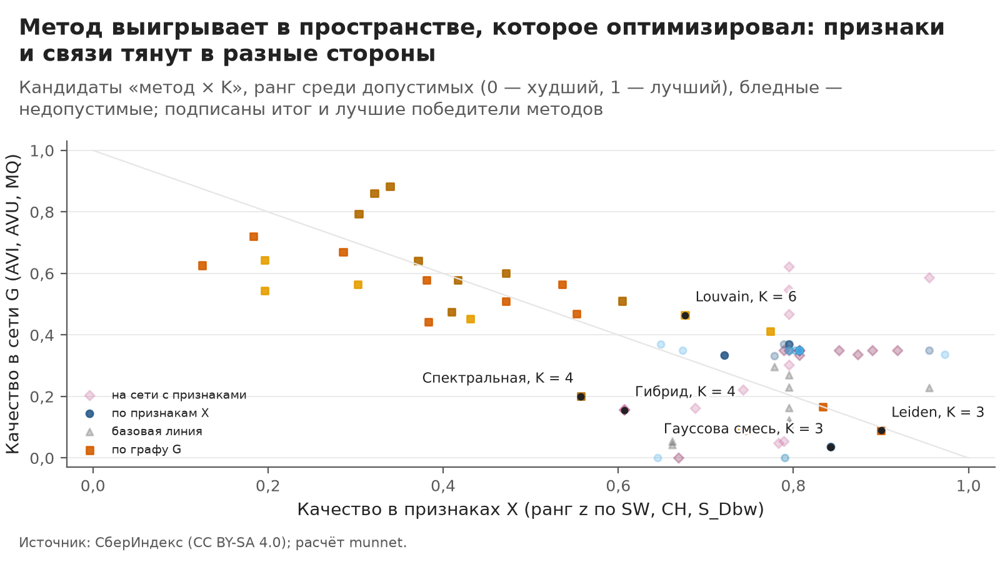
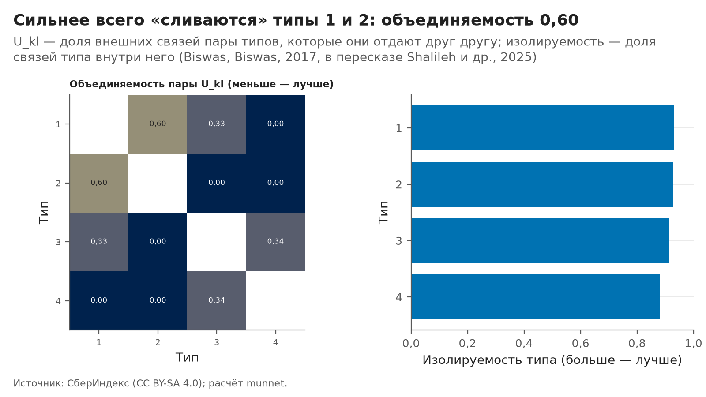

# Качество кластеризации: шесть индексов, случайный базис и согласие метрик

> Собрано командой `python -m munnet evaluate` из меток этапа `cluster` (`data/processed/cluster_labels.parquet`).
> Числа — `outputs/evaluate/report_facts.json`, все значения — `outputs/evaluate/icvi_long.csv`. Руками не
> править: шаблон — `src/munnet/templates/icvi.md`, параметры — секция `icvi` в `configs/default.yaml`.

## Главное за минуту

- **Что оценивали.** Кандидаты «метод × K» этапа `cluster`: всего — 87, допустимых — 29, методов — 9. Три индекса считаются в признаках X (узлов — 1776, признаков — 11), три — в сети G (рёбер — 12 418). Каждый метод оценён в обоих пространствах: так виден компромисс «признаки против связей».
- **Сырые значения разных K несравнимы.** Каждое значение сравнивается со случайными метками тех же размеров (200 перестановок): z-оценка показывает, насколько разбиение лучше случайного. Итог: z-оценка ослабляет связь с K у SW, S_Dbw, AVU; но и сами z не нейтральны к K: они растут с K у AVI, MQ, а падают у SW, CH; поэтому сетевое качество в правиле выбора тянет к большим K, признаковое — к малым ([рис. 1](#fig-1), [рис. 2](#fig-2)).
- **Метрики спорят, и это содержательно:** метрики одного пространства согласуются между собой сильнее, чем метрики разных пространств. AVI и модульность по построению почти дублируют друг друга, а AVU голосует против них: у большинства допустимых кандидатов z AVU меньше нуля (26 из 26) — хорошие типы связаны с соседними типами неравномерно, а случайные метки разносят связи равномерно ([рис. 3](#fig-3)).
- **S_Dbw ломается при больших K:** S_Dbw не определён у 8 из 29 допустимых кандидатов, все — с K от 9 (раздел 5).
- **Признаки против связей:** методы по признакам выше в признаковых индексах, методы по графу — в сетевых: каждая метрика подыгрывает методу, который оптимизировал её пространство ([рис. 5](#fig-5)). Поэтому индексы — вход для Парето-анализа этапа `cluster`, а не единственный судья.

## 1. Шесть индексов одной фразой

| Индекс | Что измеряет | Лучше | Ловушка |
|---|---|---|---|
| SW, силуэт | насколько каждая территория ближе к своему типу, чем к ближайшему чужому | больше | любит компактные «шарики»; шум HDBSCAN исключён — его долю называем отдельно |
| CH, Калинский — Харабаш | во сколько раз разброс между типами больше разброса внутри типов | больше | растёт с числом территорий и с K: сравнивать только через z или CH/N |
| S_Dbw | разброс внутри типов плюс плотность точек «между» типами | меньше | радиус окрестности сжимается с ростом K; в многомерных признаках при больших K индекс не определён |
| AVI, изолируемость | какая доля связей типа остаётся внутри него | больше | на случайных метках около 1/K: без базиса выигрывает маленькое K |
| AVU, объединяемость | не отдают ли два типа друг другу почти все свои внешние связи — тогда их стоило бы слить | меньше | внутренних связей не видит; при K = 2 всегда 1, при K = 3 всегда 2/3; случайные метки дают почти минимум |
| MQ, модульность | доля связей внутри типов сверх ожидаемой у сети с теми же степенями | больше | предел разрешения; сравнима только на одной сети |

Формулы и источники:

- SW — Rousseeuw, 1987; CH — Caliński, Harabasz, 1974; обе сверены со `sklearn`.
- S_Dbw — Halkidi, Vazirgiannis, ICDM 2001, в изложении авторов (Halkidi, Batistakis, Vazirgiannis, SIGMOD Record, 2002, формулы (11), (14)–(17)); вариант плотности центров — «pair» (по точкам обоих кластеров пары, буквально формула (15)).
- AVI и AVU — Biswas, Biswas, Expert Systems with Applications, 2017. Полный текст статьи закрыт; формулы — по пересказу Shalileh, Antonov, Tsyplakova (Doklady Mathematics, 2025, с. 555, формулы (18)–(21)), сверены с Howie и др. (PVLDB, 2023, с. 3175, формулы (36)–(37)). Внутренние рёбра считаются упорядоченными парами:

$$\mathrm{Iso}_k = \frac{ M_{kk} }{ \sum_l M_{kl} }, \quad U_{kl} = \frac{ M_{kl} }{ \mathrm{out}_k + \mathrm{out}_l - M_{kl} }, \quad \mathrm{AVU} = \frac{1}{K} \sum_{k \ne l} U_{kl},$$

  где M — матрица весов связей «тип × тип», out — вес связей типа наружу. ANUI = AVI / (1 + AVI · AVU) — справочно.
- MQ — модульность Newman, Girvan, 2004, взвешенная, разрешение 1; сверена с `networkx` и `igraph`.

## 2. Как считали

- **Входы — те же, что у этапа `cluster`:** X — признаки после замены пропусков и робастного масштаба, G — сеть корзины (расстояние корзин, kNN, веса — сходство). Шум HDBSCAN исключается: из X — строки, из G — узлы и их рёбра.
- **Случайный базис:** 200 перестановок меток с теми же размерами кластеров, те же перестановки, что у этапа `cluster`, поэтому z совпадают с его критериями выбора (сверка с этапом `cluster`: пар «кандидат × индекс» с определённой z — 501, все совпадают с точностью до округления в его таблице, неопределённые z — у тех же кандидатов). Если разброс базиса на уровне ошибки округления (так бывает у AVU при K = 2 и 3), z не определена: индекс на таком кандидате не информативен.
- **Интервалы (95%):** 100 подвыборок по 80% узлов без возвращения — те же, что в проверке устойчивости этапа `cluster`. Метки не пересчитываются: интервал показывает, насколько индекс зависит от состава территорий при данном разбиении. Разброс подвыборки меньше выборочного, поэтому отклонения умножаются на 2,0 (корень из m/(n − m)).

## 3. Победители методов и итог

Значение [интервал], z-оценка против случайного базиса (больше — лучше при любом направлении индекса).

| Кандидат | SW (силуэт) | CH | S_Dbw |
|---|---:|---:|---:|
| Гибрид, K = 4 — итог | 0,007 [−0,002; 0,020], z 2,2 | 130 [110; 144], z 315,5 | 3,142 [2,191; 3,717], z −6,5 |
| Гауссова смесь, K = 3 | 0,061 [0,048; 0,077], z 9,8 | 161 [141; 194], z 299,4 | 1,942 [1,609; 2,158], z 0,7 |
| Leiden, K = 3 | 0,004 [−0,010; 0,022], z 2,6 | 124 [111; 148], z 235,9 | 1,890 [1,747; 2,016], z 2,2 |
| Louvain, K = 6 | −0,029 [−0,043; −0,012], z 0,7 | 60 [54; 70], z 176,5 | 1,787 [1,525; 2,164], z 1,9 |
| Спектральная, K = 4 | 0,000 [−0,011; 0,013], z 1,7 | 105 [94; 123], z 220,7 | 2,790 [1,724; 3,457], z −4,3 |

| Кандидат | AVI | AVU | MQ (модульность) | ANUI |
|---|---:|---:|---:|---:|
| Гибрид, K = 4 — итог | 0,913 [0,893; 0,932], z 178,0 | 0,636 [0,582; 0,714], z −85,6 | 0,590 [0,566; 0,613], z 161,9 | 0,578 [0,554; 0,601], z 124,2 |
| Гауссова смесь, K = 3 | 0,439 [0,420; 0,460], z 23,6 | 0,667 [0,667; 0,667], z — | 0,086 [0,064; 0,108], z 19,5 | 0,340 [0,328; 0,352], z 22,3 |
| Leiden, K = 3 | 0,952 [0,943; 0,964], z 152,6 | 0,667 [0,667; 0,667], z — | 0,606 [0,590; 0,622], z 150,2 | 0,582 [0,579; 0,587], z 114,1 |
| Louvain, K = 6 | 0,874 [0,859; 0,888], z 203,6 | 0,572 [0,537; 0,603], z −44,8 | 0,696 [0,682; 0,711], z 191,7 | 0,582 [0,570; 0,599], z 146,7 |
| Спектральная, K = 4 | 0,929 [0,917; 0,945], z 177,5 | 0,615 [0,561; 0,683], z −65,4 | 0,599 [0,575; 0,624], z 160,7 | 0,591 [0,567; 0,614], z 125,4 |

У итога (Гибрид, K = 4) z отрицательна по S_Dbw, AVU — по этим индексам он хуже случайных меток тех же размеров; интервал силуэта [−0,002; 0,020] включает ноль: в признаках типы итога почти не разделены, а в сети изолированы (z AVI 178,0, z MQ 161,9).

## 4. Индексы по числу типов

*Рисунок 1. Сырые SW, S_Dbw, AVU заметно зависят от K: разные K сравниваются только через случайный базис. Значение индекса на всех узлах и 95% интервал по подвыборкам узлов; серая полоса — случайный базис при тех же размерах кластеров; кружок — K, выбранный методом, звезда — итог. Источник: СберИндекс (CC BY-SA 4.0).* Данные: `outputs/evaluate/figures/I01_by_k.csv`.

*Рисунок 2. z-оценки тоже зависят от K: сетевые растут с K, признаковые падают — пространства тянут K в разные стороны. z-оценка против случайного базиса, знак «больше — лучше»; только через неё сравниваются разные K; кружок — K, выбранный методом, звезда — итог. Источник: СберИндекс (CC BY-SA 4.0).* Данные: `outputs/evaluate/figures/I02_z_by_k.csv`.

Связь с K по допустимым кандидатам — сырые значения и z-оценки:

| Индекс | ρ Спирмена: значение и K | ρ Спирмена: z и K |
|---|---:|---:|
| SW (силуэт) | −0,90 | −0,60 |
| CH | −0,98 | −0,92 |
| S_Dbw | 0,31 | −0,12 |
| AVI | −0,66 | 0,96 |
| AVU | 0,76 | −0,19 |
| MQ (модульность) | 0,85 | 0,95 |

## 5. Согласие метрик и где они спорят

*Рисунок 3. AVI и модульность ранжируют кандидатов согласнее, чем любая пара метрик признаков и сети. τ Кендалла между ранжированиями допустимых кандидатов «метод × K» (лучше — выше); 1 — метрики упорядочивают кандидатов одинаково, −1 — наоборот. Источник: СберИндекс (CC BY-SA 4.0).* Данные: `outputs/evaluate/figures/I03_agreement.csv`.

| τ по z | SW | CH | S_Dbw | AVI | AVU | MQ |
|---|---:|---:|---:|---:|---:|---:|
| SW (силуэт) | 1,00 | 0,50 | −0,15 | −0,47 | 0,17 | −0,53 |
| CH | 0,50 | 1,00 | −0,16 | −0,76 | 0,23 | −0,81 |
| S_Dbw | −0,15 | −0,16 | 1,00 | −0,08 | −0,11 | 0,06 |
| AVI | −0,47 | −0,76 | −0,08 | 1,00 | −0,18 | 0,90 |
| AVU | 0,17 | 0,23 | −0,11 | −0,18 | 1,00 | −0,26 |
| MQ (модульность) | −0,53 | −0,81 | 0,06 | 0,90 | −0,26 | 1,00 |

- Внутри признаковых индексов средний τ 0,06, внутри сетевых — 0,16, между пространствами — −0,26; сильнее всех расходятся CH и MQ (τ −0,81).
- **AVI и MQ согласуются сильнее любой пары метрик из разных пространств** (τ 0,90): при фиксированных размерах кластеров обе растут с весом связей внутри типов, поэтому в правиле выбора этапа 3 сетевое качество фактически взвешено к «внутренним связям».
- **AVU против AVI и MQ** (τ −0,18 и −0,26): у большинства допустимых кандидатов z AVU меньше нуля (медиана −52,0). В формуле AVU нет внутренних связей: она мала, когда внешние связи типа разнесены по многим типам. Случайные метки разносят их равномерно, а настоящие типы связаны сильнее с соседними по смыслу типами.
- **Вырожденный базис AVU:** при K = 3 AVU тождественно равна 2/3 (у 9 кандидатов), при K = 2 — единице; z AVU не определена у 3 допустимых кандидатов.
- **Вырождение S_Dbw** (ρ Спирмена радиуса окрестности с K −0,89): S_Dbw не определён у 8 из 29 допустимых кандидатов — все с K от 9: радиус окрестности убывает с K (медиана 1,40 у неопределённых против 2,19 у остальных при медианном расстоянии до ближайшего соседа 1,63), и у какой-то пары типов в окрестностях обоих центров нет точек, а у середины есть — отношение плотностей бесконечно. В случайном базисе такие перестановки отбрасываются — до 93 из 200 у одного кандидата. Где S_Dbw не определён, признаковое качество в правиле выбора этапа 3 держится на SW и CH.

## 6. Признаки против связей

*Рисунок 5. Метод выигрывает в пространстве, которое оптимизировал: признаки и связи тянут в разные стороны. Кандидаты «метод × K», ранг среди допустимых (0 — худший, 1 — лучший), бледные — недопустимые; подписаны итог и лучшие победители методов. Источник: СберИндекс (CC BY-SA 4.0).* Данные: `outputs/evaluate/figures/I05_spaces.csv`.

Средний ранг z в признаках и в сети по семействам (допустимые кандидаты): методы по признакам выше в признаковых индексах, методы по графу — в сетевых: каждая метрика подыгрывает методу, который оптимизировал её пространство. Связь рангов двух пространств по кандидатам — ρ Спирмена −0,83. Итог выбирается по обоим пространствам сразу, чтобы ни одно из них не решало за другое.

## 7. Итоговое разбиение: какие типы «сливаются»

Итог этапа `cluster` — Гибрид, K = 4. Изолируемость типов — от 0,88 (тип 4) до 0,93 (тип 1); сильнее всего связаны между собой типы 1 и 2 (объединяемость 0,60 при медиане по парам 0,16).

*Рисунок 4. Сильнее всего «сливаются» типы 1 и 2: объединяемость 0,60. U_kl — доля внешних связей пары типов, которые они отдают друг другу; изолируемость — доля связей типа внутри него (Biswas, Biswas, 2017, в пересказе Shalileh и др., 2025). Источник: СберИндекс (CC BY-SA 4.0).* Данные: `outputs/evaluate/figures/I04_unifiability.csv`.

| Тип | МО | Изолируемость | U с типом 1 | U с типом 2 | U с типом 3 | U с типом 4 |
|---|---:|---:|---:|---:|---:|---:|
| Тип 1 | 806 | 0,93 | — | 0,60 | 0,33 | 0,00 |
| Тип 2 | 473 | 0,93 | 0,60 | — | 0,00 | 0,00 |
| Тип 3 | 394 | 0,91 | 0,33 | 0,00 | — | 0,34 |
| Тип 4 | 103 | 0,88 | 0,00 | 0,00 | 0,34 | — |

## 8. Что это значит для выбора решения

- Индексы — вход для Парето-анализа этапа `cluster` вместе с устойчивостью и объяснимостью, а не единственный судья: три сетевых индекса не независимы (AVI ≈ MQ), а AVU отвечает на другой вопрос — «не пора ли слить два типа».
- Разные K и разные методы сравниваются только через z-оценки против случайного базиса.
- Для отчёта о типах важнее всего пары с высокой объединяемостью: это кандидаты на объяснение «чем тип A отличается от типа B», если различие — в признаках, а не в связях.

Источник данных: СберИндекс (CC BY-SA 4.0); признаки места — Росстат, БД ПМО в обработке «Если быть точным» (CC BY 4.0).
