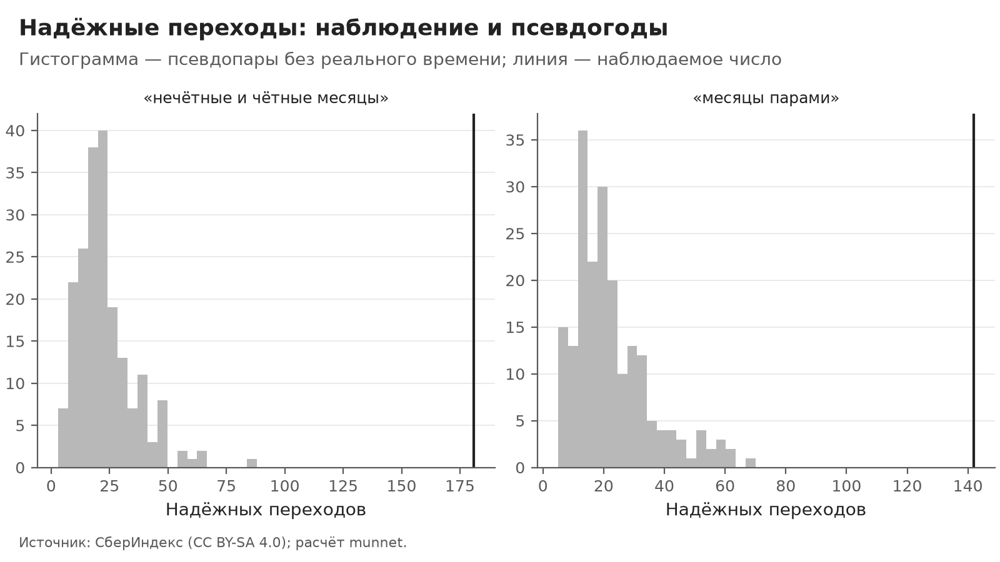
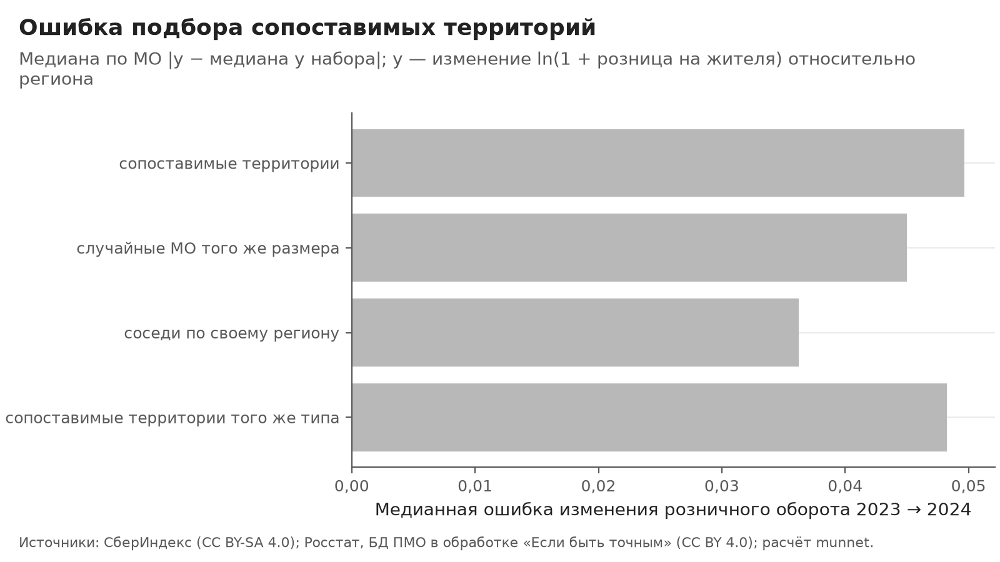

# Типы локальных экономик: интерпретация и проверки тезиса

> Собрано командой `python -m munnet interpret` из выходов этапов `features`, `network`, `cluster`, `evaluate` и `dynamics`. Числа — `outputs/interpret/facts.json`, таблицы целиком — `outputs/interpret/*.csv`. Руками не править: шаблон — `src/munnet/interpret/templates/interpretation.md`, правила — блок `interpret` в `configs/default.yaml`, записанный до расчётов отдельным коммитом (`90991e1`, редакция 3); тексты исходов T6 и T7 уточнены до вскрытия результатов, правила не менялись — раздел 13, «Поправки текстов до вскрытия результатов». Пояснения, добавленные после вскрытия, стоят рядом с текстами исходов с пометкой «Пояснение после вскрытия» и перечислены в разделе 14; тексты исходов и вердикты они не меняют. Вердикты и тексты выбирает код по правилам записи; если проверка не подтвердилась, меняется текст, а не проверка.

## Главный вывод

**Вопрос.** Какие типы локальных экономик видны в корзине безналичных трат жителей относительно своего региона, подтверждает ли их порядок оборот Росстата сверх экономики места и сдвигаются ли МО между типами за год?

1. Типы упорядочены по обороту общепита и розницы Росстата в целом (ρ общепит 0,37, розница 0,55), но внутри страт размера и доли горожан относительно региона сильнее деления МО без типов этот порядок не доказан (у типов ρ общепит 0,24, розница 0,17; у «зарплата, по возрастанию (общепит)», «уровень трат, по возрастанию (розница)» — общепит 0,35, розница 0,28). Типы по составу близки к делению «уровень трат, по возрастанию» (AMI 0,31) и внутри страт размера и доли горожан по обороту Росстата различаются не сильнее, чем деление «зарплата, по возрастанию (общепит)», «занятость: стройка, торговля, транспорт, по убыванию (розница)» (ε² общепит 0,031, розница 0,027 против общепит 0,107, розница 0,052).
2. Надёжных переходов 148, ожидаемо ложных ≈ 34 (медиана плацебо), избыток 114 (интервал от −103 до 143): число смен типа не отличается от плацебо. Надёжные переходы чаще идут к типам с большей долей общепита в корзине относительно своего региона, чем на псевдогодах без реального времени (вверх 148, вниз 33; доля «вверх» 0,82 против 0,49), при обоих разбиениях половин, но часть их — пограничные МО, чья корзина сблизилась с типом их места. Прогноз типа по признакам места 2023 года совпадает с типом назначения у 40,9% перешедших против 19,1% на нуле.
3. Подбор сопоставимых территорий — описательный инструмент: при сверке изменения розничного оборота 2023 → 2024 у самого МО с медианой его набора за тот же период он не лучше соседей по региону и случайных МО того же размера. Тип при подборе ничего не добавляет: ближайшие по корзине МО из других регионов без учёта типа дают ту же ошибку (D − A = +0,001, интервал 0,000–0,003).

*Пояснение после вскрытия к пункту 2:* вердикт T3 в главном выводе дал прогон R1 «правило рёбер „косинус корзин“»: 148 надёжных переходов против медианы плацебо ≈ 34, у 11% псевдопар их больше — неотличимо от плацебо; в основном расчёте и в 8 из 8 остальных прогонов R1 число надёжных переходов выше 95-го перцентиля плацебо (основной расчёт: 181 против 47); числа T2 — из основного расчёта: надёжных переходов 181, из них вверх 148, вниз 33; совпадение «148» у T3 и T2 случайно — это разные прогоны и разные величины.

**Оговорка.** У МО, надёжно перешедших из типа 2 в тип 1 и из типа 1 в тип 3, отличие от оставшихся того же исходного типа видно в безналичных тратах; в обороте общепита Росстата на жителя (без МСП) — нет. Распространение безналичной оплаты как объяснение их смены типа не исключено. Типы частично могут отражать охват безналичной оплаты: отношение трат к доходу 5-НДФЛ различается по типам (ε² = 0,082).

*Охват: о 1776 узлах сети в 73 регионах — МО с полным рядом за 24 месяца; ещё 169 МО с неполным рядом не типизированы (медиана населения у них ниже); медиана населения МО без типа (n = 168) — 18 398, у территориальных узлов сети (полный ряд, без внутригородских МО Москвы и Петербурга) — 21 104 (справка: у всех МО с полным рядом, включая внутригородские МО Москвы и Петербурга, — 23 744); отклонение от комментария записи: там число во фразе — все МО с неполным рядом, здесь — МО без типа; МО с неполным рядом — 174, из них 5 типизированы через узел-город (внутригородские МО Москвы и Петербурга; раздел 13 «Уточнения реализации»).* Лестница: номера типов cluster_final совпали с номерами записи (размеры те же), перенос не понадобился.

Правила для отчёта и лендинга по исходам проверок (в главный вывод не входят):

- В отчёте и на лендинге — «типы, упорядоченные по обороту, как и экономика места»; слов «ступени» и «лестница» нет.
- Главный тезис переформулируется: корзина трат уточняет деление «уровень трат, по возрастанию».
- Утверждение «каждое десятое МО надёжно сдвинулось» из тезиса и с лендинга убирается.
- Обещаний прогноза нет ни в отчёте, ни на лендинге.
- В продукте — подбор по корзине, тип — подпись; слов о пользе типа нет.

## 1. Что проверяется

Решающих проверок шесть: T1 — ступени по обороту Росстата сверх экономики места; T2 — направление переходов против плацебо; T3 — надёжные переходы против псевдогодов; T5 — не повторяют ли типы тривиальные деления; T6 — виден ли рост общепита в данных Росстата; T7 — польза «сопоставимых территорий». T4 — только описание. Фильтр R1 оставляет в главном выводе только то, что держится при другом правиле рёбер, составе узлов, без уровня трат в X, при другом способе прослеживания и seed.

| Проверка | Основной расчёт | В главном выводе (после R1) |
|---|---|---|
| T1: ступени по обороту Росстата | частично (только в целом) | частично (только в целом) |
| T5: не тривиальное деление | повторяют тривиальное деление | повторяют тривиальное деление |
| T3: надёжные переходы против плацебо | подтвердилась | не подтвердилась |
| T2: направление переходов | частично | частично |
| T6: перешедшие МО в обороте Росстата | не подтвердилась | не подтвердилась |
| T7: польза подбора | не подтвердилась | не подтвердилась |

Что было известно до записи блока (`seen_before`): эти числа подтверждениями не служат, и порогов под них нет.

- медианы признаков по типам, табл. 10 docs/clustering.md: urban_share_rel 0,00 / −0,10 / 0,18 / 0,40, log_pop_rel 0,00 / −0,51 / 0,77 / 2,21, market_access_rel, занятость, корзина (типы 1 / 2 / 3 / 4)
- размеры типов 806 / 473 / 394 / 103 и Жаккар по Хеннигу 0,90–0,94 (docs/clustering.md, табл. 9)
- порядок 2 < 1 < 3 < 4 по общепиту в корзине и формулировки тезиса («село», «районные центры», «города и пригороды», «крупные города») — PLAN.md, этап 1
- дерево глубины 3: каппа 0,89, первое разбиение — общепит в корзине (docs/clustering.md, разд. 7; outputs/cluster/tree_rules.txt)
- AMI типов с группой региона −0,003 (docs/clustering.md, разд. 7)
- итог почти повторяет спектральную кластеризацию одного графа: ARI 0,94, с K-means по X — 0,16, «признаки места в типах почти не участвуют» (docs/clustering.md в коммите 51c8604, строки 16, 133, 359; PLAN.md:150, 167; outputs/cluster/alpha_curve.csv, ari_final при α = 1 и α = 0)
- внешняя проверка этапа 3: ИП, организации, ночёвки — ε², знаки, ΔR² сверх атрибутов 0,006 / 0,026 / 0,010 (docs/clustering.md, разд. 8)
- динамика: тип сменили 15,3% узлов против 5,5% на шуме; 181 надёжный переход (10,2%) в 55 регионах из 73 (docs/dynamics.md:12, 155)
- потоки надёжных переходов (docs/dynamics.md:143–150): 2 → 1 — 74, 1 → 3 — 55, 1 → 2 — 26, 3 → 4 — 18, 3 → 1 — 5, 2 → 3 — 1, 4 → 2 — 1, 4 → 3 — 1; по ladder.order «вверх» 148, «вниз» 33
- при фиксированных типах надёжных переходов 161; в названных потоках 2 → 1 — 61, 1 → 2 — 38, 1 → 3 — 35, 3 → 4 — 11, то есть «вверх» не меньше 107 (docs/dynamics.md:211; мелкие потоки там не названы)
- D2 первой редакции по опубликованным потокам (расчёт judge-c5, второй круг): при диагонали вне знаменателя нулевая доля «вверх» 0,785 и D2 ≈ +0,033 (SE ≈ 0,029); при диагонали как «не вверх» — 0,551 и D2 ≈ +0,267. Исход решался прочтением правила, поэтому D2 — описание
- проверка driver: у маркетплейсов отношение медиан |изменения| 1,25, p = 0,001 (первая часть выполнена), но это 5-е место из шести частей; первое — общепит, 2,11 (docs/dynamics.md:14, 183–197)
- примеры МО по потокам переходов в docs/dynamics.md (правило dynamics.impl.examples)
- ARI итога 0,22 с сетью косинуса и 0,32 с районами Москвы и Петербурга отдельными узлами (PLAN.md:133)
- расчёты без меток типов (devils-advocate, второй круг, scratchpad da2/trivial.py): ρ Спирмена по 1774 узлам — плотность с log_pop_rel 0,72; розница Росстата с log_pop_rel 0,60 и с urban_share_rel 0,60; городской округ 0,35 и 0,46; столица 0,30; общепит Росстата 0,29. Разбиение «4 группы по квантилям log_pop_rel с размерами типов» проходит T1 первой редакции (5 из 5 «за») и T5 первой редакции (наибольший AMI 0,27; ε² внутри абсолютных страт 0,018 и 0,033, p = 0,003). Отсюда условные версии T1 и T5, сравнение с делениями «только место» и отрицательные контроли
- expert-economist при записи видел только покрытие данных без разбивки по типам, число уникальных type_jaccard на тип и коды регионов справочника; внешние показатели T1, T5, T6, T7 по типам не считал никто
- КРУГ 3, контроли без меток типов (devils-advocate, scratchpad da3/controls.py, 1000 перестановок и бутстрап-выборок; деления по X 2023 года с уровнем трат 2023 года, размеры 473 / 806 / 394 / 103 на 1776 узлах) против правил редакции 2 (соперники — три деления по log_pop_rel, urban_share_rel, market_access_rel): T1 — Q_log_pop_rel, Q_urban_share_rel, Q_market_access_rel, place_only (и с seed 43, и с z-оценкой), Q_density_rel, Q_place_pc1 → partial_overall; Q_log_level_rel, Q_clr_rel_cafe, Qneg_emp_sh_public → partial_one; Q_log_wage_rel → confirmed (общепит ρ (b) 0,346, нижняя граница превышения +0,153; розница 0,216 и +0,032); случайные → not в 20 из 20. T5 — деления по размеру, place_only, плотность, PC1 → not_repeats; уровень трат и общепит → not_empty; Q_log_wage_rel → confirmed (наибольший AMI 0,155, ε² общепита 0,109, нижняя граница +0,054); случайные → not_empty в 20 из 20; условие (2) выполнено у 9 из 11 делений без типов (кроме делений по доле горожан и по плотности), в том числе у деления по log_pop_rel; coverage_class по терцилям числа показателей схлопнулся в 2 группы. Против расширенного набора (11 атрибутов X в обе стороны и place_only) пять составных делений (зарплата + размер, + уровень, + общепит, + горожане, + размер + горожане) → T1 partial_overall, T5 (3) не выполнено. ОТСЮДА редакция 3: соперники — все 11 атрибутов X в обе стороны, сумма рангов размера и горожан и place_only; контроли — только деления вне набора соперников; условие (2) T5 — описание; coverage_class — по числу пропусков
- КРУГ 3, judge-c5 без меток типов (1774 узла, бутстрап 200): ρ (b) соперников редакции 2 — общепит +0,075 / +0,027 / +0,017, розница +0,105 / +0,082 / +0,119 (log_pop_rel / urban_share_rel / market_access_rel); одиночные деления — log_wage_rel: общепит +0,330 (ε² 0,090), розница +0,231; log_level_rel: +0,230 и +0,294; emp_sh_trade_transport: +0,140 и +0,212; нижняя граница превышения у log_wage_rel +0,185 (общепит) и +0,042 (розница), по ε² общепита +0,050; у плотности −0,099 и −0,046; деление по сумме рангов размера и горожан проходит превышение по рознице (нижняя граница +0,0014); ρ розницы с log_level_rel 0,61. Узлов: территориальных 1774, без urban_share_rel 47, без market_access_rel 12, с общепитом 2023 года 1241, с розницей 1705; число непустых показателей coverage_class {5: 1, 6: 17, 7: 88, 8: 294, 9: 345, 10: 339, 11: 690}, у ip_per_1000 и orgs_per_1000 в 2023 году пусто у всех
- КРУГ 3, T7 без типов (devils-advocate, da3/t7.py, 1542 МО, бутстрап 1000): вместо типа — квантили log_pop_rel, квантили log_wage_rel, дециль населения, случайные метки, «один тип» — во всех случаях вердикт not и type_gain neutral; медианные ошибки D 0,0486, B 0,0362, C ≈ 0,045 (A при квантилях log_pop_rel 0,0475); интервал B − A ниже 0 в обоих вариантах цели, C − A ≤ 0; у дециля населения D − A [0; 0,005]. Пороги T7 под эти числа не менялись
- КРУГ 3, T2 без типов (devils-advocate, симуляция numpy при p = 0,5): 95-й перцентиль |N| — 1,0 / 1,0 / 0,75 / 0,60 / 0,467 / 0,40 / 0,35 / 0,20 при 3 / 5 / 8 / 10 / 15 / 20 / 40 / 80 переходах на псевдопару; наблюдаемое N = 0,635, при фиксированных прототипах N ≥ 0,329. ОТСЮДА редакция 3: решает доля «вверх» против доли «вверх» плацебо (биномиальный тест), перцентиль |N| — описание
- КРУГ 3, expert-economist: правила редакции 3 на контролях без меток типов (scratchpad ee3/newrule.py, X как во входах clustering, 1774 территориальных узла) — числа в ключе controls.seen
- КРУГ 4, devils-advocate, scratchpad da3/r4.py, 300 перестановок и 300 бутстрап-выборок, без меток типов: K-means по 11 признакам X (seed 42 и 43) — T1 not, T5 (3) не выполнено; PC1 по 11 признакам X — partial_overall; сумма 11 признаков X со знаком по ρ с log_pop_rel — partial_overall; положительный контроль «деление по самим оборотам» — confirmed (нижняя граница +0,348 / +0,354); половина сигнала (зарплата + оборот) — confirmed (+0,239 / +0,191); сильнейшие соперники: общепит — Q_log_wage_rel, ρ (b) 0,344; розница — Q_log_level_rel, 0,277

## 2. Отрицательные контроли

Правила T1 и T5 применены к делениям без типов, которые несут только информацию признаков X, но не входят в набор соперников. Ожидание: T1 — не выше «частично (только в целом)» у делений и «не подтвердилась» у случайных; T5 — не выше «не повторяют, но внешним оборотом не подтверждено»; случайных выше ожидаемого — не больше 2 из 20. Итог: контроли не выше ожидаемого — правило отличает тип от экономики места.

| Деление | T1 | T5 | Не выше ожидаемого |
|---|---|---|---|
| K-means по признакам места (place_only_seed) | не подтвердилась | повторяют тривиальное деление | да |
| K-means по признакам места (place_only_zscore) | не подтвердилась | повторяют тривиальное деление | да |
| плотность населения | не подтвердилась | не повторяют, но внешним оборотом не подтверждено | да |
| первая главная компонента места | частично (только в целом) | повторяют тривиальное деление | да |
| сумма: зарплата, население | частично (только в целом) | повторяют тривиальное деление | да |
| сумма: зарплата, уровень трат | частично (только в целом) | повторяют тривиальное деление | да |
| сумма: зарплата, доля горожан | частично (только в целом) | повторяют тривиальное деление | да |
| сумма: зарплата, население, доля горожан | частично (только в целом) | повторяют тривиальное деление | да |
| сумма: уровень трат, население | частично (только в целом) | повторяют тривиальное деление | да |
| случайные метки 1 | не подтвердилась | не повторяют, но внешним оборотом не подтверждено | да |
| случайные метки 2 | не подтвердилась | не повторяют, но внешним оборотом не подтверждено | да |
| случайные метки 3 | не подтвердилась | не повторяют, но внешним оборотом не подтверждено | да |
| случайные метки 4 | не подтвердилась | не повторяют, но внешним оборотом не подтверждено | да |
| случайные метки 5 | не подтвердилась | не повторяют, но внешним оборотом не подтверждено | да |
| случайные метки 6 | не подтвердилась | не повторяют, но внешним оборотом не подтверждено | да |
| случайные метки 7 | не подтвердилась | не повторяют, но внешним оборотом не подтверждено | да |
| случайные метки 8 | не подтвердилась | не повторяют, но внешним оборотом не подтверждено | да |
| случайные метки 9 | не подтвердилась | не повторяют, но внешним оборотом не подтверждено | да |
| случайные метки 10 | не подтвердилась | не повторяют, но внешним оборотом не подтверждено | да |
| случайные метки 11 | не подтвердилась | не повторяют, но внешним оборотом не подтверждено | да |
| случайные метки 12 | не подтвердилась | не повторяют, но внешним оборотом не подтверждено | да |
| случайные метки 13 | не подтвердилась | не повторяют, но внешним оборотом не подтверждено | да |
| случайные метки 14 | не подтвердилась | не повторяют, но внешним оборотом не подтверждено | да |
| случайные метки 15 | не подтвердилась | не повторяют, но внешним оборотом не подтверждено | да |
| случайные метки 16 | не подтвердилась | не повторяют, но внешним оборотом не подтверждено | да |
| случайные метки 17 | не подтвердилась | не повторяют, но внешним оборотом не подтверждено | да |
| случайные метки 18 | не подтвердилась | не повторяют, но внешним оборотом не подтверждено | да |
| случайные метки 19 | не подтвердилась | не повторяют, но внешним оборотом не подтверждено | да |
| случайные метки 20 | не подтвердилась | не повторяют, но внешним оборотом не подтверждено | да |

Справки (в вердикт не входят): T1 на делении по одному признаку X без себя в наборе соперников и T1 и T5 (3) на делениях по одной части корзины.

| Деление | Справка | T1 | T5 |
|---|---|---|---|
| уровень трат, по возрастанию | без себя в наборе | частично (только в целом) | — |
| зарплата, по возрастанию | без себя в наборе | частично (один оборот сверх места) | — |
| доля горожан, по возрастанию | без себя в наборе | не подтвердилась | — |
| доля старших, по возрастанию | без себя в наборе | частично (только в целом) | — |
| население, по возрастанию | без себя в наборе | не подтвердилась | — |
| доступность рынков, по возрастанию | без себя в наборе | частично (только в целом) | — |
| занятость: сельск. хоз. и добыча, по возрастанию | без себя в наборе | частично (только в целом) | — |
| занятость: промышленность, по возрастанию | без себя в наборе | не подтвердилась | — |
| занятость: стройка, торговля, транспорт, по возрастанию | без себя в наборе | частично (только в целом) | — |
| занятость: рыночные услуги, по возрастанию | без себя в наборе | частично (только в целом) | — |
| занятость: бюджетный сектор, по возрастанию | без себя в наборе | не подтвердилась | — |
| Корзина: продовольствие | одна часть корзины | частично (только в целом) | не повторяют, но внешним оборотом не подтверждено |
| Корзина: маркетплейсы | одна часть корзины | частично (только в целом) | не повторяют, но внешним оборотом не подтверждено |
| Корзина: транспорт | одна часть корзины | не подтвердилась | не повторяют, но внешним оборотом не подтверждено |
| Корзина: здоровье | одна часть корзины | не подтвердилась | не повторяют, но внешним оборотом не подтверждено |
| Корзина: общепит | одна часть корзины | частично (только в целом) | не повторяют, но внешним оборотом не подтверждено |
| Корзина: прочее | одна часть корзины | не подтвердилась | не повторяют, но внешним оборотом не подтверждено |

Что было известно о контролях до записи: Правила редакции 3 на контролях до коммита, без меток типов (expert-economist, scratchpad ee3/newrule.py → out_1000.json; 1000 перестановок и бутстрап-выборок; X как во входах clustering; 1774 территориальных узла, размеры пропорционально 472 / 805 / 394 / 103; со стратой 1727; общепит 1241 и 1208 со стратой, розница 1705 и 1666; coverage_class 690 / 339 / 745). T1: place_only_seed, place_only_zscore, density_rel → not; place_pc1 и пять составных → partial_overall; случайные → not в 20 из 20. T5: density_rel и случайные (20 из 20) → not_empty, остальные восемь → not_repeats. Нижняя граница превышения у контролей: ρ (b) от −0,381 до −0,052, ε² от −0,139 до −0,031. Сильнейшие соперники на полной выборке — деление по log_wage_rel для общепита (ρ (b) 0,344) и по log_level_rel для розницы (0,277). Справка self_out: деление по одной log_wage_rel без себя в наборе — partial_one (общепит, нижняя граница +0,035), по log_level_rel — partial_overall (розница, −0,012). Контроли не выше ожидаемого — правило редакции 3 проходит свои контроли; пороги под эти числа не выбирались

## 3. T1: упорядочены ли типы по обороту Росстата

Упорядочены ли типы по ступеням 2 < 1 < 3 < 4 по обороту Росстата, которого нет в кластеризации, — и сверх размера и доли горожан МО относительно региона, и сильнее, чем деления МО по любому одному признаку экономики места или уровню трат?

**Исход (основной расчёт): частично (только в целом); в главном выводе — частично (только в целом).** Типы упорядочены по обороту общепита и розницы Росстата в целом (ρ общепит 0,37, розница 0,55), но внутри страт размера и доли горожан относительно региона сильнее деления МО без типов этот порядок не доказан (у типов ρ общепит 0,24, розница 0,17; у «зарплата, по возрастанию (общепит)», «уровень трат, по возрастанию (розница)» — общепит 0,35, розница 0,28). Проверка чувствительности: главный вердикт — по буквальному прочтению оборота «за сверх места» (знак, q < alpha, монотонность и beyond_place для версий (a) и (b), без порога |ρ| версии (a)); по строгому прочтению (с порогом |ρ| версии (a)) вердикт основного расчёта — «частично (только в целом)», совпадает с главным; в главный вывод идёт буквальное прочтение; обоснование — раздел 13 «Уточнения реализации».

| Оборот | Узлов (a) / (b) | ρ (a) [95%] | q (a) | Монотонно (a) | ρ (b) [95%] | q (b) | Монотонно (b) | Разность с сильнейшим [95%] | «За в целом» | «За сверх места» | «За сверх места», строго (с \|ρ (a)\| ≥ rho_min) |
|---|---|---|---|---|---|---|---|---|---|---|---|
| общепит | 1241 / 1208 | 0,37 [0,32–0,42] | 1,0·10⁻³ | да | 0,24 [0,18–0,29] | 1,0·10⁻³ | нет | −0,11 [от −0,17 до −0,04] | да | нет | нет |
| розница | 1705 / 1666 | 0,55 [0,52–0,59] | 1,0·10⁻³ | да | 0,17 [0,12–0,22] | 1,0·10⁻³ | нет | −0,10 [от −0,16 до −0,05] | да | нет | нет |

*(a) — ρ Спирмена ступени и оборота по всем территориальным узлам с показателем, нуль — перестановки меток внутри групп региона; (b) — без 47 узлов без страты (нет населения или доли горожан относительно региона), ρ внутри страт размера и доли горожан относительно региона (квинтили × квинтили), нуль — перестановки внутри страт; «разность» — ρ (b) типов минус наибольший ρ (b) 25 делений без типов на той же бутстрап-выборке, 95% интервал. «За сверх места» — главное, буквальное прочтение записи: (a) и (b) — знак, q < alpha, монотонность и нижняя граница разности больше 0, без порога |ρ| версии (a); «строго» — проверка чувствительности рядом: плюс полное «за в целом» по (a), включая |ρ (a)| ≥ rho_min.*

Описание: доля городских округов по ступеням снизу вверх — 7% / 18% / 47% / 68%, монотонно: да; доля региональных столиц по ступеням снизу вверх — 0,0% / 0,5% / 3,6% / 42,7%, монотонно: да; медиана плотности относительно региона по ступеням снизу вверх — −0,44 / −0,01 / 1,09 / 4,40, монотонно: да.

| Показатель | Групп региона, где медиана растёт по ступеням | На нуле (среднее) | p (односторонний) |
|---|---|---|---|
| плотность населения | 50 из 69 | 7,81 | 1,0·10⁻³ |
| общепит | 32 из 69 | 9,35 | 1,0·10⁻³ |
| розница | 44 из 68 | 7,74 | 1,0·10⁻³ |

Почему это не порочный круг: Статус, столица и плотность — заместители log_pop_rel и urban_share_rel из X, поэтому они только описание. Обороты Росстата тоже растут с урбанизацией и зарплатой: безусловная версия (a) это повторяет, поэтому «ступени» разрешает только условная версия (b), где типы должны превзойти деления без типов по каждому из 11 признаков X (в том числе log_wage_rel и log_level_rel) и K-means по признакам места. T1 (b) и T5 (3) — на одних показателях, стратах и соперниках: это одно свидетельство, а не два. AMI с регионом — около нуля по построению, не проверка.

## 4. T5: не повторяют ли типы тривиальные деления

Не повторяют ли типы тривиальные деления — размер, долю горожан и доступность рынков относительно региона, статус МО, федеральный округ, покрытие данных, любой один признак X, K-means по признакам места — и различаются ли они по обороту Росстата сильнее, чем такие деления?

**Исход: повторяют тривиальное деление.** Типы по составу близки к делению «уровень трат, по возрастанию» (AMI 0,31) и внутри страт размера и доли горожан по обороту Росстата различаются не сильнее, чем деление «зарплата, по возрастанию (общепит)», «занятость: стройка, торговля, транспорт, по убыванию (розница)» (ε² общепит 0,031, розница 0,027 против общепит 0,107, розница 0,052).

*Пояснение после вскрытия:* AMI типов с делением «уровень трат, по возрастанию» — 0,31 (95% бутстрап-интервал 0,29–0,34, 1000 выборок узлов; 0 — случайное совпадение, 1 — полное); в прогонах R1: seed 142 — 0,31, seed 242 — 0,31, seed 342 — 0,31, seed 442 — 0,31, правило рёбер „косинус корзин“ — 0,23, без уровня трат в признаках — 0,31, внутригородские МО отдельными узлами — 0,25. Ступень типа совпадает с группой деления по уровню трат у 63% из 1774 узлов. Исход T5 по правилу записи не меняется; числа показывают меру близости.

| Деление | AMI | ARI |
|---|---|---|
| уровень трат, по возрастанию | 0,313 | 0,239 |
| население, по возрастанию | 0,283 | 0,229 |
| уровень трат, по убыванию | 0,275 | 0,215 |
| население, по убыванию | 0,246 | 0,212 |
| сумма рангов населения и доли горожан, по возрастанию | 0,239 | 0,194 |
| K-means по признакам места | 0,200 | 0,143 |
| сумма рангов населения и доли горожан, по убыванию | 0,194 | 0,157 |
| децили населения | 0,145 | 0,057 |
| зарплата, по возрастанию | 0,123 | 0,088 |
| зарплата, по убыванию | 0,120 | 0,073 |

| Оборот | Узлов | ε² типов [95%] | q | Сильнейшее деление без типов | Его ε² | Разность [95%] |
|---|---|---|---|---|---|---|
| общепит | 1208 | 0,031 [0,019–0,047] | 1,0·10⁻³ | зарплата, по возрастанию | 0,107 | −0,076 [от −0,103 до −0,048] |
| розница | 1666 | 0,027 [0,018–0,039] | 1,0·10⁻³ | занятость: стройка, торговля, транспорт, по убыванию | 0,052 | −0,025 [от −0,047 до −0,010] |

Состав (описание): в 7 из 7 групп доли горожан не меньше 3 типов. AMI с группой региона — −0,003 (около нуля по построению: корзина и уровень — относительно своего региона).

Почему это не порочный круг: Доля горожан, население, доступность рынков и остальные признаки X входят в кластеризацию: по ним — только AMI и состав, без p-значений. Проверка (3) — на показателях вне X и G и против делений без типов по каждому признаку X и K-means по месту, иначе её проходят и деление по одному размеру (круг 2), и по одной зарплате (круг 3, seen_before). T5 (3) и T1 (b) — одно свидетельство.

## 5. T4: корзина или место (описание)

Насколько итог ближе к разбиению по одной корзине, чем по одним признакам места? Описание, не проверка: итог ближе к разбиению по одной корзине (ARI 0,94), чем по одним признакам места (ARI 0,14); разность +0,79, интервал 0,59–0,79. Это следует из построения и было известно до проверок. Описывает ли экономика места типы — T1 и T5 (3). Итог (гибрид) содержит оба источника, а ARI 0,94 и 0,16 опубликованы до записи: вердикта нет. ARI итога с квинтилями населения относительно региона — 0,15; правило T1 на разбиении «только корзина» даёт вердикт частично (только в целом) (описание, а не второе подтверждение: разбиение «только корзина» — одна из двух частей итога).

## 6. T3: больше ли надёжных переходов, чем на псевдогодах

Надёжных переходов больше, чем даёт то же правило на псевдогодах без реального времени между ними? 181 и 10,2% — в seen_before; порог — перцентиль плацебо, а не число, выбранное под 181; «каждое десятое» — по избытку сверх плацебо.

**Исход (основной расчёт): подтвердилась; в главном выводе — не подтвердилась.** Надёжных переходов 148, ожидаемо ложных ≈ 34 (медиана плацебо), избыток 114 (интервал от −103 до 143): число смен типа не отличается от плацебо.

*Основной расчёт — неустойчиво к правилу рёбер, составу узлов, уровню трат в X, способу прослеживания или seed:* За год надёжно сменили тип 181 МО (10,2%); на псевдогодах без реального времени то же правило даёт медиану 21 (95-й перцентиль 47). Сверх плацебо — 160 МО (9,0%, интервал 126–174) — примерно каждое десятое МО.

| Половины | Надёжных переходов | Плацебо: медиана | Плацебо: 95-й перцентиль | Избыток, 95% интервал | Выше перцентиля |
|---|---|---|---|---|---|
| «нечётные и чётные месяцы» | 181 | 21 | 47,0 | 126–174 | да |
| «месяцы парами» | 142 | 19 | 51,0 | 83–135 | да |

Сверка сравнения: наблюдаемые типы 2024 года этап dynamics сопоставляет с итогом цепочкой окон, а псевдогоды плацебо — напрямую. В окне 2024 года оба пути дают одни и те же номера у всех узлов во всех прогонах (`facts.json`: `qc.chain_direct`), так что сравнение равноценно.

*Рисунок 2.* Данные: `outputs/interpret/figures/`.

## 7. T2: куда идут надёжные переходы

Идут ли надёжные переходы 2023 → 2024 вверх по порядку типов 2 → 1 → 3 → 4 чаще, чем на псевдогодах без реального времени, и не переклассификация ли это пограничных МО к типу их места? Направление известно заранее: сырая асимметрия 148 вверх против 33 вниз опубликована (seen_before), и никакое правило не сделает её новым результатом. Новое в T2 — только сравнение с плацебо, проверка (c) place_tree и устойчивость в R1. Признаки места во всех окнах — 2023 год (dynamics.tracking.place_year), поэтому (c) нацелена на альтернативу «переклассификация к типу места».

**Исход (основной расчёт): частично; в главном выводе — частично.** Надёжные переходы чаще идут к типам с большей долей общепита в корзине относительно своего региона, чем на псевдогодах без реального времени (вверх 148, вниз 33; доля «вверх» 0,82 против 0,49), при обоих разбиениях половин, но часть их — пограничные МО, чья корзина сблизилась с типом их места. Прогноз типа по признакам места 2023 года совпадает с типом назначения у 40,9% перешедших против 19,1% на нуле.

*Пояснение после вскрытия:* корзина считается относительно среднего своего региона, поэтому общий сдвиг всех МО вверх невозможен по построению: среднее изменение доли общепита (CLR относительно региона, 2024 минус 2023) по всем 1776 узлам — 0,000. Переходы вверх идут рядом с тем, что МО, оставшиеся в нижнем типе (тип 2), отошли ниже: медиана изменения у 314 оставшихся — −0,050 (снизилась у 68%), у 74 перешедших из типа 2 в тип 1 — 0,129. Это расхождение МО внутри регионов, а не рост доли общепита у всех.

| Половины | Вверх / вниз | Доля «вверх» [95%] | p0 плацебо | p «чаще вверх» | p «чаще вниз» | N; 95-й перцентиль \|N\| плацебо |
|---|---|---|---|---|---|---|
| «нечётные и чётные месяцы» | 148 / 33 | 0,82 [0,76–0,87] | 0,49 | 4,4·10⁻²⁰ | 1,000 | 0,64; 0,87 |
| «месяцы парами» | 123 / 19 | 0,87 [0,81–0,92] | 0,48 | 8,8·10⁻²² | 1,000 | 0,73; 0,89 |

Пары соседних ступеней (описание, как в критерии симметрии Боукера):

| Половины | Пара ступеней (типы) | Вверх / вниз | N пары | 95-й перцентиль \|N\| пары на плацебо |
|---|---|---|---|---|
| «нечётные и чётные месяцы» | 2–1 | 74 / 26 | 0,48 | 1,00 |
| «нечётные и чётные месяцы» | 1–3 | 55 / 5 | 0,83 | 1,00 |
| «нечётные и чётные месяцы» | 3–4 | 18 / 1 | 0,89 | 1,00 |
| «месяцы парами» | 2–1 | 75 / 14 | 0,69 | 1,00 |
| «месяцы парами» | 1–3 | 38 / 4 | 0,81 | 1,00 |
| «месяцы парами» | 3–4 | 8 / 1 | 0,78 | 1,00 |

Описания (в вердикт не входят): D1 — доля «вверх» минус доля «вверх» у смен «нечётные → чётные» одного года: 0,20, в обратной ориентации 0,44; D2 — доля «вверх» минус нуль перестановок назначений: 0,03 (диагональ вне знаменателя), 0,27 (диагональ как «не вверх»); прогноз типа по месту совпадает с типом назначения у 40,9% перешедших против 19,1% на нуле (p = 1,0·10⁻³). Данные: outputs/dynamics/nodes.csv (half_type_2023, half_type_2024, reliable) и outputs/dynamics/labels.csv после перезапуска dynamics.

Ограничение биномиального теста: переходы считаются независимыми, хотя псевдопары строятся на одних и тех же узлах, поэтому интервал p0 уже настоящего.

Ограничение нулевой гипотезы: на псевдогодах без реального времени доля «вверх» по построению около 0,5. Псевдогоды А и Б взаимозаменяемы: ориентация псевдопары (какие 6 месяцев 2023 года попали в А) выбирается случайно, а при основном способе прослеживания и при фиксированных типах псевдопара с обратной ориентацией даёт ту же матрицу переходов, только транспонированную, — «вверх» и «вниз» меняются местами. Поэтому сравнение с плацебо проверяет, есть ли у надёжных переходов чистый поток в одну сторону, но не его происхождение и не то, сильнее ли асимметрия, чем при перетасовке месяцев; при заметном перекосе наблюдаемых переходов исход в основном разбиении почти предрешён, и содержание T2 — в том, держится ли перекос при другом разбиении половин, других входах, способах прослеживания и seed (R1). Альтернативу «переходят пограничные МО к типу своего места» проверяет не p0, а place_tree.

## 8. R1: что держится при других входах, способах и seed

| Прогон | T1 | T2 | T3 |
|---|---|---|---|
| main | частично (только в целом) | частично | подтвердилась |
| seed:142 | частично (только в целом) | частично | подтвердилась |
| seed:242 | частично (только в целом) | частично | подтвердилась |
| seed:342 | частично (только в целом) | частично | подтвердилась |
| seed:442 | частично (только в целом) | частично | подтвердилась |
| tracking:evolutionary | — | частично | подтвердилась |
| tracking:fixed_prototypes | — | частично | подтвердилась |
| variant:graph_basket_cos | частично (только в целом) | частично | не подтвердилась |
| variant:no_level | частично (только в целом) | частично | подтвердилась |
| variant:nodes_separate | частично (только в целом) | частично | подтвердилась |
| итог (main_text: lowest) | частично (только в целом) | частично | не подтвердилась |
| устойчив к R1 | да | да | нет |

Части корзины, у которых знак отклонения типа не прошёл R1 (в ограничения, не в названия): тип 1 — корзина: здоровье, тип 1 — корзина: прочее, тип 2 — корзина: прочее, тип 3 — корзина: прочее, тип 4 — корзина: прочее.

Основной расчёт выше итогового вердикта (неустойчиво к правилу рёбер, составу узлов, уровню трат в X, способу прослеживания или seed): T3 — подтвердилась. ARI вариантов (0,22 и 0,32) известен, поэтому порог на ARI не ставится: фильтруются знаки и вердикты.

## 9. T6: видно ли отличие перешедших МО вне данных банка

Виден ли главный признак переходов вверх по порядку типов — рост доли общепита — и вне данных банка, в обороте общепита Росстата? log_level_rel входит в X, поэтому оговорка — описание, а не проверка. Отношение медиан изменения общепита 2,11 — в seen_before. Мощность мала: оборот без МСП, пропуски у 37% узлов.

Вопрос записан до расчётов. Перешедшие — МО, надёжно сменившие тип в потоках, заданных до расчётов; текст исхода сравнивает только их с оставшимися в том же исходном типе и не утверждает сдвига всей совокупности (поправка текстов 30.09.2026, раздел 13).

**Исход: не подтвердилась.** У МО, надёжно перешедших из типа 2 в тип 1 и из типа 1 в тип 3, отличие от оставшихся того же исходного типа видно в безналичных тратах; в обороте общепита Росстата на жителя (без МСП) — нет. Распространение безналичной оплаты как объяснение их смены типа не исключено. Типы частично могут отражать охват безналичной оплаты: отношение трат к доходу 5-НДФЛ различается по типам (ε² = 0,082). Оговорка про охват (описание, без p-значений): ε² разности уровня трат и дохода 5-НДФЛ по типам — 0,082 по уровню года дохода и 0,074 по уровню 24 месяцев; решает наибольшее.

*Пояснение после вскрытия:* «не подтвердилась» здесь значит «не обнаружено», а не «отличия нет»: 95% интервал дельты Клиффа — от −0,15 до 0,12, поэтому исключено только отличие перешедших от оставшихся сильнее его границ (дельта больше ≈ 0,12 в пользу перешедших или меньше ≈ −0,15); более слабое отличие данные не исключают.

| Поток | Перешли / остались | Дельта Клиффа | Медиана Δ: перешли | Медиана Δ: остались | 95% интервал |
|---|---|---|---|---|---|
| 1 → 3 | 37 / 428 | −0,04 | 0,038 | 0,028 | — |
| 2 → 1 | 44 / 158 | 0,04 | 0,015 | −0,005 | — |
| все потоки (взвешенно, правило T6) | 81 / 586 | −0,01 | — | — | от −0,15 до 0,12 |

## 10. T7: польза «сопоставимых территорий»

Предсказывают ли «сопоставимые территории» изменение экономики МО лучше соседей по региону и случайных МО того же размера — и добавляет ли что-то ограничение «того же типа»? Розница Росстата не входит ни в X, ни в G, ни во внешнюю проверку этапа 3; тип — по окну 2023 года, цель — изменение к 2024 году.

Вопрос записан до расчётов; проверка отвечает на него сверкой изменения за тот же период, а не опережающим прогнозом (поправка текстов 30.09.2026, раздел 13).

**Исход: не подтвердилась.** Подбор сопоставимых территорий — описательный инструмент: при сверке изменения розничного оборота 2023 → 2024 у самого МО с медианой его набора за тот же период он не лучше соседей по региону и случайных МО того же размера. Тип при подборе ничего не добавляет: ближайшие по корзине МО из других регионов без учёта типа дают ту же ошибку (D − A = +0,001, интервал 0,000–0,003).

*Пояснение после вскрытия:* тип добавляет к точности подбора не больше 0,003 медианной ошибки (верхняя граница 95% интервала D − A, точка 0,001) при медианной ошибке набора без учёта типа 0,050, то есть не больше 6% её.

| Набор | Медианная ошибка | Без относительности |
|---|---|---|
| сопоставимые территории того же типа | 0,048 | 0,041 |
| соседи по своему региону | 0,036 | 0,036 |
| случайные МО того же размера | 0,045 | 0,038 |
| сопоставимые территории | 0,050 | 0,042 |

| Разность | Точка | 95% |
|---|---|---|
| B-A | −0,012 | от −0,015 до −0,009 |
| B-A (без относительности) | −0,005 | от −0,008 до −0,003 |
| C-A | −0,003 | от −0,006 до −0,001 |
| C-A (без относительности) | −0,003 | от −0,005 до 0,000 |
| B-D | −0,013 | от −0,017 до −0,010 |
| B-D (без относительности) | −0,005 | от −0,009 до −0,003 |
| C-D | −0,005 | от −0,007 до −0,002 |
| C-D (без относительности) | −0,003 | от −0,006 до −0,001 |
| D-A | 0,001 | 0,000–0,003 |
| D-A (без относительности) | 0,001 | от 0,000 до 0,002 |

*Рисунок 3.* Данные: `outputs/interpret/figures/`.

Сравнение — на 1542 МО, у которых все четыре набора не меньше порога; выбыли 27 МО. Пример для лендинга — МО с медианной ошибкой набора продукта: territory_id 44 (ошибка 0,050), членов набора 10; сверх 10 признаков места метки типа дают ΔR² −0,002 (p = 0,359).

## 11. Типы: профиль, названия, примеры

Профиль — описание, не проверка: p-значений по признакам кластеризации нет. Название дано по правилу после профиля: {слово о поселении или признак места}, {часть корзины 1}; часть корзины 2 — в подписи. Слепая проверка названий (check-ux: верно 4 из 4, порог 4).

| Тип | Название в выходах | Кандидат по правилу | Описательное | Подпись | Части корзины |
|---:|---|---|---|---|---|
| 2 | Сельские, меньше общепита | Сельские, меньше общепита | Тип 2: меньше общепита, больше продуктов | Больше продуктов; относительно своего региона | Корзина: общепит, Корзина: продовольствие |
| 1 | Города, меньше транспорта | Города, меньше транспорта | Тип 1: меньше транспорта | Относительно своего региона | Корзина: транспорт |
| 3 | Города, меньше продуктов | Города, меньше продуктов | Тип 3: меньше продуктов, больше общепита | Больше общепита; относительно своего региона | Корзина: продовольствие, Корзина: общепит |
| 4 | Крупные города, меньше продуктов | Крупные города, меньше продуктов | Тип 4: меньше продуктов, меньше маркетплейсов | Меньше маркетплейсов; относительно своего региона | Корзина: продовольствие, Корзина: маркетплейсы |

| Признак | Тип 2: MAD / δ | Тип 1: MAD / δ | Тип 3: MAD / δ | Тип 4: MAD / δ |
|---|---|---|---|---|
| Корзина: продовольствие | 0,85 / 0,79 | 0,06 / 0,14 | −1,13 / −0,78 | −2,55 / −0,98 |
| Корзина: маркетплейсы | 0,83 / 0,69 | 0,07 / 0,14 | −0,95 / −0,67 | −2,25 / −0,96 |
| Корзина: транспорт | 0,47 / 0,35 | −0,21 / −0,21 | −0,31 / −0,20 | 0,41 / 0,32 |
| Корзина: здоровье | 0,84 / 0,64 | −0,02 / −0,05 | −0,68 / −0,49 | −1,02 / −0,53 |
| Корзина: общепит | −1,01 / −1,00 | −0,02 / −0,02 | 1,08 / 0,85 | 2,01 / 0,98 |
| Корзина: прочее | 0,02 / 0,02 | −0,01 / −0,02 | −0,06 / −0,02 | 0,07 / 0,05 |
| Уровень трат | −0,59 / −0,65 | −0,06 / −0,18 | 1,27 / 0,70 | 2,88 / 0,96 |
| Зарплата | −0,54 / −0,50 | −0,03 / −0,09 | 0,71 / 0,45 | 1,78 / 0,77 |
| Доля горожан | −0,46 / −0,52 | 0,00 / −0,01 | 0,76 / 0,47 | 1,66 / 0,45 |
| Доля старших | 0,56 / 0,45 | 0,03 / 0,08 | −0,53 / −0,41 | −1,34 / −0,70 |
| Население | −0,70 / −0,68 | 0,00 / −0,09 | 1,06 / 0,61 | 3,05 / 0,91 |
| Доступность рынков | −0,27 / −0,27 | −0,03 / −0,12 | 0,47 / 0,31 | 1,71 / 0,55 |
| Занятость: сельск. хоз. и добыча | −0,06 / −0,06 | 0,41 / 0,11 | −0,21 / −0,05 | −0,47 / −0,12 |
| Занятость: промышленность | −0,42 / −0,51 | −0,04 / −0,05 | 1,19 / 0,48 | 1,53 / 0,51 |
| Занятость: стройка, торговля, транспорт | −0,50 / −0,42 | 0,03 / 0,04 | 0,34 / 0,25 | 1,13 / 0,57 |
| Занятость: рыночные услуги | −0,12 / −0,09 | −0,04 / −0,05 | 0,04 / 0,06 | 1,10 / 0,37 |
| Занятость: бюджетный сектор | 0,52 / 0,44 | 0,00 / −0,01 | −0,53 / −0,34 | −0,66 / −0,46 |

«Типичное МО» (медиана без весов) и «типичный житель» (медиана с весами населения 2023 года):

| Признак | Все: МО / житель | Тип 2: МО / житель | Тип 1: МО / житель | Тип 3: МО / житель | Тип 4: МО / житель |
|---|---|---|---|---|---|
| Корзина: продовольствие | 0,02 / −0,22 | 0,16 / 0,15 | 0,03 / 0,01 | −0,15 / −0,20 | −0,38 / −0,42 |
| Корзина: маркетплейсы | 0,01 / −0,21 | 0,16 / 0,16 | 0,03 / 0,00 | −0,15 / −0,18 | −0,37 / −0,45 |
| Корзина: транспорт | 0,01 / 0,04 | 0,08 / 0,05 | −0,02 / 0,00 | −0,03 / 0,02 | 0,07 / 0,06 |
| Корзина: здоровье | 0,00 / −0,04 | 0,09 / 0,08 | 0,00 / 0,00 | −0,07 / −0,04 | −0,11 / −0,06 |
| Корзина: общепит | −0,02 / 0,48 | −0,43 / −0,41 | −0,03 / 0,01 | 0,41 / 0,43 | 0,78 / 0,83 |
| Корзина: прочее | 0,00 / 0,00 | 0,00 / 0,01 | 0,00 / −0,01 | 0,00 / 0,00 | 0,01 / 0,01 |
| Уровень трат | −0,03 / 0,19 | −0,11 / −0,11 | −0,04 / −0,02 | 0,13 / 0,18 | 0,34 / 0,37 |
| Зарплата | 0,00 / 0,18 | −0,09 / −0,09 | −0,01 / 0,00 | 0,12 / 0,15 | 0,29 / 0,37 |
| Доля горожан | 0,00 / 0,23 | −0,11 / −0,14 | 0,00 / 0,00 | 0,19 / 0,21 | 0,41 / 0,49 |
| Доля старших | 0,00 / −0,02 | 0,02 / 0,01 | 0,00 / 0,00 | −0,02 / −0,02 | −0,04 / −0,03 |
| Население | 0,00 / 1,36 | −0,51 / −0,39 | 0,00 / 0,23 | 0,77 / 1,22 | 2,21 / 3,49 |
| Доступность рынков | 0,00 / 2,80 | −2,80 / −2,40 | −0,30 / 0,00 | 4,85 / 7,30 | 17,60 / 8,50 |
| Занятость: сельск. хоз. и добыча | 0,03 / 0,01 | 0,03 / 0,05 | 0,05 / 0,04 | 0,02 / 0,02 | 0,01 / 0,01 |
| Занятость: промышленность | 0,09 / 0,21 | 0,04 / 0,05 | 0,08 / 0,16 | 0,21 / 0,22 | 0,25 / 0,24 |
| Занятость: стройка, торговля, транспорт | 0,10 / 0,18 | 0,06 / 0,06 | 0,10 / 0,13 | 0,12 / 0,16 | 0,19 / 0,20 |
| Занятость: рыночные услуги | 0,08 / 0,12 | 0,07 / 0,08 | 0,08 / 0,09 | 0,08 / 0,10 | 0,12 / 0,17 |
| Занятость: бюджетный сектор | 0,47 / 0,37 | 0,56 / 0,55 | 0,47 / 0,41 | 0,37 / 0,35 | 0,35 / 0,35 |

Узлы-города в проверках не участвуют и показаны отдельно:

| Узел-город | Тип |
|---|---:|
| Москва | 3 |
| Санкт-Петербург | 3 |

*Пояснение после вскрытия:* узлы-города (Москва, Санкт-Петербург) — в типе 3, потому что их корзина считается относительно своей группы регионов (Москва — вместе с Московской областью, Петербург — с Ленинградской): тип говорит, чем город отличается от своей области, а не от крупных центров других регионов.

*Рисунок 1.* Данные: `outputs/interpret/figures/`.

| Тип | Вид | МО | Регион | Ранг / второй тип | Пометки |
|---:|---|---|---|---|---|
| 2 | типичное | Большеберезниковский район | Республика Мордовия | 1 | — |
| 2 | типичное | Унинский округ | Кировская область | 2 | — |
| 2 | типичное | Пестравский район | Самарская область | 3 | — |
| 2 | пограничное | Красногорский округ | Удмуртская Республика | тип 1 | — |
| 2 | пограничное | Калтасинский район | Республика Башкортостан | тип 1 | — |
| 1 | типичное | Верховский район | Орловская область | 1 | — |
| 1 | типичное | Тогучинский район | Новосибирская область | 2 | — |
| 1 | типичное | Нововаршавский район | Омская область | 4 | — |
| 1 | пограничное | Каменский район | Алтайский край | тип 3 | — |
| 1 | пограничное | Суворовский район | Тульская область | тип 2 | — |
| 3 | типичное | Любинский район | Омская область | 1 | — |
| 3 | типичное | Александровский район | Владимирская область | 2 | — |
| 3 | типичное | Михайловка | Волгоградская область | 3 | — |
| 3 | пограничное | Могойтуйский район | Забайкальский край | тип 1 | — |
| 3 | пограничное | Галич | Костромская область | тип 1 | — |
| 4 | типичное | Ярославль | Ярославская область | 1 | — |
| 4 | типичное | Иркутск | Иркутская область | 2 | — |
| 4 | типичное | Оренбург | Оренбургская область | 3 | — |
| 4 | пограничное | Боровский район | Калужская область | тип 3 | — |
| 4 | пограничное | Череповецкий район | Вологодская область | тип 3 | — |
| 2 | крупнейшее | Рузский | Московская область | — | — |
| 1 | крупнейшее | Подольск | Московская область | — | — |
| 3 | крупнейшее | Всеволожский район | Ленинградская область | — | — |
| 4 | крупнейшее | Новосибирск | Новосибирская область | — | — |

| Переход | Переходов в потоке | МО | Регион |
|---|---:|---|---|
| 1 → 2 | 26 | Октябрьский район | Волгоградская область |
| 1 → 2 | 26 | Янтиковский округ | Чувашская Республика |
| 1 → 2 | 26 | Мари-Турекский район | Республика Марий Эл |
| 1 → 3 | 55 | Лысковский округ | Нижегородская область |
| 1 → 3 | 55 | Заокский район | Тульская область |
| 1 → 3 | 55 | Беловский | Кемеровская область |
| 2 → 1 | 74 | Сандовский округ | Тверская область |
| 2 → 1 | 74 | Серафимовичский район | Волгоградская область |
| 2 → 1 | 74 | Спасский округ | Нижегородская область |
| 3 → 4 | 18 | Верхняя Пышма | Свердловская область |
| 3 → 4 | 18 | Сосновский район | Челябинская область |
| 3 → 4 | 18 | Боровский район | Калужская область |

Описание правилами: дерево глубины 3, сбалансированная точность вне фолда 0,93 (самый частый класс — 0,25, случайный сбалансированный — 0,25).

| Тип | Правило | Точность | Покрытие | Для журналиста |
|---:|---|---|---|---|
| 1 | Корзина: общепит от −0,27 до 0,21 | 96% | 94% | да |
| 2 | Корзина: общепит ≤ −0,27 | 96% | 97% | да |
| 3 | Корзина: общепит > 0,21 и Корзина: продовольствие > −0,26 и Корзина: маркетплейсы > −0,34 | 92% | 80% | да |
| 3 | Корзина: общепит от 0,21 до 0,59 и Корзина: продовольствие ≤ −0,26 | 90% | 11% | нет |
| 4 | Корзина: общепит > 0,59 и Корзина: продовольствие ≤ −0,26 | 92% | 92% | да |

| Тип | Набор ⇒ тип | Точность | Покрытие | Устойчивость |
|---:|---|---|---|---|
| 1 | корзина: общепит — средний | 100% | 73% | 100% |
| 1 | корзина: продовольствие — средний ∧ корзина: общепит — средний | 100% | 44% | 100% |
| 1 | корзина: общепит — средний ∧ население — средний | 100% | 39% | 100% |
| 2 | корзина: продовольствие — высокий ∧ корзина: общепит — низкий | 86% | 79% | 100% |
| 2 | корзина: общепит — низкий ∧ население — низкий | 86% | 73% | 100% |
| 2 | корзина: маркетплейсы — высокий ∧ корзина: общепит — низкий | 86% | 73% | 100% |
| 3 | корзина: продовольствие — низкий ∧ корзина: общепит — высокий ∧ занятость: рыночные услуги — средний | 84% | 37% | 90% |
| 3 | корзина: продовольствие — низкий ∧ корзина: общепит — высокий ∧ занятость: стройка, торговля, транспорт — средний | 86% | 36% | 97% |
| 3 | корзина: продовольствие — низкий ∧ корзина: транспорт — низкий ∧ корзина: общепит — высокий | 89% | 36% | 98% |

| Тип | Доля исключений |
|---:|---|
| 2 | 3,8% |
| 1 | 8,4% |
| 3 | 14,3% |
| 4 | 21,4% |

## 12. Разведка после регистрации

*Расчёты вне T1–T7, контролей и R1; в главный вывод, названия и лендинг не идут (расчёты вне T1–T7, контролей и R1 (например, ε² инвестиций и отгрузки по типам) — только в раздел «Разведка после регистрации» docs/interpretation.md с пометкой; в главный вывод, названия и лендинг не идут).*

| Показатель | Узлов | ε² по типам |
|---|---:|---|
| shipments_pc | 1772 | 0,200 |
| invest_pc | 1635 | 0,129 |

Разведка после вскрытия: насколько изменение розничного оборота (цель T7) объясняется группой региона — η² против перестановок меток региона, рядом η² типа.

*Разведка после вскрытия, в выводы не идёт.*

| Изменение розницы 2023 → 2024 | МО | η² группы региона | Перестановки: медиана; 95-й перцентиль | p | η² типа |
|---|---:|---|---|---|---|
| относительно региона (цель T7) | 1569 | 0,524 | 0,039; 0,061 | 1,0·10⁻³ | 0,000 |
| без относительности | 1569 | 0,218 | 0,040; 0,057 | 1,0·10⁻³ | 0,001 |

Цель T7 — разность относительных значений: из изменения ln(1 + оборот) каждого МО вычитается изменение медианы его группы региона, общее для всех МО группы, поэтому η² группы региона у неё другое, чем без относительности (0,52 против 0,22). Соседи по своему региону (набор B) делят этот общий сдвиг по построению.

## 13. Уточнения реализации

Где запись допускала два прочтения или молчала, выбранный вариант записан ниже вместе с причиной:

- T1: оборот «за сверх места» — буквально по записи «(a) и (b): знак, q < alpha, монотонность, beyond_place»: для (a) — знак, q < alpha и монотонность без rho_min (в перечне для этой части он не назван), для (b) — то же и beyond_place; это главный вердикт (facts.json: t1.verdict, R1, контроли, сборка вывода). Строгое прочтение — с полным «за в целом» по (a), включая |ρ| не меньше rho_min, — проверка чувствительности рядом (facts.json: t1.verdict_strict; t1_runs.csv: beyond_strict, verdict_strict; отчёт, раздел T1); в главный вывод не идёт.
- T1 и T5 (3): одни и те же бутстрап-выборки узлов (bootstrap 1000 у обоих) — «одно свидетельство»; ранги внутри страт пересчитываются на каждой выборке; интервал ρ (a) — по отдельному бутстрапу выборки (a).
- T1 и T5: подписи {best_partition} в тексте с двумя оборотами — у каждого оборота свой сильнейший соперник; если они разные, названы оба с оборотом в скобках.
- T1.proxies и T4 — описания: в главный вывод не входят (thesis_assembly.excluded называет T4, про proxies запись молчит; описание «монотонно: да» в главном выводе читалось бы как подтверждение).
- T1.regions_up: группа региона учитывается, если в ней узлы хотя бы min_steps ступеней; «медиана строго растёт» — по присутствующим в группе ступеням.
- T5.coverage_class: границы классов 0 / 1 / 2 и больше записаны в комментарии предрегистрации, отдельного ключа нет; T5.composition — группы доли горожан без группы пропусков.
- T3/T2: набор месяцев S и его дополнение задают одну псевдопару с переставленными А и Б (подгонка зависит только от месяцев: при основном способе у T3 то же число надёжных переходов, у T2 матрица транспонирована), поэтому 200 псевдопар берутся без повторов из C(12, 6) / 2 = 462 классов {S, дополнение S}, а ориентация — случайно от того же генератора; каждый набор равновероятен, как «случайные 6 месяцев» записи. При выборе из всех 924 наборов среди 200 было 18–27 зеркальных дублей (seed 42…442).
- T3/T2: псевдогод сопоставляется с итоговыми типами напрямую (цепочки окон между псевдогодами нет), половины псевдогода — со своим псевдогодом; в основном расчёте dynamics 2024 год сопоставлен цепочкой из 13 окон. Сверка: окно 2024 года по цепочке и напрямую должно давать одни и те же номера у всех узлов (qc.chain_direct) — в основном расчёте иначе стоп до тяжёлых расчётов, в вариантах и seed (их dynamics повторяется внутри прогона) расхождение публикуется и помечается в отчёте, чтобы не ронять прогон на полпути. В слепом прогоне сверка вариантов и seed идёт на метках окон, возвращённых в исходный порядок узлов (число узлов не зависит от номеров типов и вердиктов не раскрывает), — так слепой прогон заранее показывает расхождение, которое будет в настоящем.
- T3/T2: интервал избытка — 95% (записан словами в T3.excess), перцентиль |N| в описаниях T2 — T3.percentile.
- T2/T3 считаются по всем узлам dynamics, включая два узла-города (T3.denominator: all_nodes называет их явно; для T2 то же определение надёжного перехода).
- T2 (c) place_tree: неперешедшие исходного типа s — узлы с половинами обоих лет в типе s (определение T6, у place_tree своего нет); X — 10 признаков места после замены пропусков и масштаба, как их видела кластеризация.
- T2: place_override дописывается, только когда place_cap срабатывает (вердикт confirmed или partial).
- T2.describe.d2_permutation: число перестановок — T2.bootstrap (своего ключа нет).
- R1, способы прослеживания на псевдопарах: фиксированные типы — ближайший центр типа 24 месяцев в пространстве гибрида; эволюционный — псевдогод А из основного способа, Б — цепочка шагов от центров А на данных Б, столько же, сколько шагов между окнами 2023 и 2024 годов в dynamics (скользящих окон минус одно, 12), чтобы вес центров А убывал как в наблюдении (один шаг привязал бы Б к А сильнее и смягчил бы плацебо), половины — один шаг от центров своего псевдогода. Центры окон 2023 и 2024 годов эволюционного способа (для половин чувствительности наблюдения) этап dynamics не сохраняет: способ проходится заново тем же кодом (dynamics.compute.evolutionary_track) на перефите всех скользящих окон и половин года от первого окна основного способа из labels.csv; ARI с метками способа в labels.csv публикуется (qc.refit_evolutionary), меньше dynamics.impl.final_ari_min — предупреждение, а не стоп (способ — альтернатива R1, основной расчёт от него не зависит). Окна year_a и year_b обязаны быть первым и последним скользящим окном dynamics, иначе стоп до расчётов.
- R1, seed: соперники place_partitions (в том числе K-means place_only) — те же, что в основном расчёте («те же 25 делений»); seed меняет протокол гибрида (seed … seed + 9), псевдопары, перестановки и бутстрап.
- R1, main_text: «4-й по величине из 5 seed» — позиция seeds_required (4) в вердиктах пяти seed по убыванию; seed 42 — сам основной расчёт; для T1 способы прослеживания не применяются (T1 от них не зависит).
- R1, nodes_separate: T1 — на общих территориальных узлах основного режима; T2 и T3 — на всех узлах варианта.
- T4: разбиение «только корзина» — на всех узлах сети (G определён на них), ARI — на территориальных узлах; K-means по месту — на территориальных узлах, масштаб «как clustering.inputs.scale» — медиана и MAD × 1,4826 по всем узлам сети, как в кластеризации; в бутстрапе K-means по месту перезапускается на территориальных узлах подвыборки при том же масштабе всех узлов. Порядок ступеней «только корзины» для описания basket_only_order_by_turnovers — по сопоставлению с итогом.
- T6: оговорка про охват — ε² считается по обоим прочтениям уровня трат log_level_rel (окно года 5-НДФЛ place_year и 24 месяца, как в признаках X); оговорка дописывается, если хоть одно больше epsilon2_max (строже любого одного прочтения), оба числа публикуются.
- T7: масштаб 7 признаков расстояния «как clustering.inputs.scale» — медиана и MAD × 1,4826 по всем узлам сети (окно year_a определено на всех), расстояния и наборы — по МО с известной целью; у C при меньше 10 МО в дециле — все доступные; (b) beyond_place — по всем МО с целью, признаки места в том же масштабе всех узлов, перестановки меток типа по всем МО с целью; пример — МО с ошибкой, ближайшей к медиане.
- Профиль: признаки X без замены пропусков (пропуск выбрасывается по признаку); узлы-города в профиль не входят; взвешенный квантиль — наименьшее значение с накопленным весом не меньше доли.
- Названия: доли для слов о поселении — по всем узлам типа (узел-город засчитывается как go по записи); слова «без выраженных отличий корзины», «крупные города», «города», «сельские» записаны в комментариях naming.
- Названия до принятого ответа check-ux считаются не прошедшими слепую проверку: в выходах — описательные названия naming.test.fallback, названия по правилу — кандидаты. Описательные названия считаются и публикуются всегда (types.csv: name_descriptive). Ответ — поля correct и package_sha в docs/interpretation_naming_test.json (в git, чтобы чистый клон дал те же названия; слепой прогон — naming_test_result.json в своём каталоге); package_sha — sha пакета naming_test.json (названия и профили, без ключа: при 24 возможных ключах хеш с ключом восстанавливался бы перебором; ключ — функция пакета). Ключ пишется вне каталога выходов, который читает check-ux: paths.interim/<каталог выходов>/naming_test_key.json. Ответ к другому пакету не применяется: статус «устарел», в выходах описательные названия, предупреждение в журнале и в отчёте; этап не останавливается, чтобы устаревший файл не ронял прогон после многочасовых расчётов.
- Примеры: ранг расстояния — среди всех узлов типа (1 — ближайший к центроиду), до отбора «один на регион».
- Дерево: пороги в тексте правил — в исходных единицах (обратный масштаб медианой и MAD × 1,4826); формальные понятия — терцили на всех узлах, в бутстрапе бинаризация не пересчитывается.
- Сверка сверх записи: перефит окон 2023 и 2024 годов тем же кодом должен повторить outputs/dynamics/labels.csv (ARI не ниже dynamics.impl.final_ari_min), иначе стоп — выходы dynamics не от этих меток. В слепом прогоне сверка идёт на метках, возвращённых в исходный порядок узлов (ARI не зависит от номеров и вердиктов не раскрывает), поэтому стоп проверяется до настоящего прогона.
- T2: в отчёт рядом с ограничением биномиального теста добавлено ограничение нулевой гипотезы: псевдогоды А и Б взаимозаменяемы (ориентация псевдопары случайна, при основном способе и фиксированных типах обратная ориентация транспонирует матрицу), поэтому p0 около 0,5 по построению, и сравнение с плацебо проверяет наличие чистого потока, а не его происхождение; правило T2 не меняется.
- Слепой прогон — флаг --blind SEED командной строки (seed отличен от общего); выходы — outputs/interpret_blind.
- T1: монотонность — по sign × медианы по ступеням (как у заместителей proxies), разность «сверх места» — sign × ρ (b) минус ρ сильнейшего соперника (соперники ориентированы в свою пользу); у всех оборотов записи sign = +1, так что на исход это не влияет.
- T5 (3): p перестановок для ε² — односторонний (доля перестановок с ε² не меньше наблюдаемого): ε² не отрицателен, «меньше случайного» не свидетельствует ни за, ни против; запись сторону не называет.
- Контроли: случайный розыгрыш считается выше ожидаемого, если его вердикт выше ожидаемого хотя бы по одному из T1 и T5 (controls.expected задаёт оба) — строже, чем требовать превышения по обоим.
- best_of_24 (порядок групп place_only и контролей): при равенстве ρ (b) берётся первый порядок в лексикографическом переборе перестановок.
- K-means place_only (соперник T1 (b) и T5, контроли place_only_seed и place_only_zscore), контроли place_pc1 и составные (composites): масштаб «как clustering.inputs.scale» исполняется буквально — центр и разброс по всем узлам сети, как в кластеризации (узлы-города входят в базу масштаба), K-means, PCA и суммы — на территориальных узлах (узлы-города в деления не входят); у place_only_zscore — среднее и sd по тем же всем узлам; пропуски заменены, как их видела кластеризация.
- Кэш тяжёлых шагов (плацебо основного прогона, варианты, seed): ключ — хеш содержимого входов шага (контекст прогона с узлами, признаками, сетью и пространством гибрида, итоговые типы, выходы dynamics, наборы месяцев), исходного кода модулей расчёта и всего, что они импортируют из munnet (правка текстов отчёта кэш не сбрасывает), и поддеревьев конфига сети, признаков, входов и реализации без clustering.impl.workers (итог от числа процессов не зависит). Время изменения файлов в ключ не входит: перезапуск evaluate кэш не сбрасывает, а проверка freshness по записи остаётся. sha256 файлов-входов (метки и итог cluster, выходы dynamics) публикуются в facts.json (qc.inputs_sha256).
- Состояние выходов: в начале прогона facts.json заменяется меткой status = running, при ошибке — failed с текстом ошибки, полный facts.json со status = done пишется последним шагом, после отчёта; остальным файлам каталога можно верить только при status = done (при обрыве там лежат выходы прошлого прогона и свежий controls.csv).
- Протокол seed: final.json seeds должны быть seed … seed + n − 1 (как seed-прогоны R1 строят s … s + n − 1), иначе стоп до расчётов.
- Описательное название (naming.test.fallback): если частей корзины, прошедших правило названия, меньше двух, пустое место вместе с запятой опускается; нет ни одной — пишется «без выраженных отличий корзины».
- Отклонение от комментария записи (scope.phrase): «ещё {n_partial} МО с неполным рядом не типизированы» — n_partial считает МО без типа ни у самих, ни через свой узел-город (features_members), а не все МО с series_status ≠ full, как сказано в комментарии записи: внутригородские МО Москвы и Петербурга с неполным рядом типизированы через город, и с ними фраза была бы неверна. Обе величины и их разность — в facts.json (scope.n_untyped, n_partial_series, n_partial_typed_via_city); сверка «медиана населения у них ниже» — по тем же МО без типа; в отчёте рядом с фразой — оба числа (все МО с неполным рядом и сколько из них типизировано через город), подпись медианы населения — «МО без типа (n = …)». Исправлено до настоящего прогона.
- Поузловые выгрузки для лендинга (node_comparable, node_r1, node_seed, node_margin, node_rival) — описание, не проверка: выгрузка уже посчитанного (метки прогонов R1 из кэша, наборы T7, расстояния правила examples, деления-соперники T1 и T5); в вердикты, thesis_assembly и проверки не входят.

### Поправки текстов до вскрытия результатов

Тексты исходов, изменённые до вскрытия результатов этапа: правила, пороги и статистики не менялись, поправка только сужает утверждение до проверенного. «Было» — `src/munnet/interpret/amendments.py`, «стало» — текущий `configs/default.yaml`:

- 30.09.2026, `interpret.tests.T6_bank_coverage.outcomes.confirmed.text`: было «Сдвиг {direction} виден и вне данных банка: оборот общепита Росстата на жителя у перешедших МО рос быстрее, чем у оставшихся того же исходного типа (дельта Клиффа {delta}, интервал {ci}).» → стало «У МО, надёжно перешедших {flows}, оборот общепита Росстата на жителя рос быстрее, чем у оставшихся того же исходного типа (дельта Клиффа {delta}, интервал {ci}): отличие перешедших видно и вне данных банка.»; правило не менялось. Почему: текст T6 стоит на экране 0 при любом исходе (thesis_assembly.caveat) и утверждал «сдвиг {direction}» как общий вывод: при T3 not выходило «смен типа не больше плацебо… Сдвиг виден», при T2 down — «сдвиг к городской корзине» рядом с «вниз чаще». T6 сравнивает только МО потоков movers с оставшимися того же исходного типа; новый текст говорит только это (devils-advocate, 30.09.2026).
- 30.09.2026, `interpret.tests.T6_bank_coverage.outcomes.partial.text`: было «В обороте общепита Росстата сдвиг {direction} виден слабо (p = {p}, дельта Клиффа {delta}, интервал {ci}); распространение безналичной оплаты как объяснение не исключено.» → стало «В обороте общепита Росстата на жителя отличие МО, надёжно перешедших {flows}, от оставшихся того же исходного типа видно слабо (p = {p}, дельта Клиффа {delta}, интервал {ci}); распространение безналичной оплаты как объяснение их смены типа не исключено.»; правило не менялось. Почему: текст T6 стоит на экране 0 при любом исходе (thesis_assembly.caveat) и утверждал «сдвиг {direction}» как общий вывод: при T3 not выходило «смен типа не больше плацебо… Сдвиг виден», при T2 down — «сдвиг к городской корзине» рядом с «вниз чаще». T6 сравнивает только МО потоков movers с оставшимися того же исходного типа; новый текст говорит только это (devils-advocate, 30.09.2026).
- 30.09.2026, `interpret.tests.T6_bank_coverage.outcomes.not.text`: было «Сдвиг {direction} виден в безналичных тратах; в обороте общепита Росстата (без МСП) — нет. Распространение безналичной оплаты как объяснение не исключено.» → стало «У МО, надёжно перешедших {flows}, отличие от оставшихся того же исходного типа видно в безналичных тратах; в обороте общепита Росстата на жителя (без МСП) — нет. Распространение безналичной оплаты как объяснение их смены типа не исключено.»; правило не менялось. Почему: текст T6 стоит на экране 0 при любом исходе (thesis_assembly.caveat) и утверждал «сдвиг {direction}» как общий вывод: при T3 not выходило «смен типа не больше плацебо… Сдвиг виден», при T2 down — «сдвиг к городской корзине» рядом с «вниз чаще». T6 сравнивает только МО потоков movers с оставшимися того же исходного типа; новый текст говорит только это (devils-advocate, 30.09.2026).
- 30.09.2026, `interpret.tests.T7_utility.outcomes.confirmed.text`: было «{set_name} из других регионов предсказывают изменение розничного оборота 2023 → 2024 точнее, чем соседи по своему региону и случайные МО того же размера (медианная ошибка {err_P} против {err_B} и {err_C}).» → стало «{set_name} из других регионов точнее, чем соседи по своему региону и случайные МО того же размера, при сверке изменения розничного оборота 2023 → 2024 у самого МО с медианой его набора за тот же период (медианная ошибка {err_P} против {err_B} и {err_C}); это сверка, а не опережающая оценка.»; правило не менялось. Почему: цель T7 — изменение розничного оборота за тот же период 2023 → 2024, что и у самого МО: это сверка, а не опережающий прогноз; «предсказывают», «как прогноз», «предсказывает» утверждали больше проверенного (devils-advocate, 30.09.2026).
- 30.09.2026, `interpret.tests.T7_utility.outcomes.partial.text`: было «{set_name} точнее, чем {passed_set}, но не точнее, чем {failed_set}: как ориентир для сравнения — да, как прогноз — нет.» → стало «{set_name} точнее, чем {passed_set}, но не точнее, чем {failed_set}, при сверке изменения розничного оборота 2023 → 2024 у самого МО с медианой его набора за тот же период: это ориентир для сравнения, а не опережающая оценка.»; правило не менялось. Почему: цель T7 — изменение розничного оборота за тот же период 2023 → 2024, что и у самого МО: это сверка, а не опережающий прогноз; «предсказывают», «как прогноз», «предсказывает» утверждали больше проверенного (devils-advocate, 30.09.2026).
- 30.09.2026, `interpret.tests.T7_utility.outcomes.not.text`: было «Подбор сопоставимых территорий — описательный инструмент: изменение розничного оборота он предсказывает не лучше соседей по региону и случайных МО того же размера.» → стало «Подбор сопоставимых территорий — описательный инструмент: при сверке изменения розничного оборота 2023 → 2024 у самого МО с медианой его набора за тот же период он не лучше соседей по региону и случайных МО того же размера.»; правило не менялось. Почему: цель T7 — изменение розничного оборота за тот же период 2023 → 2024, что и у самого МО: это сверка, а не опережающий прогноз; «предсказывают», «как прогноз», «предсказывает» утверждали больше проверенного (devils-advocate, 30.09.2026).

## 14. Журнал после вскрытия

Правило: после вскрытия предрегистрированные правила, вердикты и тексты исходов не меняются. Допускаются исправление доказанной ошибки кода (с записью и обоими результатами) и пояснения рядом с текстом исхода, помеченные «Пояснение после вскрытия»; числа пояснений считает код — `src/munnet/interpret/post_unsealing.py`, `facts.json`: `post_unsealing`.

- 30.09.2026, главный вывод, пункт 2: какой прогон дал вердикт T3 и откуда числа T2 (пояснение): было — текст пункта 2 без указания прогона; стало — тот же текст и пояснение рядом (прогон R1 с вердиктом T3, число прогонов R1 выше 95-го перцентиля, «вверх» и «вниз» T2 основного расчёта). Почему: в пункте 2 рядом стоят «надёжных переходов 148» (T3, вариант правила рёбер) и «вверх 148» (T2, основной расчёт) — совпадение чисел читалось как одно и то же.
- 30.09.2026, T2: почему общий сдвиг всех МО вверх невозможен (пояснение): было — текст исхода T2; стало — тот же текст и пояснение с медианой изменения доли общепита у оставшихся в нижнем типе. Почему: корзина считается относительно среднего своего региона; без этого «чаще вверх» читалось как сдвиг всей совокупности.
- 30.09.2026, T5: насколько типы повторяют деление по уровню трат (пояснение): было — текст исхода T5; стало — тот же текст и AMI с бутстрап-интервалом, AMI в прогонах R1, доля МО с той же ступенью. Почему: исход «повторяют тривиальное деление» без меры близости не говорит, насколько.
- 30.09.2026, T6: интервал дельты Клиффа в таблице и смысл «нет» (пояснение): было — таблица потоков без интервала; стало — строка «все потоки» с интервалом и пояснение: не обнаружено, исключено только отличие больше границы. Почему: «не подтвердилась» читалось как «отличия нет».
- 30.09.2026, T7: сколько добавляет тип; η² региона для изменения розницы (пояснение и разведка): было — текст исхода T7; стало — тот же текст и верхняя граница вклада типа; η² группы региона против перестановок — в разведке. Почему: «тип ничего не добавляет» без верхней границы не говорит, насколько мало.
- 30.09.2026, узлы Москвы и Петербурга в типе 3 (пояснение): было — таблица узлов-городов без пояснения; стало — таблица и одна фраза о корзине относительно своей группы регионов. Почему: читатель ждёт столицы в верхнем типе.
- Исправлений ошибок кода после вскрытия нет. Правила, вердикты и тексты исходов не менялись: sha256 `verdicts_final` и `thesis` до пояснений — `b53344518402ba86…`, в этом прогоне — `b53344518402ba86…`, совпадают.

## 15. Откуда числа

- Все файлы — в `outputs/interpret/`. Вердикты, тексты, главный вывод: `outputs/interpret/facts.json` (ключи `verdicts_*`, `texts`, `thesis`).
- T1: `t1_runs.csv`, `t1_pairwise.csv`, `t1_proxies.csv`; T5: `t5_ami.csv`, `t5_composition.csv`; контроли: `controls.csv`.
- T3 и T2: `t3_placebo.csv`, `facts.json` (`t3`, `t2`, `t2_describe`); R1: `r1_runs.csv`, `r1_basket_signs.csv`.
- T6: `t6_flows.csv`; T7: `t7_errors.csv`; профиль и названия: `profile.csv`, `settlement_shares.csv`, `types.csv`; примеры: `examples.csv`; правила: `tree_rules.csv`, `fca.csv`, `exceptions.csv`; разведка после регистрации: `posthoc.csv`; пакет слепой проверки названий: `naming_test.json`.
- Поузловые выгрузки для лендинга — описание, не проверка (в вердикты и главный вывод не входят): `node_comparable.csv` (наборы T7), `node_r1.csv` и `node_seed.csv` (тип узла в прогонах R1), `node_margin.csv` (пограничность), `node_rival.csv` (деления-соперники).
- Пояснения после вскрытия и разведка после вскрытия: `facts.json` (`post_unsealing`: `t3_runs` — из `t3_placebo.csv` и `r1_runs.csv`, `t2_relative`, `t5_level` — из `types.csv`, `node_rival.csv`, `node_r1.csv`, `t7_region`, `outcomes_sha256`); код — `src/munnet/interpret/post_unsealing.py`.
- Источники данных: СберИндекс (CC BY-SA 4.0); Росстат, БД ПМО в обработке «Если быть точным» (CC BY 4.0); ФНС, 5-НДФЛ в обработке «Если быть точным».
