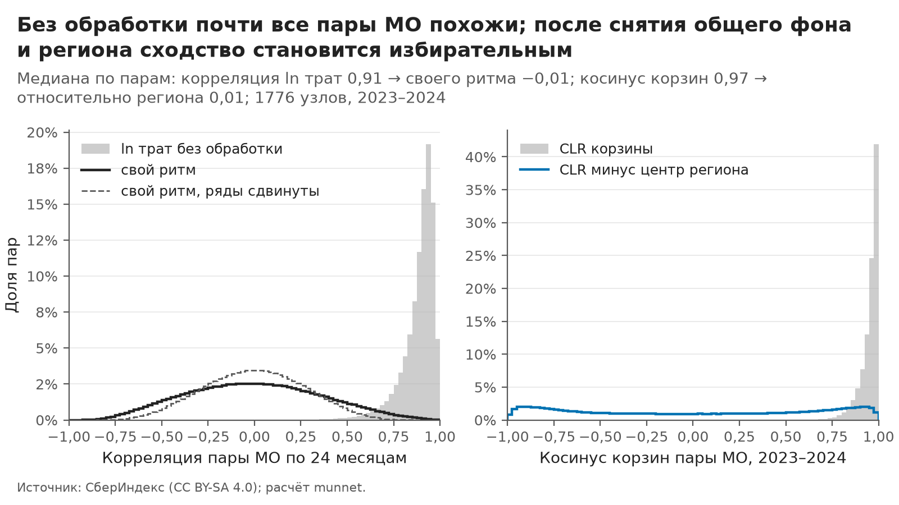
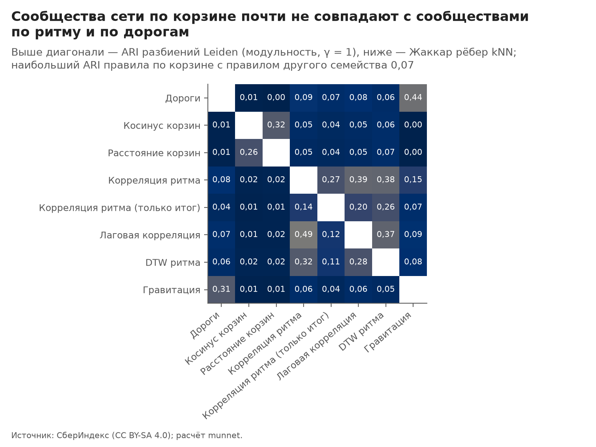
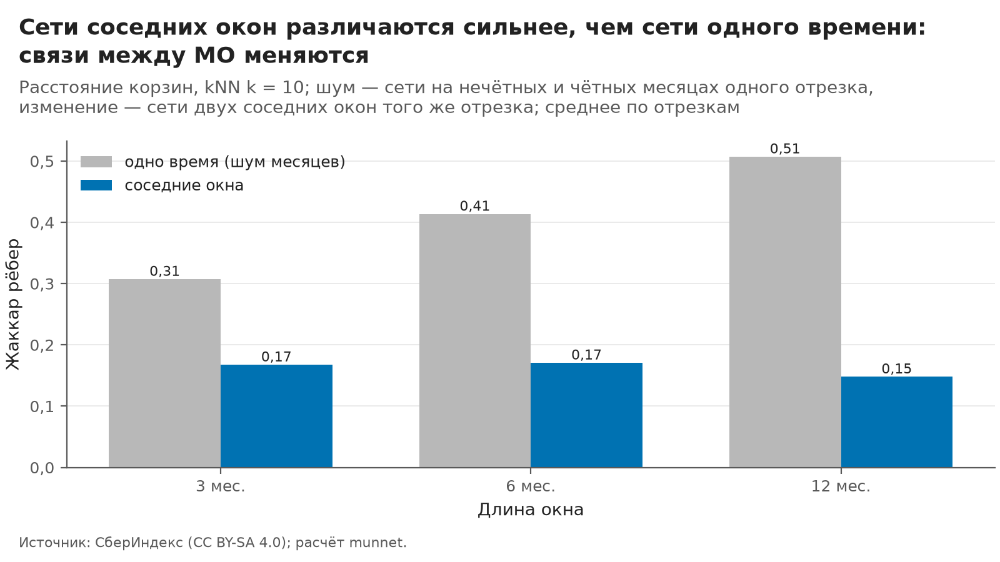

# Сеть муниципалитетов: правила рёбер, сравнение и выбор

> Собрано командой `python -m munnet network` из выходов этапа `features`. Числа — `outputs/network/report_facts.json`,
> таблицы целиком — `outputs/network/*.csv`, рёбра — `data/processed/network_*.parquet`. Руками не править:
> шаблон — `src/munnet/network/templates/network.md`, параметры — секция `network` в `configs/default.yaml`.

## Главное за минуту

- **Основное правило ребра — «Расстояние корзин»:** две территории связаны, если корзина трат их жителей одинаково отличается от корзины своего региона. Из 5 правил-кандидатов оно самое надёжное (у сетей 2023 и 2024 годов общих рёбер 0,15 по мере Жаккара при случайном уровне 0,004), почти не повторяет дороги (Жаккар с дорожной сетью 0,009) и сильнее всех согласовано с экономикой места, которая в правило не входит (средняя ассортативность 0,27). Выбор не меняется ни при одном из 24 порядков критериев и ни при одном k из 5, 10, 15, 20.
- **Без обработки похожи все:** медиана корреляции помесячных рядов пары МО 0,91, медиана косинуса корзин 0,97. После снятия общего фона (рост, декабрь) и региона — −0,01 и 0,01: сходство становится избирательным ([рис. 1](#fig-1)).
- **Свой ритм — слой, а не основа.** Корреляция, лаговая корреляция и DTW своего ритма дают сети с надёжностью 0,08, 0,05 и 0,06, с хабами и северной окраской (ассортативность по Северу 0,53 против 0,05 у корзины) — это северный ритм сюжета.
- **Чистая география — контроль:** сообщества дорожной сети повторяют регионы (AMI с группой региона 0,73), гравитация делает Москву соседом 1349 узлов из 1776.
- **Москва и Петербург.** Если районы Москвы и Петербурга с полным рядом (242) — отдельные узлы, по корзине они не слипаются в «кластер столиц»: в район того же города ведут 25,7% их рёбер, по ритму — 84,9%, по дорогам — 79,5%.
- **Сеть меняется во времени сверх шума:** у сетей 2023 и 2024 годов общих рёбер 0,15, а у двух сетей одного времени (нечётные и чётные месяцы) — 0,51. Этапу 3 передана последовательность из 13 скользящих 12-месячных окон.

## 1. Узлы и расстояния

- **Узлы** — 1776 узлов с полным рядом за 24 месяца: режим `nodes.mode: collapse`, районы Москвы и Петербурга свёрнуты в узлы-города 90077 и 90078, «относительно региона» — по группе региона (город вместе со своей областью). Ещё 169 узлов из 1945 в сеть не вошли: их ряд короче 24 месяцев (`features.min_months`); каждый с причиной — `outputs/network/excluded.csv`. Сравнение с 247 районами отдельными узлами — раздел 7.
- **Дороги** — `connection.parquet`. Автодорожная связь (`highway`) записана один раз на пару: 3 303 736 строк и столько же пар. Железнодорожная (`railway`) — в обе стороны: 2 638 628 строк на 1 319 314 пар. Пары приводятся к виду (min, max) и схлопываются до симметризации, поэтому пара в обе стороны даёт одно ребро (тест `test_railway_pair_both_directions_is_one_edge`). В расчётах только автодороги: железнодорожной связи нет у 830 МО панели. У 10 узлов нет ни одного автодорожного расстояния: в сетях географии они изоляты (`excluded.csv`, область «правила географии»). У 148 пар файла расстояние 0 (общий центр); в гравитации оно ограничено снизу.
- **Расстояние от узла-города** — среднее расстояний его районов с весами населения: ожидаемый путь случайного жителя города; с теми же весами собраны и траты узла-города. Минимум по районам (`network.city_distance: min`) приравнял бы путь до города к пути до его ближайшего района на окраине. Пары районов одного города исчезают: внутри узла рёбер нет.

## 2. Правила рёбер

Обозначения: $p_i$ — шесть долей корзины узла за окно (пять категорий и «Прочее» = «Все категории» минус сумма пяти); $g(i)$ — группа региона узла; $x^c_i(t)$ — логарифм трат категории $c$ в месяц $t$; $d_{ij}$ — дорожное расстояние, км; $P_i$ — население.

Корзина относительно региона (CLR с мультипликативной заменой долей меньше `features.clr_floor`):

$$s_i = \operatorname{clr}(p_i) - \bar c_{g(i)},\qquad \operatorname{clr}(p)_q = \ln p_q - \tfrac{1}{6}\textstyle\sum_{q'} \ln p_{q'},\qquad \bar c_g = \operatorname{mean}_{j\in g}\operatorname{clr}(p_j)$$

Свой ритм (определение разведки, одно на весь проект; `features_rhythm_monthly.own`): логарифм трат минус линейный тренд узла и общий ритм календарного месяца $m(t)$ — медиана по узлам:

$$r^c_i(t) = x^c_i(t) - a^c_i - b^c_i\,t - \operatorname{med}_j\bigl(x^c_j(t) - a^c_j - b^c_j\,t\bigr)$$

Без снятия тренда узла повторяемость профилей завышена (разведка, раздел 3), поэтому тренд снимается.

**1. Косинус корзин** (`basket_cos`; `network.rules.basket_cos`):

$$S^{\cos}_{ij} = \frac{\langle s_i, s_j\rangle}{\lVert s_i\rVert\,\lVert s_j\rVert}$$

**2. Расстояние корзин** (`basket_dist`): расстояние Эйчисона между корзинами относительно региона и гауссово ядро, $\sigma$ — медиана расстояния по парам (0,57):

$$d_{ij} = \lVert s_i - s_j\rVert,\qquad S^{d}_{ij} = \exp\bigl(-d_{ij}^2/\sigma^2\bigr)$$

**3. Корреляция ритма** (`rhythm_corr`): Пирсон по 24 месяцам, среднее по шести частям корзины (`network.rhythm_categories`) — то же, что корреляция сцепленных z-рядов; вариант `rhythm_corr_all` — только ряд «Все категории». Спирмен вместо Пирсона — проверка на выбросы:

$$S^{\rho}_{ij} = \tfrac{1}{6}\textstyle\sum_c \operatorname{corr}_t\bigl(r^c_i(t),\, r^c_j(t)\bigr)$$

**4. Лаговая корреляция** (`rhythm_lag`, $L$ = 3): корреляция на сдвиге $\ell$ — по $24 - |\ell|$ общим месяцам, сдвиг один для всех категорий пары; $\ell^* > 0$ — узел $i$ опережает $j$. Сеть неориентированная: $\rho_{ij}(\ell) = \rho_{ji}(-\ell)$, поэтому $S$ симметрично, а знак $\ell^*$ сохранён в колонке `lag` рёбер (от `source` к `target`):

$$S^{\ell}_{ij} = \max_{|\ell|\le L} \tfrac{1}{6}\textstyle\sum_c \operatorname{corr}_t\bigl(r^c_i(t),\, r^c_j(t+\ell)\bigr)$$

**5. DTW ритма** (`rhythm_dtw`, окно Сакоэ — Чибы $w$ = 2 месяца): ряды z-нормируются, путь выравнивания $\pi$ не отходит от диагонали дальше $w$; расстояние — среднее по шести частям, $\sigma_D$ = 4,92. Без окна DTW «склеивает» что угодно: пик в январе совпал бы с пиком в июле:

$$\mathrm{DTW}_w(a,b) = \min_{\pi:\ |u-v|\le w}\sqrt{\textstyle\sum_{(u,v)\in\pi}(a_u-b_v)^2},\qquad S^{D}_{ij} = \exp\bigl(-D_{ij}^2/\sigma_D^2\bigr)$$

**6. Дороги** (`geo_road`, контроль): гауссово ядро дорожного расстояния, $\sigma_R$ = 1855 км; у узла-города $C$ расстояние — среднее по районам $m$ с весами населения $w_m$:

$$S^{R}_{ij} = \exp\bigl(-d_{ij}^2/\sigma_R^2\bigr),\qquad d_{Cj} = \textstyle\sum_{m\in C} w_m\, d_{mj} \big/ \sum_{m\in C} w_m$$

**7. Гравитация** (`geo_gravity`, контроль, $\beta$ = 2,0):

$$\ln S^{G}_{ij} = \ln P_i + \ln P_j - \beta \ln \max(d_{ij},\, d_{\min})$$

Индекс доступности рынков — атрибут узла (`market_access_rel` в согласованности), а не ребро.

| Правило | Что сравнивает | Код | Смысл ребра для неспециалиста |
|---|---|---|---|
| Косинус корзин | направление отличия корзины от региона | `rules.cosine_matrix` | жители тратят деньги похоже, если сравнивать каждое МО со своим регионом: одни и те же статьи выше или ниже, чем у соседей по региону |
| Расстояние корзин | направление и силу отличия | `rules.euclid_matrix`, `rules.gaussian_similarity` | корзины двух МО почти одинаково отличаются от корзин своих регионов — и по направлению, и по силе отличия |
| Корреляция ритма | одновременные колебания | `rules.corr_multi` | траты в двух МО поднимаются и опускаются в одни и те же месяцы сверх общего для страны ритма |
| Лаговая корреляция | колебания со сдвигом до 3 месяцев | `rules.lagged_corr` | траты одного МО повторяют колебания другого, возможно, с задержкой до нескольких месяцев |
| DTW ритма | форму колебаний | `rules.dtw_matrix`, `rules.dtw_multi` | у двух МО одинаковая форма колебаний трат, даже если пики сдвинуты на месяц-два |
| Дороги | близость по дороге | `geo.node_distance_matrix` | МО близки по дороге |
| Гравитация | размер и близость | `geo.gravity_log` | между МО сильное «притяжение»: оба крупные и недалеко друг от друга |

**Разрежение** (`network.sparsify`): основное — объединение списков $k$ ближайших, $k$ = 10; проверки — взаимные $k$ ближайших и порог. У правил по рядам порог — значимость пары против нулевой модели с поправкой Бенджамини — Хохберга на все пары ($q$ = 0,05), у остальных — самые похожие пары в том же числе рёбер, что у kNN:

$$E_{kNN} = \bigl\{(i,j):\ j\in N_k(i)\ \lor\ i\in N_k(j)\bigr\},\qquad E_{mutual} = \bigl\{(i,j):\ j\in N_k(i)\ \land\ i\in N_k(j)\bigr\}$$

**Нулевая модель правил по рядам** — циклический сдвиг рядов узла на $s_i$ месяцев: автокорреляция и распределение ряда сохраняются, совпадение во времени разрушается (простая перестановка месяцев сломала бы автокорреляцию и занизила бы порог). Сдвиги, при которых сезон снова совпадает, исключены: расстояние $s_i$ до 0 и до 12 месяцев не меньше досягаемости правила $\lambda$ (лаг $L$, окно $w$, у корреляции 0) плюс запас $\gamma$ = 2. Максимум по лагам завышает сходство — в нуле он считается так же, поэтому поправка на выбор лага встроена. Нулевое распределение — 5 сдвигов всех узлов, p-значение пары эмпирическое:

$$\tilde r_i(t) = r_i\bigl((t - s_i) \bmod 24\bigr),\qquad p_{ij} = \bigl(1 + \#\{\tilde S \ge S_{ij}\}\bigr) \big/ \bigl(1 + N_0\bigr)$$

## 3. Почему не сырые ряды и не сырые корзины

*Рисунок 1. Без обработки почти все пары МО похожи; после снятия общего фона и региона сходство становится избирательным. Медиана по парам: корреляция ln трат 0,91 → своего ритма −0,01; косинус корзин 0,97 → относительно региона 0,01; 1776 узлов, 2023–2024. Источник: СберИндекс (CC BY-SA 4.0).* Данные: `outputs/network/figures/N01_signal.csv`.

- **Ряды.** Помесячные логарифмы трат почти у всех пар МО коррелируют на 0,91 (10-й перцентиль — 0,77): общий рост и декабрь делают всех похожими, и правило «корреляция рядов» без обработки строит сеть из общего фона. После снятия тренда узла и общего ритма месяца медиана — −0,01, а правый хвост длиннее, чем на сдвинутых рядах: 90-й перцентиль 0,48 против 0,36.
- **Шум коротких рядов.** Стандартная ошибка корреляции после преобразования Фишера $1/\sqrt{n-3}$ — 0,22 при 24 месяцах и 0,33 при 12; автокорреляция ещё уменьшает число независимых точек. Порог $r$ > 0,5 без поправки по ряду «Все категории» пропускает 145 704 пар МО, а на сдвинутых рядах, где связи нет, их ожидалось бы 48 701: 33,4% «рёбер» такого порога появились бы и без всякой связи. По шести частям корзины после поправки Бенджамини — Хохберга число значимых пар — 66 950.
- **Корзины.** Косинус корзин без поправки на регион у половины пар выше 0,97: у всех МО продовольствие — самая большая часть. Относительно своего региона корзины расходятся во все стороны (медиана 0,01): остаётся то, чем МО отличается от соседей по региону.

## 4. Сравнение правил: одни измерения для всех

Каждое правило даёт сеть на 24 месяцах при одном разрежении (kNN, $k$ = 10), и у каждой сети одинаковые измерения:

1. **Паспорт:** рёбра, степени, k-встречаемость $N_k(x)$ — сколько раз узел входит в чужие списки ближайших (асимметрия её распределения выдаёт хабы, Radovanović и др., 2010), коэффициент кластеризации, компоненты.
2. **Надёжность:** то же правило на месяцах 2023 и на месяцах 2024 года, Жаккар рёбер $J = |E_{2023} \cap E_{2024}| / |E_{2023} \cup E_{2024}|$; случайный уровень — Жаккар при перестановке узлов; ρ Спирмена сходств всех пар двух лет; бутстрап месяцев (20 повторов) — насколько сеть зависит от набора месяцев.
3. **Отличие от географии:** Жаккар с сетью «Дороги», доля рёбер внутри группы региона, длина ребра по прямой.
4. **Согласованность с экономикой места** — ассортативность Ньюмена по признакам, которые не входят ни в одно правило: зарплата, доля горожан, доля старших, население и доступность рынков относительно региона, доли занятости по укрупнённым разделам ОКВЭД2 минус медиана группы региона (Росстат, 2023 год); среднее по десяти признакам.
5. **Зонд кластеров:** Leiden (модульность, $\gamma$ = 1,0, без весов рёбер, 10 seed). Модульность сетей разной плотности напрямую несравнима, поэтому она сравнивается с Leiden на 10 сетях с теми же степенями и перемешанными рёбрами: в таблице — превышение над этим нулём.
6. **Время** расчёта матрицы сходства на всех парах (float32, векторно; DTW — C-версия `dtaidistance`).

| Измерение | Дороги | Косинус корзин | Расстояние корзин | Корреляция ритма | Корреляция ритма (только итог) | Лаговая корреляция | DTW ритма | Гравитация |
|---|---:|---:|---:|---:|---:|---:|---:|---:|
| Рёбер | 10 803 | 12 046 | 12 418 | 14 495 | 14 147 | 14 840 | 14 132 | 14 888 |
| Степень: медиана | 12 | 13 | 14 | 14 | 14 | 14 | 14 | 11 |
| Степень: максимум | 25 | 23 | 25 | 91 | 51 | 77 | 61 | 1349 |
| Асимметрия k-встречаемости (хабы) | 0,3 | 0,2 | 0,1 | 2,4 | 1,3 | 2,2 | 1,6 | 21,0 |
| Коэффициент кластеризации | 0,60 | 0,38 | 0,36 | 0,21 | 0,23 | 0,17 | 0,17 | 0,70 |
| Доля гигантской компоненты | 99,3% | 100,0% | 100,0% | 100,0% | 100,0% | 100,0% | 100,0% | 99,3% |
| Изолятов | 10 | 0 | 0 | 0 | 0 | 0 | 0 | 10 |
| Надёжность: Жаккар сетей 2023 и 2024 | 1 (не меняется) | 0,14 | 0,15 | 0,08 | 0,03 | 0,05 | 0,06 | 1 (не меняется) |
| То же при случайных сетях | 0,003 | 0,004 | 0,004 | 0,004 | 0,004 | 0,005 | 0,004 | 0,005 |
| ρ сходств всех пар 2023 и 2024 | 1 (не меняется) | 0,87 | 0,88 | 0,39 | 0,25 | 0,21 | 0,39 | 1 (не меняется) |
| Бутстрап месяцев: Жаккар с сетью на всех месяцах | — | 0,62 | 0,67 | 0,39 | 0,32 | — | — | — |
| Жаккар с сетью «Дороги» | 1,000 | 0,009 | 0,009 | 0,084 | 0,043 | 0,070 | 0,059 | 0,314 |
| Рёбер внутри группы региона | 76,7% | 3,0% | 3,1% | 25,7% | 15,1% | 21,0% | 18,8% | 45,1% |
| Ассортативность по группе региона | 0,76 | 0,01 | 0,01 | 0,24 | 0,13 | 0,19 | 0,17 | 0,44 |
| Длина ребра, медиана, км | 78 | 1413 | 1380 | 483 | 783 | 633 | 672 | 160 |
| Согласованность с экономикой места | 0,07 | 0,25 | 0,27 | 0,22 | 0,17 | 0,19 | 0,21 | −0,12 |
| Ассортативность по Северу | 0,87 | 0,03 | 0,05 | 0,53 | 0,40 | 0,43 | 0,46 | 0,49 |
| Модульность сверх нуля с теми же степенями | 0,61 | 0,48 | 0,47 | 0,36 | 0,40 | 0,31 | 0,33 | 0,47 |
| Сообществ Leiden | 36 | 12 | 11 | 7 | 9 | 10 | 8 | 21 |
| ARI разбиений разных seed | 0,72 | 0,59 | 0,57 | 0,52 | 0,63 | 0,59 | 0,54 | 0,71 |
| AMI сообществ с группой региона | 0,73 | 0,02 | 0,01 | 0,26 | 0,18 | 0,22 | 0,21 | 0,62 |
| Рёбер kNN, значимых после поправки | — | — | — | 74,2% | 52,6% | 43,7% | 81,0% | — |
| Время расчёта матрицы | < 1 с | < 1 с | < 1 с | < 1 с | < 1 с | < 1 с | 1–10 с | < 1 с |

*Рисунок 2. Расстояние корзин относительно региона — самая надёжная сеть и почти не повторяет дороги. Жаккар рёбер kNN (k = 10) сетей 2023 и 2024 годов против доли рёбер, общих с сетью «Дороги»; случайный уровень Жаккара ≈ 0,004; размер точки — согласованность с экономикой места (от 0,17 до 0,27). Источник: СберИндекс (CC BY-SA 4.0).* Данные: `outputs/network/figures/N02_pareto.csv`.

**Что видно.**

- Правила по корзине надёжнее правил по ритму: 0,15 и 0,14 против 0,08 у корреляции ритма; ρ сходств всех пар 2023 и 2024 годов — 0,88 против 0,39. Абсолютный Жаккар невелик, потому что десять ближайших из 1776 в шестимерном пространстве сдвигаются от малых изменений; это в 38 раз выше случайного уровня.
- Среднее по шести частям корзины надёжнее одного ряда «Все категории» (0,08 против 0,03), поэтому правила по ритму считаются по шести частям. Лаги и DTW надёжность не добавляют: 0,05 и 0,06.
- Корзина относительно региона почти не видит географию: внутри группы региона 3,1% рёбер, медианная длина ребра 1380 км, AMI сообществ с группой региона 0,01. У ритма внутри региона 25,7% рёбер и AMI 0,26, у дорог — 76,7% и 0,73.
- Хабов у корзины нет (асимметрия k-встречаемости 0,1, наибольшая степень 25). У ритма есть: асимметрия 2,4, наибольшая степень 91; чаще всех в чужих списках ближайших (сколько раз) — Дзержинский муниципальный район (Калужская область) — 89; Грязовецкий муниципальный округ (Вологодская область) — 88; Собинский муниципальный район (Владимирская область) — 72. У гравитации хаб — Москва: Москва (Москва) — 1349; Санкт-Петербург (Санкт-Петербург) — 407; городской округ город Казань (Республика Татарстан) — 395.
- **Узлы-города не получают завышенных рёбер.** Ряд узла-города — среднее 101–146 районов, он глаже, и корреляции с ним могли бы быть выше. Степень Москвы и Петербурга в сети корзины 10 и 13, в сети ритма 13 и 17 при медиане 14 и 14.
- Сети корреляции ритма по Пирсону и по Спирмену делят 0,60 рёбер по Жаккару: выбросы меняют часть рёбер, но меньше, чем смена года. Бутстрап месяцев: сеть корзины на бутстрап-выборках месяцев сохраняет 0,67 рёбер по Жаккару, сеть ритма — 0,39.
- Правила по рядам: после поправки значимы 74,2% рёбер kNN корреляции ритма, 43,7% — лаговой корреляции, 81,0% — DTW; остальные рёбра kNN у них — «ближайшие из незначимых».

**Согласованность с экономикой места** — ассортативность по каждому признаку (больше нуля — связанные узлы похожи):

| Признак места | Дороги | Косинус корзин | Расстояние корзин | Корреляция ритма | Корреляция ритма (только итог) | Лаговая корреляция | DTW ритма | Гравитация |
|---|---:|---:|---:|---:|---:|---:|---:|---:|
| Зарплата относительно региона | 0,14 | 0,31 | 0,35 | 0,25 | 0,21 | 0,21 | 0,24 | −0,21 |
| Доля горожан относительно региона | 0,11 | 0,32 | 0,33 | 0,36 | 0,24 | 0,30 | 0,32 | −0,09 |
| Доля старших относительно региона | 0,07 | 0,30 | 0,31 | 0,16 | 0,12 | 0,14 | 0,15 | −0,08 |
| Население относительно региона | 0,03 | 0,58 | 0,68 | 0,50 | 0,42 | 0,45 | 0,53 | −0,44 |
| Доступность рынков относительно региона | 0,08 | 0,14 | 0,17 | 0,18 | 0,14 | 0,16 | 0,16 | −0,05 |
| Занятость: сельское хозяйство и добыча | 0,07 | 0,04 | 0,03 | 0,08 | 0,06 | 0,07 | 0,08 | 0,00 |
| Занятость: промышленность | 0,08 | 0,31 | 0,32 | 0,26 | 0,19 | 0,20 | 0,24 | 0,00 |
| Занятость: стройка, торговля, транспорт | 0,05 | 0,12 | 0,13 | 0,12 | 0,11 | 0,10 | 0,13 | −0,06 |
| Занятость: рыночные услуги | 0,02 | 0,09 | 0,10 | 0,11 | 0,06 | 0,09 | 0,12 | −0,19 |
| Занятость: бюджетный сектор | 0,09 | 0,24 | 0,27 | 0,18 | 0,14 | 0,15 | 0,17 | −0,04 |
| Север (севернее 60°) | 0,87 | 0,03 | 0,05 | 0,53 | 0,40 | 0,43 | 0,46 | 0,49 |

Сильнее всего рёбра корзины связывают МО похожего размера относительно своего региона (ассортативность 0,68), затем — по зарплате, доле горожан и доле промышленности: территории с одинаковым отличием корзины от региона похожи и по экономике места, хотя она в правило не входит. Рёбра дорог связывают по Северу (0,87), но почти не по экономике места (0,07); у гравитации согласованность отрицательна (−0,12): крупный центр связан с малыми соседями.

### Чувствительность к k

| Правило | k | Рёбер | Надёжность | Жаккар с дорогами | Согласованность с местом | Асимметрия k-встречаемости | Модульность сверх нуля | AMI с регионом | ARI с разбиением при k основном |
|---|---:|---:|---:|---:|---:|---:|---:|---:|---:|
| Дороги | 5 | 5511 | 1,00 | 1,000 | 0,12 | 0,5 | 0,49 | 0,75 | 0,61 |
| Дороги | 10 | 10 803 | 1,00 | 1,000 | 0,07 | 0,3 | 0,61 | 0,74 | 0,79 |
| Дороги | 15 | 16 071 | 1,00 | 1,000 | 0,05 | 0,1 | 0,65 | 0,72 | 0,59 |
| Дороги | 20 | 21 344 | 1,00 | 1,000 | 0,04 | −0,1 | 0,66 | 0,69 | 0,49 |
| Косинус корзин | 5 | 6007 | 0,10 | 0,007 | 0,25 | 0,3 | 0,40 | 0,02 | 0,46 |
| Косинус корзин | 10 | 12 046 | 0,14 | 0,009 | 0,25 | 0,2 | 0,48 | 0,02 | 1,00 |
| Косинус корзин | 15 | 18 079 | 0,17 | 0,011 | 0,24 | 0,1 | 0,50 | 0,01 | 0,71 |
| Косинус корзин | 20 | 24 183 | 0,19 | 0,013 | 0,24 | 0,1 | 0,51 | 0,01 | 0,59 |
| Расстояние корзин | 5 | 6262 | 0,11 | 0,007 | 0,28 | 0,2 | 0,40 | 0,01 | 0,45 |
| Расстояние корзин | 10 | 12 418 | 0,15 | 0,009 | 0,27 | 0,1 | 0,47 | 0,01 | 0,60 |
| Расстояние корзин | 15 | 18 543 | 0,18 | 0,011 | 0,27 | 0,0 | 0,50 | 0,01 | 0,63 |
| Расстояние корзин | 20 | 24 717 | 0,20 | 0,013 | 0,26 | 0,0 | 0,51 | 0,01 | 0,54 |
| Корреляция ритма | 5 | 7421 | 0,07 | 0,071 | 0,25 | 2,6 | 0,31 | 0,30 | 0,41 |
| Корреляция ритма | 10 | 14 495 | 0,08 | 0,084 | 0,22 | 2,4 | 0,36 | 0,26 | 0,50 |
| Корреляция ритма | 15 | 21 392 | 0,09 | 0,090 | 0,20 | 2,3 | 0,37 | 0,27 | 0,65 |
| Корреляция ритма | 20 | 28 242 | 0,10 | 0,095 | 0,20 | 2,1 | 0,37 | 0,28 | 0,54 |
| Корреляция ритма (только итог) | 5 | 7250 | 0,02 | 0,034 | 0,18 | 1,4 | 0,33 | 0,20 | 0,50 |
| Корреляция ритма (только итог) | 10 | 14 147 | 0,03 | 0,043 | 0,17 | 1,3 | 0,40 | 0,19 | 0,68 |
| Корреляция ритма (только итог) | 15 | 20 929 | 0,04 | 0,049 | 0,16 | 1,3 | 0,43 | 0,16 | 0,66 |
| Корреляция ритма (только итог) | 20 | 27 671 | 0,04 | 0,055 | 0,15 | 1,3 | 0,44 | 0,16 | 0,63 |
| Лаговая корреляция | 5 | 7571 | 0,05 | 0,060 | 0,21 | 2,6 | 0,27 | 0,24 | 0,54 |
| Лаговая корреляция | 10 | 14 840 | 0,05 | 0,070 | 0,19 | 2,2 | 0,31 | 0,22 | 1,00 |
| Лаговая корреляция | 15 | 21 935 | 0,06 | 0,074 | 0,17 | 2,2 | 0,32 | 0,20 | 0,54 |
| Лаговая корреляция | 20 | 28 988 | 0,06 | 0,076 | 0,16 | 2,0 | 0,33 | 0,18 | 0,51 |
| DTW ритма | 5 | 7295 | 0,05 | 0,051 | 0,23 | 1,7 | 0,27 | 0,22 | 0,50 |
| DTW ритма | 10 | 14 132 | 0,06 | 0,059 | 0,21 | 1,6 | 0,33 | 0,21 | 0,76 |
| DTW ритма | 15 | 20 860 | 0,07 | 0,065 | 0,20 | 1,5 | 0,35 | 0,17 | 0,58 |
| DTW ритма | 20 | 27 410 | 0,08 | 0,070 | 0,19 | 1,5 | 0,36 | 0,16 | 0,50 |
| Гравитация | 5 | 7619 | 1,00 | 0,288 | −0,13 | 26,7 | 0,41 | 0,66 | 0,61 |
| Гравитация | 10 | 14 888 | 1,00 | 0,314 | −0,12 | 21,0 | 0,46 | 0,61 | 0,74 |
| Гравитация | 15 | 22 267 | 1,00 | 0,317 | −0,12 | 15,6 | 0,48 | 0,62 | 0,74 |
| Гравитация | 20 | 29 460 | 1,00 | 0,320 | −0,12 | 12,8 | 0,49 | 0,60 | 0,62 |

Правило, выбранное при $k$ = 10, выбирается тем же способом при 4 из 4 значений k (`outputs/network/selection_by_k.csv`). С ростом k надёжность растёт у всех правил (больше рёбер — больше совпадений), а асимметрия k-встречаемости у ритма остаётся высокой: хабы — свойство правила, а не выбора k.

### Способ разрежения

| Правило | Разрежение | Рёбер | Гигантская компонента | Изолятов | Степень: максимум | Внутри региона | Согласованность с местом | Надёжность |
|---|---:|---:|---:|---:|---:|---:|---:|---:|
| Дороги | kNN (объединение) | 10 803 | 99,3% | 10 | 25 | 76,7% | 0,07 | 1,00 |
| Дороги | взаимный kNN | 6839 | 87,4% | 11 | 10 | 81,5% | 0,11 | 1,00 |
| Дороги | порог | 10 812 | 79,2% | 101 | 54 | 72,4% | 0,06 | 1,00 |
| Косинус корзин | kNN (объединение) | 12 046 | 100,0% | 0 | 23 | 3,0% | 0,25 | 0,14 |
| Косинус корзин | взаимный kNN | 5714 | 99,8% | 4 | 10 | 3,2% | 0,26 | 0,10 |
| Косинус корзин | порог | 12 046 | 30,8% | 490 | 126 | 2,8% | 0,31 | 0,32 |
| Расстояние корзин | kNN (объединение) | 12 418 | 100,0% | 0 | 25 | 3,1% | 0,27 | 0,15 |
| Расстояние корзин | взаимный kNN | 5342 | 96,8% | 33 | 10 | 3,5% | 0,29 | 0,10 |
| Расстояние корзин | порог | 12 418 | 83,4% | 239 | 68 | 3,1% | 0,21 | 0,17 |
| Корреляция ритма | kNN (объединение) | 14 495 | 100,0% | 0 | 91 | 25,7% | 0,22 | 0,08 |
| Корреляция ритма | взаимный kNN | 3265 | 83,9% | 217 | 10 | 43,4% | 0,30 | 0,08 |
| Корреляция ритма | порог | 66 950 | 92,2% | 131 | 354 | 8,1% | 0,10 | 0,18 |
| Корреляция ритма (только итог) | kNN (объединение) | 14 147 | 100,0% | 0 | 51 | 15,1% | 0,17 | 0,03 |
| Корреляция ритма (только итог) | взаимный kNN | 3613 | 92,2% | 119 | 10 | 24,0% | 0,22 | 0,02 |
| Корреляция ритма (только итог) | порог | 29 494 | 75,0% | 407 | 231 | 9,4% | 0,10 | 0,01 |
| Лаговая корреляция | kNN (объединение) | 14 840 | 100,0% | 0 | 77 | 21,0% | 0,19 | 0,05 |
| Лаговая корреляция | взаимный kNN | 2920 | 81,0% | 254 | 10 | 40,0% | 0,30 | 0,06 |
| Лаговая корреляция | порог | 39 354 | 63,2% | 616 | 299 | 8,3% | 0,07 | 0,10 |
| DTW ритма | kNN (объединение) | 14 132 | 100,0% | 0 | 61 | 18,8% | 0,21 | 0,06 |
| DTW ритма | взаимный kNN | 3628 | 90,3% | 144 | 10 | 29,7% | 0,26 | 0,05 |
| DTW ритма | порог | 61 640 | 96,6% | 59 | 329 | 7,2% | 0,13 | 0,11 |
| Гравитация | kNN (объединение) | 14 888 | 99,3% | 10 | 1349 | 45,1% | −0,12 | 1,00 |
| Гравитация | взаимный kNN | 2754 | 31,9% | 205 | 10 | 87,5% | 0,19 | 1,00 |
| Гравитация | порог | 14 888 | 83,3% | 214 | 1058 | 36,6% | −0,03 | 1,00 |

- **Порог** по одному квантилю для всей страны у корзины оставляет 490 изолятов (косинус) и 239 (расстояние), а гигантская компонента — 30,8% и 83,4% узлов: рёбра собираются вокруг узлов с самыми крайними корзинами. У ритма порог значимости даёт 66 950 рёбер и узлы со степенью до 354.
- **Взаимный kNN** убирает хабы, но оставляет изоляты (33 у корзины, 217 у ритма) и снижает надёжность корзины до 0,10.
- **Объединение kNN** — основное: у каждого узла не меньше k соседей, изолятов нет, степень ограничена сверху примерно 2k (у корзины наибольшая — 25); все узлы попадают в разбиение этапа 3.

### Сети разных правил между собой

| Правило А | Правило Б | Жаккар рёбер | ρ сходств пар | p (Мантел) | ARI сообществ |
|---|---:|---:|---:|---:|---:|
| Дороги | Косинус корзин | 0,01 | 0,00 | 0,70 | 0,01 |
| Дороги | Расстояние корзин | 0,01 | 0,04 | 0,02 | 0,00 |
| Дороги | Корреляция ритма | 0,08 | 0,14 | 0,02 | 0,09 |
| Дороги | Корреляция ритма (только итог) | 0,04 | 0,12 | 0,02 | 0,07 |
| Дороги | Лаговая корреляция | 0,07 | 0,06 | 0,02 | 0,08 |
| Дороги | DTW ритма | 0,06 | 0,11 | 0,02 | 0,06 |
| Дороги | Гравитация | 0,31 | 0,80 | 0,02 | 0,44 |
| Косинус корзин | Расстояние корзин | 0,26 | 0,67 | 0,02 | 0,32 |
| Косинус корзин | Корреляция ритма | 0,02 | 0,28 | 0,02 | 0,05 |
| Косинус корзин | Корреляция ритма (только итог) | 0,01 | 0,17 | 0,02 | 0,04 |
| Косинус корзин | Лаговая корреляция | 0,01 | 0,18 | 0,02 | 0,05 |
| Косинус корзин | DTW ритма | 0,02 | 0,27 | 0,02 | 0,06 |
| Косинус корзин | Гравитация | 0,01 | −0,04 | 0,02 | 0,00 |
| Расстояние корзин | Корреляция ритма | 0,02 | 0,23 | 0,02 | 0,05 |
| Расстояние корзин | Корреляция ритма (только итог) | 0,01 | 0,14 | 0,02 | 0,04 |
| Расстояние корзин | Лаговая корреляция | 0,02 | 0,14 | 0,02 | 0,05 |
| Расстояние корзин | DTW ритма | 0,02 | 0,24 | 0,02 | 0,07 |
| Расстояние корзин | Гравитация | 0,01 | −0,04 | 0,02 | 0,00 |
| Корреляция ритма | Корреляция ритма (только итог) | 0,14 | 0,75 | 0,02 | 0,27 |
| Корреляция ритма | Лаговая корреляция | 0,49 | 0,66 | 0,02 | 0,39 |
| Корреляция ритма | DTW ритма | 0,32 | 0,90 | 0,02 | 0,38 |
| Корреляция ритма | Гравитация | 0,06 | 0,05 | 0,02 | 0,15 |
| Корреляция ритма (только итог) | Лаговая корреляция | 0,12 | 0,53 | 0,02 | 0,20 |
| Корреляция ритма (только итог) | DTW ритма | 0,11 | 0,70 | 0,02 | 0,26 |
| Корреляция ритма (только итог) | Гравитация | 0,04 | 0,07 | 0,02 | 0,07 |
| Лаговая корреляция | DTW ритма | 0,28 | 0,67 | 0,02 | 0,37 |
| Лаговая корреляция | Гравитация | 0,06 | 0,07 | 0,02 | 0,09 |
| DTW ритма | Гравитация | 0,05 | −0,02 | 0,02 | 0,08 |

*Рисунок 3. Сообщества сети по корзине почти не совпадают с сообществами по ритму и по дорогам. Выше диагонали — ARI разбиений Leiden (модульность, γ = 1), ниже — Жаккар рёбер kNN; наибольший ARI правила по корзине с правилом другого семейства 0,07. Источник: СберИндекс (CC BY-SA 4.0).* Данные: `outputs/network/figures/N03_ari.csv`.

Ранговая корреляция сходств всех пар проверена перестановкой узлов (тест Мантела, 49 перестановок, наименьшее возможное p = 0,02); значимы 27 из 28 пар правил. Семейства почти не пересекаются: у расстояния корзин с корреляцией ритма общих рёбер 0,02, ARI сообществ 0,05; с дорогами — 0,01 и 0,00. Внутри семейств совпадение выше: косинус и расстояние корзин — 0,26 рёбер и ARI 0,32, корреляция и лаговая корреляция ритма — 0,49 и 0,39. Значит, **выбор правила определяет, какие типы получатся**: кластеры по корзине и по ритму — разные разбиения страны, а не два взгляда на одно.

## 5. Выбор основного правила

Критерии и их порядок объявлены до расчёта (27.09.2026, `network.selection` в конфиге): 1) надёжность — Жаккар сетей 2023 и 2024 годов; 2) отличие от географии — 1 − Жаккар с сетью «Дороги»; 3) согласованность с экономикой места; 4) простота — ранг, заданный заранее (косинус, расстояние и корреляция — 1, лаги — 2, DTW — 3). Кандидаты — 5 правил по тратам; дороги и гравитация — контроль. Правило выбора: Парето-фронт по четырём критериям, на фронте — первый по объявленному порядку.

| Правило | Надёжность | Отличие от географии | Согласованность с местом | Простота (ранг) |
|---|---:|---:|---:|---:|
| Косинус корзин | 0,14 | 0,991 | 0,25 | 1 |
| Расстояние корзин | 0,15 | 0,991 | 0,27 | 1 |
| Корреляция ритма | 0,08 | 0,916 | 0,22 | 1 |
| Лаговая корреляция | 0,05 | 0,930 | 0,19 | 2 |
| DTW ритма | 0,06 | 0,941 | 0,21 | 3 |

- **Парето-фронт** — «Расстояние корзин»: оно не хуже остальных по всем четырём критериям и лучше хотя бы по одному. Выбрано «Расстояние корзин».
- **Чувствительность выбора:** тот же результат при всех 24 из 24 порядков критериев (`selection_orders.csv`), по сумме рангов (Борда) — «Расстояние корзин», при каждом k из 5, 10, 15, 20.
- **Косинус или расстояние.** Разница в надёжности невелика, поэтому она проверена парным бутстрапом: на одних и тех же 20 выборках месяцев расстояние надёжнее косинуса в 100,0% повторов (медианная разница 0,011). Содержательная причина: косинус видит только направление отличия от региона, а у МО, типичных для своего региона, вектор $s_i$ короткий и его направление — шум; расстояние считает такие МО похожими друг на друга, и типичная территория получает типичных соседей.
- **Альтернативы для проверки устойчивости выводов** — «Корреляция ритма», «Дороги»: лучший кандидат другого семейства (слой северного ритма) и контроль географии. Их рёбра при всех k и способах разрежения — в `network_edges.parquet`.

## 6. Как правило ребра меняет сеть и кластеры

- **Корзина относительно региона** связывает территории через всю страну (медианное ребро 1380 км, внутри региона 3,1% рёбер): регион из правила вычтен, поэтому кластеры будут типами «как тратят относительно своего региона», а не картой регионов. Сеть без хабов, кластеризация 0,36, модульность сверх нуля 0,47; сообществ зонда — 11.
- **Свой ритм** связывает соседей чаще (25,7% рёбер внутри региона), северные МО друг с другом, и порождает хабы: кластеры по ритму выделят северный ритм и сгустки вокруг МО-хабов. Поэтому ритм — слой (атрибут или отдельная сеть), а не основа типологии.
- **Дороги** дают плотные локальные клубки (кластеризация 0,60, 36 сообществ): кластеры по ним — регионы и их части. **Гравитация** стягивает всё к крупнейшим городам.
- **Двойной счёт.** Если на этапе 3 признаки узла — та же корзина относительно региона, что и рёбра, один сигнал войдёт в кластеризацию дважды. Разведение: рёбра — корзина, атрибуты — экономика места (занятость, зарплата, урбанизация, возраст, доступность рынков, Север) и ритм; или, если в атрибутах корзина, рёбра — альтернативная сеть (ритм или дороги). Решение — за этапом 3; числа согласованности выше показывают, что корзина и экономика места — разные, но связанные сигналы.

## 7. Москва и Петербург: два узла или районы отдельно

| Измерение | Расстояние корзин | Корреляция ритма | Дороги |
|---|---:|---:|---:|
| Узлов сети | 2016 | 2016 | 2016 |
| Из них районов Москвы и Петербурга | 242 | 242 | 242 |
| Рёбер | 14 192 | 16 606 | 12 481 |
| Рёбер районов, ведущих в район того же города | 25,7% | 84,9% | 79,5% |
| Степень районов, медиана | 15 | 14 | 14 |
| Степень остальных узлов, медиана | 14 | 14 | 12 |
| Сообществ, по которым разошлись районы Москвы | 7 | 4 | 2 |
| Доля районов Москвы в самом частом их сообществе | 31,2% | 88,2% | 62,5% |
| Сообществ, по которым разошлись районы Петербурга | 5 | 1 | 1 |
| Доля районов Петербурга в самом частом их сообществе | 35,7% | 100,0% | 100,0% |
| Жаккар рёбер с основным режимом на общих узлах | 0,92 | 0,77 | 0,98 |
| ARI сообществ с основным режимом на общих узлах | 0,47 | 0,65 | 0,61 |
| Степень узла-города Москва в основном режиме | 10 | 13 | 18 |
| Степень узла-города Петербург в основном режиме | 13 | 17 | 18 |

- В режиме `separate` полный ряд у 242 районов из 247, и сеть строится на 2016 узлах. «Относительно региона» для районов в этом режиме — относительно своего города (группа региона — сам город).
- По корзине районы не слипаются: в район того же города ведут 25,7% их рёбер, районы Москвы разошлись по 7 сообществам. По ритму — наоборот: 84,9% рёбер внутри города, районы Петербурга — в 1 сообществе: районы живут в общем городском ритме. По дорогам — 79,5%.
- На остальных узлах сеть корзины почти не меняется: Жаккар рёбер с основным режимом 0,92, ARI сообществ 0,47 при ARI разных seed одного режима 0,57.
- **Вывод для требования организаторов о влиянии правила на структуру:** при правилах по ритму и дорогам районы создали бы «кластер столиц» из почти одинаковых узлов, при корзине — нет, но они заняли бы 12,0% узлов сети. Основной режим — два узла-города; режим `separate` — проверка чувствительности.

## 8. Динамическая сеть

Для выбранного правила сеть строится в каждом окне теми же правилом и разрежением. Сравнены кварталы, полугодия и скользящие 12 месяцев с шагом 1 (`dynamics.window_months`, `dynamics.step_months`).

| Окна | Число окон | Жаккар соседних окон: среднее | минимум | максимум |
|---|---:|---:|---:|---:|
| кварталы | 8 | 0,18 | 0,15 | 0,20 |
| полугодия | 4 | 0,18 | 0,16 | 0,18 |
| скользящие 12 месяцев, шаг 1 | 13 | 0,73 | 0,72 | 0,75 |

**Шум против изменения.** Чтобы отделить изменение сети от шума месяцев, для окна длиной $L$ берётся отрезок $2L$ месяцев: сети на нечётных и чётных месяцах отрезка описывают одно время (их различие — шум), сети первой и второй половины — два соседних окна (шум плюс изменение).

| Окно, мес. | Отрезок | Жаккар: нечётные и чётные месяцы (шум) | Жаккар: два соседних окна | ρ сходств: шум | ρ сходств: соседние окна |
|---|---:|---:|---:|---:|---:|
| 3 | 2023-01–2023-06 | 0,31 | 0,15 | 0,96 | 0,88 |
| 3 | 2023-07–2023-12 | 0,30 | 0,17 | 0,96 | 0,90 |
| 3 | 2024-01–2024-06 | 0,32 | 0,18 | 0,97 | 0,91 |
| 3 | 2024-07–2024-12 | 0,30 | 0,18 | 0,96 | 0,91 |
| 6 | 2023-01–2023-12 | 0,41 | 0,16 | 0,98 | 0,89 |
| 6 | 2024-01–2024-12 | 0,42 | 0,18 | 0,98 | 0,91 |
| 12 | 2023-01–2024-12 | 0,51 | 0,15 | 0,99 | 0,88 |

*Рисунок 4. Сети соседних окон различаются сильнее, чем сети одного времени: связи между МО меняются. Расстояние корзин, kNN k = 10; шум — сети на нечётных и чётных месяцах одного отрезка, изменение — сети двух соседних окон того же отрезка; среднее по отрезкам. Источник: СберИндекс (CC BY-SA 4.0).* Данные: `outputs/network/figures/N04_windows.csv`.

- При любой длине окна у соседних окон общих рёбер меньше, чем у двух сетей одного времени: для годовых окон 0,15 против 0,51, для кварталов 0,17 против 0,31. Связи между МО меняются сверх шума — это и есть материал для переходов типов на этапе 3.
- **Основная последовательность — скользящие 12 месяцев** (13 окон): в каждом окне все календарные месяцы, поэтому сезонный состав корзины (декабрьские маркетплейсы, летний общепит) не смешивается со сдвигом типов; сеть окна так же надёжна, как годовая. Соседние скользящие окна делят 11 месяцев из 12, и их Жаккар 0,73 высок по построению: изменение надо сравнивать между непересекающимися окнами (первое и последнее окно — 2023 и 2024 годы). Кварталы (8 окон) и полугодия (4) — проверка: сеть квартала шумнее (Жаккар двух сетей одного времени 0,31), а сезон у соседних окон разный.

## 9. Ограничения

- **Два года.** Надёжность «2023 против 2024» включает настоящее изменение корзин (сдвиг к маркетплейсам), поэтому она занижена одинаково для всех правил; сравнение правил от этого не зависит, абсолютные числа — нижняя оценка.
- **Зонд Leiden — не кластеризация.** Разбиения разных seed совпадают на ARI 0,57 (корзина): зонд нужен для сравнения правил одной меркой, число и состав типов выбирает этап 3.
- **Нулевая модель по парам общая:** p-значение пары берётся из распределения всех сдвинутых пар, то есть пары считаются взаимозаменяемыми; у МО с очень гладким или очень шумным рядом собственный нуль был бы другим.
- **Бутстрап месяцев смещён вниз:** повторённые месяцы добавляют шум, поэтому бутстрап используется для сравнения правил между собой (парно) и устойчивости сети, а не как доверительный интервал надёжности.
- **Согласованность — связь, а не причина.** Признаки места — Росстат за 2023 год без малого бизнеса, по месту работодателя; для узлов-городов — свёрнутые районы.
- **Данные** — безналичные траты по картам одного банка (оценка модели СберИндекса), 77 регионов; траты приезжих не видны.

## 10. Выходы и запуск

Запуск: `uv run --frozen python -m munnet network` (после `panel features`); временный конфиг и повторный прогон — как в `docs/agents.md`. Время — несколько минут на обычном ноутбуке, случайность — от `seed` конфига.

| Файл | Строка | Колонки |
|---|---|---|
| `data/processed/network_edges.parquet` | ребро правила при разрежении | `rule`, `sparsify`, `k`, `source` < `target` (`territory_id`), `weight` = $S_{ij}$, `lag` (лаговое правило: $\ell^*$ от `source` к `target`), `q_value` (правила по рядам), `same_region`, `dist_km`, `is_main` |
| `data/processed/network_windows.parquet` | ребро выбранного правила в окне | `rule`, `window_kind` (`quarter`, `half`, `rolling`), `window`, `n_months`, `source`, `target`, `weight`, `is_main_kind` |
| `data/processed/network_window_nodes.parquet` | узел в окне | `window_kind`, `window`, `territory_id`, `n_months`, `first_date`, `last_date`, `clr_rel_*` — корзина относительно группы региона |
| `data/processed/network_nodes.parquet` | узел × правило | `degree`, `kocc`, `community` (зонд Leiden), `is_city_node` |
| `outputs/network/comparison.csv` | правило | все измерения раздела 4; `attributes.csv`, `sensitivity_k.csv`, `sparsify.csv`, `rule_pairs.csv`, `selection_*.csv`, `reliability_bootstrap.csv`, `modes.csv`, `windows*.csv`, `excluded.csv` |

Время расчёта на 1776 узлах — в таблице раздела 4 (`timing.csv` — секунды; это единственный файл, который меняется от прогона к прогону).
