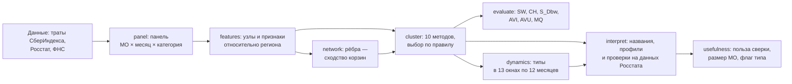

# Корзина и регион: типы муниципальных образований по тратам жителей. Методологический отчёт

Отчёт для жюри конкурса СберИндекса 2026, направление «Кластеризация». Корзина трат — то, как траты жителей муниципального образования (МО) делятся между продуктами, кафе и ресторанами, маркетплейсами, транспортом, здоровьем и прочими покупками. Продукты и кафе с ресторанами — это категории «Продовольствие» и «Общественное питание» в данных СберИндекса (дальше — продукты и общепит). МО связаны в сеть по сходству корзин.

## 1. Главный вывод: четыре типа МО идут друг за другом вдоль одной оси — доли кафе и ресторанов в тратах относительно своего региона

**Вопрос.** Чем различаются муниципальные образования, если смотреть, на что тратят деньги их жители, и сравнивать каждое МО со своим регионом? Говорит ли такое деление что-нибудь об экономике места?

**Ответ в трёх пунктах.**

1. Четыре типа МО идут друг за другом вдоль одной оси — доли кафе и ресторанов в тратах относительно своего региона. На одном краю — сельские районы, где корзина сдвинута к продуктам и маркетплейсам, на другом — крупные города. Вместе с осью растут размер МО и уровень трат, то есть насколько жители тратят больше или меньше, чем в среднем по МО своего региона. По уровню трат и экономике места (зарплата, занятость, население и другие признаки) чётких границ между типами нет (разделы 6 и 9). Мера таких границ — силуэт — равна 0,007 по шкале от −1 до 1; 0 значит, что МО одинаково близко к своему и соседнему типу.
2. По составу типы близки к простому делению МО по уровню трат: совпадение разбиений — 0,31 по шкале AMI, где 0 — совпадение как у случайных разбиений, 1 — полное совпадение.
3. **Практический совет аналитику региона и журналисту.** Изменения оборота и доходов небольшого или среднего МО (меньше 53,5 тыс. жителей, это четыре пятых МО) сверяйте со своим регионом. До 10 ближайших по расстоянию МО того же региона (дальше — соседи по региону) ближе к настоящему изменению, чем похожие по корзине МО других регионов, в 56,3% случаев. При равной точности было бы 50%. У самых крупных МО (53,5 тыс. жителей и больше) оба ориентира почти равны: свой регион ближе в 50,7% случаев. Смотрите на оба ориентира: какой из них лучше, данные не показывают.

**Зачем сверять.** Если изменение показателя МО далеко от обоих ориентиров, это повод проверить данные или искать местную причину. Так вышло с общепитом Октябрьского района: оборот на жителя вырос на 107%, у соседей по региону — на 2%, у похожих по корзине — на 5%. Ошибка обоих ориентиров здесь больше, чем у 93–94% из 481 небольшого и среднего МО, где известны все три показателя (приложение Г.4).

**Почему верить.** Правила проверок и тексты выводов на каждый исход мы записали в репозиторий до расчёта самих проверок, поэтому подогнать пороги и тексты под итог проверок было нельзя. Проверки смысла типов мы записали, когда сами типы и их смены уже были посчитаны; что мы тогда знали, перечислено в ключе `interpret.seen_before`, и эти числа подтверждением не считаются. Прогон с нуля в чистой копии репозитория повторил все таблицы и рисунки до байта, кроме замеров времени. Подробности — список «Почему этому можно верить» ниже, перед таблицей шести проверок.

**Откуда числа совета.** Проценты — среднее по трём показателям за 2023 → 2024: обороту общепита, отгрузке товаров собственного производства (Росстат, без малого бизнеса) и доходам по налоговой отчётности 5-НДФЛ. 95% интервалы — 53,5–59,3% у небольших и средних МО и 45,5–55,9% у крупных; разница между крупными и остальными МО может быть и нулевой. Границу по размеру мы выбрали, уже видя первые результаты. Как получены интервалы и как доля меняется по пятым частям МО — приложение Г.4.

**Пример: Октябрьский район Амурской области, 18,6 тыс. жителей.** Его выбрало правило, записанное до выбора: среди 481 МО меньше 53,5 тыс. жителей, где известны все три показателя, у района перевес соседей по региону над похожими по корзине ровно посередине, то есть по этому перевесу случай типичный. Соседи по региону ближе в двух показателях из трёх, по отгрузке и доходу по 5-НДФЛ; об отдельном МО по одному сравнению двух лет вывода нет. Изменения по каждому показателю и по рознице, где ближе похожие по корзине, — в приложении Г.4 (таблица и текст под ней).

**Как устроен расчёт.**



**Что работает.**

- **Четыре типа по тратам жителей относительно своего региона** — от «Сельских, меньше общепита» до «Крупных городов, меньше продуктов». По корзине трат типы идут друг за другом вдоль одной оси — доли кафе и ресторанов в тратах относительно своего региона. Мы связали каждое МО с десятью самыми похожими по корзине трат; по этой сети типы прежде всего и строились (раздел 6). В среднем по четырём типам 91% силы этих связей остаётся внутри своего типа, при случайном делении на группы тех же размеров было бы 25%. Простое правило по корзине, где главное — доля общепита, угадывает тип у 93% МО, которых не видело при обучении (раздел 8).
- **Порядок типов виден в обороте розницы и общепита Росстата.** Эти обороты в признаки типов не входили. По розничному обороту на жителя (Росстат, без малого бизнеса) относительно региона ранговая корреляция Спирмена ρ = 0,55 (при ρ = 1 порядок совпадает полностью, при 0 связи нет), по общепиту — 0,37. Уровень трат сам по себе связан с розницей сильнее (список ниже). В признаки входили зарплата, занятость и население Росстата и уровень трат по данным банка. Сверх них порядок не доказан.
- **Сайт:** можно найти своё МО и увидеть тип, отличие корзины от своего региона, с кем сверять изменения и устойчив ли тип. Адрес — https://nik0mir.github.io/sberindex/ (заработает после публикации 08.10.2026; локально — README, раздел «Лендинг»).

Профили и карта типов — рисунки 4 и 5 в разделе 8 ([профили](../docs/img/interpret/I01_profile.png), [карта](../docs/img/cluster/C07_map.png)).

**Чего данные не показали** (подробности — таблица ниже и раздел 8).

- **Типы близки к простому делению МО по уровню трат** (пункт 2 ответа; заранее записанный порог AMI — 0,30). Отраслевых типов («промышленные», «курортные») траты жителей не показывают. С розничным оборотом Росстата уровень трат сам по себе связан сильнее типов: ρ = 0,63 против 0,55; по общепиту разница в пределах погрешности. Это сравнение мы добавили, уже зная итоги заранее записанных проверок (раздел 8).
- **Смена типа за год не подтверждена.** Смены сравнивали с шумом (расхождением типов между нечётными и чётными месяцами одного года) и с плацебо — наборами месяцев без хода времени. В основном расчёте тип сменили 15,3% МО сети при шуме 5,5%, надёжных смен 181 — больше, чем на плацебо. Но по заранее записанному правилу в вывод идёт самый слабый вариант расчёта, а в нём, при другом правиле связей между МО, надёжных смен не больше, чем на плацебо (разделы 7 и 8).
- **Что маркетплейсы перестраивают типы, проверка не показала.** У МО, сменивших тип, сильнее меняются пять частей корзины из шести, больше всего кафе и рестораны: тип строится прежде всего по корзине. Поэтому вердикт «частично» по заранее записанному правилу о роли маркетплейсов ничего не говорит (раздел 7).
- **Пользу сверки тип МО сверх размера не предсказывает.** У двух городских типов сверка со своим регионом помогает реже: 51,3% против 56,6% у двух других типов. Но если сравнивать МО одного размера, разница между типами не больше той, что даёт случайная перестановка типов, поэтому совет дан по размеру. Три четверти крупных МО относятся к двум городским типам, и влияние типа и размера по этим данным не разделить (раздел 8).
- **По рознице соседи по региону ближе к настоящему изменению, чем похожие по корзине МО других регионов, в 57,2% случаев** (882 из 1542; при равной точности — 50%). Почти весь выигрыш даёт сам регион: против случайных МО того же региона — 48,4%, поэтому совет звучит «сверяйте со своим регионом» (раздел 8, приложение Г).
- **Тип отдельного МО зависит от варианта расчёта.** Во всех вариантах тип одинаков у 578 из 1776 МО (32,5%). Порядок типов по рознице при этом держится во всех вариантах (ρ от 0,46 до 0,55).

**Почему этому можно верить.**

- Правила и тексты выводов на каждый исход мы записали в репозиторий до расчёта проверок. Номера записей (коммитов) с датой и временем: выбор метода — `2ee1363`, смысл типов — `90991e1`, польза — `82636b3`, проверка по типам — `f744563`.
- Проверки смысла типов (коммит `90991e1`) мы записали, когда сами типы и их смены уже были посчитаны. Что мы тогда знали (размеры и профили типов, 181 смена и их направление), перечислено в `configs/default.yaml`, ключ `interpret.seen_before`: эти числа мы подтверждением не считаем и пороги под них не выбирали.
- Код проверок мы писали, не видя настоящих типов: на перемешанных типах (`abc6107`) или на синтетических данных с заранее известным ответом (`cf9cd49`, `183d683`). Когда настоящие результаты стали известны (в отчёте это «вскрытие»), вердикты не менялись. Отступления от записанных правил — в разделе 9.
- Из шести проверок смысла типов две подтвердились частично, четыре — нет (таблица ниже). Формулировки этого раздела мы выбрали после вскрытия и сузили после внутренней проверки. Вывод, записанный заранее, — в `docs/interpretation.md`, «Главный вывод».
- Ошибку кода мы исправили открыто (коммит `766f891`): соседи по региону ближе к настоящему изменению, чем случайные МО своего региона, в 48,4% случаев (до исправления — 52,5%); оба результата — в разделе 8 и приложении Г.
- Прогон с нуля в чистой копии репозитория на коммите `5a2ea8b` 03.10.2026 повторил все таблицы и рисунки до байта, кроме замеров времени. Команды, время и сравнение — [docs/repro_2026-10-03.md](../docs/repro_2026-10-03.md). После этого прогона, 04.10.2026, мы добавили два расчёта пользы: сравнение с уровнем трат (ρ 0,63) и пример Октябрьского района. В прогон с нуля они не входили; 05.10.2026 этап `usefulness` вместе с ними повторили на коммите `22d9b38`, и результаты совпали побайтно (приложение В, «Журнал повторных прогонов»).

**Шесть проверок смысла типов**, записанных до расчётов (подробности — раздел 8 и `docs/interpretation.md`):

| Что проверяли | Результат | Вывод |
|---|---|---|
| Упорядочены ли типы по обороту Росстата | в целом да: розница ρ 0,55, общепит 0,37; внутри групп МО одного размера и доли горожан — слабее простых делений по зарплате и уровню трат (раздел 8) | частично |
| Не повторяют ли типы простое деление | AMI с делением по уровню трат 0,31 при пороге 0,30 | повторяют |
| Меняют ли МО тип чаще, чем на плацебо, во всех вариантах расчёта | основной расчёт: 181 надёжная смена — больше, чем на плацебо, так же в 8 из 9 прогонов устойчивости; в девятом, при правиле связей «косинус корзин», 148 — не больше, чем на плацебо (раздел 8) | не подтверждено |
| Куда идут смены типа | в основном расчёте 82% смен (148 из 181) — к большей доле общепита, обратно — 33; на плацебо — 49% | частично |
| Видна ли смена типа вне данных банка | в обороте общепита Росстата отличия нет | нет |
| Помогает ли тип подобрать сопоставимые МО | похожие по корзине МО не точнее соседей по региону и случайных МО того же размера | нет |

**Как читать отчёт.** Раздел 1 — ответ; 2–7 — методика по одному шаблону (от «что и зачем» до «почему так»); 8 — смысл типов и польза; 9 — ограничения; 10 — как воспроизвести. Подробности — в отчётах этапов `docs/*.md` и приложениях: А — обозначения и словарь терминов, Б — литература и данные, В — карта «шаг → код → параметры → файл» и повторные прогоны, Г — расчёт пользы, Д — определения, нужные, чтобы повторить расчёт по одному отчёту. Откуда каждое число — [`report/numbers.md`](numbers.md).

## 2. Данные: траты жителей 2190 МО 77 регионов, в сеть входят 1776 узлов с полным рядом

**Что и зачем.** Типы строятся по тратам жителей — единственному показателю, который есть помесячно почти по всем МО. Росстат нужен, чтобы объяснить и проверить типы.

| Источник | Что берём | Лицензия |
|---|---|---|
| СберИндекс: безналичные потребительские расходы по МО | средние безналичные траты жителя в месяц, 2023-01…2024-12: «Все категории» и пять категорий — продовольствие, маркетплейсы, транспорт, здоровье, общепит | CC BY-SA 4.0 |
| СберИндекс: доступность рынков, дорожные связи, справочник и границы МО | атрибут узла; контроль «география»; ключ `territory_id`, регион, ОКТМО, полигоны | CC BY-SA 4.0 |
| Росстат, БД ПМО в обработке «Если быть точным» | занятость и зарплата по разделам ОКВЭД2 (крупные и средние организации), население, ИП и организации, ночёвки, обороты | CC BY 4.0 |
| ФНС, 5-НДФЛ в обработке «Если быть точным» | доход на жителя — только для внешних проверок | на странице набора не указана |

**Что в данных и что с этим сделано** (подробно — `docs/eda.md`, раздел 1):

- Траты есть по 2190 МО 77 регионов; 8 регионов нет целиком. Выводы относятся к 77 регионам; о восьми регионах без данных они ничего не говорят.
- «Прочее» — «Все категории» минус пять категорий (медиана — 27,1% трат); сложить шесть рядов значило бы посчитать траты дважды.
- Полный ряд за 24 месяца — у 2016 МО; неполные мельче (медиана населения 17 698 против 23 841, p = 4,5·10⁻⁸), поэтому сеть строится только на полных рядах.
- 247 районов Москвы и Петербурга свёрнуты в два узла-города (`docs/network.md`, раздел 7); узлов с полным рядом — 1776 в 73 регионах.
- Рубли номинальные (медианный рост трат за год +15,1%), поэтому МО сравниваются со своим регионом.
- Росстат и ФНС присоединены по ОКТМО через срез справочника на свой год; сошлись все 21 жёсткое контрольное число (`outputs/panel/controls.json`).

**Формула.** «Прочее» узла $i$ в месяц $t$ и доля части $q$ за окно:

$$v^{\mathrm{other}}_{it} = v^{\mathrm{all}}_{it} - \sum_{c=1}^{5} v^{c}_{it},\qquad p_{iq} = \frac{\sum_t v^{q}_{it}}{\sum_t v^{\mathrm{all}}_{it}}.$$

**Параметры:** `period`, `nodes.mode: collapse`, `features.min_months: 24`. **Код:** `munnet.panel.consumption:build_panel`, `add_other`; `munnet.panel.crosswalk:match_rows`; `munnet.nodes:build_nodes`. **Результат:** `outputs/eda/facts.json`, `outputs/network/excluded.csv`.

**Почему так.** С неполными рядами типы двух лет считались бы на разных наборах МО. Ограничение: мелкие МО с неполными рядами в сеть не попали.

## 3. Признаки узлов: всё о тратах считается относительно своего региона, иначе типы повторят карту регионов

**Что и зачем.** Регион задаёт большую часть уровня трат и состава корзины. Чтобы типы показывали различия между местами внутри региона, каждый признак — отклонение узла от центра своей группы региона (Москва — вместе с Московской областью, Петербург — с Ленинградской).

**Формула.** Корзина узла $i$ за окно — шесть долей $p_i$ (пять категорий и «Прочее»); корзина относительно региона:

$$s_i = \operatorname{clr}(p_i) - \bar c_{g(i)},\qquad \operatorname{clr}(p)_q = \ln p_q - \tfrac{1}{6}\textstyle\sum_{q'} \ln p_{q'},\qquad \bar c_g = \operatorname{mean}_{j\in g}\operatorname{clr}(p_j).$$

CLR (центрированный логарифм отношения, Aitchison, 1986) сравнивает доли, не ломая их сумму.

**Что получилось.** Доля разброса, которую объясняет регион (η²), у трат как есть — от 0,29 до 0,62, после вычитания центра группы — не выше 0,00. Так и должно быть по построению: вычитание центра убирает различия между группами. Признаки разведены по ролям, чтобы один сигнал не вошёл в расчёт дважды:

| Роль | Признаки | Где используется |
|---|---|---|
| Рёбра сети (6) | корзина относительно региона: продовольствие, маркетплейсы, транспорт, здоровье, общепит, «Прочее» | сходство МО (раздел 4) |
| Атрибуты узлов $X$ (11) | доли занятых в пяти укрупнённых разделах ОКВЭД2 (как есть); уровень трат, зарплата, доля горожан, доля старших, население, доступность рынков — относительно региона | кластеризация (раздел 5) |
| Слой (2) | северный годовой ритм | описание части МО, в типы не входит |
| Динамика (2) | доля маркетплейсов и её прирост | сравнение окон (раздел 7) |

Отбор: порядок узлов в 2023 и 2024 годах повторяется не меньше чем на 0,5 (ρ Спирмена), у атрибутов |ρ| между собой не выше 0,8 (`docs/features.md`, разделы 4–6).

**Почему доли занятости без CLR.** Доли занятых по пяти группам разделов ОКВЭД2 входят в $X$ как есть, без CLR и без вычета региона. CLR берёт логарифм каждой доли, а нулей здесь много: доля хотя бы одной из пяти групп равна нулю у 709 из 1776 узлов, доля группы «сельское хозяйство и добыча» — у 597. Ноль значит, что разделов группы нет в данных Росстата: работников нет или их число не раскрыто. Замена нуля малым числом выдумала бы долю у 709 узлов. Регион не вычитаем по правилу отбора атрибутов: признак как есть годится, если регион объясняет не больше 0,6 его разброса (η²), а у долей занятости η² 0,14–0,26. Доступность рынков (η² 0,80) и доля старших (0,61) правило не проходят, поэтому они взяты относительно региона (`docs/features.md`, разделы 3–4; проверка — `munnet.features:_verdict`).

**Параметры:** `features.clr_floor: 0.001`, `features.space` (`min_reliability: 0.5`, `max_abs_rho: 0.8`). **Код:** `munnet.features:relative_clr`, `relative_values`, `place_features`. **Результат:** `outputs/features/feature_table.csv`.

**Почему так.** Корзина, очищенная и от региона, и от уровня трат, почти не связана с экономикой места: каппа Коэна дерева «экономика места → тип» — 0,121 против 0,315 у корзины относительно региона. Ограничение: экономика места — Росстат за 2023 год, без малого бизнеса и по месту работодателя.

## 4. Рёбра сети: МО связаны, если их корзины одинаково отличаются от своих регионов; по устойчивости эта сеть вместе с косинусом корзин впереди остальных правил

**Что и зачем.** Ребро соединяет МО, жители которых тратят похоже относительно своих регионов. Без обработки похожи почти все пары: медиана корреляции помесячных рядов — 0,91, косинуса корзин — 0,97; после снятия общего фона и региона — −0,01 и 0,01.

**Формула основного правила** «Расстояние корзин» — расстояние Эйчисона между корзинами относительно региона и гауссово ядро; разрежение — объединение списков $k = 10$ ближайших:

$$d_{ij} = \lVert s_i - s_j\rVert,\qquad S_{ij} = \exp\!\bigl(-d_{ij}^2/\sigma^2\bigr),\qquad \sigma = \operatorname{med}_{i<j} d_{ij} = 0{,}57,\qquad E = \lbrace (i,j) : j\in N_k(i) \lor i\in N_k(j) \rbrace.$$

**Что сравнивали.** Пять правил по тратам — косинус и расстояние корзин, корреляция годового ритма, лаговая корреляция и DTW ритма (Sakoe, Chiba, 1978) — и два контроля «чистой географии»: дороги и гравитация (формулы и все 10 сетей — `docs/network.md`, разделы 2 и 4).

| Измерение | Расстояние корзин | Косинус корзин | Корреляция ритма | Дороги |
|---|---:|---:|---:|---:|
| Надёжность: доля общих рёбер сетей 2023 и 2024 годов | 0,15 | 0,14 | 0,08 | 1 |
| Доля рёбер, общих с сетью дорог | 0,009 | 0,009 | 0,084 | 1,000 |
| Рёбер внутри группы региона | 3,1% | 3,0% | 25,7% | 76,7% |
| Согласованность с экономикой места | 0,27 | 0,25 | 0,22 | 0,07 |

*Надёжность случайных сетей — 0,003–0,005. Источник: `outputs/network/comparison.csv`.*

**Выбор** — Парето-фронт по четырём критериям (надёжность, отличие от географии, согласованность с местом, простота). «Расстояние корзин» побеждает при всех 24 порядках критериев, при k от 5 до 20 и по правилу Борда. По надёжности расстояние и косинус корзин почти равны: 0,15 против 0,14, разница меньше допуска ничьей 0,016. На фронте остаётся одно расстояние, потому что по согласованности с местом оно выше сверх допуска (0,27 против 0,25).

**Что записано до расчёта.** Единственный такой набор критериев — из PLAN.md (25.09.2026, коммит `cc6f265`): устойчивость, модульность, согласованность с атрибутами. По нему тоже выигрывает «корзина», но косинус и расстояние делят победу: каждый первый при 3 из 6 порядков критериев (без допуска ничьей расстояние первое при 4 порядках из 6).

**В заранее записанном наборе PLAN.md ничью между косинусом и расстоянием корзин решил парный бутстрап месяцев, и это правило мы записали после расчёта.** Бутстрап — повторный расчёт надёжности на случайных выборках месяцев, одинаковых для обеих сетей: расстояние надёжнее косинуса в 20 из 20 повторов. Допуск ничьей (разница, меньше которой значения считаем равными) и решение ничьей бутстрапом добавлены 27.09.2026, когда первый расчёт уже был виден (комментарий к ключу `network.selection.tie`; `docs/network.md`, раздел 5). Поэтому сеть косинуса мы оставили как проверку: на ней повторены типы и проверка смены типа. Надёжных смен там 148, а каждый двадцатый набор плацебо (месяцы без хода времени) даёт больше 236 (раздел 8).


*Рисунок 1. Расстояние корзин относительно региона и косинус корзин — самые надёжные сети из кандидатов, и обе почти не повторяют дороги. Файл — `docs/img/network/N02_pareto.png`.*

**Что не доказано.** Порядок критериев основного набора попал в git одним коммитом с результатами. Без вычета региона сеть надёжнее (0,22 против 0,15): вычитание региона мы выбрали ради сюжета, по надёжности оно проигрывает.

Для раздела 7 сеть строится тем же правилом в 13 скользящих 12-месячных окнах.

**Параметры:** `network.rules.basket_dist`, `network.sparsify` (`k: 10`, `k_grid: [5, 10, 15, 20]`), `network.selection`. **Код:** `munnet.network.rules:euclid_matrix`, `gaussian_similarity`; `munnet.network.graph:knn_edges`; `munnet.network.compare:evaluate_rule`, `select`. **Результат:** `data/processed/network_edges.parquet`, `outputs/network/comparison.csv`.

**Почему не ритм и не дороги.** Сети ритма почти вдвое менее надёжны и окрашены Севером, поэтому ритм мы держим отдельным слоем и в основу типологии не берём; дороги повторяют регионы (AMI сообществ с группами регионов 0,73). Ограничение: типы наследуют правило ребра — сообщества сетей косинуса и расстояния совпадают на ARI 0,32.

## 5. Методы кластеризации и их сравнение: итог решили пороги размера типов — из методов, видящих сеть и признаки, их прошёл только гибрид с K = 4

**Что и зачем.** Десять методов получают одни входы — атрибутированную сеть $(G, X)$ на 1776 узлах (сеть раздела 4 и 11 атрибутов раздела 3) — и одну сетку $K = 3, \dots, 12$, чтобы различия в результатах шли от методов: входы и сетка у всех одни. Кластер метода мы называем для читателя типом. Правило выбора записано до расчётов коммитом `2ee1363`.

**Методы** (`clustering.families`): по признакам $X$ — K-means (Lloyd, 1982), Уорд (Ward, 1963), гауссова смесь (Fraley, Raftery, 2002), HDBSCAN (Campello и др., 2013); по графу $G$ — Leiden (Traag и др., 2019), Louvain (Blondel и др., 2008), спектральная кластеризация (von Luxburg, 2007); по $X$ и $G$ — KEFRiN (Shalileh, Mirkin, 2022) и гибрид; базовая линия «нужен ли граф» — K-means по координатам корзины ⊕ $X$.

**Формулы.** KEFRiN минимизирует $F = \rho\sum_{i,v}\bigl(y_{iv} - c_{k(i)v}\bigr)^2 + \xi\sum_{i,j}\bigl(p_{ij} - \lambda_{k(i)j}\bigr)^2$ (признаки и сеть, стандартизованная модульностью, против центров кластера; $\rho = \xi = 1$, как у авторов). Гибрид — K-means на $Z = \bigl[\sqrt{\alpha}\,U/\sqrt{\operatorname{tr}\operatorname{Var}U},\ \sqrt{1-\alpha}\,X/\sqrt{\operatorname{tr}\operatorname{Var}X}\bigr]$, $U$ — $K$ собственных векторов нормированного лапласиана $G$, $\alpha = 0{,}5$; близкий подход — Binkiewicz и др. (2017).

**Правило выбора** (`clustering.feasible`, `clustering.selection`): (1) допустимы разбиения, где наименьший тип — не меньше 2% узлов, крупнейший — не больше 50%; (2) четыре критерия — качество в $X$ и на $G$ (средний ранг z-оценок индексов раздела 6), устойчивость на 100 подвыборках и объяснимость деревом глубины 3; (3) Парето-фронт, на нём правило Копленда (Copeland, 1951, цит. по Henriet, 1985); (4) сначала $K$ внутри метода, затем метод среди видящих оба источника, а среди всех семейств — проверка.

**Синтетика: граф помогает, только когда в нём есть сигнал.** Генератор с известной истиной: 45 ячеек «сила сигнала в графе × сила сигнала в признаках», в каждой 20 наборов данных. Сила сигнала — разнос центров групп в стандартных отклонениях шума, от 0 до 2. Победитель ячейки — только если 95% интервалы ARI лучших методов не перекрываются. Синтетика в предрегистрацию не входила (раздел 9). Три условия применения:

- сигнал есть и в графе, и в признаках, а граф построен из известных координат (граф k ближайших соседей, как в данных), — лучше базовая линия, K-means по этим координатам и признакам: ARI 0,91 против 0,83 у гибрида, когда оба сигнала не меньше 1;
- граф дан без координат (блочный граф: группы заданы, доля рёбер между ними 0,5) — гибрид лучший в среднем: 0,43 против 0,34 у спектральной, явно — в 1 ячейке из 5;
- в графе нет сигнала — гибрид теряет сигнал признаков: 0,03 против 0,46 у K-means.

*Рисунок 2. Какой метод выигрывает при разной силе сигнала в графе и в признаках (граф k ближайших соседей по координатам корзины; блочного графа на рисунке нет — `docs/clustering.md`, таблица 1а). Рисунок не встроен (подписи на нём мелкие) — [docs/img/cluster/C01_synthetic.png](../docs/img/cluster/C01_synthetic.png).*

**Что получилось на данных.** Из 87 кандидатов «метод × K» допустимы 29. KEFRiN и базовая линия недопустимы при всех $K$: в каждом их разбиении есть тип меньше 2% узлов — пригороды областных центров. У гибрида допустимо одно значение — $K = 4$. Итог — **гибрид с $K = 4$**: 806, 473, 394 и 103 узла, устойчивость 0,91; среди методов, видящих сеть и признаки, он выбран при seed 42–46 в 5 прогонах из 5.

**Итог определили пороги размера типов, а правила голосования не понадобились.** По правилу, записанному до расчётов, итог ищется среди методов, которые видят и сеть, и признаки (`clustering.final_eligible`). Среди них пороги размера типов (наименьший — не меньше 2% узлов, крупнейший — не больше 50%) прошёл один кандидат: гибрид с $K = 4$. Сравнивать его было не с кем.

**Среди всех семейств выбор неустойчив.** Если допустить к выбору все методы (проверка `all_eligible` из того же правила, `clustering.selection.sensitivity`), на фронте Парето три кандидата. Победитель тогда зависит от правила голосования (Копленд или Борда), порядка критериев и seed:

| Кандидат на фронте Парето | Качество в $X$ | Качество на $G$ | Устойчивость | Объяснимость | Очки Копленда | Борда | Сколько раз первый из 24 порядков критериев |
|---|---:|---:|---:|---:|---:|---:|---:|
| Leiden, $K = 3$ | 0,75 | 0,25 | 0,62 | 0,92 | +1 | 7 | 12 |
| Louvain, $K = 6$ | 0,25 | 1,00 | 0,56 | 0,66 | −2 | 10 | 6 |
| Гибрид, $K = 4$ | 0,50 | 0,50 | 0,91 | 0,89 | +1 | 7 | 6 |

*Seed 42; $K$ каждого метода — по основному правилу. Качество в $X$ и на $G$ — средний ранг z-оценок трёх индексов среди пяти победителей методов: 1 — лучший, 0 — худший. Устойчивость и объяснимость — как в правиле выбора; по всем четырём критериям больше — лучше. Борда — сумма мест по ним, меньше — лучше. Равные очки Копленда (+1) и суммы Борда (7) решает устойчивость, и побеждает гибрид; по порядкам критериев чаще первым оказывается Leiden. Среди всех семейств при seed 42–46 гибрид побеждает в 4 прогонах из 5, спектральная с $K = 4$ — в одном; среди методов, видящих сеть и признаки, гибрид выбран во всех 5. Источник: `outputs/cluster/selection_levels_all.csv` (строки `level = 2`), `seed_runs.csv`; `docs/clustering.md`, таблицы 5, 6 и 6б.*

**Ещё три места, где выбор хрупок.**

1. По метрикам графа, сравнимым между разными $K$, побеждает Leiden с $K = 3$ (AVI с поправкой на случайность 0,927 против 0,884).
2. При пороге крупнейшего типа 55% вместо 50% среди всех семейств побеждает спектральная с $K = 3$.
3. Гибрид почти повторяет спектральную кластеризацию графа (ARI 0,94), а на сети «косинус корзин» совпадает с итогом на ARI 0,22.

Вывод «гибрид лучше методов одного источника» данными не подтверждён. Вариант правила с допуском ничьей по шуму случайного базиса добавлен после результатов (отступление, раздел 9) и итог не меняет (`docs/clustering.md`, таблица 6б).

**Почему выбран гибрид.** Гибрид почти совпадает со спектральной кластеризацией графа (ARI 0,94), а выбор между ними решил порядок правила: итог ищется среди методов, видящих и сеть, и признаки, а спектральная видит только сеть; правило и пороги допустимости (2% и 50%) записаны до расчётов коммитом `2ee1363`. На внешней проверке, по показателям, которые не входили ни в рёбра, ни в признаки, гибрид немного лучше спектральной по числу ИП и организаций на 1000 жителей: ε² 0,152 и 0,194 против 0,139 и 0,183, прирост R² сверх признаков $X$ 0,006 и 0,026 против 0,003 и 0,023. По ночёвкам в средствах размещения он хуже: ε² 0,024 против 0,026, прирост R² 0,010 против 0,014. Разница мала: она согласуется с выбором, но не доказывает, что гибрид лучше (`docs/clustering.md`, таблица 12).

**Методы: где слабы на этих данных и когда применять** (полная таблица — `docs/clustering.md`, таблица 13; «когда применять» — по синтетике):

| Метод | Видит | Минус на этих данных | Когда применять |
|---|---|---|---|
| K-means | $X$ | хвост доступности рынков даёт мелкий тип, все $K$ недопустимы | сигнал только в признаках (без сигнала в графе лучший метод по $X$ — ARI 0,48) |
| Уорд | $X$ | те же мелкие типы, устойчивость 0,53 | нужна иерархия типов |
| Гауссова смесь | $X$ | почти не согласна с методами по графу (ARI с итогом 0,09) | граф не нужен |
| HDBSCAN | $X$ | сгустков плотности нет: не больше 2 кластеров | плотные группы в малой размерности |
| Leiden | $G$ | после удаления 10% рёбер ARI с исходным 0,63 (у гибрида 0,98) | сигнал только в графе (блочный граф с долей внешних рёбер 0,3 без сигнала в $X$ — ARI 0,98) |
| Louvain | $G$ | достиг только 7 из 10 значений $K$ | первый взгляд на сообщества |
| Спектральная | $G$ | признаки места не участвуют | граф связен и информативен |
| KEFRiN | $X$ и $G$ | хвосты $X$ дают мелкий тип, все $K$ недопустимы | граф шумовой, нужны оба источника (граф без сигнала — ARI 0,39 против 0,03 у гибрида) |
| Гибрид | $X$ и $G$ | почти совпадает со спектральной; на шумовом графе теряет признаки | граф информативен и дан без координат (блочный граф с долей внешних рёбер 0,5 — ARI 0,43 против 0,34 у спектральной и 0,17 у Leiden) |
| Базовая линия | $X$ и координаты $G$ | тип пригородов, все $K$ недопустимы | координаты графа доступны (сильные сигналы в обоих источниках — ARI 0,91 против 0,83 у гибрида) |

**Подготовка $X$.** Пропуск признака заполняется медианой группы региона (доля горожан — у 47 узлов, доля старших — у 6, доступность рынков — у 12). Затем каждый признак масштабируется по всем узлам: $x \mapsto (x - \operatorname{med} x)\,/\,(1{,}4826 \cdot \operatorname{MAD} x)$, где MAD — медиана абсолютных отклонений от медианы. Центр группы региона у признаков места — медиана (`features.place_center: median`), у уровня трат — среднее, как у корзины (`features.region_center: mean`).

**Параметры:** `clustering.inputs` (`scale: robust`, `impute: region_median`), `n_clusters: [3, 12]`, `families`, `protocol` (`hybrid_alpha: 0.5`), `feasible`, `selection`, `synthetic` (`repeats: 20`); вне предрегистрации — `clustering.impl`. **Код:** `munnet.clustering.inputs:build_X`, `impute_region_median`, `robust_scale`; `munnet.clustering.methods:fit`, `spectral_embed`; `munnet.clustering.kefrin:kefrin`; `munnet.clustering.selection:pareto_front`, `copeland_scores`, `two_level`. **Результат:** `data/processed/cluster_final.parquet`, `outputs/cluster/candidates.csv`, `final.json`.

**Почему так.** Правило записано до расчётов, чтобы выбор нельзя было подогнать под результат. Ограничение: итог держится на порогах размера типов (2% и 50%).

## 6. Качество кластеров (ICVI): в сети связи МО остаются внутри типа, в признаках границы размыты

**Что и зачем.** Шесть индексов отвечают на два вопроса: разделены ли типы в признаках (SW, CH, S_Dbw) и остаются ли связи МО внутри своего типа в сети (AVI, AVU, MQ). Индексы посчитаны для всех 87 кандидатов.

| Индекс | Простыми словами | Итог: гибрид, K = 4 | Спектральная, K = 4 | Leiden, K = 3 |
|---|---|---:|---:|---:|
| SW ↑ | насколько МО ближе к своему типу, чем к чужому | 0,007; z 2,2 | 0,000; z 1,7 | 0,004; z 2,6 |
| CH ↑ | во сколько раз разброс между типами больше разброса внутри | 130; z 315,5 | 105; z 220,7 | 124; z 235,9 |
| S_Dbw ↓ | разброс внутри типов плюс плотность точек между ними | 3,142; z −6,5 | 2,790; z −4,3 | 1,890; z 2,2 |
| AVI ↑ | доля силы (веса) связей МО типа, ведущих к МО того же типа, в среднем по типам | 0,913; z 178,0 | 0,929; z 177,5 | 0,952; z 152,6 |
| AVU ↓ | не отдают ли два типа друг другу почти все внешние связи | 0,636; z −85,6 | 0,615; z −65,4 | 0,667; z — |
| MQ ↑ | связи внутри типов сверх случайной сети с теми же степенями | 0,590; z 161,9 | 0,599; z 160,7 | 0,606; z 150,2 |

*Значение и z; ↑ — больше лучше, ↓ — меньше лучше; z у всех индексов — больше лучше; «—» — z не определена. Другие кандидаты и интервалы — `outputs/evaluate/icvi_long.csv`, `docs/icvi.md`, раздел 3.*

**Формулы сетевых индексов.** $M_{kl}$ — вес рёбер между кластерами $k$ и $l$ (внутренние — упорядоченными парами), $\mathrm{out}_k = \sum_{l\ne k} M_{kl}$, $A$ — матрица весов, $d_i$ — степень узла, $m$ — суммарный вес:

$$\mathrm{AVI} = \frac{1}{K}\sum_k \frac{M_{kk}}{\sum_l M_{kl}},\qquad \mathrm{AVU} = \frac{1}{K}\sum_{k\ne l} \frac{M_{kl}}{\mathrm{out}_k + \mathrm{out}_l - M_{kl}},\qquad \mathrm{MQ} = \frac{1}{2m}\sum_{i,j}\Bigl(A_{ij} - \frac{d_i d_j}{2m}\Bigr)[\,y_i = y_j\,].$$

AVI и AVU предложены Biswas, Biswas (2017); её текст закрыт, поэтому формулы — по пересказу Shalileh, Antonov, Tsyplakova (Doklady Mathematics, 2025), сверенному с Howie и др. (PVLDB, 2023). Источники остальных индексов — приложение Б.

**z-оценка** — расстояние от 200 случайных разметок тех же размеров в их стандартных отклонениях: $z = \pm\,(I - \bar I_{\mathrm{perm}})/\mathrm{SD}_{\mathrm{perm}}$; z = 178 — не вероятность и не «в 178 раз лучше». Разброс случайных разметок оценён по 200 перестановкам, поэтому сама z может ошибаться примерно на 5% своей величины ($1/\sqrt{2 \cdot 199}$); крупные z (десятки и сотни) читаются как порядок величины.

**Как читать.** В сети связи МО в основном остаются внутри своего типа: в среднем по типам 91,3% силы связей МО приходится на МО того же типа, при случайных метках тех же размеров — 24,9%. Это та же сеть, по которой строились типы.

**В признаках $X$ CH и силуэт говорят о разном, и верно то и другое.** CH с z ≈ 315 значит, что средние типов в признаках различаются намного сильнее, чем у случайных меток тех же размеров: на различия между типами приходится около 18% разброса признаков. Силуэт 0,007 (его интервал включает ноль) говорит об отдельных МО: в среднем МО почти так же близко к соседнему типу, как к своему, — границы между типами размыты.

По S_Dbw и AVU итог хуже случайных меток тех же размеров (z −6,5 и −85,6). S_Dbw считается в тех же признаках, где границы типов размыты, и штрафует плотность точек между центрами типов. AVU мала, когда внешние связи типа разнесены поровну по всем типам, как у случайных меток, а типы итога связаны в основном с соседними по смыслу типами; так у всех допустимых кандидатов (ниже; `docs/icvi.md`, разделы 3 и 5).

**Три свойства индексов на этой сети** (`docs/icvi.md`, разделы 4–7):

- AVU при K = 3 всегда равна 2/3 на любом связном графе — её z не определена.
- z AVU отрицательна у всех 26 допустимых кандидатов с определённой z: случайные метки дают минимум AVU, поэтому она работает как карта «какие типы стоило бы слить» (у итога — типы 1 и 2, «Города, меньше транспорта» и «Сельские, меньше общепита», $U_{12} = 0{,}60$).
- z не нейтральна к K: сетевые z растут с K (ρ 0,96 у AVI), признаковые падают (−0,92 у CH). Поэтому разные K сравниваются ещё и через AVI с поправкой на случайность $(\mathrm{AVI} - E)/(1 - E)$, $E \approx 1/K$.

Метрики разных пространств спорят (средний τ Кендалла −0,26), поэтому в правиле выбора они стоят рядом с устойчивостью и объяснимостью.


*Рисунок 3. z-оценки зависят от K: сетевые растут, признаковые падают. Файл — `docs/img/icvi/I02_z_by_k.png`.*

**Параметры:** `icvi.metrics`, `icvi.baseline_permutations: 200`, `icvi.s_dbw_density: pair`. **Код:** `munnet.icvi:avi`, `avu`, `modularity`, `silhouette`, `calinski_harabasz`, `s_dbw`, `random_baseline`, `zscore`. **Результат:** `outputs/evaluate/icvi_long.csv`, `docs/icvi.md`.

**Почему так.** Сырые значения разных K несравнимы: AVI случайной разметки — около $1/K$. Ограничение: индексы меряют удалённость от случайного разбиения.

## 7. Динамика: типы сохранились; смен типа в основном расчёте больше шума, но проверка этапа 5 этого не подтвердила

**Что и зачем.** Нужно отличить настоящее изменение типов от шума: разбиение на другом наборе месяцев и без всяких изменений немного другое. Правила записаны до расчётов в коммите `2ee1363`.

**Как отслеживаем.** В каждом из 13 скользящих 12-месячных окон заново строятся сеть и типы с $K = 4$; типы соседних окон сопоставляются венгерским алгоритмом (Kuhn, 1955) по коэффициенту Жаккара, как у Greene и др. (2010): перестановка $\pi$ максимизирует $\sum_k J_{k\pi(k)}$, $J_{kl} = |A_k\cap B_l|/|A_k\cup B_l|$. Изменение — смены типа между 2023 и 2024 годами, шум — между нечётными и чётными месяцами одного года; изменение сверх шума, если нижняя граница 95% интервала их разности больше нуля.

| Способ отслеживания | Сменили тип 2023 → 2024 | Шум | Разность, 95% интервал | Надёжных переходов |
|---|---:|---:|---:|---:|
| Перефит и сопоставление (основной) | 15,3% | 5,5% | +9,8 п. п. (8,3…11,5) | 181 |
| Фиксированные типы 24 месяцев | 14,1% | 5,6% | +8,4 п. п. (6,9…10,0) | 161 |
| Эволюционная кластеризация (Chakrabarti и др., 2006) | 15,3% | 5,3% | +10,0 п. п. (8,3…11,7) | 184 |

*Источник: `outputs/dynamics/comparison.csv`; способы — `docs/dynamics.md`, раздел 2.*

**Что получилось.**

- Изменение сверх шума при любом способе. **Надёжный переход** — тип совпал на нечётных и чётных месяцах каждого года, а у двух лет он разный; таких 181 (10,2% узлов).
- **Типы сохраняются:** по схеме событий MONIC (Spiliopoulou и др., 2006) все 4 типа «сохранились» во всех 12 парах соседних окон, разделений и слияний нет; меняется состав по краям.
- **Проверка этапа 5 этого не подтвердила** (раздел 8): на сети «косинус корзин» число смен от плацебо не отличается.
- **Маркетплейсы — частично по записанному правилу.** Проверка `dynamics.tracking.driver` записана до расчётов и состоит из двух частей. Первая выполнена: у МО с надёжным переходом медиана абсолютного изменения доли маркетплейсов больше, чем у сохранивших тип, в 1,25 раза (тест Манна — Уитни, p = 0,001). Вторая не выполнена: по этому отношению маркетплейсы пятые из шести частей корзины, первое место у общепита (2,11). Вердикт по записи «частично», он не менялся.
- **Отступление после вскрытия 03.10.2026: первая часть проверки ничего не говорит о роли маркетплейсов.** Тип окна строится прежде всего по сети корзин. Поэтому перешедшее МО сдвинулось по корзине, и почти любая часть корзины у него меняется сильнее, чем у остальных. Так и вышло: p < 0,05 у 5 частей из 6, отношения медиан от 1,18 до 2,11; не значим только транспорт (p = 0,063). Нулевая гипотеза теста («у перешедших МО часть корзины меняется так же, как у остальных») неверна по построению типов. Gao, Bien, Witten (2022) разбирают именно эту ошибку: проверку гипотез по признакам, по которым построены сами кластеры. Правило «по признакам кластеризации p-значения не считаем» в проекте записано для профилей типов (блок `interpret`), а к этой проверке мы его не применили. Итог после вскрытия: этим тестом гипотеза «сдвиг к маркетплейсам перестраивает типы» не подтверждена, а первое место общепита по отношению медиан (2,11) — описание. Уровень трат в сеть корзин не входит, и у перешедших МО он меняется почти так же, как у остальных (отношение медиан 1,03). Это тоже описание: уровень трат входит в признаки $X$, по которым строится тип окна (раздел 3), поэтому и для него p-значение не годится.
- **Общепит на первом месте ожидаемо.** По доле общепита типы различаются сильнее всего: размах медиан типов 1,21 против 0,52 у маркетплейсов и 0,53 у продуктов. Поэтому при смене типа она и меняется сильнее. Прочтение по записанному правилу, прочтение после вскрытия и таблица по всем частям корзины — `docs/dynamics.md`, раздел 6.

**Параметры:** `dynamics.window_months: 12`, `dynamics.tracking` (`main: refit_match`, `bootstrap: 1000`, `driver`). **Код:** `munnet.dynamics.tracking:match`, `stable_halves`, `monic_events`; `munnet.dynamics.compute:change_vs_noise`, `driver_test`. **Результат:** `outputs/dynamics/comparison.csv`, `transitions.csv`, `driver.csv`, `docs/dynamics.md`.

**Почему так.** Три способа отслеживания согласны, поэтому вывод не держится на одном из них. Ограничение: два года — одно сравнение, тренд от колебания не отличить.

## 8. Типы локальных экономик: четыре типа различаются долей общепита и продуктов в тратах относительно своего региона

**Что и зачем.** Кластеризация даёт номера 1–4; интерпретация даёт им названия и проверяет смысл типов на данных, которые в построении не участвовали. Как называть, какие МО брать в примеры и какой текст писать при каждом исходе, записано до расчётов (блок `interpret`, коммит `90991e1`).

| | Тип 2 | Тип 1 | Тип 3 | Тип 4 |
|---|---|---|---|---|
| Название | Сельские, меньше общепита | Города, меньше транспорта | Города, меньше продуктов | Крупные города, меньше продуктов |
| Узлов | 473 | 806 | 394 | 103 |
| Общепит в корзине относительно региона (медиана CLR) | −0,43 | −0,03 | +0,41 | +0,78 |
| Продукты | +0,16 | +0,03 | −0,15 | −0,38 |
| Маркетплейсы | +0,16 | +0,03 | −0,15 | −0,37 |
| Транспорт | +0,08 | −0,02 | −0,03 | +0,07 |
| Уровень трат относительно региона (логарифм) | −0,11 | −0,04 | +0,13 | +0,34 |
| Доля МО, где горожан не меньше половины | 23% | 52% | 75% | 74% |
| Доля крупных городов (от 100 тыс. жителей) | 0% | 3% | 14% | 60% |
| Типичное МО | Большеберезниковский район, Мордовия | Верховский район, Орловская область | Любинский район, Омская область | Ярославль |

*Источник: `outputs/interpret/profile.csv` (медианы по 1774 территориальным узлам), `settlement_shares.csv`, `examples.csv`.*

**Как читать.** Ноль — как в среднем по своему региону; +0,41 у общепита типа 3 — доля общепита примерно в 1,5 раза выше региональной. Тип 1 ближе всех к своему региону, и читать его стоит как «типичное МО своего региона». Обе части его названия «Города, меньше транспорта» держатся слабо. У 48% МО типа, где известна доля горожан, большинство жителей сельские (`outputs/interpret/settlement_shares.csv`, колонка `rural`). Доля транспорта почти как в своём регионе: медиана CLR −0,02. На рисунке 4 у того же признака −0,21. Там отсчёт идёт от медианы всех 1774 территориальных узлов (+0,01), а разница делится на разброс признака по этим узлам, MAD × 1,4826 (`munnet.interpret.describe:profile_table`, `profile.csv`).


*Рисунок 4. Профили типов: медиана признака в типе минус медиана всех территориальных узлов, в единицах MAD × 1,4826. Файл — `docs/img/interpret/I01_profile.png`.*


*Рисунок 5. Типы на карте не повторяют регионы. Это рисунок этапа кластеризации: цвета и подписи «Тип N» — его собственные; названия типов — в таблице выше, на сайте у типов другие цвета. Файл — `docs/img/cluster/C07_map.png`.*

**Названия проверены вслепую:** проверяющий, не видевший ключа, сопоставил четыре названия с обезличенными профилями верно в 4 случаях из 4 при заранее записанном пороге 4 из 4 (`docs/interpretation_naming_test.json`). **Простое правило:** дерево решений по корзине восстанавливает тип у 92,7% узлов (если приписать всем самый частый тип — 45,4%), и главное в нём — доля общепита:

| Если у МО общепит относительно региона (CLR)… | Тип | Верно для МО под правилом |
|---|---|---:|
| не выше −0,27 | 2 | 96% |
| от −0,27 до 0,21 | 1 | 96% |
| выше 0,21, продукты выше −0,26 и маркетплейсы выше −0,34 | 3 | 92% |
| выше 0,59 и продукты не выше −0,26 | 4 | 92% |

*Источник: `outputs/interpret/tree_rules.csv`.*

**Пример: путь одного МО от трат до типа** — Благовещенский район Республики Башкортостан, выбранный правилом как МО с медианной ошибкой сверки (`interpret.tests.T7_utility.example`).

1. *Траты:* житель тратил безналично в среднем 27 867 ₽ в месяц, из них на общепит — 1 278 ₽ (`data/processed/panel_long.parquet`).
2. *Корзина 2023 года:* продукты — 43,3%, общепит — 4,6%.
3. *Относительно региона:* общепит выше среднего по Башкортостану (CLR +0,29), продукты — около нуля (−0,06).
4. *Тип:* по правилу — тип 3 «Города, меньше продуктов», кластеризация даёт тот же (`outputs/interpret/types.csv`).
5. *Сверка:* цель — изменение розничного оборота на жителя за 2023 → 2024 относительно своего региона (цель проверки T7). У района оно ближе к медиане 10 похожих по корзине МО других регионов (ошибка 0,050), чем к медиане 10 соседей по Башкортостану (0,058): здесь совет не сработал. По цели без поправки на регион разрыв больше: 0,058 против 0,033 (приложение Г.3). Один пример правило не подтверждает и не опровергает.

**Что показали проверки** — вердикты в таблице раздела 1; в выводы идёт только то, что держится во всех прогонах устойчивости (`docs/interpretation.md`). К таблице стоит добавить четыре вещи. ИП и организации на 1000 жителей типы различают (ε² 0,152 и 0,194 при 0,002 на перестановках), но прирост R² сверх 11 признаков места — 0,006–0,026. Смены типа сравнивали с плацебо — наборами месяцев без хода времени. В основном расчёте 181 надёжная смена, а больше 47 даёт каждый двадцатый набор плацебо (95-й перцентиль); так же в 8 из 9 прогонов устойчивости. В девятом, на сети «косинус корзин», надёжных смен 148, а каждый двадцатый набор плацебо даёт больше 236; по правилу в вывод идёт этот самый слабый вариант расчёта. У плацебо этой сети тяжёлый хвост, и убирать его после вскрытия было бы подгонкой. По цели T7 — изменению розничного оборота относительно своего региона — медианная ошибка сверки у соседей по своему региону 0,036, у похожих по корзине МО других регионов 0,050 (`docs/img/interpret/I03_t7.png`); по той же рознице без поправки на регион — 0,036 и 0,042: у соседей по региону ошибка в обеих целях одна и та же. Сравнение с уровнем трат мы добавили, уже зная итоги заранее записанных проверок (`outputs/usefulness/level_rho.json`, `munnet.usefulness_level`). По рознице ρ уровня трат 0,633 против 0,551 у типов, разность +0,082 (95% интервал от +0,053 до +0,108); у четырёх групп МО тех же размеров по уровню трат 0,601, разность +0,050 (от +0,021 до +0,078). По общепиту ρ уровня трат 0,400 и четырёх групп по уровню трат 0,381 против 0,374 у типов, интервалы разностей захватывают ноль (от −0,012 до +0,067 и от −0,033 до +0,048).

**Параметры:** `interpret` (`naming`, `examples`, `tests`, `robustness`). **Код:** `munnet.interpret.stage:run`; `munnet.interpret.describe:typical_examples`, `tree_describe`; `munnet.interpret.external:t7_sets`. **Результат:** `outputs/interpret/facts.json`, `types.csv`, `profile.csv`, `docs/interpretation.md`.

**Почему так.** Проверка на тех же тратах проверяла бы построение типов, поэтому проверки идут на данных Росстата. Ограничение: типы описывают одно измерение. Внутри групп МО одного размера и доли горожан порядок типов по обороту Росстата слабее, чем у деления по зарплате или уровню трат: ρ общепита 0,24 против 0,35 у деления по зарплате, ρ розницы 0,17 против 0,28 у деления по уровню трат (`docs/interpretation.md`).

### Чем полезно: сверяйте со своим регионом — соседи по нему ближе похожих МО других регионов в 57% случаев, но выигрыш небольшой

**Что и зачем.** Медианы ошибок T7 не говорят, как часто совет верен для отдельного МО и важны ли именно ближайшие соседи. Поэтому считаем долю случаев, где соседи по региону ближе. Это разведка после вскрытия: что считать и как называть каждый исход, записано до первого расчёта (коммит `82636b3`, блок `usefulness`), код с тестами — `cf9cd49`; весь расчёт — приложение Г.

**Формула.** Для каждого из $n = 1542$ МО $\Delta_i$ — изменение розничного оборота на жителя 2023 → 2024 без поправки на регион (разность логарифмов), ошибка набора $S$ — $e_i^S = \lvert \Delta_i - \operatorname{med}_{j \in S(i)} \Delta_j \rvert$, доля случаев — $\frac{1}{n}\sum_i [\,e_i^B - e_i^D < -\varepsilon\,]$ с допуском $\varepsilon = 10^{-12}$. Наборы: B — до 10 ближайших МО своего региона, D — 10 самых похожих по корзине МО других регионов, C — случайные того же размера из других регионов, R — случайные из своего региона. Слова — по 95% интервалу (бутстрап по 58 группам региона): выше 50% — «чаще, чем нет», накрывает 50% — «примерно в половине случаев».

| Соседи по своему региону против… | Соседи ближе | Доля случаев, 95% интервал | Слова по правилу | Медианная ошибка набора |
|---|---:|---:|---|---:|
| похожих по корзине МО других регионов (D) | 882 из 1542 | 57,2% (54,7–59,7%) | чаще, чем нет | 0,042 |
| случайных МО того же размера (C) | 894 из 1542 | 58,0% (55,4–60,4%) | чаще, чем нет | 0,038 |
| случайных МО своего региона (R) | 746 из 1542 | 48,4% (45,9–50,8%) | примерно в половине случаев | 0,035 |

*Цель — изменение розничного оборота на жителя без поправки на регион, поэтому у похожих по корзине МО медианная ошибка здесь 0,042; в T7, где цель взята относительно региона, — 0,050. Медианная ошибка соседей — 0,036 в обеих целях. При равной точности было бы 50%. Источник: `outputs/usefulness/facts.json`, ключ `rule`.*

Проценты совета в разделе 1 (56,3% и 50,7%) посчитаны по трём другим целям: изменению оборота общепита, отгрузки и дохода по 5-НДФЛ (подраздел «Зависит ли польза от типа МО»); розница в них не входит.

- **Против похожих МО других регионов совет верен чаще, чем нет**, поэтому по заранее записанной правке `usefulness.rule_share.edits.more_often` фраза раздела 1 «ориентир лучше» остаётся — рядом с долей, интервалом и ориентиром 50%.
- **Почти весь выигрыш даёт сам регион:** против случайных МО своего региона — примерно половина. Сработала правка `edits.vs_R_not_more_often`: совет звучит «сверяйте со своим регионом»: так правило велит, когда соседи не точнее случайных МО своего региона.
- **Исправление ошибки кода после внутренней проверки (02.10.2026):** из-за расхождения в последнем знаке 64 из 75 равенств ошибок B и R засчитывались победой соседей; теперь все сравнения идут через `munnet.usefulness:compare_errors` с допуском $\varepsilon$ (коммит `766f891`). Доля против R — 48,4% вместо 52,5%, против D и C — без изменений; таблица «до и после» — приложение Г.
- **Об отдельном МО вывода нет:** знак разности у одного МО — шум одного сравнения двух лет. Примеры — Йошкар-Ола и обратный Благовещенский район — в приложении Г.

**Параметры:** `usefulness.rule_share` (`random_draws: 100`, `tie_tol: 1.0e-12`, `bootstrap: 2000`, `words`, `edits`). **Код:** `munnet.usefulness:rule_share`, `compare_errors`, `group_bootstrap`. **Результат:** `outputs/usefulness/facts.json`, `rule_by_mo.csv`.

**Почему так.** Доля случаев отвечает на вопрос пользователя — как часто совет сработает. Ограничение: одна цель и одно сравнение двух лет.

### Зависит ли польза от типа МО: проверка, записанная заранее, и что показал размер

**Что и зачем.** По рознице у двух городских типов, «Города, меньше продуктов» и «Крупные города, меньше продуктов», соседи по региону ближе примерно в половине случаев. У двух других типов, «Города, меньше транспорта» и «Сельские, меньше общепита», — в 59–61%. Проверяем это на трёх показателях, которых до записи правил (коммит `f744563`, код вслепую — `183d683`) не видели: изменение оборота общепита, дохода по 5-НДФЛ и отгрузки на жителя.

**Формула.** $\theta = \frac{1}{3}\sum_t \bigl(h_{\{3,4\},t} - h_{\{1,2\},t}\bigr)$, где $h_{G,t}$ — доля случаев «соседи ближе» в группе типов $G$ на показателе $t$. «Подтверждено», если верхняя граница 95% интервала ниже нуля и p перестановок меньше 0,05; в вывод идёт наименьший вердикт из 8 прогонов (основной, 3 варианта расчёта типов, 4 повтора с другим случайным началом, seed). Повторы seed дали те же типы, поэтому фактически разных прогонов четыре.

**Что получилось: подтверждено во всех 8 вариантах расчёта.** $\theta$ = −5,3 п. п. (от −8,4 до −1,9, p = 0,002): у двух городских типов — 51,3%, у двух других — 56,6%. Порог обнаружения — 4,6 п. п., найденная разница больше него на 0,7 п. п. По показателям (описание): общепит −7,0, доход −2,0, отгрузка −6,8 п. п.

**Что показал размер** (разведка после вскрытия, коммит `8f73a3a`). Типы 3–4 — во многом крупные МО, поэтому ту же долю мы посмотрели по пятым частям МО по населению:

| МО по населению | МО | Доля двух городских типов | Соседи ближе, 95% интервал | С учётом общих членов D |
|---|---:|---:|---:|---:|
| четыре нижних пятых, меньше 53,5 тыс. | 1233 | 16,5% | 56,3% (54,2–58,4%) | 53,5–59,3% |
| верхняя пятая, 53,5 тыс. и больше | 309 | 76,1% | 50,7% (46,0–54,2%) | 45,5–55,9% |

*Последняя колонка — интервал, который учитывает, что одни и те же похожие МО входят в наборы многих МО, а доля стоит почти посередине интервала (приложение Г.4). Источник: `outputs/usefulness/size_check.json`; по каждому квинтилю — приложение Г.*

Крупные против остальных — −5,6 п. п., как у групп типов. Тип при равном размере даёт −3,2 п. п. (от −7,2 до +1,6), и столько же даёт случайная перестановка типов: если перемешать типы между МО одного региона и одной пятой части по числу жителей, такая же или ещё большая разница в ту же сторону выходит в 55% случаев (p = 0,55). Размер при равном типе даёт −3,6 п. п., но интервал от −9,2 до +0,9 п. п. захватывает ноль. Три четверти крупных МО (235 из 309) относятся к двум городским типам, поэтому влияние типа и размера по этим данным не разделить.

**Отступление от записанного правила.** Правка `edits.confirmed.status_adds` уточняла совет типом. Мы её не применяем и пишем совет по размеру МО (раздел 1): размер каждый читатель знает, а влияние типа и размера данные не разделяют. Правка по типу касалась бы 438 МО двух городских типов, совет по размеру касается 309 крупных МО, общих 235.

**Параметры:** `usefulness.by_type_test`, `usefulness.size_posthoc`. **Код:** `munnet.usefulness_by_type:evaluate_run`, `lowest_verdict`; `munnet.usefulness_size:compute`. **Результат:** `outputs/usefulness/by_type.json`, `size_check.json`.

### Флаг устойчивости типа: тип отдельного МО одинаков во всех вариантах расчёта у трети узлов

*Описание, не проверка; правило — коммит `82636b3` (`usefulness.type_flag`).* «Тип устойчив» — узел во всех 3 вариантах расчёта и 4 повторах с другим seed получил тот же тип, что в основном расчёте; иначе «тип зависит от варианта расчёта».

| Что меняли | Тот же тип |
|---|---:|
| только seed | 100% узлов |
| без признака уровня трат | 99,8% |
| районы Москвы и Петербурга отдельными узлами | 57,3% (1016 из 1774) |
| другое правило рёбер (косинус корзин) | 46,9% (833 из 1776) |
| всё вместе — «тип устойчив» | 32,5% (578 из 1776) |

*Источник: `outputs/usefulness/facts.json`, ключ `type_flag`; флаг каждого узла — `mo_flags.csv`.*

По типам: «Крупные города, меньше продуктов» — 96,1%, «Сельские, меньше общепита» — 62,6%, «Города, меньше продуктов» — 30,5%, «Города, меньше транспорта» — 7,8%. «Тип зависит от варианта расчёта» не значит «тип ошибочен»: хотя бы в одном разумном варианте МО попало в другой тип.

## 9. Ограничения и отступления от предрегистрации

- **Данные** (разделы 2, 3). Оценка модели СберИндекса по безналичным тратам по картам одного банка: охват различается между МО, рубли — номинальные и не полные расходы, «траты × население» — не оборот. 77 регионов без курортов юга, траты приезжих не видны. Экономика места — Росстат 2023 года без малого бизнеса, по месту работодателя. 169 мелких узлов без полного ряда в сеть не вошли.
- **Типы** (разделы 5, 6, 8). Итог держится на порогах размера типов (2% и 50%), выбор среди всех семейств зависит от seed, правила голосования и порога. Типы — свойство выбранной сети корзин, в признаках границы типов размыты (силуэт 0,007). Гауссова смесь запускалась из одного начального приближения на seed (параметры sklearn по умолчанию), K-means — из 20 (`clustering.impl.gmm`, `clustering.impl.kmeans_n_init`). Значит, эти два метода по признакам сравнивались в неравных условиях; смесь в итог не входит. Тип отдельного МО устойчив у 578 из 1776 МО в сети (32,5%), в типе «Города, меньше транспорта» — у 7,8%.
- **Смысл и польза** (раздел 8, приложение Г). Измерение одно и близко к уровню трат; часть различий может быть охватом безналичной оплаты (ε² 0,082 у отношения трат к доходу 5-НДФЛ); розница Росстата есть у 1705 из 1774 узлов. Советы — одно сравнение двух лет, выигрыш небольшой; у совета крупным МО интервал с учётом общих членов наборов доходит до нуля.
- **Динамика** (раздел 7). Два года — одно сравнение; шум измерен на полугодовых наборах и, вероятно, завышен; признаки места во всех окнах — за 2023 год, поэтому переход отражает изменение корзины: экономика места в окнах не меняется. Все связи — ассоциации, о причинах данные не говорят.

**Отступления от предрегистрации и что добавлено после расчётов** (рядом всегда результат исходного правила):

1. Сеть: порядок критериев основного набора записан вместе с результатами; допуск ничьей и решение ничьей парным бутстрапом месяцев добавлены 27.09 после первого расчёта. Набор, записанный заранее (`cc6f265`), тоже выбирает «корзину», но косинус и расстояние делят в нём победу (раздел 4).
2. Кластеризация: допуск ничьей по шуму базиса добавлен 29.09 после результатов, итог не меняет (раздел 5).
3. Синтетика не предрегистрирована (`512cc67`), её правила изменены 29.09 после первых результатов.
4. В комментарии предрегистрации SEFNAC ошибочно приписан статье об ICESi; на выбор это не влияет.
5. Толкования правил кластеризации и динамики — `docs/clustering.md`, раздел 10, и `docs/dynamics.md`, раздел 8.
6. Проверка сюжета о маркетплейсах (`dynamics.tracking.driver`): запись и вердикт «частично» не менялись. После вскрытия 03.10.2026 добавлен разбор: первая часть проверки ничего не говорит о роли маркетплейсов (Gao, Bien, Witten, 2022). Тип окна строится прежде всего по корзине, и у перешедших МО сильнее меняются 5 частей корзины из 6; этим тестом гипотеза не подтверждена. Оба результата — раздел 7 и `docs/dynamics.md`, раздел 6.
7. Смысл типов: после вскрытия добавлены только пояснения (`docs/interpretation.md`, раздел 14); рамка раздела 1 выбрана после вскрытия.
8. Польза — разведка после вскрытия, хотя её правила записаны до расчёта (`82636b3`).
9. Проверка по типам: правка `status_adds` не применена; порог «верхняя пятая часть» выбран после черновых чисел (в черновике — верхние 28,4% МО); интервалы сдвинуты к точечной доле после того, как увидели сдвиг (приложение Г).
10. Ошибка кода исправлена после первого прогона, оба результата показаны (`766f891`).
11. Сайт: отступления — `docs/landing_spec.md`, §4.

## 10. Воспроизводимость

**Окружение.** Python 3.12 (допустимы 3.11–3.13) и uv; версии библиотек закреплены в `uv.lock`, для pip — в `requirements.txt`. Случайность — только от `seed: 42` в `configs/default.yaml`.

**Команды** — из корня репозитория; в Windows `make` нет, те же команды работают в Git Bash и PowerShell (путь к Python, если нужно, — через `--python`). Этапу `data` нужна библиотека libarchive (README, «Быстрый старт»).

```bash
uv sync --frozen                                  # окружение строго по uv.lock
uv run --frozen python -m munnet data             # скачать данные и сверить sha256
uv run --frozen python -m munnet panel eda features network cluster evaluate dynamics
uv run --frozen python -m munnet interpret        # проверки смысла типов, около 2 ч
uv run --frozen python -m munnet usefulness       # польза сверки, размер МО, флаг типа
uv run --frozen python -m munnet site             # собрать лендинг в site/ (site.build.out)
```

Код выхода: 0 — успех, 1 — нет входов этапа, 2 — этап не реализован, 3 — не сошлось контрольное число или утверждение отчёта этапа. Определения, без которых расчёт не повторить по одному отчёту (окна, узлы-города, замена почти нулей, S_Dbw, состав проверок, плацебо, правила T1–T7), — приложение Д.

**Сколько это стоит.** Полный расчёт без скачивания занимает от 3 до 3,5 ч на ноутбуке с 16 ГБ памяти. Время меняется от прогона к прогону: сумма однократных замеров по этапам — около 3,5 ч, прогон с нуля 03.10.2026 одной командой — 3 ч 2 мин. Дольше всех идут `interpret` (2 ч 11 мин в замере 02.10.2026, 2 ч 2 мин — 03.10.2026) и `cluster` (69 и 47 мин); на диске — 263 МБ исходных данных, 38 МБ промежуточных и около 55 МБ выходов. Время по этапам, sha256 данных и карта «шаг → код → параметры → файл» — приложение В.

**Что проверено повтором** (журнал — приложение В): 28.09.2026 — `panel`, `features`, `network` с нуля совпали с репозиторием побайтно; 30.09.2026 — `cluster` с seed конфига 43 и 44 дал то же разбиение (ARI 1,00); 02.10.2026 — `interpret` пересчитан целиком, и все 24 CSV и `facts.json` совпали с прогоном 30.09.2026 побайтно, кроме полей времени, а `usefulness` после него — кроме времени и отпечатка входа; 03.10.2026 — все этапы от `panel` до `site` прогнаны с нуля в чистой копии репозитория: код 0, все таблицы, json, parquet и рисунки совпали побайтно, кроме замеров времени и производных от них отпечатков файлов ([docs/repro_2026-10-03.md](../docs/repro_2026-10-03.md)).

## Приложение А. Обозначения и словарь

| Обозначение | Смысл |
|---|---|
| $i, j$ | узлы сети: МО или узел-город; $n = 1776$ |
| $g(i)$ | группа региона узла $i$ |
| $p_i$, $s_i$ | шесть долей корзины узла за окно; корзина относительно региона (CLR минус центр группы) |
| $d_{ij}$, $S_{ij}$, $\sigma$ | расстояние Эйчисона, сходство (вес ребра), ширина ядра |
| $N_k(i)$, $k$ | $k$ самых похожих на узел $i$; $k = 10$ |
| $G$, $A$, $m$ | сеть, матрица весов рёбер, суммарный вес рёбер |
| $X$ | матрица атрибутов: 1776 узлов × 11 признаков |
| $K$, $y_i$ | число кластеров (типов); кластер узла $i$ |
| $M_{kl}$ | суммарный вес связей между кластерами $k$ и $l$ (внутренние — упорядоченными парами) |
| $\alpha$ | вес графа в гибриде |
| $\rho$, $\xi$ | веса признаков и сети в KEFRiN (только в разделе 5); в остальных местах $\rho$ — ранговая корреляция Спирмена |
| $J$ | коэффициент Жаккара: общая часть двух множеств, делённая на их объединение |
| $z$ | отклонение от среднего случайного базиса в его стандартных отклонениях |
| $y_i^{(w)}$ | тип узла $i$ в окне $w$ |
| $\Delta_i$ | изменение розничного оборота Росстата на жителя 2023 → 2024 (разность логарифмов; только раздел 8, «Чем полезно») |
| $e_i^S$, $\Delta e_i$ | ошибка сверки МО $i$ с медианой набора $S$; разность ошибок соседей по региону и похожих по корзине МО других регионов |
| $h_{G,t}$, $\theta$ | доля случаев «соседи по региону ближе» в группе типов $G$ на показателе $t$; разность групп типов 3–4 (два городских) и 1–2, усреднённая по трём показателям (только раздел 8) |

- **МО** — муниципальное образование: район, округ, городской округ или внутригородская территория Москвы и Петербурга.
- **ОКТМО** — код МО в общероссийском классификаторе территорий; в проекте только мост к данным Росстата и ФНС.
- **Атрибутированная сеть** — сеть, у узлов которой есть признаки: здесь узлы — МО с 11 признаками, рёбра — сходство корзин трат.
- **Ребро** — связь двух МО: одно входит в число 10 самых похожих на другое по корзине трат относительно региона.
- **Кластер и тип** — одно и то же: группа узлов, которую выделил метод. В методике — кластер, для читателя — тип.
- **ICVI** — внутренние индексы качества кластеризации: оценивают разбиение по самим данным, без эталона.
- **Модульность** — насколько больше связей внутри групп, чем было бы в случайной сети с теми же числами связей у каждого узла.
- **DTW** — динамическая трансформация времени: сравнение формы двух рядов, допускающее сдвиг во времени.
- **ARI** — скорректированный индекс Рэнда: насколько совпадают два разбиения по парам объектов; 1 — одинаковы, около 0 — как случайно. **AMI** — то же по взаимной информации.
- **CLR** — центрированный логарифм отношения: логарифм доли к среднему геометрическому всех долей корзины.
- **η²** — доля разброса показателя, которая приходится на различия между группами (здесь — регионами).
- **Парето-фронт** — кандидаты, которых никто не обходит сразу по всем критериям; **правило Копленда** — выбор по числу попарных побед; **правило Борда** — выбор по наименьшей сумме мест по всем критериям.
- **Предрегистрация** — правило выбора, записанное в репозиторий отдельным коммитом до расчётов. **Отступление от предрегистрации** — изменение правила после расчётов; результат исходного правила показывается рядом.
- **Допустимое разбиение** — такое, где наименьший тип не меньше 2% узлов, а крупнейший — не больше 50%; только такие участвуют в выборе.
- **Бутстрап** — повтор расчёта на случайных выборках с возвращением (месяцев, узлов или групп региона): разброс результата показывает, насколько он зависит от состава данных. **Парный бутстрап** — две величины считаются на одних и тех же выборках.
- **Допуск ничьей** — разница критерия, меньше которой два кандидата считаются равными.
- **Seed** — начальное число генератора случайных чисел: при том же seed расчёт повторяется до последней цифры.
- **Плацебо, псевдогоды** — тот же расчёт переходов на парах наборов месяцев без реального хода времени: сколько «переходов» даёт один шум.
- **Надёжный переход** — МО, у которого тип совпал на нечётных и чётных месяцах каждого года, а типы 2023 и 2024 годов различаются.
- **Разведка после вскрытия** — расчёт, задуманный после того, как итоги проверок стали известны. Его правила тоже записаны до расчёта. Результат описывает данные: вердикта «подтверждено» или «не подтверждено» у него нет.
- **Флаг устойчивости типа** — слово при типе МО: «тип устойчив», если во всех вариантах расчёта и повторах с другим seed тип тот же, иначе «тип зависит от варианта расчёта».
- **Квинтиль населения** — пятая часть МО, упорядоченных по числу жителей; «самые крупные МО» — верхний квинтиль.
- **ε²** — доля разброса показателя, которую объясняют типы; 0 — типы по нему не различаются.

## Приложение Б. Литература и данные

Данные. Все наборы скачаны 25.09.2026 загрузчиком `munnet.data:run` (дата — время записи файлов в `data/raw/`); версии закреплены sha256 в приложении В.

- Потребительские безналичные расходы на уровне муниципальных образований по категориям трат. СберИндекс. CC BY-SA 4.0. Данные доступны по адресу https://sberindex.ru/ru/research/data-sense-opisanie-nabora-dannikh-khakatona-sberindeksa-po-munitsipalnim-dannim (данные скачаны 25.09.2026).
- Индекс доступности рынков на уровне муниципальных образований. СберИндекс. CC BY-SA 4.0. Данные доступны по адресу https://sberindex.ru/ru/research/data-sense-opisanie-nabora-dannikh-khakatona-sberindeksa-po-munitsipalnim-dannim (данные скачаны 25.09.2026).
- Автодорожные и железнодорожные связи между муниципальными образованиями. СберИндекс. CC BY-SA 4.0. Данные доступны по адресу https://sberindex.ru/ru/research/data-sense-opisanie-nabora-dannikh-khakatona-sberindeksa-po-munitsipalnim-dannim (данные скачаны 25.09.2026).
- Версионный справочник муниципальных образований России (границы и изменения МО). СберИндекс. CC BY-SA 4.0. URL: https://sberindex.ru/ru/research/dataset-borders-and-changes-of-municipalities (данные скачаны 25.09.2026). Полигоны границ — по данным OpenStreetMap, на картах подпись «© участники OpenStreetMap».
- Муниципальная статистика России с 2005 года // Росстат; обработка «Если быть точным», 2024. Условия использования: Creative Commons BY 4.0. URL: https://tochno.st/datasets/bdmo (данные скачаны 25.09.2026).
- Отчетность по налогу на доходы физических лиц по муниципалитетам и регионам с 2016 года // ФНС; обработка: «Если быть точным», 2025. URL: https://tochno.st/datasets/ndfl (данные скачаны 25.09.2026; лицензия на странице набора не указана).

Литература:

- Aitchison J. The Statistical Analysis of Compositional Data. London; New York: Chapman and Hall, 1986. xv, 416 p. (Monographs on Statistics and Applied Probability). ISBN 0-412-28060-4.
- Benjamini Y., Hochberg Y. Controlling the false discovery rate: a practical and powerful approach to multiple testing // Journal of the Royal Statistical Society: Series B. 1995. Vol. 57, no. 1. P. 289–300. DOI 10.1111/j.2517-6161.1995.tb02031.x.
- Binkiewicz N., Vogelstein J. T., Rohe K. Covariate-assisted spectral clustering // Biometrika. 2017. Vol. 104, no. 2. P. 361–377. DOI 10.1093/biomet/asx008.
- Biswas A., Biswas B. Defining quality metrics for graph clustering evaluation // Expert Systems with Applications. 2017. Vol. 71. P. 1–17. DOI 10.1016/j.eswa.2016.11.011.
- Blondel V. D., Guillaume J.-L., Lambiotte R., Lefebvre E. Fast unfolding of communities in large networks // Journal of Statistical Mechanics: Theory and Experiment. 2008. No. 10. P10008. DOI 10.1088/1742-5468/2008/10/P10008.
- Borda J.-C. de. Mémoire sur les élections au scrutin // Histoire de l'Académie Royale des Sciences (année 1781). Paris, 1784. P. 657–665. Выходные данные сверены по спискам литературы Emerson (2013, DOI 10.1007/s00355-011-0603-9) и Behnke (2004, DOI 10.1007/978-3-322-80613-0_7) в Crossref; оригинал не открывали.
- Caliński T., Harabasz J. A dendrite method for cluster analysis // Communications in Statistics. 1974. Vol. 3, no. 1. P. 1–27. DOI 10.1080/03610927408827101.
- Campello R. J. G. B., Moulavi D., Sander J. Density-based clustering based on hierarchical density estimates // Advances in Knowledge Discovery and Data Mining: PAKDD 2013. Berlin; Heidelberg: Springer, 2013. (Lecture Notes in Computer Science; vol. 7819). P. 160–172. DOI 10.1007/978-3-642-37456-2_14.
- Chakrabarti D., Kumar R., Tomkins A. Evolutionary clustering // Proceedings of the 12th ACM SIGKDD International Conference on Knowledge Discovery and Data Mining (KDD 2006). New York: ACM, 2006. P. 554–560. DOI 10.1145/1150402.1150467.
- Chiang M. M.-T., Mirkin B. Intelligent choice of the number of clusters in K-Means clustering: an experimental study with different cluster spreads // Journal of Classification. 2010. Vol. 27, no. 1. P. 3–40. DOI 10.1007/s00357-010-9049-5. Метод iK-means.
- Cohen J. A coefficient of agreement for nominal scales // Educational and Psychological Measurement. 1960. Vol. 20, no. 1. P. 37–46. DOI 10.1177/001316446002000104.
- Copeland A. H. A «reasonable» social welfare function. Seminar on Applications of Mathematics to the Social Sciences, University of Michigan, 1951. Неопубликованные материалы семинара, DOI нет; текст не проверен, ссылка приведена по списку литературы Henriet (1985).
- de Grazia A. Mathematical derivation of an election system // Isis. 1953. Vol. 44, no. 1/2. P. 42–51. DOI 10.1086/348187. Английский перевод мемуара Борда.
- Fortunato S., Barthélemy M. Resolution limit in community detection // PNAS. 2007. Vol. 104, no. 1. P. 36–41. DOI 10.1073/pnas.0605965104.
- Fraley C., Raftery A. E. Model-based clustering, discriminant analysis, and density estimation // Journal of the American Statistical Association. 2002. Vol. 97, no. 458. P. 611–631. DOI 10.1198/016214502760047131.
- Gao L. L., Bien J., Witten D. Selective inference for hierarchical clustering // Journal of the American Statistical Association. 2024. Vol. 119, no. 545. P. 332–342. DOI 10.1080/01621459.2022.2116331. Опубликована онлайн в 2022 году, в тексте — 2022.
- Greene D., Doyle D., Cunningham P. Tracking the evolution of communities in dynamic social networks // 2010 International Conference on Advances in Social Networks Analysis and Mining (ASONAM). IEEE, 2010. P. 176–183. DOI 10.1109/ASONAM.2010.17.
- Halkidi M., Vazirgiannis M. Clustering validity assessment: finding the optimal partitioning of a data set // Proceedings 2001 IEEE International Conference on Data Mining (ICDM). IEEE Computer Society, 2001. P. 187–194. DOI 10.1109/ICDM.2001.989517.
- Halkidi M., Batistakis Y., Vazirgiannis M. Clustering validity checking methods: part II // ACM SIGMOD Record. 2002. Vol. 31, no. 3. P. 19–27. DOI 10.1145/601858.601862.
- Hennig C. Cluster-wise assessment of cluster stability // Computational Statistics & Data Analysis. 2007. Vol. 52, no. 1. P. 258–271. DOI 10.1016/j.csda.2006.11.025.
- Henriet D. The Copeland choice function: an axiomatic characterization // Social Choice and Welfare. 1985. Vol. 2, no. 1. P. 49–63. DOI 10.1007/BF00433767.
- Howie J., Srinivasan V., Thomo A. Scaling up structural clustering to large probabilistic graphs using Lyapunov central limit theorem // Proceedings of the VLDB Endowment. 2023. Vol. 16, no. 11. P. 3165–3177. DOI 10.14778/3611479.3611516.
- Hubert L., Arabie P. Comparing partitions // Journal of Classification. 1985. Vol. 2, no. 1. P. 193–218. DOI 10.1007/BF01908075.
- Kuhn H. W. The Hungarian method for the assignment problem // Naval Research Logistics Quarterly. 1955. Vol. 2, no. 1–2. P. 83–97. DOI 10.1002/nav.3800020109.
- Lloyd S. P. Least squares quantization in PCM // IEEE Transactions on Information Theory. 1982. Vol. 28, no. 2. P. 129–137. DOI 10.1109/TIT.1982.1056489.
- Newman M. E. J. Analysis of weighted networks // Physical Review E. 2004. Vol. 70, no. 5. Art. 056131. DOI 10.1103/PhysRevE.70.056131.
- Newman M. E. J., Girvan M. Finding and evaluating community structure in networks // Physical Review E. 2004. Vol. 69, no. 2. Art. 026113. DOI 10.1103/PhysRevE.69.026113.
- Radovanović M., Nanopoulos A., Ivanović M. Hubs in space: popular nearest neighbors in high-dimensional data // Journal of Machine Learning Research. 2010. Vol. 11. P. 2487–2531. URL: https://jmlr.org/papers/v11/radovanovic10a.html
- Reichardt J., Bornholdt S. Statistical mechanics of community detection // Physical Review E. 2006. Vol. 74, no. 1. Art. 016110. DOI 10.1103/PhysRevE.74.016110.
- Rousseeuw P. J. Silhouettes: a graphical aid to the interpretation and validation of cluster analysis // Journal of Computational and Applied Mathematics. 1987. Vol. 20. P. 53–65. DOI 10.1016/0377-0427(87)90125-7.
- Sakoe H., Chiba S. Dynamic programming algorithm optimization for spoken word recognition // IEEE Transactions on Acoustics, Speech, and Signal Processing. 1978. Vol. 26, no. 1. P. 43–49. DOI 10.1109/TASSP.1978.1163055.
- Shalileh S., Antonov E. A., Tsyplakova D. A. Cluster validity across attribute and network spaces: empirical benchmarks for attributed networks clustering // Doklady Mathematics. 2025. Vol. 112, no. 3. P. 553–564. DOI 10.1134/S1064562425700589. Открытый доступ, CC BY 4.0.
- Shalileh S., Mirkin B. A method for community detection in networks with mixed scale features at its nodes // Complex Networks & Their Applications IX. Cham: Springer, 2021. (Studies in Computational Intelligence; vol. 943). P. 3–14. DOI 10.1007/978-3-030-65347-7_1. В тексте — 2021а, метод SEFNAC.
- Shalileh S., Mirkin B. Least-squares community extraction in feature-rich networks using similarity data // PLoS ONE. 2021. Vol. 16, no. 7. Art. e0254377. DOI 10.1371/journal.pone.0254377. В тексте — 2021б, метод ICESi.
- Shalileh S., Mirkin B. Community partitioning over feature-rich networks using an extended K-means method // Entropy. 2022. Vol. 24, no. 5. Art. 626. DOI 10.3390/e24050626. Метод KEFRiN.
- Spiliopoulou M., Ntoutsi I., Theodoridis Y., Schult R. MONIC: modeling and monitoring cluster transitions // Proceedings of the 12th ACM SIGKDD International Conference on Knowledge Discovery and Data Mining (KDD 2006). New York: ACM, 2006. P. 706–711. DOI 10.1145/1150402.1150491.
- Traag V. A., Waltman L., van Eck N. J. From Louvain to Leiden: guaranteeing well-connected communities // Scientific Reports. 2019. Vol. 9. Art. 5233. DOI 10.1038/s41598-019-41695-z.
- Vinh N. X., Epps J., Bailey J. Information theoretic measures for clusterings comparison: variants, properties, normalization and correction for chance // Journal of Machine Learning Research. 2010. Vol. 11. P. 2837–2854. URL: https://jmlr.org/papers/v11/vinh10a.html
- von Luxburg U. A tutorial on spectral clustering // Statistics and Computing. 2007. Vol. 17, no. 4. P. 395–416. DOI 10.1007/s11222-007-9033-z.
- Ward J. H. Hierarchical grouping to optimize an objective function // Journal of the American Statistical Association. 1963. Vol. 58, no. 301. P. 236–244. DOI 10.1080/01621459.1963.10500845.

## Приложение В. Воспроизводимость: карта расчёта, время, версии данных, повторные прогоны

**Карта расчёта: шаг → код → параметры → выход.**

| Шаг | Модуль и функция | Ключи `configs/default.yaml` | Выходной файл |
|---|---|---|---|
| Скачать и сверить данные | `munnet.data:run` | `sources`, `download` | `data/raw/<источник>/` |
| Панель «МО × месяц × категория», «Прочее» | `munnet.panel.consumption:build_panel`, `add_other` | `panel`, `period` | `data/processed/panel_long.parquet`, `outputs/panel/controls.json` |
| Росстат и ФНС по ОКТМО | `munnet.panel.crosswalk:match_rows` | `panel`, `context` | `data/processed/context_annual.parquet`, `outputs/panel/unmatched.csv` |
| Разведка и выбор сюжета | `munnet.eda:run` | `eda` | `outputs/eda/facts.json`, `docs/eda.md` |
| Узлы: два узла-города, полный ряд | `munnet.nodes:build_nodes`, `munnet.features:select_nodes` | `nodes`, `features.min_months` | `data/processed/features_nodes.parquet` |
| Корзина и признаки относительно региона | `munnet.features:clr_frame`, `relative_clr`, `relative_values`, `place_features`, `feature_table` | `features` | `data/processed/features_windows.parquet`, `features_place.parquet`, `docs/features.md` |
| Сходство и рёбра | `munnet.network.rules:euclid_matrix`, `gaussian_similarity`; `munnet.network.graph:knn_edges` | `network.rules`, `network.sparsify` | `data/processed/network_edges.parquet` |
| Сравнение правил и выбор | `munnet.network.compare:evaluate_rule`, `select`, `paired_bootstrap` | `network.selection` | `outputs/network/comparison.csv`, `selection_sets.csv`, `docs/network.md` |
| Сети по окнам | `munnet.network.compare:dynamics` | `network.dynamics`, `dynamics.window_months` | `data/processed/network_windows.parquet` |
| Входы кластеризации | `munnet.clustering.inputs:build_X` | `clustering.inputs` | — |
| Методы и сетка K | `munnet.clustering.methods:fit`, `tune_param`, `spectral_embed`; `munnet.clustering.kefrin:kefrin` | `clustering.families`, `protocol`, `impl` | `data/processed/cluster_labels.parquet` |
| Устойчивость и объяснимость | `munnet.clustering.stability:boot_task`, `tree_kappa` | `clustering.stability`, `interpretability` | `outputs/cluster/candidates.csv` |
| Выбор типологии | `munnet.clustering.selection:pareto_front`, `copeland_scores`, `tie_break`, `two_level`, `one_step`; `munnet.clustering.decide:decide`, `icvi_checks` | `clustering.feasible`, `selection` | `data/processed/cluster_final.parquet`, `outputs/cluster/final.json`, `docs/clustering.md` |
| Чувствительность выбора | `munnet.clustering.analysis:seed_frequency`, `quality_tolerance`, `threshold_grid` | `clustering.impl` | `outputs/cluster/seed_frequency.csv`, `quality_tolerance.csv`, `threshold_grid.csv` |
| Синтетика | `munnet.clustering.synthetic:make_knn`, `make_sbm`, `summarize` | `clustering.synthetic` | `outputs/cluster/synthetic_summary.csv`, `docs/img/cluster/C01_synthetic.png` |
| Внешняя проверка | `munnet.clustering.validation:validate` | `clustering.validation` | `outputs/cluster/validation.csv` |
| Шесть индексов и случайный базис | `munnet.icvi:avi`, `avu`, `modularity`, `silhouette`, `calinski_harabasz`, `s_dbw`, `random_baseline`, `zscore`, `unifiability`; этап — `munnet.icvi_stage:run` | `icvi` | `outputs/evaluate/icvi_long.csv`, `docs/icvi.md` |
| Типы по окнам, шум, переходы | `munnet.dynamics.tracking:match`, `stable_halves`, `paired_bootstrap`, `monic_events`, `procrustes`, `evolutionary_kmeans`; `munnet.dynamics.compute:change_vs_noise`, `driver_test`, `compare_tracks` | `dynamics` | `data/processed/dynamics_history.parquet`, `outputs/dynamics/comparison.csv`, `docs/dynamics.md` |
| Названия, профили, примеры, проверки смысла типов | `munnet.interpret.stage:run`; `munnet.interpret.describe:typical_examples`, `tree_describe`; `munnet.interpret.external:t7_sets` | `interpret` | `outputs/interpret/facts.json`, `profile.csv`, `examples.csv`, `tree_rules.csv`, `docs/interpretation.md` |
| Доля случаев «соседи по региону ближе», пример, флаг устойчивости типа (разведка после вскрытия) | `munnet.usefulness:rule_share`, `compare_errors`, `region_random_errors`, `group_bootstrap`, `example`, `type_flags`, `flags_summary` | `usefulness` | `outputs/usefulness/facts.json`, `rule_by_mo.csv`, `mo_flags.csv` |
| Зависит ли польза от типа МО (проверка) и от размера (разведка после вскрытия) | `munnet.usefulness_by_type:evaluate_run`, `verdict`, `lowest_verdict`, `mde`; `munnet.usefulness_size:quantile_bounds`, `compute`, `shared_bootstrap` | `usefulness.by_type_test`, `usefulness.size_posthoc` | `outputs/usefulness/by_type.json`, `by_type_runs.csv`, `by_type_by_mo.csv`, `size_check.json`, `size_by_mo.csv` |

**Время и место.**

| Этап | Однократный замер | Откуда число | Прогон с нуля 03.10.2026 |
|---|---|---|---|
| `data` | зависит от сети; на диске 263 МБ | замер места 28.09.2026 | не запускался |
| `panel` | 68 с | замер 28.09.2026 | 57 с |
| `eda` | 42 с | замер 26.09.2026 (коммит `aacfaf6`) | 52 с |
| `features` | 16 с | замер 28.09.2026 | 9 с |
| `network` | 431 с (около 7 мин) | замер 28.09.2026 | 6 мин 53 с |
| `cluster` | 69 мин на 6 процессах (бутстрап — 4 мин, пересчёт на других входах — 13 мин) | `docs/clustering.md`, раздел 3; прогон 30.09.2026 | 47 мин 23 с (бутстрап — 3 мин, пересчёт на других входах — 9 мин) |
| `evaluate` | 104 с | замер 28.09.2026 | 1 мин 20 с |
| `dynamics` | 33 с | `outputs/dynamics/facts.json`, ключ `seconds` | 45 с |
| `interpret` | 7886 с (2 ч 11 мин) на 6 процессах; из них 110 мин — прогоны устойчивости | `outputs/interpret/facts.json`, ключи `seconds`, `timing`; прогон 02.10.2026 | 2 ч 2 мин 15 с |
| `usefulness` | 41 с по журналу этапа (из них проверка по типам — 28 с, разведка по размеру — около 7 с); выходы — 1,2 МБ | замер 02.10.2026 | 41 с |

*Однократные замеры; 28.09.2026 — время запуска команды целиком на ноутбуке с Windows 10, выходы во временной папке. Время меняется от прогона к прогону: сумма однократных замеров без `data` — около 3,5 ч, а прогон с нуля 03.10.2026 на том же ноутбуке (все этапы от `panel` до `site` одной командой) занял 3 ч 1 мин 35 с, из них `site` — 12 с. Время этапа в последней колонке — разность времени начала соседних этапов в журнале прогона: [docs/repro_2026-10-03.md](../docs/repro_2026-10-03.md).*

Место на диске после полного прогона: `data/raw` — 263 МБ, `data/processed` — 38 МБ, выходы этапов в `outputs/` — около 55 МБ (замер 02.10.2026, без папок сборок лендинга). Этапу `cluster` задано 6 процессов (`clustering.impl.workers`), чтобы уложиться в 16 ГБ памяти; результат от числа процессов не зависит.

**Версии данных** (sha256 из `configs/default.yaml`, сверяются при скачивании):

| Данные | Файл | sha256 |
|---|---|---|
| СберИндекс: траты, доступность рынков, связи | `hackathonlicence.zip` | `a9f932ff4096a7df797d1547987937f34d3995ac445b4748177114488d12b010` |
| СберИндекс: справочник и границы МО | `t_dict_municipal.rar` | `319ed22684b77716641bc15b61f7325adc44e9fc47e9be2973d88412d27d21f5` |
| ФНС, 5-НДФЛ («Если быть точным») | `data_5ndfl_155_v20260722.parquet` | `b45f51b61874d7049582b5eca1baaf83be02bc03f02d253b708e1a7581d0a8b3` |
| Росстат, БД ПМО («Если быть точным») | 14 файлов `data/raw/bdmo/<код>.csv.gz` | у каждого свой — `sources.bdmo.members` |

**Журнал повторных прогонов.**

- **28.09.2026.** Этапы `panel`, `features` и `network` перезапущены с нуля во временной папке, `evaluate` — там же на сохранённых метках кластеризации. `outputs/panel/controls.json`, `outputs/features/report_facts.json`, `outputs/network/report_facts.json`, `docs/features.md` и `docs/network.md` совпали с репозиторием побайтно; в `outputs/evaluate/report_facts.json` совпали все числа, кроме сверки с таблицей этапа `cluster`, которой во временной папке не было.
- **30.09.2026.** Этап `cluster` целиком прогнан во временной папке с seed конфига 43 и 44: итоговое разбиение совпало с разбиением при seed 42 на всех 1776 узлах (ARI 1,00, номера типов те же), а победитель проверки среди всех семейств при seed конфига 43 — спектральная с $K = 4$ (раздел 5).
- **01.10.2026.** Этап `usefulness` повторён в отдельную папку на тех же выходах `interpret`: `facts.json`, `rule_by_mo.csv` и `mo_flags.csv` совпали с репозиторием побайтно (sha256). Правила этапа записаны до первого расчёта коммитом `82636b3`, код и тесты на синтетике — коммитом `cf9cd49`.
- **02.10.2026, ночь.** Этап `usefulness` вместе с проверкой по типам и разведкой по размеру повторён так же: семь файлов совпали с репозиторием побайтно, в `size_check.json` отличается только замер времени (`seconds`). Правила проверки по типам — коммит `f744563`, её код и тесты — `183d683`, разведка по размеру — `8f73a3a`.
- **02.10.2026, полный пересчёт `interpret`.** Кэш этапа сброшен правкой палитры сайта, и этап пересчитан целиком (7886 с). Все 24 CSV в `outputs/interpret/` и `naming_test.json` совпали с прогоном 30.09.2026 побайтно, в `facts.json` отличаются только поля времени `seconds` и `timing`. После этого `usefulness` дал те же пять CSV и `by_type.json` побайтно; в `facts.json` отличается только отпечаток входа (`inputs_sha256`), в `size_check.json` — только замеры времени.
- **03.10.2026, прогон с нуля в чистой копии.** `git clone` коммита `5a2ea8b`, `uv sync --frozen`, Windows 10, от уже скачанных сырых данных (этап `data` не повторяли; копия конфига отличается одной строкой — абсолютным `paths.raw`). Все этапы от `panel` до `site` одной командой: код 0, 3 ч 2 мин. Все таблицы, json, parquet и рисунки совпали побайтно с основным репозиторием, кроме замеров времени и производных от них отпечатков файлов (`inputs_sha256`, `facts_sha256`); у сайта отличается ещё строка с коммитом сборки. Linux, macOS и скачивание данных этим прогоном не проверены. Команды, время по этапам и таблица сравнения — [docs/repro_2026-10-03.md](../docs/repro_2026-10-03.md), полный журнал — [docs/repro_2026-10-03_run.log](../docs/repro_2026-10-03_run.log), скрипт сравнения — [scripts/compare_outputs.py](../scripts/compare_outputs.py).
- **05.10.2026, повтор на коммите `22d9b38`.** Во временной папке заново прогнаны этапы `panel`, `eda`, `features`, `network`, `dynamics`, `usefulness` и `site`; `cluster` и `interpret` не пересчитывали, их выходы взяты из основной копии. Все этапы завершились с кодом 0. Таблицы, json и parquet совпали с основной копией побайтно, кроме замеров времени; среди них и оба расчёта пользы, добавленные 04.10.2026 (`outputs/usefulness/level_rho.json`, `example_small.json`). У сайта 26 файлов из 27 совпали побайтно, в `index.html` отличается только коммит сборки, отпечаток результатов тот же (`9ab800c87ffd`). Все 1331 тест прошли и без доступа к сети; `ruff check` и `ruff format --check` замечаний не дали. Содержимое ветки `gh-pages`, из которой публикуется сайт, совпадает с папкой `site/` коммита `22d9b38`.

## Приложение Г. Польза сверки: расчёт целиком

### Г.1. Доля случаев «соседи по региону ближе»

**Формула полностью.** Для каждого МО $i$ общего набора T7 ($n = 1542$) цель — изменение розничного оборота Росстата на жителя без поправки на регион: $\Delta_i = \ln(1 + r_{i,2024}) - \ln(1 + r_{i,2023})$, где $r_{i,t}$ — оборот на жителя в году $t$. Ошибка набора $S$ — $e_i^S = \lvert \Delta_i - \operatorname{med}_{j \in S(i)} \Delta_j \rvert$. Наборы: B — до 10 ближайших по расстоянию МО своей группы региона; D — 10 самых похожих по корзине трат МО других регионов; C — 10 случайных МО того же дециля населения из других регионов; R — случайные МО своей группы региона, столько же, сколько в B (ошибка — медиана по 100 розыгрышам). Разность ошибок $\Delta e_i = e_i^B - e_i^D$; соседи ближе, если $\Delta e_i < -\varepsilon$, а при $\lvert \Delta e_i \rvert \le \varepsilon$ ошибки считаются равными; $\varepsilon = 10^{-12}$ — допуск на ошибки округления в последнем знаке, а самая малая настоящая разность ошибок в данных — $2{,}5 \cdot 10^{-8}$. Интервал — бутстрап по 58 группам региона (2000 выборок, группа берётся целиком): у МО одного региона общие соседи, и их ошибки зависимы. Цель без поправки на регион строже к совету: у соседей по региону ошибка в обеих целях одна и та же, а у похожих МО других регионов цель относительно региона добавляет к ошибке разность центров двух регионов.

**Что ещё посчитано.**

- *Почти ничьи — не победы.* При допуске 0,01 (около 1% изменения оборота) соседи ближе больше чем на допуск в 691 случае, разница в пределах допуска — в 381, похожие по корзине ближе больше чем на допуск — в 470.
- *Типичное МО.* Медиана разности $\Delta e_i$ по МО — −0,0053 (интервал −0,0083…−0,0035): у типичного МО соседи по региону ближе. Это другая величина, чем разность медиан ошибок −0,005 в разделе 1 и в T7, и её интервал по группам региона с интервалом T7 по МО не сравнивается.
- *Перевод в понятные единицы.* Без поправки на регион медианная ошибка соседей меньше примерно на 13% (0,036 против 0,042). Ошибка — разность логарифмов, это примерно процентные пункты роста оборота, поэтому разность медиан 0,005 означает около 0,5–0,6 п. п. при типичном росте оборота.
- *Равенства с набором R.* Со случайными МО своего региона ошибки равны у 75 МО: это небольшие группы региона, где случайный набор R либо всегда совпадает с набором соседей B (в группе ровно столько МО), либо в большинстве розыгрышей даёт ту же медиану. Эти случаи остаются в знаменателе.
- *По типам — описание.* Доля случаев, где соседи ближе похожих по корзине: «Сельские, меньше общепита» — 60,8% (55,9–65,1%; 411 МО) и «Города, меньше транспорта» — 59,0% (55,2–62,9%; 693 МО), оба «чаще, чем нет»; «Города, меньше продуктов» — 50,3% (44,4–56,8%; 344 МО) и «Крупные города, меньше продуктов» — 53,2% (44,6–61,3%; 94 МО), оба «примерно в половине случаев» (`rule.by_type`). На трёх других показателях разницу проверяет раздел 8 («Зависит ли польза от типа МО») и Г.4.

**Параметры:** `usefulness.rule_share` (`target: target_abs`, `rule_set: B`, `against: D`, `also_against: [C, R]`, `random_draws: 100`, `groups: region_group`, `works: strict_less`, `tie_tol: 1.0e-12`, `delta: 0.01`, `bootstrap: 2000`, `ci_level: 0.95`, `words`, `edits`, `per_mo: not_shown`), `usefulness.example`, `seed: 42`. **Код:** `munnet.usefulness:rule_share`, `compare_errors`, `region_random_errors`, `group_bootstrap`, `share_words`, `gain_words`, `pick_example`, `example`. **Результат:** `outputs/usefulness/facts.json` (ключи `rule` и `example`), ошибки каждого МО — `outputs/usefulness/rule_by_mo.csv`.

### Г.2. Исправление ошибки кода (02.10.2026): оба результата

Первая версия кода сравнивала ошибки наборов точным «меньше». У 75 МО ошибки соседей и случайных МО своего региона равны, но ошибка B читалась из файла `outputs/interpret/t7_errors.csv`, а ошибка R считалась заново, и из-за расхождения в последнем знаке (до $1{,}1 \cdot 10^{-16}$) 64 из этих 75 равенств засчитывались как «соседи ближе». Теперь все сравнения — B против D, C и R, а также в проверке по типам и размеру — идут через одну функцию `munnet.usefulness:compare_errors` с допуском $\varepsilon$ (`usefulness.rule_share.tie_tol`). Тест на синтетике `tests/test_usefulness.py::test_rule_share_same_sets_different_paths_are_ties` воспроизводит этот случай. Исправление — коммит `766f891`.

| Соседи против случайных МО своего региона (R) | Соседи ближе | Равенства | Доля случаев, 95% интервал | Слова по правилу |
|---|---:|---:|---:|---|
| до исправления, прогон 01.10.2026 | 810 из 1542 | 11 | 52,5% (50,1–55,0%) | чаще, чем нет |
| после исправления, коммит `766f891` | 746 из 1542 | 75 | 48,4% (45,9–50,8%) | примерно в половине случаев |

*Источник: «до» — комментарий к ключу `usefulness.rule_share.tie_tol` в `configs/default.yaml` и сообщение коммита `766f891`; «после» — `outputs/usefulness/facts.json`, ключ `rule.vs_R`.*

Числа против D и C, флаг устойчивости типа и вердикты проверки по типам не изменились; равенств с D и C нет. Изменилось одно — какое правило стоит за советом. До исправления доля против R была «чаще, чем нет», заранее записанная правка `edits.vs_R_not_more_often` не срабатывала, и совет «сверяйте со своим регионом» вместо «сверяйте с соседями» держался на решении участника 01.10.2026 ослабить заголовок до доказанного. Теперь та же формулировка следует из правила, записанного до расчёта.

### Г.3. Примеры: Йошкар-Ола по правилу и обратный случай

**Пример по правилу: Йошкар-Ола.** Пример не выбран вручную: у этого МО разность ошибок ближе всего к её медиане по всем 1542 МО (`usefulness.example.rule: median_paired_diff`). Йошкар-Ола, Республика Марий Эл, тип 4 «Крупные города, меньше продуктов».

1. *Своё изменение.* Розничный оборот Росстата на жителя вырос за 2023 → 2024 на 21,7% (номинал).
2. *Соседи по региону.* Медиана роста у 10 ближайших МО Марий Эл — 19,9%. Соседи: Медведевский (17 км), Оршанский (31), Советский (34), Звениговский (45), Килемарский (60), Новоторъяльский (64), Моркинский (64), Куженерский (68), Волжский (75) и Сернурский (82 км).
3. *Похожие по корзине.* Медиана роста у 10 самых похожих по корзине трат МО других регионов — 19,2%. Это Тюменский, Набережные Челны, Пермский, Архангельск, Кстовский, Уфа, Находкинский, Иркутск, Абакан и Верхняя Пышма, от 232 до 5863 км от Йошкар-Олы.
4. *Ошибки.* У соседей по региону — 0,015, у похожих по корзине — 0,021: соседи ближе на 0,005, как у типичного МО.
5. *Насколько пример типичен.* По разности ошибок — типичен, по их уровню — нет: обе ошибки меньше типичных, это 23-й процентиль ошибок соседей и 28-й процентиль ошибок похожих среди 1542 МО.
6. *Другая цель.* По цели относительно региона (её показывает глава 6 сайта) у Йошкар-Олы, наоборот, ближе похожие по корзине: 0,013 против 0,015. Знак разности у отдельного МО зависит даже от выбора цели — поэтому об отдельном МО вывода нет.

По рознице у Октябрьского района Амурской области (пример совета небольшим и средним МО, раздел 1 и Г.4) ближе похожие по корзине: 0,021 против 0,090. Розница в выбор этого примера не входила.

**Обратный случай — пример этапа 5, Благовещенский район Республики Башкортостан** (раздел 8, «Пример: путь одного МО»). По той же цели без поправки на регион соседи по региону ошибаются больше похожих по корзине: 0,058 против 0,033 (67-й и 42-й процентили). По цели относительно региона, которую показывает глава 6 сайта, — 0,058 против 0,050. Совет верен чаще, чем нет, но для отдельного МО бывает неверен.

### Г.4. Зависит ли польза от типа МО и что показал размер

**Правило полностью.** Для показателя $t$ и группы типов $G$ доля случаев $h_{G,t} = \frac{1}{n_{G,t}}\sum_{i \in G} [\,e_i^B < e_i^D - \varepsilon\,]$ — как в Г.1: с тем же допуском $\varepsilon = 10^{-12}$ (`usefulness.rule_share.tie_tol`) и той же функцией `munnet.usefulness:compare_errors`, но на МО, где показатель известен в оба года. Интервал для $\theta$ — бутстрап по 58 группам региона (2000 выборок), нуль — 2000 перестановок типов внутри групп региона. «Подтверждено», если верхняя граница 95% интервала ниже нуля (интервал расширяется на смещение нуля в худшую для гипотезы сторону) и p < 0,05. В главный вывод идёт наименьший вердикт из 8 прогонов.

**Детали исхода.** Внутри статуса МО, отдельно среди городских округов и среди остальных, $\theta$ = −6,1 п. п. (от −9,4 до −2,3). Деление «городской округ / остальные» само по себе даёт −0,4 п. п. (от −4,2 до 2,8). В вариантах: другое правило рёбер — −5,7, без уровня трат — −5,2, районы Москвы и Петербурга отдельно — −5,8 п. п.; повторы с другим seed дают те же типы и те же числа, что основной расчёт, так что фактически разных прогонов четыре. Порог обнаружения 4,6 п. п. — это 2,80 стандартного отклонения бутстрапа: разницу такого размера проверка заметила бы примерно в 80% случаев.

Отдельные показатели — описание, без вывода по каждому: оборот общепита — −7,0 п. п. (от −12,8 до −0,3; 828 МО, где оборот публикуется), доход по 5-НДФЛ — −2,0 (от −7,1 до 3,6; 1231 МО), отгрузка — −6,8 (от −12,2 до −1,4; 1541 МО). На рознице, где гипотеза родилась, — −8,8 п. п. (от −14,9 до −2,3).

**Размер по квинтилям** (разведка после вскрытия: вердиктов нет, p — описание):

| Население, тыс. жителей | МО | Доля МО двух городских типов | Соседи по региону ближе похожих по корзине, 95% интервал | Интервал с учётом общих членов D |
|---|---:|---:|---:|---:|
| до 11,7 | 309 | 5,5% | 58,2% (54,6–62,3%) | 53,3–63,4% |
| 11,7–18,1 | 308 | 7,8% | 56,8% (53,4–60,0%) | 52,3–61,7% |
| 18,1–28,1 | 308 | 14,6% | 55,5% (51,3–59,1%) | 50,4–60,9% |
| 28,1–53,5 | 308 | 38,0% | 54,9% (50,6–59,4%) | 50,3–60,2% |
| *меньше 53,5 вместе* | *1233* | *16,5%* | *56,3% (54,2–58,4%)* | *53,5–59,3%* |
| 53,5 и больше | 309 | 76,1% | 50,7% (46,0–54,2%) | 45,5–55,9% |

*Доля — среднее по трём показателям, как у $\theta$; население — среднегодовое за 2023 год (Росстат). По отдельным квинтилям — описание. Последняя колонка — бутстрап, который пересыпает и похожие МО других регионов (ниже); строка «до 53,5 вместе» добавлена 02.10.2026 после замечания внутренней проверки. Источник: `outputs/usefulness/size_check.json`, ключи `quintile_bounds`, `quintiles` (`share`, `share_ci`, `share_ci_shared_centered`) и `lower_four`; квинтиль каждого МО — `size_by_mo.csv`.*

- Крупнейшая пятая часть против остальных: 50,7% против 56,3%, разность −5,6 п. п. (с учётом общих похожих МО — от −10,4 до +0,1, интервал захватывает ноль, этот бутстрап описан ниже; обычный бутстрап по группам региона — от −10,4 до −1,8; p перестановок 0,0015) — как у групп типов.
- Не видно, чтобы тип при равном размере что-то добавлял: внутри квинтилей разность типов −3,2 п. п. (интервал от −7,2 до +1,6), и столько же в среднем даёт случайная перестановка типов внутри региона и квинтиля (p 0,55). Размер при равном типе: −3,6 п. п. (p 0,045), но интервал от −9,2 до +0,9 п. п. захватывает ноль.
- Обычные интервалы не учитывают, что похожие МО других регионов входят в наборы многих МО сразу. Поэтому есть второй бутстрап: в каждой выборке групп региона пересыпаются и эти похожие МО — медиана набора D считается заново, а вес похожего МО равен тому, сколько раз в выборку попала его группа региона (`munnet.usefulness_size:shared_bootstrap`). Для разностей он шире обычного: для $\theta$ — от −10,1 до −0,7 п. п., для крупных против остальных — от −10,4 до +0,1, то есть до нуля.
- У долей (в отличие от разностей) этот бутстрап ещё и смещён вверх. При пересыпании меняется состав похожих МО, их медиана в среднем дальше от цели, и «соседи ближе» выходит чаще. Среднее по выборкам у четырёх нижних квинтилей вместе — 59,0% против 56,3% по данным (смещение 2,7 п. п.), у верхнего квинтиля смещение — 3,4 п. п. Сами выборки в 95 случаях из 100 лежат в 56,2–62,0% у четырёх нижних квинтилей и в 48,9–59,2% у верхнего (`share_ci_shared`): в их середине — среднее выборок.
- Поэтому интервал долей в последней колонке таблицы, в разделе 8 и на первой странице сдвинут на среднее смещение: ширину даёт бутстрап с общими похожими МО, а среднее выборок совмещено с самой долей, и доля стоит почти посередине интервала — 53,5–59,3% и 45,5–55,9% (`share_ci_shared_centered`, функция `shared_ci` в `munnet.usefulness_size:compute`). Сдвигать интервал мы решили после того, как увидели смещение (раздел 9, п. 9).
- У каждого показателя свой набор МО. На 675 МО, где известны все три, разность типов — −3,6 п. п. (от −7,6 до +0,8), крупных против остальных — −4,9 (от −9,2 до −0,8).

**Пример совета небольшим и средним МО: Октябрьский район Амурской области.** Правило записано 04.10.2026 до выбора (коммит `28a2079`, `usefulness.example_small`). Пул — 481 МО общего набора T7 меньше 53,5 тыс. жителей, у которых в расчёт входят все три показателя совета (из 1233 МО у 752 хотя бы одного нет, чаще всего оборота общепита). По каждому показателю $t$ разность ошибок $d_t = e^B - e^D$ переводится в ранг среди МО пула, ранги трёх показателей усредняются, и выбирается МО, у которого среднее ближе всего к медиане по пулу; розница в выборе не участвует, любой исход публикуется. Октябрьский район: 18 555 жителей (третий квинтиль), тип «Города, меньше транспорта», тип зависит от варианта расчёта.

| Показатель, изменение на жителя 2023 → 2024 | Само МО | Соседи по региону, медиана | Похожие по корзине, медиана | Ошибка соседей | Ошибка похожих | Ближе |
|---|---:|---:|---:|---:|---:|---|
| отгрузка | +29,0% | +20,9% | +13,8% | 0,064 | 0,125 | соседи |
| доход по 5-НДФЛ | +15,4% | +19,1% | +19,5% | 0,032 | 0,035 | соседи |
| оборот общепита | +107,1% | +1,9% | +4,7% | 0,710 | 0,682 | похожие |

*Ошибка — модуль разности логарифмов, как в Г.1; изменения — номинал. Медиана — по тем из десяти, у кого есть данные показателя: таких соседей по региону 10, 9 и 7, похожих — 10, 9 и 6. Источник: `outputs/usefulness/example_small.json`; код — `munnet.usefulness_example:compute`, `pick_closest_to_median`.*

Соседи по региону ближе в двух показателях из трёх. Соседи — Михайловский (53 км), Завитинский, Ивановский, Серышевский, Бурейский, Благовещенский, Архаринский, Селемджинский, Магдагачинский и Сковородинский (559 км) районы Амурской области; похожие по корзине — от Ельцовского района Алтайского края (2907 км) до Куйбышевского района Калужской области (5982 км). Розница в выбор примера не входила, хотя совет нашли на ней: оборот на жителя вырос на 16,5%, у соседей по региону — на 27,5%, у похожих по корзине — на 14,1%; ближе похожие (ошибки 0,090 и 0,021, Г.3). Об отдельном МО вывода нет: знак разности у одного МО — шум одного сравнения двух лет. По общепиту случай редкий: ошибка соседей по региону (0,710) не меньше, чем у 94% из 481 МО пула, ошибка похожих по корзине (0,682) — чем у 93% (`per_target.catering.pct_B_pool` 0,938 и `pct_D_pool` 0,929 — доля МО пула с ошибкой не больше, чем у района). Если изменение МО далеко от обоих ориентиров, это повод проверить данные или искать местную причину; порога «далеко» мы не задавали.

**Отступление полностью.** Правка `edits.confirmed.status_adds` уточняла совет типом («для МО типов 3–4 полезно посмотреть и на похожие по тратам МО других регионов»; «тип подсказывает, когда одного региона мало»). Мы её не применяем и пишем совет по размеру МО: три четверти крупных МО относятся к двум городским типам, «Города, меньше продуктов» и «Крупные города, меньше продуктов», и влияние типа и размера данные не разделяют (раздел 8). Для лендинга то же отступление записано в журнал `docs/landing_spec.md`, §4.

**Ограничения.** Один переход 2023 → 2024. Общепит и отгрузка — без малого бизнеса, доход по 5-НДФЛ — по месту работодателя; по общепиту — только МО, где оборот публикуется. Порог «крупные — верхняя пятая часть по населению» выбран после того, как увидели черновые числа (в черновике крупными были верхние 28,4% МО, а доли по квинтилям уже были посчитаны), поэтому он не независим от увиденного. Совет для крупных опирается на широкий интервал, который с учётом общих членов наборов доходит до нуля. Объяснение «у крупного города соседи по региону — чаще сельские районы с другой экономикой» не проверено.

**Параметры:** `usefulness.by_type_test` (`universe.min_set: 5`, `groups`, `statistic.main: mean_of_three`, `statistic.bootstrap.n: 2000`, `statistic.permutation` с `n: 2000` и `alpha: 0.05`, `statistic.mde`, `rule.robustness.required: lowest_verdict`), `usefulness.size_posthoc` (`size.source: context_annual.pop_avg`, `size.year: 2023`, `quintiles.n: 5`, `quintiles.large: top`, `statistic`, `shared_members_bootstrap.n: 2000`), `seed: 42`. **Код:** `munnet.usefulness_by_type:evaluate_run`, `verdict`, `lowest_verdict`, `mde`; `munnet.usefulness_size:quantile_bounds`, `compute`, `shared_bootstrap`. **Результат:** `outputs/usefulness/by_type.json` (ключи `verdicts`, `main_text`, `runs`), `by_type_runs.csv` (8 прогонов по показателям), `by_type_by_mo.csv`, `size_check.json`, `size_by_mo.csv`.

### Г.5. Флаг устойчивости типа: детали

Повторы с другим seed — 142, 242, 342 и 442 (`interpret.robustness`). Флаг «проверен в N из 3 вариантов» (тип везде тот же, но вариантов меньше трёх) не достался никому: у Москвы и Петербурга варианта «районы отдельно» нет, а в одном из двух доступных вариантов их тип другой. Мягкое правило — все повторы и больше половины вариантов — даёт 71,5% (1270 из 1776). «Тип зависит от варианта расчёта» — у 1198 узлов. По типам: тип 2 — 296 из 473, тип 1 — 63 из 806, тип 3 — 120 из 394, тип 4 — 99 из 103. Флаг решают два варианта: другое правило рёбер и районы Москвы и Петербурга отдельными узлами. Ограничение: флаг опирается только на варианты и повторы, записанные в предрегистрации этапа 5; другие варианты могли бы дать другую долю.

**Параметры:** `usefulness.type_flag` (`variants: 3`, `seeds: 4`, `stable: all_runs`, `also: majority`, `breakdown`, `by_type`, `label`), варианты и повторы — `interpret.robustness`. **Код:** `munnet.usefulness:type_flags`, `flag_text`, `flags_summary`. **Результат:** флаг каждого узла — `outputs/usefulness/mo_flags.csv`, сводка — `outputs/usefulness/facts.json`, ключ `type_flag`.

## Приложение Д. Повторить по отчёту: определения, которых нет в разделах 2–8

Здесь собраны правила, без которых расчёт не повторить по одному этому отчёту: в разделах 2–8 их нет, они в отчётах этапов и в коде. Порядок — по ходу расчёта. В конце каждого пункта — ключ `configs/default.yaml` → модуль:функция → выход.

**Д.1. Узлы-города Москва и Санкт-Петербург.** Траты города по части $q$ в месяц $t$ — среднее районов с весами населения: $v^{q}_{ct} = \sum_{j \in c} w_{j}\,v^{q}_{jt} \big/ \sum_{j \in c} w_{j}$. Вес $w_j$ — среднегодовое население района (`pop_avg`) того же года, а если его нет — другого года панели; суммы идут только по районам с данными этого месяца. Население и потоки Росстата — суммы районов, зарплата — среднее с весами работников, доли жителей — среднее с весами населения. Показатель Росстата у города считается, только если он есть у районов со всем населением города. Группа региона города — вместе с областью: Москва с Московской, Петербург с Ленинградской. `nodes.mode: collapse`, `nodes.cities`, `nodes.min_pop_coverage: 1.0` → `munnet.nodes:city_panel`, `_weights`, `city_context_rows`, `build_nodes` → `data/processed/features_nodes.parquet`, `features_members.parquet`.

**Д.2. Почти нулевые доли перед CLR.** Доли корзины узла за окно — $p_q$. Доля меньше $\epsilon$ заменяется на $\epsilon$, остальные умножаются на одно число, чтобы сумма осталась 1: $\tilde p_q = \epsilon$ при $p_q < \epsilon$, иначе $\tilde p_q = p_q\,(1 - k\epsilon) \big/ \sum_{q':\,p_{q'} \ge \epsilon} p_{q'}$, где $k$ — число заменённых долей. CLR и вычитание центра группы региона (раздел 3) считаются по $\tilde p$. `features.clr_floor: 0.001` → `munnet.features:replace_small`, `clr_frame`, `relative_clr` → `data/processed/features_windows.parquet`.

**Д.3. Окна.** Сеть $G$, корзина базовой линии и уровень трат в $X$ считаются по всем 24 месяцам 2023-01…2024-12, признаки места в $X$ — за 2023 год. Уровень трат узла — $\ell_i = \ln\bigl(\tfrac{1}{24}\sum_t v^{\mathrm{all}}_{it}\bigr) - \bar\ell_{g(i)}$, где $\bar\ell_g$ — среднее по узлам группы региона. В 13 окнах динамики (раздел 7) корзина и уровень трат берутся за 12 месяцев окна, признаки места — тоже за 2023 год.
- Сеть: `network.period: all` → `munnet.network.data:window_clr` → `data/processed/network_edges.parquet`.
- Признаки $X$: `clustering.inputs.place_year: 2023`, `features.region_center: mean` → `munnet.clustering.inputs:window_level`, `_assemble`, `load_inputs` (читают `network_edges.parquet` и `features_place.parquet`, уровень сверяют с `features_windows.parquet`; $X$ в файл не пишется) → кластеризация: `data/processed/cluster_labels.parquet`, `cluster_final.parquet`.
- Окна динамики: `dynamics.window_months: 12`, `dynamics.tracking.place_year: 2023`.

**Д.4. S_Dbw, вариант `pair`** (Halkidi, Batistakis, Vazirgiannis, 2002, формулы 11, 14–17). $\mathrm{S\_Dbw} = \mathrm{Scat} + \mathrm{Dens\_bw}$. Разброс $\mathrm{Scat} = \frac{1}{K}\sum_k \lVert \sigma(C_k) \rVert \big/ \lVert \sigma(X) \rVert$, где $\sigma$ — вектор дисперсий признаков. Радиус $r = \frac{1}{K}\sqrt{\sum_k \lVert \sigma(C_k) \rVert}$. Плотность между кластерами $\mathrm{Dens\_bw} = \frac{1}{K(K-1)}\sum_k \sum_{l \ne k} \mathrm{dens}(u_{kl}) \big/ \max\{\mathrm{dens}(c_k), \mathrm{dens}(c_l)\}$, где $c_k$ — центр кластера, $u_{kl}$ — середина между центрами, $\mathrm{dens}(u)$ — число точек на расстоянии не больше $r$ от $u$. В варианте `pair` плотность и середины, и обоих центров считается по точкам обоих кластеров пары. Если обе плотности равны нулю, слагаемое пары равно 0; если знаменатель равен нулю, а числитель больше нуля, индекс не определён. Считается в признаках $X$. `icvi.s_dbw_density: pair` → `munnet.icvi:s_dbw` → `outputs/evaluate/icvi_long.csv`.

**Д.5. Какие МО входят в проверки смысла типов.** Из 1776 узлов сети в проверках 1774 территориальных узла: у узлов-городов Москва и Петербург показателей Росстата в годовой таблице нет, в таблицах проверок они идут отдельной строкой. Дальше у каждого показателя свой набор: розница Росстата 2023 года есть у 1705 узлов, оборот общепита — у 1241 (T1, T5); розница за оба года, 2023 и 2024, — у 1569 (T7). Из этих 1569 в сравнение T7 входят 1542 МО, у которых во всех четырёх наборах сверки (Д.7, T7) не меньше 5 МО; 27 МО выбыли. Тот же набор из 1542 МО — в разделе 8 («Чем полезно») и в приложении Г. `interpret.scope.city_nodes`, `interpret.tests.T1_ladder_external.missing: drop`, `interpret.tests.T7_utility` (`min_set: 5`, `common_set: true`) → `munnet.interpret.data:load`, `munnet.interpret.external:t7_sets`, `t7_eval` → `outputs/interpret/facts.json` (ключи `scope.n_territorial`, `t7.n_known`, `t7.n_common`, `t7.n_dropped`), `t7_errors.csv`.

**Д.6. Плацебо (псевдогоды).** Псевдопара: псевдогод А — 6 случайных календарных месяцев 2023 года и остальные 6 календарных месяцев 2024-го, псевдогод Б — наоборот. В каждом псевдогоде все 12 календарных месяцев, но хода времени между А и Б нет. Псевдопар 200, все разные. На каждом псевдогоде и его половинах тем же кодом, что в разделе 7, строятся сеть, признаки и типы итогового метода; типы сопоставляются по Жаккару, надёжный переход определяется тем же правилом. Половины псевдогода — нечётные и чётные календарные месяцы (основная схема) или месяцы {1, 2, 5, 6, 9, 10} и {3, 4, 7, 8, 11, 12} (проверка). `interpret.tests.T3_reliable_placebo` (`pseudo_pairs: 200`, `halves: odd_even`, `halves_sensitivity`) → `munnet.interpret.placebo:pseudo_sets`, `pseudo_months`, `pair_task`, `t3_eval` → `outputs/interpret/t3_placebo.csv`.

**Д.7. Проверки смысла типов T1–T7 — пересказ записанных правил.** Порядок типов — 2 < 1 < 3 < 4 по доле общепита (`interpret.ladder.order`). Обороты Росстата — на жителя, $\ln(1 + x)$ минус медиана группы региона (`log1p_rel`). «Нижняя граница» — нижняя граница 95% бутстрап-интервала. Полная запись правил — `interpret.tests`, результаты — `docs/interpretation.md`.

Два набора по 25 легко спутать:
- **25 страт** — квинтили размера × квинтили доли горожан относительно региона, 2023 год (`interpret.strata`);
- **25 делений без типов** («соперники» типов) — 11 признаков $X$, каждый в обе стороны (22 деления), сумма рангов размера и доли горожан относительно региона в обе стороны (2 деления) и K-means по 10 признакам места с $K = 4$ (1 деление). У первых 24 делений четыре группы тех же размеров, что у типов (`interpret.place_partitions`).

| Проверка | Что сравнивается | Итог одной фразой | Код |
|---|---|---|---|
| T1 | порядок типов и обороты Росстата 2023 года | частично (только в целом) | `munnet.interpret.order:t1_eval`, `t1_verdict` |
| T2 | направление надёжных переходов и плацебо | частично | `munnet.interpret.placebo:t2_scheme`, `t2_verdict`, `place_tree_test` |
| T3 | число надёжных переходов и плацебо | не подтвердилась (в главном выводе) | `munnet.interpret.placebo:t3_eval` |
| T4 | итог, разбиение по корзине и по месту | описание, вердикта нет | `interpret.tests.T4_basket_vs_place`; `munnet.interpret.stage:run` |
| T5 | типы и простые деления | повторяют простое деление | `munnet.interpret.order:t5_eval` |
| T6 | оборот общепита у перешедших и оставшихся | не подтвердилась | `munnet.interpret.external:t6_eval` |
| T7 | ошибки сверки четырёх наборов МО | не подтвердилась | `munnet.interpret.external:t7_sets`, `t7_eval` |

*Итоги — раздел 1 и `docs/interpretation.md`, раздел 1.*

- **T1. Порядок типов по обороту Росстата.** Ранг типа (2 < 1 < 3 < 4) сравнивается с оборотом общепита и розницы 2023 года на жителя. (a) ρ Спирмена по всем узлам; нуль — 1000 перестановок меток внутри групп региона, p двусторонний. (b) ρ внутри 25 страт (ранг типа минус его среднее в страте, ранг оборота внутри страты); нуль — 1000 перестановок меток внутри страт, p двусторонний. Поправка Бенджамини — Хохберга — по двум оборотам, отдельно для (a) и для (b). Оборот засчитан «в целом», если в (a) ρ положителен и не меньше 0,10, q < 0,05, медианы соседних типов не убывают, а у верхнего типа медиана выше, чем у нижнего. Оборот засчитан «сверх места», если в (a) и в (b) знак верный, q < 0,05 и медианы упорядочены так же, а нижняя граница разности «ρ (b) типов минус наибольший ρ (b) из 25 делений без типов» больше 0 (1000 бутстрап-выборок узлов, все ρ на одной выборке). Вердикт: оба оборота «сверх места» — подтверждено; ровно один — частично; ни одного, но хотя бы один «в целом» — частично (только в целом); иначе — нет.
- **T2. Куда идут надёжные переходы.** Доля «вверх» по порядку типов среди надёжных переходов — вверх / (вверх + вниз). Нулевая доля для биномиального теста — та же доля по всем надёжным переходам 200 псевдопар (Д.6). Односторонний биномиальный тест, p < 0,05, отдельно в двух схемах половин: «чаще вверх» в обеих — подтверждено, в одной — частично; «чаще вниз» хотя бы в одной — «вниз»; иначе — нет. Если дерево по признакам места 2023 года угадывает тип назначения у перешедших чаще, чем у оставшихся того же исходного типа (p < 0,05), вердикт не выше «частично».
- **T3. Больше ли надёжных переходов, чем на плацебо.** Число надёжных переходов 2023 → 2024 сравнивается с тем же числом на 200 псевдопарах (Д.6). Выше 95-го перцентиля плацебо в обеих схемах половин — подтверждено, в одной — частично, ни в одной — нет.
- **T4. Корзина или место.** ARI итога с разбиением только по корзине (спектральное вложение сети, K-means, $K = 4$) и только по 10 признакам места (K-means, $K = 4$). Это описание, вердикта нет.
- **T5. Не повторяют ли типы простые деления.** Условие (1): AMI типов с каждым простым делением меньше 0,30. Простые деления — децили населения, группы доли горожан, статус МО, федеральный округ, класс покрытия данных и 25 делений без типов. Условие (3): ε² Краскела — Уоллиса оборотов общепита и розницы по типам на рангах внутри 25 страт; нуль — 1000 перестановок меток внутри страт. Оно выполнено, если хотя бы у одного оборота q < 0,05 (поправка Бенджамини — Хохберга на два оборота) и нижняя граница разности «ε² типов минус наибольший ε² из 25 делений без типов» больше 0. Вердикт: (1) и (3) — подтверждено; только (3) — частично; только (1) — «не повторяют, но и не различаются сильнее»; ни одного — «повторяют». Условие (2) — состав типов внутри групп доли горожан — в редакции 3 стало описанием и в вердикт не входит.
- **T6. Видно ли отличие перешедших МО вне данных банка.** Изменение оборота общепита на жителя 2023 → 2024 у МО, надёжно перешедших 2 → 1 и 1 → 3, сравнивается с оставшимися в том же исходном типе. δ Клиффа считается по парам внутри исходного типа; нуль — 1000 перестановок статуса «перешёл / остался» внутри исходного типа, p односторонний. p < 0,05 и нижняя граница δ больше 0 — подтверждено, одно из двух — частично, ни одного — нет.
- **T7. Помогает ли тип подобрать сопоставимые МО.** Ошибка сверки — $\lvert y_i - \operatorname{med}_{j \in S(i)} y_j \rvert$, где $y$ — изменение розницы на жителя 2023 → 2024. Наборы по 10 МО: A — ближайшие по корзине и уровню трат 2023 года МО того же типа из других регионов; B — до 10 ближайших по расстоянию МО своей группы региона; C — случайные МО того же дециля населения из других регионов (100 розыгрышей); D — как A, но без условия типа. Корзина для A и D — шесть частей относительно региона и уровень трат, каждый признак масштабирован как в $X$, расстояние евклидово. «Лучше B» — нижняя граница разности медианных ошибок (B − A) больше 0 и в цели относительно региона, и в цели без поправки (цели — раздел 8); «лучше C» — то же для (C − A) в цели относительно региона; парный бутстрап МО, 1000 выборок. Оба — подтверждено, одно — частично, ни одного — нет. Вердикт считается по A, если условие типа уменьшает ошибку (нижняя граница D − A больше 0), иначе по D.

**Д.8. Какой вариант расчёта идёт в вывод.** Вердикты T1–T3 и знаки отклонений частей корзины у типов пересчитаны в трёх вариантах входов (сеть «косинус корзин», без уровня трат в $X$, районы Москвы и Петербурга отдельными узлами), двумя другими способами прослеживания (фиксированные типы и эволюционная кластеризация) и при пяти seed: 42, 142, 242, 342 и 442. Вердикты пяти seed упорядочиваются от лучшего к худшему, и берётся четвёртый: один худший seed отбрасывается. В главный вывод идёт наименьший вердикт среди основного расчёта, вариантов, способов прослеживания и этого вердикта по seed. У T5, T6 и T7 в вывод идёт основной расчёт. `interpret.robustness` (`variants`, `tracking`, `seeds`, `seeds_required: 4`, `main_text: lowest`) → `munnet.interpret.stage:run`, `munnet.interpret.runs:full_run`, `munnet.interpret.post_unsealing:t3_runs` → `outputs/interpret/r1_runs.csv`.
