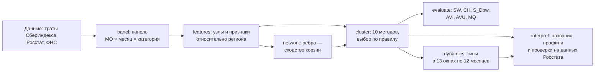

# Типы локальных экономик России: методологический отчёт

Краткий отчёт для жюри конкурса СберИндекса 2026, направление «Кластеризация». Мы делим муниципальные образования (МО) на типы по тому, как тратят их жители относительно своего региона, связываем МО в сеть по сходству корзины трат прослеживаем, как состав типов меняется от 2023 к 2024 году, и проверяем смысл типов на данных Росстата, которые в построении не участвовали.

Методические разделы 2–7 устроены одинаково: что делаем и зачем, формула, параметры из `configs/default.yaml`, где это в коде, что получилось и почему выбран такой способ. Подробности каждого шага — в отчётах этапов `docs/*.md`, числа — в `outputs/`, откуда взято каждое число текста — в реестре [`report/numbers.md`](numbers.md). Обозначения и словарь — в приложении А, карта «шаг → код → параметры → файл» — в разделе 10.



## 1. Вопрос и главный вывод: типы показывают, насколько развит местный потребительский рынок по сравнению со своим регионом

**Вопрос.** Чем различаются муниципальные образования (МО), если смотреть, на что тратят деньги их жители, и сравнивать каждое МО не со всей страной, а со своим регионом? Говорит ли такое деление что-нибудь об экономике места?

**Ответ в трёх предложениях.**

1. Четыре типа МО различаются прежде всего тем, какую часть трат жители оставляют в кафе и ресторанах, а какую — на продукты и маркетплейсы, по сравнению с остальным регионом: от сельских районов, где доля общепита ниже региональной, до крупных городов, где ниже доля продуктов (раздел 8).
2. Смысл типов подтверждают данные, которые в их построении не участвовали: от типа с наименьшей долей общепита к типу с наибольшей растёт розничный оборот Росстата на жителя относительно региона (ρ Спирмена 0,55), слабее — оборот общепита (0,37), а число ИП и организаций на 1000 жителей типы различают сверх случайного (ε² 0,152 и 0,194 при 0,002 на перестановках; раздел 5, «Внешняя проверка»).
3. Граница: измерение у типов одно — сверх зарплаты и уровня трат они почти ничего не добавляют, а отраслевых типов («промышленные», «аграрные», «курортные») траты жителей не показывают.

**Шесть проверок смысла типов** записаны до расчётов вместе с текстом вывода на каждый исход. Что они дали (подробности — раздел 8 и `docs/interpretation.md`):

| Что проверяли | Результат | Вывод |
|---|---|---|
| Упорядочены ли типы по обороту Росстата | в целом да: розница ρ 0,55, общепит 0,37; но внутри групп МО одного размера и одной доли горожан деление по зарплате или по уровню трат упорядочено сильнее типов: 0,35 и 0,28 против 0,24 и 0,17 | частично |
| Не повторяют ли типы простое деление | по составу близки к делению МО по уровню трат: AMI 0,31 при заранее записанном пороге 0,30 | повторяют |
| Меняют ли МО тип за год сверх шума | в основном расчёте надёжно сменили тип 181 МО, на псевдогодах без реального хода времени — медиана 21 (95-й перцентиль 47), так же в 8 из 9 прогонов устойчивости; на сети «косинус корзин» число смен от плацебо не отличается, а правило требует устойчивости во всех прогонах | не подтверждено |
| Куда идут переходы | к типам с большей долей общепита — 148, обратно — 33 (доля 0,82 против 0,49 на псевдогодах); часть переходов — пограничные МО | частично |
| Видна ли смена типа вне данных банка | в обороте общепита Росстата у сменивших тип отличия нет | нет |
| Помогает ли тип подобрать сопоставимые МО | соседи по своему региону точнее и МО, похожих по корзине, и случайных МО того же размера | нет |

**Динамика — с оговоркой.** В основном расчёте смен типа заметно больше, чем на плацебо, и чаще они идут к типам с большей долей общепита. Но вывод держится не при любом правиле рёбер, данных всего два года, а у сменивших тип МО сдвиг не виден в обороте общепита Росстата: часть переходов может быть ростом безналичной оплаты, а не рынка.

**Чем полезно.** Тип — короткая проверенная подпись к МО: насколько его потребительский рынок развит по сравнению с регионом. Практическое правило для аналитика и журналиста: чтобы понять, как меняется экономика МО, сравнивайте его с соседями по своему региону. При сверке изменения розничного оборота 2023 → 2024 за тот же период медианная ошибка соседей по региону — 0,036, похожих по корзине МО других регионов — 0,050, случайных МО того же размера — 0,045. Это сверка изменений у самого МО и у набора за один и тот же период.

**Почему этому можно верить.** Проверки, пороги и тексты выводов на каждый исход записаны в репозиторий до расчётов по типам (коммит `90991e1`, 29.09.2026). Код этапа написан и отлажен вслепую, на перемешанных типах (коммит `abc6107`). После вскрытия вердикты и тексты выводов не менялись; добавлены только пояснения, и каждое записано в журнал `docs/interpretation.md`. Отрицательные исходы опубликованы наравне с положительными.

## 2. Данные: траты жителей 2190 МО 77 регионов, в сеть входят 1776 узлов с полным рядом

**Что и зачем.** Типы строятся по тратам жителей: это единственный показатель, который есть помесячно почти по всем МО. Экономику места (занятость, зарплата, население) берём у Росстата, чтобы объяснить и проверить типы.

| Источник | Что берём | Лицензия |
|---|---|---|
| СберИндекс: безналичные потребительские расходы по МО | оценка средних безналичных трат жителя МО в месяц, 2023-01…2024-12: «Все категории» и пять категорий — продовольствие, маркетплейсы, транспорт, здоровье, общепит | CC BY-SA 4.0 |
| СберИндекс: индекс доступности рынков, автодорожные связи, справочник и границы МО | атрибут узла; контроль «география» (раздел 4); ключ `territory_id`, регион, ОКТМО, полигоны | CC BY-SA 4.0 |
| Росстат, БД ПМО в обработке «Если быть точным» | занятость и зарплата по разделам ОКВЭД2 (крупные и средние организации), население, число ИП и организаций, ночёвки в средствах размещения | CC BY 4.0 |
| ФНС, 5-НДФЛ в обработке «Если быть точным» | доход на жителя — только внешняя проверка рёбер (раздел 4) | на странице набора лицензия не указана |

**Что в данных и что с этим сделано.**

- **Покрытие.** Траты есть по 2190 МО 77 регионов. Целиком нет 8 регионов (Белгородская, Брянская, Воронежская, Курская и Ростовская области, Краснодарский край, Республика Крым, Севастополь) и ещё 153 МО в остальных регионах. Все выводы — о 77 регионах, а не о России.
- **«Прочее».** Исходная таблица — 303 126 строк «МО × месяц × категория». «Все категории» больше суммы пяти категорий; разность мы называем «Прочее» (медиана — 27,1% трат МО в 2024 году). Доли считаются от итога, шестая часть корзины — «Прочее»; сложить шесть рядов значило бы посчитать траты дважды.
- **Пропуски неслучайны.** Полный ряд за 24 месяца — у 2016 МО (92,1%). МО с неполным рядом мельче: медиана населения 17 698 против 23 841, тест Манна — Уитни p = 4,5·10⁻⁸. Поэтому сеть и переходы типов считаются на узлах с полным рядом, а исключённые перечислены с причиной в `outputs/network/excluded.csv`.
- **Узлы.** 247 внутригородских территорий Москвы и Петербурга (11,3% МО, 15,5% населения выборки) свёрнуты в два узла-города; траты узла-города — среднее районов с весами населения. Из 1945 узлов полный ряд у 1776 — это узлы сети; 169 узлов вне сети.
- **Номинал.** Медианный рост трат МО от 2023 к 2024 году — +15,1% в текущих рублях. Поэтому МО сравниваются между собой и со своим регионом, а «реальный рост» не считается.
- **Соединение.** Показатели Росстата и ФНС присоединяются по ОКТМО через срез справочника границ на свой год. Сошлись все жёсткие (21) и мягкие (32) контрольные числа панели: `outputs/panel/controls.json`.

**Формула.** «Прочее» узла $i$ в месяц $t$ и доля части $q$ за окно:

$$v^{\mathrm{other}}_{it} = v^{\mathrm{all}}_{it} - \sum_{c=1}^{5} v^{c}_{it},\qquad p_{iq} = \frac{\sum_t v^{q}_{it}}{\sum_t v^{\mathrm{all}}_{it}}.$$

**Параметры:** `period` (2023-01…2024-12), `nodes.mode: collapse`, `features.min_months: 24`, `sources.*.sha256`. **Код:** `munnet.data:run` (скачивание и сверка sha256), `munnet.panel.consumption:build_panel` и `add_other`, `munnet.panel.crosswalk:match_rows` (ОКТМО), `munnet.nodes:build_nodes`, `munnet.features:select_nodes`. **Результат:** `docs/eda.md` (раздел 1), `outputs/eda/facts.json`, `outputs/panel/controls.json`.

**Почему так.** Можно было взять все 2190 МО с неполными рядами, но тогда типы 2023 и 2024 годов считались бы на разных наборах МО. Районы Москвы и Петербурга отдельными узлами проверены в разделах 4 и 5. Ограничение: мелкие МО с неполными рядами в сеть не попали.

## 3. Признаки узлов: всё о тратах считается относительно своего региона, иначе типы повторят карту регионов

**Что и зачем.** Регион задаёт большую часть уровня трат и состава корзины. Чтобы типы показывали различия мест, а не регионов, каждый признак трат — это отклонение узла от центра своей группы региона. Группа региона — субъект; Москва считается вместе с Московской областью, Петербург — с Ленинградской.

**Формула.** Корзина узла $i$ за окно — шесть долей $p_i$ (пять категорий и «Прочее»). Корзина относительно региона:

$$s_i = \operatorname{clr}(p_i) - \bar c_{g(i)},\qquad \operatorname{clr}(p)_q = \ln p_q - \tfrac{1}{6}\textstyle\sum_{q'} \ln p_{q'},\qquad \bar c_g = \operatorname{mean}_{j\in g}\operatorname{clr}(p_j).$$

CLR (центрированный логарифм отношения, Aitchison, 1986) сравнивает доли, не ломая их сумму; доли меньше `features.clr_floor` перед логарифмом заменяются мультипликативно. Уровень трат — логарифм средних трат жителя в месяц минус среднее группы региона; признаки места с суффиксом `_rel` — минус медиана группы.

**Что получилось.** У уровня трат и шести долей корзины как есть доля разброса между группами регионов (η²) — от 0,29 до 0,62 при 0,04 на чистом шуме; после вычитания центра группы — не выше 0,00. Признаки разведены по ролям, чтобы один сигнал не вошёл в расчёт дважды:

| Роль | Признаки | Как используется |
|---|---|---|
| Рёбра сети (6) | корзина относительно региона: продовольствие, маркетплейсы, транспорт, здоровье, общепит, «Прочее» | сходство МО (раздел 4) |
| Атрибуты узлов $X$ (11) | уровень трат; доли занятых в пяти укрупнённых разделах ОКВЭД2; зарплата, доля горожан, доля старше трудоспособного возраста, население и доступность рынков — относительно региона | признаки для кластеризации (раздел 5) |
| Слой (2) | северный годовой ритм: летний избыток своего ритма и его сила | описание части МО, в типы не входит |
| Динамика (2) | доля маркетплейсов и её прирост за год | сравнение окон времени (раздел 7) |

Каждый признак прошёл проверку своей роли: рёбра — 6 из 6, атрибуты — 11 из 11, слой — 2 из 2 (`docs/features.md`, раздел 4). Правила: порядок узлов по признаку в 2023 и 2024 годах повторяется (ρ Спирмена) не меньше чем на 0,5; у атрибутов ещё η² группы региона не выше 0,6 и |ρ| с другим атрибутом не выше 0,8. Корзина повторяется на 0,86–0,96. Декабрьский пик трат не повторяется (0,25) и остался описанием.

**Параметры:** `features.clr_floor: 0.001`, `features.region_center: mean`, `features.place_center: median`, `features.space` (роли признаков, `min_reliability: 0.5`, `max_abs_rho: 0.8`). **Код:** `munnet.features:clr_frame`, `relative_clr`, `relative_values`, `place_features`, `feature_table`. **Результат:** `docs/features.md`, `outputs/features/feature_table.csv`.

**Почему так.** Альтернатива — корзина, очищенная и от региона, и от уровня трат. Её типы почти не связаны с экономикой места: каппа Коэна (Cohen, 1960) неглубокого дерева «экономика места → тип» — 0,121 против 0,315 у корзины относительно региона, а с регионом типы корзины относительно региона не совпадают (AMI 0,005; Vinh и др., 2010). Сильнее всего атрибуты пересекаются с рёбрами в паре «уровень трат — доля общепита» (|ρ| = 0,73); расчёт без уровня трат даёт то же разбиение (раздел 5). Ограничение: экономика места — Росстат за 2023 год, без малого бизнеса и по месту работодателя.

## 4. Рёбра сети: МО связаны, если их корзины одинаково отличаются от своих регионов; из пяти правил эта сеть самая устойчивая

**Что и зачем.** Ребро соединяет МО, жители которых тратят похоже, если сравнивать каждое МО со своим регионом. Без обработки похожи почти все пары: медиана корреляции помесячных рядов трат — 0,91 (общий рост и декабрь), медиана косинуса корзин — 0,97 (продовольствие везде главная часть). После снятия общего фона и региона — −0,01 и 0,01: сходство становится избирательным.

**Формула основного правила** «Расстояние корзин» — расстояние Эйчисона между корзинами относительно региона и гауссово ядро:

$$d_{ij} = \lVert s_i - s_j\rVert,\qquad S_{ij} = \exp\!\bigl(-d_{ij}^2/\sigma^2\bigr),\qquad \sigma = \operatorname{med}_{i<j} d_{ij} = 0{,}57.$$

Разрежение — объединение списков $k$ ближайших, $k = 10$: $E = \lbrace (i,j) : j\in N_k(i) \lor i\in N_k(j) \rbrace$, вес ребра — $S_{ij}$. У каждого узла не меньше $k$ соседей, изолятов нет.

**Что сравнивали.** Пять правил по тратам — косинус и расстояние корзин относительно региона, корреляция своего годового ритма, лаговая корреляция (сдвиг до 3 месяцев) и DTW своего ритма (окно Сакоэ — Чибы 2 месяца; Sakoe, Chiba, 1978); два контроля «чистой географии» — дорожное расстояние и гравитация; две абляции. Формулы всех правил — `docs/network.md`, раздел 2. Каждая сеть получила одни измерения:

| Измерение | Расстояние корзин | Косинус корзин | Корреляция ритма | Дороги (контроль) |
|---|---:|---:|---:|---:|
| Надёжность: доля общих рёбер сетей 2023 и 2024 годов (Жаккар) | 0,15 | 0,14 | 0,08 | 1 (сеть не меняется) |
| То же у случайных сетей | 0,004 | 0,004 | 0,005 | 0,003 |
| Доля рёбер, общих с сетью дорог | 0,009 | 0,009 | 0,084 | 1,000 |
| Рёбер внутри группы региона | 3,1% | 3,0% | 25,7% | 76,7% |
| Согласованность с экономикой места (ассортативность, среднее по 10 признакам) | 0,27 | 0,25 | 0,22 | 0,07 |
| Хабы (Radovanović и др., 2010): асимметрия k-встречаемости; наибольшая степень | 0,1; 25 | 0,2; 23 | 2,4; 91 | 0,3; 25 |
| Ассортативность по Северу | 0,05 | 0,03 | 0,53 | 0,87 |

*Источник: `outputs/network/comparison.csv`; полная таблица по 10 сетям — `docs/network.md`, раздел 4.*

**Выбор.** Правило: Парето-фронт по четырём критериям (надёжность, отличие от географии, согласованность с местом, простота), на фронте — первый по порядку критериев; разница меньше стандартного отклонения критерия по бутстрапу месяцев считается ничьей. «Расстояние корзин» побеждает при всех 24 порядках критериев основного набора (`outputs/network/selection_sets.csv`), при k = 5, 10, 15 и 20 (`selection_by_k.csv`) и по сумме мест (Борда) во всех трёх наборах критериев. Семейство «корзина» выигрывает и при единственном наборе, записанном до расчёта: устойчивость, модульность, согласованность (`PLAN.md`, коммит `cc6f265`). Косинус и расстояние почти равны; на одних и тех же бутстрап-выборках месяцев расстояние надёжнее в 20 из 20 повторов.

**Что не доказано.** Порядок критериев основного набора попал в git одним коммитом с результатами. Без вычета региона сеть корзины надёжнее (0,22 против 0,15): вычитание региона — решение сюжета, а не выигрыш по критериям. На доходе 5-НДФЛ, который не входит в атрибуты, ассортативность сети — 0,28, но сверх зарплаты — 0,011 при случайном уровне ±0,010: независимого подтверждения сеть не получила.

**Динамическая сеть.** Для раздела 7 сеть строится тем же правилом в 13 скользящих 12-месячных окнах (от 2023-01–2023-12 до 2024-01–2024-12). Две сети одного времени (нечётные и чётные месяцы) делят 0,51 рёбер, сети 2023 и 2024 годов — 0,15: связи меняются сверх шума.

**Параметры:** `network.rules.basket_dist`, `network.sparsify` (`method: knn`, `k: 10`, `k_grid: [5, 10, 15, 20]`), `network.selection`, `network.dynamics`. **Код:** `munnet.network.rules:euclid_matrix`, `gaussian_similarity`; `munnet.network.graph:knn_edges`; `munnet.network.compare:evaluate_rule`, `select`, `paired_bootstrap`, `dynamics`. **Результат:** `data/processed/network_edges.parquet`, `network_windows.parquet`, `outputs/network/comparison.csv`, рисунок `docs/img/network/N02_pareto.png`.

**Почему не ритм и не дороги.** Сети своего ритма почти вдвое менее надёжны, с хабами и северной окраской: это слой «северный ритм», а не основа типологии. Дороги повторяют регионы: сообщества дорожной сети совпадают с группами регионов на AMI 0,73. Ограничение: типы наследуют правило ребра — сообщества сетей косинуса и расстояния совпадают лишь на ARI 0,32 (скорректированный индекс Рэнда; Hubert, Arabie, 1985).

## 5. Методы кластеризации и их сравнение: итог решила допустимость — из методов, видящих граф и признаки, допустим только гибрид с K = 4

**Что и зачем.** Десять методов (три семейства и базовая линия) получают одни входы: атрибутированную сеть $(G, X)$ на 1776 узлах и одну сетку числа кластеров $K = 3, \dots, 12$. Кластер метода мы называем для читателя типом. Выбор делает правило, записанное до расчётов отдельным коммитом `2ee1363` 28.09.2026; всё, что добавлено позже, ниже помечено, и рядом всегда показан результат исходного правила.

**Входы.** $G$ — сеть раздела 4: 12 418 рёбер, веса $S_{ij}$ от 0,11 до 1, одна компонента связности. $X$ — 11 атрибутов раздела 3; пропуск — медиана группы региона, масштаб — $(x - \operatorname{med})/(\mathrm{MAD}\cdot 1{,}4826)$. Корзину координатами видит только базовая линия.

**Методы** (`clustering.families`):

- по признакам $X$: K-means (Lloyd, 1982), Уорд (Ward, 1963), гауссова смесь (Fraley, Raftery, 2002), HDBSCAN (Campello и др., 2013);
- по графу $G$: Leiden (Traag и др., 2019) и Louvain (Blondel и др., 2008) — взвешенная модульность (Newman, 2004) с разрешением γ (Reichardt, Bornholdt, 2006), подобранным под заданное $K$; спектральная кластеризация (von Luxburg, 2007). Предел разрешения модульности (Fortunato, Barthélemy, 2007) здесь $K$ не ограничивает: наименьший внутренний вес сообщества у 17 разбиений Leiden и Louvain — 360 при пороге от 152 до 334;
- по $X$ и $G$: **KEFRiN** (Shalileh, Mirkin, 2022) и **гибрид**. KEFRiN чередованием минимизирует $F = \rho\sum_{i,v}\bigl(y_{iv} - c_{k(i)v}\bigr)^2 + \xi\sum_{i,j}\bigl(p_{ij} - \lambda_{k(i)j}\bigr)^2$, где $y_i$ — признаки узла, $p_{ij}$ — сеть после стандартизации модульностью, $c_k$ и $\lambda_k$ — центры кластера в двух пространствах, $\rho = \xi = 1$, как у авторов. Из методов этих авторов взят KEFRiN, потому что он получает $K$ как параметр; SEFNAC (Shalileh, Mirkin, 2021а) извлекает кластеры по одному и сам определяет $K$, сетке $K$ он не подходит. ICESi (Shalileh, Mirkin, 2021б) — другой метод: в предрегистрированном комментарии конфига SEFNAC ошибочно приписан его статье; комментарий предрегистрации не правится, на выбор это не влияет. Гибрид — K-means на $Z = \bigl[\sqrt{\alpha}\,U/\sqrt{\operatorname{tr}\operatorname{Var}U},\ \sqrt{1-\alpha}\,X/\sqrt{\operatorname{tr}\operatorname{Var}X}\bigr]$, где $U$ — $K$ собственных векторов нормированного лапласиана $G$, $\alpha = 0{,}5$. Близкий опубликованный подход — covariate-assisted spectral clustering (Binkiewicz и др., 2017); наш вариант проще: готовое вложение графа и признаки соединяются перед K-means с заданным весом блоков;
- базовая линия «нужен ли граф»: K-means по координатам корзины ⊕ $X$ с равным весом блоков.

**Правило выбора** (`clustering.feasible`, `clustering.selection`):

1. Допустимость: наименьший тип — не меньше 2% узлов (36), крупнейший — не больше 50%, шум HDBSCAN — не больше 10%.
2. Четыре критерия, у всех больше — лучше. Качество в $X$ — средний ранг z-оценок SW, CH и S_Dbw против 200 случайных разметок тех же размеров (раздел 6); качество на $G$ — то же для AVI, AVU и MQ; устойчивость — средний ARI (Hubert, Arabie, 1985) с разбиениями 100 подвыборок по 80% узлов; объяснимость — каппа Коэна (Cohen, 1960) дерева глубины 3 «17 признаков → тип» на 5-кратной проверке.
3. Парето-фронт с допусками ничьей (устойчивость и объяснимость — 0,02, качество — 0). На фронте — правило Копленда (Copeland, 1951, цит. по Henriet, 1985): $A$ обходит $B$, если $A$ лучше сверх допуска по большему числу критериев, чем $B$; очки — число обойдённых минус число обошедших. Равенство очков решает устойчивость, затем простота метода, затем меньшее $K$.
4. Два уровня: сначала $K$ внутри метода, затем метод — среди методов, видящих оба источника (`clustering.final_eligible`). Та же процедура среди всех семейств — проверка `all_eligible` из предрегистрации.

**Синтетика: граф помогает, только когда в нём есть сигнал** (`clustering.synthetic`, рисунок `docs/img/cluster/C01_synthetic.png`). Генератор с известной истиной повторяет устройство данных: 600 узлов, 4 группы, граф kNN по шести координатам «корзины»; вторая схема — посаженный блочный граф без координат с долей рёбер между группами от 0,3 до 0,9. В каждой из 45 ячеек — 20 наборов данных. Победитель ячейки назван, только если 95% интервал его среднего ARI не перекрывается с интервалом второго метода; иначе — ничья; если лучший средний ARI ниже 0,05, победителя нет. Итог: явный победитель в 9 ячейках, ничья в 30, победителя нет в 6.

- **Сигнал и в графе, и в признаках.** Лучший средний ARI — у метода, видящего оба источника, в 16 из 16 ячеек, но явно — лишь в 6. Во всех 16 это базовая линия: она берёт координаты, из которых построен граф. При сильных сигналах её средний ARI 0,91, у гибрида 0,83, у KEFRiN 0,44.
- **Сигнал только в графе.** На графе kNN Leiden, спектральная, гибрид и базовая линия в ничьей во всех 4 ячейках. Явная победа метода только по графу — в одной ячейке: блочный граф с долей внешних рёбер 0,3, Leiden (ARI 0,98).
- **Граф без координат, половина рёбер между группами.** У гибрида лучший средний ARI в 5 из 5 ячеек (в среднем 0,43 против 0,34 у спектральной и 0,17 у Leiden), но явно — лишь в 1; в 3 ячейках ничья со спектральной.
- **Шумовой граф — минус гибрида.** Без сигнала в графе и при сигнале в признаках 2,0 у гибрида ARI 0,03, у K-means 0,46, у KEFRiN 0,39: вложение шумового графа с равным весом блока заглушает признаки. На блочном графе с долей внешних рёбер 0,7 — 0,04 против 0,43 у K-means и 0,40 у KEFRiN. Из методов на двух источниках сигнал признаков сохраняет KEFRiN, но он не лучше методов по одним признакам: K-means, гауссова смесь и KEFRiN в ничьей по интервалам во всех 9 ячейках шумового графа, где лучший средний ARI не ниже порога 0,05.

Синтетика целиком не входит в предрегистрацию: генератор, сетки сигналов и проверка на блочном графе записаны 28.09 вместе с кодом этапа, уже после коммита предрегистрации (коммит `512cc67`, `git log -S sbm_mixing -- configs/default.yaml`). Правила синтетики изменены 29.09, после первых результатов: было 5 наборов на ячейку и победитель по наибольшему среднему. Два прежних вывода сняты: «на посаженном блочном графе выигрывает гибрид» и «шумовой граф почти не мешает». Порог 0,05 лежит в разрыве: в ячейках без победителя лучший средний ARI не выше 0,040, в остальных — не ниже 0,149. Это выводы о двух генераторах, а не о данных.

**Что получилось на данных.** Из 87 кандидатов «метод × K» допустимы 29. У KEFRiN и базовой линии недопустимы все 10 значений $K$: в каждом разбиении есть тип меньше 2% узлов. Такие мелкие типы почти всегда выделяются по доступности рынков относительно региона (105 из 108): это пригородные районы областных центров, у гибрида — 16 районов с доступностью рынков на 26 MAD выше медианы своего региона. И в варианте статьи (z-оценка признаков, $\rho = \xi = 1$) KEFRiN недопустим: при $K = 4$ наименьший тип — 1,2% узлов; допустимые разбиения появляются только при весе сети $\xi/\rho$ от 16, которого предрегистрация не предусматривала. У гибрида допустимо одно значение, $K = 4$: при $K = 3$ крупнейший тип — 51,5%, при $K \ge 5$ выделяются те же пригороды. Поэтому итог — **гибрид с $K = 4$**: 806, 473, 394 и 103 узла; устойчивость 0,91; у всех четырёх типов Жаккар лучшего совпадения на подвыборках не ниже 0,90 при пороге устойчивости 0,75 (Hennig, 2007).

**Итог устойчив, а сравнение гибрида с методами одного источника не решено.**

- *Итог решила допустимость, а не сравнение критериев.* Из методов с двумя источниками допустим один кандидат, поэтому любая замена агрегатора, набора критериев, допусков или шага даёт его же. Это следствие допустимости, а не довод надёжности.
- *Итог от seed не зависит.* Разбиения гибрида с $K = 4$ при 10 seed метода совпадают (ARI 1,00). При seed 42–46 методов, случайного базиса и бутстрапа итог «гибрид, $K = 4$» получается в 5 прогонах из 5 и по правилу предрегистрации, и с допуском, описанным ниже. Полный прогон этапа с seed конфига 43 и 44 дал то же разбиение (раздел 10).
- *Среди всех семейств выбор зависит от seed.* При seed 42 на Парето-фронте три кандидата: Leiden с $K = 3$, Louvain с $K = 6$ и гибрид. Очки Копленда поровну у Leiden и гибрида (+1), и равенство решает устойчивость (0,91 против 0,62): побеждает гибрид. Правило Борда на том же фронте (сумма мест по четырём критериям, меньше — лучше; Borda, 1784, англ. пер. — de Grazia, 1953) чистого победителя тоже не даёт: у Leiden и гибрида по 7, у Louvain 10, и ничью снова решает устойчивость (0,909 против 0,615). В прогонах с seed конфига 43 и 44 по правилу Борда поровну уже у трёх кандидатов (Leiden, спектральная, гибрид), и устойчивость снова выбирает гибрид. При seed 42–46 правило предрегистрации даёт гибрид в 4 прогонах из 5 и спектральную с $K = 4$ в одном. Сами разбиения этих двух кандидатов от seed не зависят (наименьший ARI 1,00). При seed 42 спектральная не попала на фронт лишь потому, что гибрид выше по одному критерию, качеству в $X$ (средний ранг z-оценок 0,50 против 0,25): по качеству на $G$ у них поровну (0,50), а устойчивость (0,909 и 0,901) и объяснимость (0,894 и 0,905) различаются меньше допуска 0,02. Поэтому победителя переключают z-оценки случайного базиса, а при равенстве очков — устойчивость: 0,91 у гибрида против 0,90 у спектральной.
- *Среди всех семейств выбор зависит и от агрегатора.* При seed 42 победитель сохраняется в 7 из 8 проверок чувствительности; при выборе за один шаг по всем парам «метод, $K$» побеждает спектральная с $K = 4$. Из 24 лексикографических порядков критериев при выборе метода Leiden с $K = 3$ побеждает в 12, гибрид и Louvain с $K = 6$ — в 6 каждый.
- ***По метрикам графа, сравнимым между разными $K$, среди всех семейств побеждает Leiden с $K = 3$.*** У него AVI с поправкой на случайность 0,927 против 0,884 у гибрида, сырая модульность 0,606 против 0,590. Победитель среди всех семейств по z-оценкам при seed 42 — гибрид с $K = 4$ (при других seed — не всегда, см. ниже); гибрид выше Leiden только по z-оценкам, а они смещены по $K$ (раздел 6): **это преимущество гибрида по графу держится на смещённых z-оценках.** Проверка добавлена после предрегистрации; итог она не меняет.
- *Порог крупнейшего типа решает сильнее правила.* При 55% вместо 50% среди всех семейств побеждает спектральная с $K = 3$. Внутри гибрида $K = 3$ и $K = 4$ тогда различает только устойчивость: разница 0,008 при допуске 0,02. По основной цепочке равенств выбирается $K = 4$, с допуском в цепочке — $K = 3$. Порог 50% записан до расчётов, но на этой границе итог хрупок. Порог наименьшего типа от 1% до 3% победителей не меняет.

Вывод «гибрид лучше методов одного источника» данными не подтверждён. Внешнего довода за $K = 4$ против $K = 3$ у гибрида тоже нет: разбиение с $K = 3$ недопустимо и во внешней проверке не участвовало. Ориентир числа типов по iK-means (Chiang, Mirkin, 2010) в правило выбора не входит: метод выделяет «аномальные» кластеры по одному, и кластеров не меньше 2 узлов у него 16 по $X$ и 20 по корзине ⊕ $X$, больше верхней границы сетки $K = 12$ (`clustering.impl.ik_means_min_size: 2`, `munnet.clustering.methods:ik_means_k`). В данных много мелких отличающихся групп и немного крупных типов.

**Отступление от предрегистрации: допуск ничьей по шуму случайного базиса.** В предрегистрации (`clustering.selection.tie`) допуск ничьей критериев качества — 0: любая разница средних рангов z-оценок считается победой. Проверка 28.09 показала, что при seed 43 выбор среди всех семейств другой. Поэтому 29.09, когда результаты уже были известны, добавлен второй вариант правила: допуск равен стандартному отклонению критерия по 5 независимым случайным базисам при тех же разбиениях (медиана по допустимым кандидатам). Получилось 0,03 для качества в $X$ и 0,04 для качества на $G$ (`clustering.impl.quality_tolerance: baseline_sd`). Это проверка рядом с исходным правилом, а не замена; основной результат отчёта — по исходному правилу.

| Уровень выбора | Правило предрегистрации (допуск 0) | С допуском по шуму базиса |
|---|---|---|
| Итог (методы с двумя источниками), seed 42 | гибрид, K = 4 | гибрид, K = 4 |
| Итог, seed 42–46 | гибрид, K = 4 — 5 из 5 | гибрид, K = 4 — 5 из 5 |
| Все семейства, seed 42 | гибрид, K = 4 | гибрид, K = 4 |
| Все семейства, seed 42–46 | гибрид, K = 4 — 4 из 5; спектральная, K = 4 — 1 из 5 | гибрид, K = 4 — 3 из 5; спектральная, K = 4 — 2 из 5 |

*Источник: `outputs/cluster/seed_frequency.csv`, `seed_runs.csv`; полная таблица по всем проверкам — `docs/clustering.md`, таблица 6б.*

Сам допуск оценён с шумом. Без одного из пяти базисов он от 0,031 до 0,033 в $X$ и от 0,030 до 0,039 на $G$; при seed 42 победитель среди всех семейств с такими допусками — гибрид в 5 случаях из 5, а на сетке допусков от 0 до удвоенного (25 сочетаний) — в 25 из 25. Но прогон с другим seed конфига оценивает допуск по другим базисам. В прогонах 30.09 с seed конфига 42, 43 и 44 допуск был 0,032, 0,031 и 0,035 в $X$ и 0,043, 0,042 и 0,037 на $G$, и один и тот же seed 44 с допуском дал спектральную в прогонах 42 и 43, а гибрид — в прогоне 44. Расходятся не только главные строки при seed 44: в варианте с допуском проверки и порядки на уровне всех семейств при seed 44–47 разошлись в 23 из 276 общих строк `seed_runs.csv` между прогонами 42 и 44 (seed 44–46), в 28 из 368 между прогонами 43 и 44 (seed 44–47) и в 0 из 368 между прогонами 42 и 43. Это наблюдение по трём прогонам, одной командой оно не воспроизводится. У правила предрегистрации общие seed трёх прогонов дали одинаковых победителей во всех проверках и порядках: расхождений 0 из 368, 276 и 368 общих строк. Допуск по шуму базиса, таким образом, выбор среди всех семейств устойчивым не делает.

Остальное, что добавлено после предрегистрации, выбор не меняет и описано в `docs/clustering.md`, раздел 10: толкование цепочки равенств (устойчивость сравнивается без допуска, `clustering.impl.tie_chain_tolerance: 0`), правило для метрики с неопределённой z-оценкой, проверки по свойствам индексов, сетка порогов допустимости, пересчёт на других входах, удаление рёбер, частота победителей по seed.

**Где итог хрупок.** Гибрид почти повторяет спектральную кластеризацию одного графа (ARI 0,94): типы задаёт корзина, признаки места мало что добавляют. На сети «Косинус корзин» тот же метод с $K = 4$ совпадает с итогом на ARI 0,22 (победитель на этой сети — гибрид с $K = 3$, ARI 0,28), с районами Москвы и Петербурга отдельными узлами — на 0,32 (победитель — базовая линия с $K = 4$, ARI 0,40), без уровня трат — на 1,00. При усечённых хвостах признаков побеждает KEFRiN с $K = 4$ (ARI с итогом 0,15), хотя сам гибрид от усечения почти не меняется (0,97).

**Внешняя проверка** — на показателях вне рёбер и признаков: ИП и организации на 1000 жителей, ночёвки в средствах размещения на жителя; нулевая модель — 1000 перестановок меток внутри групп региона. Все 10 проверок значимы после поправки Бенджамини — Хохберга (Benjamini, Hochberg, 1995). Типы различают показатели (ε² — 0,152, 0,194 и 0,024 при 0,002–0,003 на перестановках), подтвердились 4 из 4 заранее записанных знаков, прирост R² сверх 11 признаков места — от 0,006 до 0,026: эффект небольшой.

**Методы: плюсы, минусы, когда применять** (сокращённая таблица 13 из `docs/clustering.md`; там у каждой ячейки ссылка на свой результат). «Когда применять» — по синтетике, если не сказано иное.

| Метод | Видит | Плюсы | Минусы на этих данных | Когда применять |
|---|---|---|---|---|
| K-means | $X$ | устойчив и на недопустимых $K$: медианный ARI бутстрапа 0,85 | хвост доступности рынков даёт тип из 2–34 узлов, все $K$ недопустимы | сигнал только в признаках, хвосты усечены: без сигнала в графе лучший метод по $X$ даёт ARI 0,48 |
| Уорд | $X$ | детерминирован, одно дерево на все $K$ | те же мелкие типы; медианная устойчивость 0,53 | нужна иерархия типов и подтипов |
| Гауссова смесь | $X$ | допустима при $K = 3$; кластеры разной формы | почти не согласна с методами по графу: ARI с итогом 0,09 | признаки близки к гауссовым, граф не нужен |
| HDBSCAN | $X$ | сам находит $K$ и шум | сгустков плотности нет: при `min_cluster_size` от 5 до 400 не больше 2 кластеров | плотные группы в малой размерности |
| Leiden | $G$ | сообщества связны: несвязных нет ни у одного из 10 разбиений; допустим при всех 10 $K$ | после удаления 10% рёбер ARI с исходным разбиением 0,63 против 0,98 у гибрида | сигнал только в графе; явно побеждает лишь на блочном графе с долей внешних рёбер 0,3 (ARI 0,98), на графе kNN — ничья с гибридом, спектральной и базовой линией (4 из 4 ячеек) |
| Louvain | $G$ | быстрый | достиг только 7 из 10 значений $K$ | первый взгляд на сообщества |
| Спектральная | $G$ | устойчива: 0,90 на подвыборках, 0,97 после удаления рёбер | признаки места не участвуют | граф связен и информативен; в синтетике — ничья с гибридом (блочный граф с долей 0,5: 3 из 5 ячеек; kNN без сигнала в $X$: 4 из 4) |
| KEFRiN | $X$ и $G$ | одна целевая функция по признакам и связям | хвосты $X$ дают тип из 1–32 узлов, все $K$ недопустимы, в варианте статьи тоже; при сильных сигналах слабее гибрида: 0,44 против 0,83 | граф шумовой, признаки информативны, а нужен метод на двух источниках: сигнал признаков сохраняет (0,39 против 0,03 у гибрида и 0,46 у K-means), но не лучше методов по $X$: с K-means и гауссовой смесью — ничья по интервалам в 9 из 9 ячеек |
| Гибрид | $X$ и $G$ | устойчив (0,91), все типы устойчивы по Хеннигу | почти совпадает со спектральной (ARI 0,94); при шумовом графе теряет сигнал признаков (0,03 против 0,46 у K-means); при координатах графа уступает базовой линии (0,83 против 0,91); зависит от правила рёбер (0,22) и состава узлов (0,32) | граф информативен и дан без координат: блочный граф с долей 0,5 — 0,43 против 0,34 у спектральной и 0,17 у Leiden, лучший по среднему в 5 из 5 ячеек, но явно — в 1 |
| K-means корзина ⊕ $X$ | $X$ и координаты $G$ | лучший средний ARI в синтетике, где граф построен из координат: 16 из 16 ячеек, явно — 6 | тип пригородов (при $K = 4$ — 16 узлов), все $K$ недопустимы | координаты, из которых строится граф, доступны, хвосты $X$ усечены |

**Параметры:** `clustering.inputs`, `clustering.n_clusters: [3, 12]`, `families`, `final_eligible`, `protocol` (`seeds: 10`, `hybrid_alpha: 0.5`), `feasible`, `selection`, `stability`, `interpretability`, `validation`, `synthetic` (`repeats: 20`, `ci_level: 0.95`, `min_ari: 0.05`); параметры реализации вне предрегистрации — `clustering.impl`, в том числе `seed_check: 5`, `tie_chain_tolerance: 0` (толкование) и `quality_tolerance: baseline_sd` (отступление). **Код:** `munnet.clustering.inputs:build_X`; `munnet.clustering.methods:fit`, `spectral_embed`, `tune_param`; `munnet.clustering.kefrin:kefrin`; `munnet.clustering.selection:pareto_front`, `copeland_scores`, `tie_break`, `two_level`, `one_step`; `munnet.clustering.decide:decide`, `icvi_checks`; `munnet.clustering.analysis:seed_frequency`, `quality_tolerance`, `threshold_grid`; `munnet.clustering.stability:boot_task`, `tree_kappa`; `munnet.clustering.synthetic:make_knn`, `make_sbm`, `summarize`; `munnet.clustering.validation:validate`. **Результат:** `data/processed/cluster_final.parquet`, `cluster_labels.parquet`, `outputs/cluster/candidates.csv`, `final.json`, `seed_frequency.csv`, `quality_tolerance.csv`, `threshold_grid.csv`, `synthetic_summary.csv`, `validation.csv`, отчёт `docs/clustering.md`, рисунки `docs/img/cluster/C01_synthetic.png` и `C02_methods.png`.

**Почему так.** Одни входы, одна сетка $K$ и одни seed нужны, чтобы различие объясняли методы, а не условия; правило записано до расчётов, чтобы выбор нельзя было подогнать под результат. Ограничение: итог держится на порогах допустимости, а сравнение гибрида с методами одного источника зависит от seed, агрегатора и метрик графа.

## 6. Качество кластеров: ICVI — в сети типы итога изолированы, в признаках почти не разделены

**Что и зачем.** Шесть индексов отвечают на два вопроса: насколько типы разделены в признаках (SW, CH, S_Dbw) и насколько они замкнуты в сети (AVI, AVU, MQ). Индексы посчитаны для всех 87 кандидатов; в правило выбора они входят через z-оценку.

**Одной фразой для неспециалиста:**

- **SW, силуэт** — насколько каждое МО ближе к своему типу, чем к ближайшему чужому; от −1 до 1, больше — лучше.
- **CH, индекс Калинского — Харабаша** — во сколько раз разброс между типами больше разброса внутри типов; больше — лучше.
- **S_Dbw** — разброс внутри типов плюс плотность точек «между» типами; меньше — лучше.
- **AVI, изолируемость** — какая доля связей типа остаётся внутри него; больше — лучше.
- **AVU, объединяемость** — не отдают ли два типа друг другу почти все внешние связи, так что их стоило бы слить; меньше — лучше.
- **MQ, модульность** — доля связей внутри типов сверх ожидаемой в случайной сети с теми же степенями узлов; больше — лучше.

**Формулы сетевых индексов.** $M_{kl}$ — сумма весов рёбер между кластерами $k$ и $l$; внутренние рёбра считаются упорядоченными парами, то есть $M_{kk}$ — удвоенный вес рёбер внутри кластера; $\mathrm{out}_k = \sum_{l\ne k} M_{kl}$; $A$ — матрица весов $G$, $d_i$ — взвешенная степень узла, $m$ — суммарный вес рёбер:

$$\mathrm{Iso}_k = \frac{M_{kk}}{\sum_l M_{kl}},\qquad \mathrm{AVI} = \frac{1}{K}\sum_k \mathrm{Iso}_k,\qquad U_{kl} = \frac{M_{kl}}{\mathrm{out}_k + \mathrm{out}_l - M_{kl}},\qquad \mathrm{AVU} = \frac{1}{K}\sum_{k\ne l} U_{kl},$$

$$\mathrm{MQ} = \frac{1}{2m}\sum_{i,j}\Bigl(A_{ij} - \frac{d_i d_j}{2m}\Bigr)\,[\,y_i = y_j\,].$$

AVI и AVU предложены в работе Biswas, Biswas (2017). Её текст закрыт, поэтому формулы взяты по пересказу Shalileh, Antonov, Tsyplakova (Doklady Mathematics, 2025, формулы (18)–(21), DOI 10.1134/S1064562425700589) и сверены с Howie и др. (PVLDB, 2023, формулы (36)–(37)). MQ — Newman, Girvan (2004); SW — Rousseeuw (1987); CH — Caliński, Harabasz (1974); S_Dbw — Halkidi, Vazirgiannis (2001) в изложении Halkidi, Batistakis, Vazirgiannis (2002), плотность центров — по точкам обоих кластеров пары.

**z-оценка.** Значение индекса $I$ сравнивается с 200 случайными разметками с теми же размерами типов: $z = \pm\,(I - \bar I_{\mathrm{perm}})/\mathrm{SD}_{\mathrm{perm}}$, знак выбран так, чтобы больше было лучше. **z = 178 у AVI итога значит: его AVI выше среднего по случайным разметкам на 178 стандартных отклонений этих разметок.** Это расстояние от случайного уровня, а не вероятность и не «в 178 раз лучше». Интервалы — по 100 подвыборкам 80% узлов при тех же метках; отклонения умножены на 2,0, чтобы учесть размер подвыборки.

**Победители методов и итог:** значение, 95% интервал, z (`outputs/evaluate/icvi_long.csv`).

| Кандидат | SW ↑ | CH ↑ | S_Dbw ↓ | AVI ↑ | AVU ↓ | MQ ↑ |
|---|---:|---:|---:|---:|---:|---:|
| Гибрид, K = 4 — итог | 0,007<br>[−0,002; 0,020]<br>z 2,2 | 130<br>[110; 144]<br>z 315,5 | 3,142<br>[2,191; 3,717]<br>z −6,5 | 0,913<br>[0,893; 0,932]<br>z 178,0 | 0,636<br>[0,582; 0,714]<br>z −85,6 | 0,590<br>[0,566; 0,613]<br>z 161,9 |
| Спектральная, K = 4 | 0,000<br>[−0,011; 0,013]<br>z 1,7 | 105<br>[94; 123]<br>z 220,7 | 2,790<br>[1,724; 3,457]<br>z −4,3 | 0,929<br>[0,917; 0,945]<br>z 177,5 | 0,615<br>[0,561; 0,683]<br>z −65,4 | 0,599<br>[0,575; 0,624]<br>z 160,7 |
| Leiden, K = 3 | 0,004<br>[−0,010; 0,022]<br>z 2,6 | 124<br>[111; 148]<br>z 235,9 | 1,890<br>[1,747; 2,016]<br>z 2,2 | 0,952<br>[0,943; 0,964]<br>z 152,6 | 0,667<br>[0,667; 0,667]<br>z — | 0,606<br>[0,590; 0,622]<br>z 150,2 |
| Louvain, K = 6 | −0,029<br>[−0,043; −0,012]<br>z 0,7 | 60<br>[54; 70]<br>z 176,5 | 1,787<br>[1,525; 2,164]<br>z 1,9 | 0,874<br>[0,859; 0,888]<br>z 203,6 | 0,572<br>[0,537; 0,603]<br>z −44,8 | 0,696<br>[0,682; 0,711]<br>z 191,7 |
| Гауссова смесь, K = 3 | 0,061<br>[0,048; 0,077]<br>z 9,8 | 161<br>[141; 194]<br>z 299,4 | 1,942<br>[1,609; 2,158]<br>z 0,7 | 0,439<br>[0,420; 0,460]<br>z 23,6 | 0,667<br>[0,667; 0,667]<br>z — | 0,086<br>[0,064; 0,108]<br>z 19,5 |

*↑ — больше лучше, ↓ — меньше лучше; z у всех индексов — больше лучше; «—» — z не определена (см. ниже).*

**Как читать.** У итога интервал силуэта включает ноль, а z по S_Dbw и AVU отрицательна: в признаках типы почти не разделены. В сети они изолированы: в среднем 91,3% веса связей типа остаётся внутри него, z AVI — 178,0.

**Свойства индексов на этой сети** (найдены независимой проверкой модуля до расчётов этапа кластеризации):

- **AVU при K = 3 всегда равна 2/3** на любом связном графе, при K = 2 — единице. Её z не определена у всех 9 кандидатов с K = 3, и такая метрика не входит в средний ранг кандидата.
- **z AVU отрицательна** у всех 26 допустимых кандидатов с определённой z (медиана −52,0): случайные метки разносят внешние связи типа равномерно, а это минимум AVU. Поэтому AVU работает как карта «какие типы стоило бы слить»: у итога это типы 1 и 2 ($U_{12} = 0{,}60$ при медиане по парам 0,16).
- **AVI и MQ почти дублируют друг друга:** ранжируют кандидатов одинаково на τ Кендалла 0,90 по z и 0,84 внутри одного K. Сетевое качество в правиле выбора фактически взвешено к «связям внутри типов».
- **S_Dbw вырождается** в 11 признаках: он не определён у 8 из 29 допустимых кандидатов, у всех — с K от 9.
- **z не нейтральна к K:** ранговая корреляция z с K — 0,96 у AVI и 0,95 у MQ, −0,92 у CH и −0,60 у SW; сетевые индексы тянут к большим K, признаковые — к малым. Поэтому разные K сравниваются ещё и через AVI с поправкой на случайность $(\mathrm{AVI} - E)/(1 - E)$, где $E$ — среднее AVI случайных разметок (около $1/K$). По ней первым идёт Leiden с K = 3 (0,927), у итога 0,884 при $E = 0{,}249$; по z AVI первым идёт Louvain с K = 6. Если в правиле выбора заменить z-оценки качества на $G$ поправкой на случайность и сырой модульностью, итог не меняется, а среди всех семейств побеждает Leiden с K = 3 (раздел 5).

**Согласие метрик.** Метрики одного пространства согласуются между собой сильнее, чем метрики разных: средний τ Кендалла между пространствами −0,26, сильнее всех расходятся CH и MQ (−0,81). Каждая метрика подыгрывает методу, который оптимизировал её пространство, поэтому индексы в правиле выбора стоят рядом с устойчивостью и объяснимостью, а не решают сами.

**Параметры:** `icvi.metrics`, `icvi.baseline_permutations: 200`, `icvi.s_dbw_density: pair`, `icvi.bootstrap: 100`, `icvi.ci_level: 0.95`. **Код:** `munnet.icvi:silhouette`, `calinski_harabasz`, `s_dbw`, `avi`, `avu`, `modularity`, `random_baseline`, `zscore`, `unifiability`; этап — `munnet.icvi_stage:run`. **Результат:** `outputs/evaluate/icvi_long.csv`, `k_fair.csv`, `agreement_z.csv`, `docs/icvi.md`, рисунки `docs/img/icvi/I02_z_by_k.png` и `I03_agreement.png`.

**Почему так.** Сырые значения разных K несравнимы: AVI случайной разметки — около $1/K$. Ограничение: индексы меряют удалённость от случайного разбиения, и вывод о разных K надёжен, только если его подтверждают сразу z, поправка на случайность и ранг внутри K.

## 7. Динамика: за год тип сменили 15,3% узлов — в 2,8 раза больше шума, а сами типы сохранились

**Что и зачем.** Нужно отличить настоящее изменение типов от шума: разбиение на другом наборе месяцев и без всяких изменений немного другое. Правила отслеживания записаны до расчётов в том же коммите `2ee1363` (`dynamics.tracking`).

**Как отслеживаем.** В каждом из 13 скользящих 12-месячных окон заново строится сеть (раздел 4) и заново применяется итоговый метод с тем же $K = 4$. Признаки места во всех окнах — за 2023 год, поэтому по окнам меняются только корзина и уровень трат. Номера типов произвольны, и типы окна сопоставляются с типами прошлого окна венгерским алгоритмом (Kuhn, 1955) по коэффициенту Жаккара, как у Greene и др. (2010): перестановка $\pi$ максимизирует $\sum_k J_{k\pi(k)}$, где $J_{kl} = |A_k\cap B_l|/|A_k\cup B_l|$ — доля общих узлов двух типов. Доля сменивших тип между окнами $a$ и $b$ — $\frac{1}{n}\sum_i\bigl[\,y_i^{(a)}\ne y_i^{(b)}\,\bigr]$.

**Шум против изменения.** Изменение — смены типа между непересекающимися окнами 2023 и 2024 годов. Шум — смены между разбиениями нечётных и чётных месяцев одного года: время одно, различие только от выборки месяцев. Полугодовые наборы шумнее 12-месячных окон, поэтому проверка консервативна. Изменение считается сверх шума, если нижняя граница 95% интервала парного бутстрапа (1000 выборок узлов) для разности «изменение минус шум» больше нуля.

| Способ отслеживания | Сменили тип 2023 → 2024 | Шум | Разность, 95% интервал | Надёжных переходов |
|---|---:|---:|---:|---:|
| Перефит и сопоставление (основной) | 15,3% (13,7–17,1%) | 5,5% | +9,8 п. п. (8,3…11,5) | 181 |
| Фиксированные типы 24 месяцев | 14,1% | 5,6% | +8,4 п. п. (6,9…10,0) | 161 |
| Эволюционная кластеризация (Chakrabarti и др., 2006) | 15,3% | 5,3% | +10,0 п. п. (8,3…11,7) | 184 |

*Источник: `outputs/dynamics/comparison.csv`. Фиксированные типы: узел окна относится к ближайшему центру итогового типа; эволюционная кластеризация сглаживает центры по прошлому окну.*

**Что получилось.**

- Изменение сверх шума при любом способе, и способы согласны: ARI меток переходов с основным способом — 0,99 у эволюционной кластеризации и 0,91 у фиксированных типов.
- **Надёжный переход** — тип узла совпал на нечётных и чётных месяцах каждого года, а типы двух лет различаются. Таких 181 (10,2% узлов) в 55 регионах из 73; крупнейшие потоки — из типа 2 в тип 1 (74), из 1 в 3 (55), из 1 в 2 (26), из 3 в 4 (18).
- **Типы сохраняются.** По схеме событий MONIC (Spiliopoulou и др., 2006) при пороге Жаккара 0,3, 0,5 и 0,7 все 4 типа «сохранились» во всех 12 парах соседних окон и между 2023 и 2024 годами: разделений, слияний, новых и исчезнувших типов нет. Меняется состав типов по краям.
- Переходы идут вдоль одной оси корзины: по доле общепита относительно региона типы упорядочены 2 < 1 < 3 < 4, по доле маркетплейсов — в обратном порядке.
- **Проверка этапа 5 (раздел 8).** По правилам, записанным до расчётов, вывод «МО меняют тип сверх шума» в главные не вошёл: в основном расчёте 181 надёжный переход против медианы 21 на псевдогодах без реального хода времени (95-й перцентиль 47), так же в 8 из 9 прогонов устойчивости, но на сети «косинус корзин» число смен от плацебо не отличается. Направление к типам с большей долей общепита подтвердилось частично: 148 переходов против 33, часть из них — пограничные МО. В обороте общепита Росстата у сменивших тип МО отличия нет.

**Заранее записанная проверка о маркетплейсах** (`dynamics.tracking.driver`). До расчёта записаны две части: (1) у узлов с надёжным переходом модуль изменения доли маркетплейсов в корзине (CLR относительно региона) больше, чем у узлов без смены типа, — односторонний тест Манна — Уитни, α = 0,05; (2) из шести частей корзины у маркетплейсов наибольшее отношение медиан модуля изменения «переход / без смены».

**Результат: проверка подтвердилась частично.** Первая часть выполнена: отношение медиан 1,25, p = 0,001, AUC 0,57. Вторая — нет: по этому отношению маркетплейсы лишь 5-е из шести частей, первое место у общепита (2,11, p = 3,3·10⁻²²). При строгом определении «без смены» (1399 узлов) вывод тот же: p = 6,7·10⁻⁴, отношение 1,27, первое место у общепита. Уровень трат у сменивших тип меняется не сильнее, чем у остальных (отношение 1,03, p = 0,379). Корзина взята относительно региона, поэтому общий для всех рост маркетплейсов вычтен; тест показывает связь, а не причину.

**Параметры:** `dynamics.window_months: 12`, `dynamics.step_months: 1`, `dynamics.tracking` (предрегистрация: `main: refit_match`, `alternatives`, `events_jaccard: 0.5`, `change`, `noise`, `change_rule`, `bootstrap: 1000`, `node_transition`, `driver`), `dynamics.impl` (толкования и параметры реализации). **Код:** `munnet.dynamics.tracking:match`, `stable_halves`, `paired_bootstrap`, `monic_events`, `procrustes`, `evolutionary_kmeans`; `munnet.dynamics.compute:change_vs_noise`, `driver_test`, `compare_tracks`. **Результат:** `data/processed/dynamics_history.parquet` (тип каждого узла в каждом окне), `outputs/dynamics/comparison.csv`, `transitions.csv`, `driver.csv`, рисунки `docs/img/dynamics/D01_change_noise.png` и `D04_driver.png`.

**Почему так.** Перефит в каждом окне позволяет типам сдвигаться вместе с корзиной, фиксированные типы закрепляют смысл типа, эволюционная кластеризация сглаживает соседние окна. Соседние окна делят 11 месяцев из 12, и перефит устойчив сам по себе (ARI разбиений разных seed в окне не ниже 0,99), поэтому сглаживание почти ничего не меняет. Ограничение: два года — одно сравнение, тренд от колебания не отличить.

## 8. Типы локальных экономик: четыре типа различаются долей общепита и продуктов в тратах относительно своего региона

**Что и зачем.** Кластеризация даёт номера 1–4. Этап интерпретации делает из них понятные типы: даёт названия, описывает, чем тип отличается от своего региона, выбирает примеры МО и проверяет смысл типов на данных, которые в построении не участвовали. Все правила — как называть, какие МО брать в примеры, что проверять и какой текст писать при каждом исходе — записаны до расчётов по типам (блок `interpret` в `configs/default.yaml`, коммит `90991e1`). Подобрать пример «под вывод» или переименовать тип после вскрытия нельзя.

**Четыре типа** — в порядке роста доли общепита относительно региона.

| | Тип 2 | Тип 1 | Тип 3 | Тип 4 |
|---|---|---|---|---|
| Название | Сельские, меньше общепита | Города, меньше транспорта | Города, меньше продуктов | Крупные города, меньше продуктов |
| Узлов | 473 | 806 | 394 | 103 |
| Общепит в корзине относительно региона (медиана CLR) | −0,43 | −0,03 | +0,41 | +0,78 |
| Продовольствие | +0,16 | +0,03 | −0,15 | −0,38 |
| Маркетплейсы | +0,16 | +0,03 | −0,15 | −0,37 |
| Транспорт | +0,08 | −0,02 | −0,03 | +0,07 |
| Уровень трат относительно региона (логарифм) | −0,11 | −0,04 | +0,13 | +0,34 |
| Доля МО, где горожан не меньше половины | 23% | 52% | 75% | 74% |
| Доля крупных городов (городские округа от 100 тыс. жителей) | 0% | 3% | 14% | 60% |
| Типичное МО — ближайшее к центру типа | Большеберезниковский район, Республика Мордовия | Верховский район, Орловская область | Любинский район, Омская область | Ярославль, Ярославская область |

*Источник: `outputs/interpret/profile.csv` (медианы по 1774 территориальным узлам), `settlement_shares.csv` (вместе с узлами-городами), `examples.csv` (`kind = typical`, ранг 1); рисунок `docs/img/interpret/I01_profile.png`, карта типов — `docs/img/cluster/C07_map.png`.*

**Как читать CLR.** Ноль — как в среднем по своему региону. +0,41 у общепита типа 3 значит: доля общепита по отношению к корзине в целом примерно в 1,5 раза (e^0,41) выше, чем в среднем по региону; −0,43 у типа 2 — примерно в 1,5 раза ниже. Уровень трат +0,34 у типа 4 — жители тратят в месяц примерно на 40% больше, чем в среднем по своему региону.

**Что это за типы.**

- **Тип 2 «Сельские, меньше общепита».** В 77% МО типа горожан меньше половины. Корзина сдвинута к продуктам, маркетплейсам и здоровью, на общепит тратят меньше, чем в регионе, уровень трат ниже регионального.
- **Тип 1 «Города, меньше транспорта»** — самый большой и ближе всех к среднему по своему региону: медианы всех частей корзины отличаются от региона не больше чем на 0,03. Отличие по транспорту небольшое, а горожан не меньше половины лишь в 52% МО, поэтому название этого типа — самое слабое из четырёх: читать его стоит как «типичное МО своего региона».
- **Тип 3 «Города, меньше продуктов»** и **тип 4 «Крупные города, меньше продуктов».** Чем крупнее город, тем больше доля общепита и меньше доля продуктов и маркетплейсов относительно региона. Москва и Петербург попали в тип 3: их сравнивают с Московской и Ленинградской областями вместе с ними самими.

**Названия проверены вслепую.** Название собирает правило: слово о типе поселения, если условие на составе типа выполнено, плюс части корзины с наибольшим отличием от региона (`interpret.naming`). Проверяющий, не видевший ключа, сопоставил четыре названия с четырьмя обезличенными профилями верно в 4 случаях из 4 при заранее записанном пороге 4 из 4; иначе названия заменились бы описательными «Тип N: …» (`docs/interpretation_naming_test.json`, `interpret.naming.test.pass_min`).

**Правило отнесения простыми словами.** Дерево решений по корзине относительно региона восстанавливает тип у 92,7% узлов (сбалансированная точность 92,6%; если приписать всем самый частый тип — 45,4%). Главное — доля общепита:

| Если у МО общепит относительно региона (CLR)… | Тип | Верно для МО под правилом | Доля типа под правилом |
|---|---|---:|---:|
| не выше −0,27 | 2 | 96% | 97% |
| от −0,27 до 0,21 | 1 | 96% | 94% |
| выше 0,21, продовольствие выше −0,26 и маркетплейсы выше −0,34 | 3 | 92% | 80% |
| выше 0,59 и продовольствие не выше −0,26 | 4 | 92% | 92% |

*Источник: `outputs/interpret/tree_rules.csv` (у типа 3 есть второе правило — общепит от 0,21 до 0,59 при продовольствии не выше −0,26, ещё 11% типа), точность — `outputs/interpret/facts.json`, ключ `tree`. Код: `munnet.interpret.describe:tree_describe`.*

**Пример: путь одного МО от трат до типа.** Благовещенский район Республики Башкортостан. Он не выбран вручную: это МО с медианной ошибкой в сверке сопоставимых территорий (правило `interpret.tests.T7_utility.example: median_error_product`).

1. *Траты.* За 24 месяца житель района тратил безналично в среднем 27 867 ₽ в месяц (номинал): на продукты — 11 692 ₽, на маркетплейсы — 3 330 ₽, на общепит — 1 278 ₽ (`data/processed/panel_long.parquet`).
2. *Корзина.* В 2023 году продукты — 43,3% трат, маркетплейсы — 9,4%, общепит — 4,6%, «Прочее» — 31,4% (`data/processed/features_windows.parquet`, окно 2023).
3. *Относительно региона.* Доля общепита выше средней по Башкортостану: CLR +0,29 в 2023 году и +0,31 в 2024-м; продукты −0,06 и −0,07, маркетплейсы +0,05 и +0,02; уровень трат выше регионального (+0,19 и +0,27).
4. *Тип.* Общепит выше 0,21, продукты и маркетплейсы выше порогов −0,26 и −0,34: по правилу — тип 3 «Города, меньше продуктов». Кластеризация относит район к тому же типу (`outputs/interpret/types.csv`).
5. *Сверка.* Изменение розничного оборота Росстата на жителя 2023 → 2024 (логарифм относительно региона) у района отличается от медианы 10 похожих по корзине МО других регионов на 0,050 — столько же, сколько у медианного МО. У 10 ближайших соседей по Башкортостану ошибка для этого района больше — 0,058, хотя по медиане всех 1542 МО соседи по региону точнее (0,036). Один пример правило не подтверждает и не опровергает: он показывает, как оно считается.

**Что показали проверки** (`docs/interpretation.md`; числа — `outputs/interpret/facts.json`). Каждая проверка записана до расчётов с текстом на каждый исход. В главные выводы идёт только то, что держится и в основном расчёте, и во всех прогонах устойчивости: при другом правиле рёбер, без уровня трат, с районами Москвы и Петербурга отдельно, при двух других способах отслеживания типов и четырёх других seed (`interpret.robustness`).

- **Оборот Росстата (T1): частично.** Порядок типов 2, 1, 3, 4 связан с оборотом на жителя относительно региона: розница ρ 0,55 (95% интервал 0,52–0,59; 1705 МО), общепит 0,37 (0,32–0,42; 1241 МО). Внутри групп МО одного размера и одной доли горожан относительно региона у типов ρ 0,17 и 0,24, а у лучшего деления без типов — 0,28 (уровень трат, розница) и 0,35 (зарплата, общепит): разность −0,10 (от −0,16 до −0,05) и −0,11 (от −0,17 до −0,04). Порядок есть, но сверх экономики места он не доказан.
- **Простые деления (T5): типы повторяют деление по уровню трат.** Наибольший AMI — 0,31 с делением МО по уровню трат относительно региона (порог 0,30), с населением — 0,28, с зарплатой — 0,12, с регионом — −0,003. С делениями по долям занятых в отраслях — не выше 0,10: отраслевых типов траты жителей не выделяют.
- **Внешняя проверка этапа 3.** ИП и организации на 1000 жителей и ночёвки в средствах размещения типы различают сверх перестановок (ε² 0,152, 0,194 и 0,024 при 0,002–0,003), но прирост R² сверх 11 признаков места — лишь 0,006–0,026 (`docs/clustering.md`, раздел 8). Ночёвки различаются слабее всего: «курортного» типа нет.
- **Смены типа (T3): не подтверждено по правилу устойчивости.** В основном расчёте 181 надёжный переход (10,2% узлов) против медианы 21 на псевдогодах (95-й перцентиль 47), и так же в 8 из 9 прогонов устойчивости (`outputs/interpret/r1_runs.csv`). Исключение — сеть «косинус корзин»: 148 переходов при ожидаемых ≈ 34 ложных, но у плацебо этой сети тяжёлый хвост: 95-й перцентиль 236, у 11% псевдопар переходов больше, чем в реальности; интервал избытка от −103 до 143, от плацебо не отличается. Отдельного разбора причины хвоста в репозитории нет, а убирать хвост из плацебо после вскрытия было бы подгонкой, поэтому вердикт — «не подтверждено». Рисунок `docs/img/interpret/I02_placebo.png`.
- **Направление (T2): частично.** К типам с большей долей общепита — 148 надёжных переходов, обратно — 33: доля 0,82 (интервал 0,76–0,87) против 0,49 на псевдогодах. У 40,9% перешедших тип назначения совпадает с типом, который дерево по признакам места 2023 года указывает сразу (19,1% на нуле): часть переходов — пограничные МО, чья корзина догнала тип их места. Корзина взята относительно среднего по региону, поэтому общий сдвиг всех МО невозможен: переход — это расхождение МО внутри своего региона.
- **Вне данных банка (T6): нет.** У 81 МО, надёжно перешедших из типа 2 в тип 1 и из типа 1 в тип 3, изменение оборота общепита Росстата на жителя не отличается от 586 оставшихся того же исходного типа: δ Клиффа −0,015 (интервал от −0,15 до 0,12), p = 0,60. Отношение безналичных трат к доходу 5-НДФЛ различается по типам (ε² 0,082): часть различий может быть охватом безналичной оплаты, а не рынком.
- **Сопоставимые территории (T7): нет.** Для каждого из 1542 МО изменение розничного оборота 2023 → 2024 сравнили с медианой четырёх наборов по 10 МО. Медианная ошибка: соседи по своему региону — 0,036, случайные МО того же размера из других регионов — 0,045, похожие по корзине и уровню трат МО того же типа — 0,048, такие же похожие без учёта типа — 0,050. Соседи по региону точнее и при цели относительно региона (разность −0,012, интервал от −0,015 до −0,009), и без неё (−0,005, от −0,008 до −0,003); тип ничего не добавляет (+0,001, от 0,000 до 0,003). Рисунок `docs/img/interpret/I03_t7.png`.

**Параметры:** `interpret` (`profile`, `naming`, `examples`, `tests`, `robustness`, `controls`). **Код:** `munnet.interpret.stage:run`; `munnet.interpret.describe:typical_examples`, `tree_describe`; `munnet.interpret.external:t7_sets`. **Результат:** `outputs/interpret/facts.json`, `types.csv`, `profile.csv`, `settlement_shares.csv`, `tree_rules.csv`, `examples.csv`, `r1_runs.csv`, `t7_errors.csv`, отчёт `docs/interpretation.md`, рисунки `docs/img/interpret/I01_profile.png`, `I02_placebo.png`, `I03_t7.png`.

**Почему так.** Проверять смысл типов на тех же тратах, по которым они построены, — значит проверять построение, а не смысл; поэтому проверки идут на обороте Росстата, числе ИП и организаций и ночёвках. Альтернатива — назвать типы по экономике места («промышленные», «аграрные»); данные этого не поддерживают (T5). Ограничение: типы описывают одно измерение — развитость местного потребительского рынка относительно региона — и почти ничего не добавляют к зарплате и уровню трат.

## 9. Ограничения

**Данные**

- Это безналичные траты по картам одного банка — оценка модели СберИндекса, а не сумма операций; охват и доля безналичной оплаты различаются между МО. Абсолютные рубли не выдаём за полные расходы жителей, а «траты × население» — за оборот МО.
- Данные покрывают 77 регионов: 8 регионов нет целиком, в том числе курорты юга. Выводы — о покрытых МО, а не о России.
- Траты привязаны к жителям МО: траты приезжих в данных не видны, «курортный» тип по тратам не выделить.
- Рубли номинальные (медианный рост +15,1% за год), поэтому все признаки трат взяты относительно региона и «реальный рост» не считается.
- Экономика места — Росстат за 2023 год: крупные и средние организации, учёт по месту работодателя; зарплаты за 2024 год нет в 5 регионах.
- 169 узлов без полного ряда в сеть не вошли, и они мельче остальных.

**Типы**

- Итог держится на допустимости, а не на сравнении критериев: из методов с двумя источниками допустим один кандидат — гибрид с $K = 4$. KEFRiN и базовую линию при всех $K$ отсекает тип пригородов меньше 2% узлов, у гибрида $K = 3$ отсекает крупнейший тип (51,5%). При пороге крупнейшего типа 55% внутри гибрида $K = 3$ и $K = 4$ различает только устойчивость (разница 0,008 при допуске 0,02), а при усечённых хвостах признаков побеждает KEFRiN (ARI с итогом 0,15).
- Гибрид почти повторяет спектральную кластеризацию одного графа (ARI 0,94): типы держатся на корзине трат. В признаках места типы почти не разделены (силуэт 0,007, интервал включает ноль), прирост R² внешних показателей сверх признаков места — от 0,006 до 0,026.
- Выбор среди всех семейств зависит от seed: по правилу предрегистрации гибрид побеждает при 4 seed из 5, спектральная с $K = 4$ — при одном; с допуском по шуму базиса — 3 из 5 и 2 из 5. По метрикам графа, сравнимым между разными $K$, побеждает Leiden с $K = 3$. Что гибрид лучше методов одного источника, данные не показывают; от seed не зависит только итог среди методов с двумя источниками.
- Типы зависят от правила рёбер и состава узлов: на сети косинуса корзин тот же метод совпадает с итогом на ARI 0,22, с районами Москвы и Петербурга отдельными узлами — на 0,32. Типы — свойство выбранной сети корзин.
- Гибрид при шумовом графе теряет сигнал признаков: в синтетике без сигнала в графе у него ARI 0,03 против 0,46 у K-means. На данных граф далёк от шумового (z AVI гибрида не ниже 143), но это условие применения метода, а не его свойство.
- Правило выбора кластеризации записано отдельным коммитом до расчётов, а порядок критериев выбора правила рёбер — одним коммитом с результатами. Допуск ничьей по шуму базиса добавлен после расчётов (отступление, раздел 5) и сам зависит от seed прогона. Синтетика в предрегистрацию не входила: генератор и сетки записаны вместе с кодом этапа, а число наборов (5 → 20) и правило победителя ячейки изменены 29.09, после первых результатов.
- Индексы качества меряют удалённость от случайного разбиения и зависят от $K$.

**Смысл типов**

- Главное измерение одно — развитость местного потребительского рынка относительно региона. По составу типы близки к делению МО по уровню трат (AMI 0,31), а внутри групп МО одного размера и одной доли горожан деление по зарплате или уровню трат упорядочено по обороту Росстата сильнее типов. Отраслевых типов нет: AMI с делениями по долям занятых в отраслях — не выше 0,10.
- Часть различий типов может быть охватом безналичной оплаты: отношение безналичных трат к доходу 5-НДФЛ различается по типам (ε² 0,082).
- Обороты Росстата — без малого бизнеса и с пропусками: розница есть у 1705 из 1774 территориальных узлов, общепит — у 1241, оба года оборота общепита — у 1115, оба года розницы — у 1569.
- Два года данных: вывод о сменах типа неустойчив к правилу рёбер, направление переходов подтвердилось частично, а вне данных банка сдвиг не виден.
- Траты приезжих не видны: «курортный» тип по тратам не выделить, ночёвки типы различают слабо (ε² 0,024).
- Названия — описание относительно своего региона и по большинству МО типа: «Сельские» — 77% МО типа 2, «Города» у типа 1 — лишь 52%.

**Динамика**

- Данных два года: изменение 2023 → 2024 — одно сравнение, тренд от колебания не отличить.
- Шум измерен на полугодовых наборах месяцев и, вероятно, завышен.
- Признаки места во всех окнах — за 2023 год: переход типа отражает изменение корзины и уровня трат, а не экономики места.
- Все найденные связи — ассоциации, а не причины.

## 10. Воспроизводимость

**Окружение.** Python 3.12 (допустимы 3.11–3.13) и менеджер пакетов uv; версии всех библиотек закреплены в `uv.lock`, для pip — в `requirements.txt`. Случайность — только от `seed: 42` в `configs/default.yaml`: повторный прогон даёт те же метки и числа, меняются лишь файлы замеров времени (`timing.csv`).

**Команды** — из корня репозитория. В Windows `make` нет: те же команды выполняются в Git Bash или PowerShell. Если `uv sync --frozen` не находит нужный Python, путь к нему передаётся явно: `uv sync --frozen --python <путь к python 3.12>`. Этапу `data` для архива справочника границ нужна системная библиотека libarchive (README, «Быстрый старт»).

```bash
uv sync --frozen                                  # окружение строго по uv.lock
uv run --frozen python -m munnet data             # скачать данные и сверить sha256
uv run --frozen python -m munnet panel eda features network cluster evaluate dynamics
uv run --frozen python -m munnet interpret                            # этап 5: проверки смысла типов
uv run --frozen python -m munnet --config configs/my.yaml cluster evaluate   # свои параметры
```

Код выхода: 0 — успех, 1 — нет входов этапа (не запущен предыдущий), 2 — этап не реализован, 3 — не сошлось контрольное число или утверждение отчёта этапа перестало быть верным на данных (отчёт тогда не перезаписывается).

| Этап | Время | Откуда число |
|---|---|---|
| `data` | зависит от сети; на диске 263 МБ | замер места 28.09.2026 |
| `panel` | 68 с | замер 28.09.2026 |
| `eda` | 42 с | README, замер 26.09.2026 |
| `features` | 16 с | замер 28.09.2026 |
| `network` | 431 с (около 7 мин) | замер 28.09.2026 |
| `cluster` | около 69 мин на 6 процессах (бутстрап — 4 мин, пересчёт на других входах — 13 мин) | `docs/clustering.md`, раздел 3 |
| `evaluate` | 104 с | замер 28.09.2026 |
| `dynamics` | не больше 1 мин | `docs/dynamics.md`, раздел 10 |
| `interpret` | около 2 ч (7241 с) на 6 процессах; из них 101 мин — прогоны устойчивости | `outputs/interpret/facts.json`, ключи `seconds`, `timing` |

*Замеры 28.09.2026 — время запуска команды целиком на ноутбуке с Windows 10, выходы во временной папке.*

Место на диске после полного прогона: `data/raw` — 263 МБ, `data/processed` — 38 МБ, `outputs` — 42 МБ. Этапу `cluster` задано 6 процессов (`clustering.impl.workers`), чтобы уложиться в 16 ГБ памяти; результат от числа процессов не зависит.

**Проверка воспроизведения.** 28.09.2026 этапы `panel`, `features` и `network` перезапущены с нуля во временной папке, `evaluate` — там же на сохранённых метках кластеризации. `outputs/panel/controls.json`, `outputs/features/report_facts.json`, `outputs/network/report_facts.json`, `docs/features.md` и `docs/network.md` совпали с репозиторием побайтно; в `outputs/evaluate/report_facts.json` совпали все числа, кроме сверки с таблицей этапа `cluster`, которой во временной папке не было. 30.09.2026 этап `cluster` целиком прогнан во временной папке с seed конфига 43 и 44: итоговое разбиение совпало с разбиением при seed 42 на всех 1776 узлах (ARI 1,00, номера типов те же), а победитель проверки среди всех семейств при seed конфига 43 — спектральная с $K = 4$ (раздел 5).

**Версии данных** (sha256 из `configs/default.yaml`, сверяются при скачивании):

| Данные | Файл | sha256 |
|---|---|---|
| СберИндекс: траты, доступность рынков, связи | `hackathonlicence.zip` | `a9f932ff4096a7df797d1547987937f34d3995ac445b4748177114488d12b010` |
| СберИндекс: справочник и границы МО | `t_dict_municipal.rar` | `319ed22684b77716641bc15b61f7325adc44e9fc47e9be2973d88412d27d21f5` |
| ФНС, 5-НДФЛ («Если быть точным») | `data_5ndfl_155_v20260722.parquet` | `b45f51b61874d7049582b5eca1baaf83be02bc03f02d253b708e1a7581d0a8b3` |
| Росстат, БД ПМО («Если быть точным») | 14 файлов `data/raw/bdmo/<код>.csv.gz` | у каждого свой — `sources.bdmo.members` |

**Карта расчёта: шаг → код → параметры → выход.**

| Шаг | Модуль и функция | Ключи `configs/default.yaml` | Выходной файл |
|---|---|---|---|
| Скачать и сверить данные | `munnet.data:run` | `sources`, `download` | `data/raw/<источник>/` |
| Панель «МО × месяц × категория», «Прочее» | `munnet.panel.consumption:build_panel`, `add_other` | `panel`, `period` | `data/processed/panel_long.parquet`, `outputs/panel/controls.json` |
| Росстат и ФНС по ОКТМО | `munnet.panel.crosswalk:match_rows` | `panel`, `context` | `data/processed/context_annual.parquet`, `outputs/panel/unmatched.csv` |
| Разведка и выбор сюжета | `munnet.eda:run` | `eda` | `outputs/eda/facts.json`, `docs/eda.md` |
| Узлы: два узла-города, полный ряд | `munnet.nodes:build_nodes`, `munnet.features:select_nodes` | `nodes`, `features.min_months` | `data/processed/features_nodes.parquet` |
| Корзина и признаки относительно региона | `munnet.features:relative_clr`, `relative_values`, `place_features` | `features` | `data/processed/features_windows.parquet`, `features_place.parquet`, `docs/features.md` |
| Сходство и рёбра | `munnet.network.rules:euclid_matrix`, `gaussian_similarity`; `munnet.network.graph:knn_edges` | `network.rules`, `network.sparsify` | `data/processed/network_edges.parquet` |
| Сравнение правил и выбор | `munnet.network.compare:evaluate_rule`, `select` | `network.selection` | `outputs/network/comparison.csv`, `selection_sets.csv`, `docs/network.md` |
| Сети по окнам | `munnet.network.compare:dynamics` | `network.dynamics`, `dynamics.window_months` | `data/processed/network_windows.parquet` |
| Входы кластеризации | `munnet.clustering.inputs:build_X` | `clustering.inputs` | — |
| Методы и сетка K | `munnet.clustering.methods:fit`, `tune_param`; `munnet.clustering.kefrin:kefrin` | `clustering.families`, `protocol`, `impl` | `data/processed/cluster_labels.parquet` |
| Устойчивость и объяснимость | `munnet.clustering.stability:boot_task`, `tree_kappa` | `clustering.stability`, `interpretability` | `outputs/cluster/candidates.csv` |
| Выбор типологии | `munnet.clustering.selection:two_level` | `clustering.feasible`, `selection` | `data/processed/cluster_final.parquet`, `outputs/cluster/final.json`, `docs/clustering.md` |
| Внешняя проверка | `munnet.clustering.validation:validate` | `clustering.validation` | `outputs/cluster/validation.csv` |
| Шесть индексов и случайный базис | `munnet.icvi:avi`, `avu`, `modularity`, `silhouette`, `calinski_harabasz`, `s_dbw`, `random_baseline` | `icvi` | `outputs/evaluate/icvi_long.csv`, `docs/icvi.md` |
| Типы по окнам, шум, переходы | `munnet.dynamics.tracking:match`, `stable_halves`; `munnet.dynamics.compute:change_vs_noise`, `driver_test` | `dynamics` | `data/processed/dynamics_history.parquet`, `outputs/dynamics/comparison.csv`, `docs/dynamics.md` |
| Названия, профили, примеры, проверки смысла типов | `munnet.interpret.stage:run`; `munnet.interpret.describe:typical_examples`, `tree_describe`; `munnet.interpret.external:t7_sets` | `interpret` | `outputs/interpret/facts.json`, `profile.csv`, `examples.csv`, `tree_rules.csv`, `docs/interpretation.md` |

## Приложение А. Обозначения и словарь

| Обозначение | Смысл |
|---|---|
| $i, j$ | узлы сети: МО или узел-город; $n = 1776$ |
| $g(i)$ | группа региона узла $i$ |
| $p_i$, $s_i$ | шесть долей корзины узла за окно; корзина относительно региона (CLR минус центр группы) |
| $d_{ij}$, $S_{ij}$, $\sigma$ | расстояние Эйчисона, сходство (вес ребра), ширина ядра |
| $N_k(i)$, $k$ | $k$ самых похожих на узел $i$; $k = 10$ |
| $G$, $A$, $m$ | сеть, матрица весов рёбер, суммарный вес рёбер |
| $X$ | матрица атрибутов: 1776 узлов × 11 признаков |
| $K$, $y_i$ | число кластеров (типов); кластер узла $i$ |
| $M_{kl}$ | суммарный вес связей между кластерами $k$ и $l$ (внутренние — упорядоченными парами) |
| $\alpha$ | вес графа в гибриде |
| $\rho$, $\xi$ | веса признаков и сети в KEFRiN (только в разделе 5); в остальных местах $\rho$ — ранговая корреляция Спирмена |
| $J$ | коэффициент Жаккара: общая часть двух множеств, делённая на их объединение |
| $z$ | отклонение от среднего случайного базиса в его стандартных отклонениях |
| $y_i^{(w)}$ | тип узла $i$ в окне $w$ |

- **МО** — муниципальное образование: район, округ, городской округ или внутригородская территория Москвы и Петербурга.
- **ОКТМО** — код МО в общероссийском классификаторе территорий; в проекте только мост к данным Росстата и ФНС.
- **Атрибутированная сеть** — сеть, у узлов которой есть признаки: здесь узлы — МО с 11 признаками, рёбра — сходство корзин трат.
- **Ребро** — связь двух МО: одно входит в число 10 самых похожих на другое по корзине трат относительно региона.
- **Кластер и тип** — одно и то же: группа узлов, которую выделил метод. В методике — кластер, для читателя — тип.
- **ICVI** — внутренние индексы качества кластеризации: оценивают разбиение по самим данным, без эталона.
- **Модульность** — насколько больше связей внутри групп, чем было бы в случайной сети с теми же числами связей у каждого узла.
- **DTW** — динамическая трансформация времени: сравнение формы двух рядов, допускающее сдвиг во времени.
- **ARI** — скорректированный индекс Рэнда: насколько совпадают два разбиения по парам объектов; 1 — одинаковы, около 0 — как случайно. **AMI** — то же по взаимной информации.
- **CLR** — центрированный логарифм отношения: логарифм доли к среднему геометрическому всех долей корзины.
- **η²** — доля разброса показателя, которая приходится на различия между группами (здесь — регионами).
- **Парето-фронт** — кандидаты, которых никто не обходит сразу по всем критериям; **правило Копленда** — выбор по числу попарных побед; **правило Борда** — выбор по наименьшей сумме мест по всем критериям.
- **Предрегистрация** — правило выбора, записанное в репозиторий отдельным коммитом до расчётов. **Отступление от предрегистрации** — изменение правила после расчётов; результат исходного правила показывается рядом.
- **Допустимое разбиение** — такое, где наименьший тип не меньше 2% узлов, а крупнейший — не больше 50%; только такие участвуют в выборе.
- **Seed** — начальное число генератора случайных чисел: при том же seed расчёт повторяется до последней цифры.
- **Плацебо, псевдогоды** — тот же расчёт переходов на парах наборов месяцев без реального хода времени: сколько «переходов» даёт один шум.
- **Надёжный переход** — МО, у которого тип совпал на нечётных и чётных месяцах каждого года, а типы 2023 и 2024 годов различаются.
- **ε²** — доля разброса показателя, которую объясняют типы; 0 — типы по нему не различаются.

## Приложение Б. Литература и данные

Данные. Все наборы скачаны 25.09.2026 загрузчиком `munnet.data:run` (дата — время записи файлов в `data/raw/`); версии закреплены sha256 в разделе 10.

- Потребительские безналичные расходы на уровне муниципальных образований по категориям трат. СберИндекс. CC BY-SA 4.0. Данные доступны по адресу https://sberindex.ru/ru/research/data-sense-opisanie-nabora-dannikh-khakatona-sberindeksa-po-munitsipalnim-dannim (данные скачаны 25.09.2026).
- Индекс доступности рынков на уровне муниципальных образований. СберИндекс. CC BY-SA 4.0. Данные доступны по адресу https://sberindex.ru/ru/research/data-sense-opisanie-nabora-dannikh-khakatona-sberindeksa-po-munitsipalnim-dannim (данные скачаны 25.09.2026).
- Автодорожные и железнодорожные связи между муниципальными образованиями. СберИндекс. CC BY-SA 4.0. Данные доступны по адресу https://sberindex.ru/ru/research/data-sense-opisanie-nabora-dannikh-khakatona-sberindeksa-po-munitsipalnim-dannim (данные скачаны 25.09.2026).
- Версионный справочник муниципальных образований России (границы и изменения МО). СберИндекс. CC BY-SA 4.0. URL: https://sberindex.ru/ru/research/dataset-borders-and-changes-of-municipalities (данные скачаны 25.09.2026). Полигоны границ — по данным OpenStreetMap, на картах подпись «© участники OpenStreetMap».
- Муниципальная статистика России с 2005 года // Росстат; обработка «Если быть точным», 2024. Условия использования: Creative Commons BY 4.0. URL: https://tochno.st/datasets/bdmo (данные скачаны 25.09.2026).
- Отчетность по налогу на доходы физических лиц по муниципалитетам и регионам с 2016 года // ФНС; обработка: «Если быть точным», 2025. URL: https://tochno.st/datasets/ndfl (данные скачаны 25.09.2026; лицензия на странице набора не указана).

Литература:

- Aitchison J. The Statistical Analysis of Compositional Data. London; New York: Chapman and Hall, 1986. xv, 416 p. (Monographs on Statistics and Applied Probability). ISBN 0-412-28060-4.
- Benjamini Y., Hochberg Y. Controlling the false discovery rate: a practical and powerful approach to multiple testing // Journal of the Royal Statistical Society: Series B. 1995. Vol. 57, no. 1. P. 289–300. DOI 10.1111/j.2517-6161.1995.tb02031.x.
- Binkiewicz N., Vogelstein J. T., Rohe K. Covariate-assisted spectral clustering // Biometrika. 2017. Vol. 104, no. 2. P. 361–377. DOI 10.1093/biomet/asx008.
- Biswas A., Biswas B. Defining quality metrics for graph clustering evaluation // Expert Systems with Applications. 2017. Vol. 71. P. 1–17. DOI 10.1016/j.eswa.2016.11.011.
- Blondel V. D., Guillaume J.-L., Lambiotte R., Lefebvre E. Fast unfolding of communities in large networks // Journal of Statistical Mechanics: Theory and Experiment. 2008. No. 10. P10008. DOI 10.1088/1742-5468/2008/10/P10008.
- Borda J.-C. de. Mémoire sur les élections au scrutin // Histoire de l'Académie Royale des Sciences (année 1781). Paris, 1784. P. 657–665. Выходные данные сверены по спискам литературы Emerson (2013, DOI 10.1007/s00355-011-0603-9) и Behnke (2004, DOI 10.1007/978-3-322-80613-0_7) в Crossref; оригинал не открывали.
- Caliński T., Harabasz J. A dendrite method for cluster analysis // Communications in Statistics. 1974. Vol. 3, no. 1. P. 1–27. DOI 10.1080/03610927408827101.
- Campello R. J. G. B., Moulavi D., Sander J. Density-based clustering based on hierarchical density estimates // Advances in Knowledge Discovery and Data Mining: PAKDD 2013. Berlin; Heidelberg: Springer, 2013. (Lecture Notes in Computer Science; vol. 7819). P. 160–172. DOI 10.1007/978-3-642-37456-2_14.
- Chakrabarti D., Kumar R., Tomkins A. Evolutionary clustering // Proceedings of the 12th ACM SIGKDD International Conference on Knowledge Discovery and Data Mining (KDD 2006). New York: ACM, 2006. P. 554–560. DOI 10.1145/1150402.1150467.
- Chiang M. M.-T., Mirkin B. Intelligent choice of the number of clusters in K-Means clustering: an experimental study with different cluster spreads // Journal of Classification. 2010. Vol. 27, no. 1. P. 3–40. DOI 10.1007/s00357-010-9049-5. Метод iK-means.
- Cohen J. A coefficient of agreement for nominal scales // Educational and Psychological Measurement. 1960. Vol. 20, no. 1. P. 37–46. DOI 10.1177/001316446002000104.
- Copeland A. H. A «reasonable» social welfare function. Seminar on Applications of Mathematics to the Social Sciences, University of Michigan, 1951. Неопубликованные материалы семинара, DOI нет; текст не проверен, ссылка приведена по списку литературы Henriet (1985).
- de Grazia A. Mathematical derivation of an election system // Isis. 1953. Vol. 44, no. 1/2. P. 42–51. DOI 10.1086/348187. Английский перевод мемуара Борда.
- Fortunato S., Barthélemy M. Resolution limit in community detection // PNAS. 2007. Vol. 104, no. 1. P. 36–41. DOI 10.1073/pnas.0605965104.
- Fraley C., Raftery A. E. Model-based clustering, discriminant analysis, and density estimation // Journal of the American Statistical Association. 2002. Vol. 97, no. 458. P. 611–631. DOI 10.1198/016214502760047131.
- Greene D., Doyle D., Cunningham P. Tracking the evolution of communities in dynamic social networks // 2010 International Conference on Advances in Social Networks Analysis and Mining (ASONAM). IEEE, 2010. P. 176–183. DOI 10.1109/ASONAM.2010.17.
- Halkidi M., Vazirgiannis M. Clustering validity assessment: finding the optimal partitioning of a data set // Proceedings 2001 IEEE International Conference on Data Mining (ICDM). IEEE Computer Society, 2001. P. 187–194. DOI 10.1109/ICDM.2001.989517.
- Halkidi M., Batistakis Y., Vazirgiannis M. Clustering validity checking methods: part II // ACM SIGMOD Record. 2002. Vol. 31, no. 3. P. 19–27. DOI 10.1145/601858.601862.
- Hennig C. Cluster-wise assessment of cluster stability // Computational Statistics & Data Analysis. 2007. Vol. 52, no. 1. P. 258–271. DOI 10.1016/j.csda.2006.11.025.
- Henriet D. The Copeland choice function: an axiomatic characterization // Social Choice and Welfare. 1985. Vol. 2, no. 1. P. 49–63. DOI 10.1007/BF00433767.
- Howie J., Srinivasan V., Thomo A. Scaling up structural clustering to large probabilistic graphs using Lyapunov central limit theorem // Proceedings of the VLDB Endowment. 2023. Vol. 16, no. 11. P. 3165–3177. DOI 10.14778/3611479.3611516.
- Hubert L., Arabie P. Comparing partitions // Journal of Classification. 1985. Vol. 2, no. 1. P. 193–218. DOI 10.1007/BF01908075.
- Kuhn H. W. The Hungarian method for the assignment problem // Naval Research Logistics Quarterly. 1955. Vol. 2, no. 1–2. P. 83–97. DOI 10.1002/nav.3800020109.
- Lloyd S. P. Least squares quantization in PCM // IEEE Transactions on Information Theory. 1982. Vol. 28, no. 2. P. 129–137. DOI 10.1109/TIT.1982.1056489.
- Newman M. E. J. Analysis of weighted networks // Physical Review E. 2004. Vol. 70, no. 5. Art. 056131. DOI 10.1103/PhysRevE.70.056131.
- Newman M. E. J., Girvan M. Finding and evaluating community structure in networks // Physical Review E. 2004. Vol. 69, no. 2. Art. 026113. DOI 10.1103/PhysRevE.69.026113.
- Radovanović M., Nanopoulos A., Ivanović M. Hubs in space: popular nearest neighbors in high-dimensional data // Journal of Machine Learning Research. 2010. Vol. 11. P. 2487–2531. URL: https://jmlr.org/papers/v11/radovanovic10a.html
- Reichardt J., Bornholdt S. Statistical mechanics of community detection // Physical Review E. 2006. Vol. 74, no. 1. Art. 016110. DOI 10.1103/PhysRevE.74.016110.
- Rousseeuw P. J. Silhouettes: a graphical aid to the interpretation and validation of cluster analysis // Journal of Computational and Applied Mathematics. 1987. Vol. 20. P. 53–65. DOI 10.1016/0377-0427(87)90125-7.
- Sakoe H., Chiba S. Dynamic programming algorithm optimization for spoken word recognition // IEEE Transactions on Acoustics, Speech, and Signal Processing. 1978. Vol. 26, no. 1. P. 43–49. DOI 10.1109/TASSP.1978.1163055.
- Shalileh S., Antonov E. A., Tsyplakova D. A. Cluster validity across attribute and network spaces: empirical benchmarks for attributed networks clustering // Doklady Mathematics. 2025. Vol. 112, no. 3. P. 553–564. DOI 10.1134/S1064562425700589. Открытый доступ, CC BY 4.0.
- Shalileh S., Mirkin B. A method for community detection in networks with mixed scale features at its nodes // Complex Networks & Their Applications IX. Cham: Springer, 2021. (Studies in Computational Intelligence; vol. 943). P. 3–14. DOI 10.1007/978-3-030-65347-7_1. В тексте — 2021а, метод SEFNAC.
- Shalileh S., Mirkin B. Least-squares community extraction in feature-rich networks using similarity data // PLoS ONE. 2021. Vol. 16, no. 7. Art. e0254377. DOI 10.1371/journal.pone.0254377. В тексте — 2021б, метод ICESi.
- Shalileh S., Mirkin B. Community partitioning over feature-rich networks using an extended K-means method // Entropy. 2022. Vol. 24, no. 5. Art. 626. DOI 10.3390/e24050626. Метод KEFRiN.
- Spiliopoulou M., Ntoutsi I., Theodoridis Y., Schult R. MONIC: modeling and monitoring cluster transitions // Proceedings of the 12th ACM SIGKDD International Conference on Knowledge Discovery and Data Mining (KDD 2006). New York: ACM, 2006. P. 706–711. DOI 10.1145/1150402.1150491.
- Traag V. A., Waltman L., van Eck N. J. From Louvain to Leiden: guaranteeing well-connected communities // Scientific Reports. 2019. Vol. 9. Art. 5233. DOI 10.1038/s41598-019-41695-z.
- Vinh N. X., Epps J., Bailey J. Information theoretic measures for clusterings comparison: variants, properties, normalization and correction for chance // Journal of Machine Learning Research. 2010. Vol. 11. P. 2837–2854. URL: https://jmlr.org/papers/v11/vinh10a.html
- von Luxburg U. A tutorial on spectral clustering // Statistics and Computing. 2007. Vol. 17, no. 4. P. 395–416. DOI 10.1007/s11222-007-9033-z.
- Ward J. H. Hierarchical grouping to optimize an objective function // Journal of the American Statistical Association. 1963. Vol. 58, no. 301. P. 236–244. DOI 10.1080/01621459.1963.10500845.
